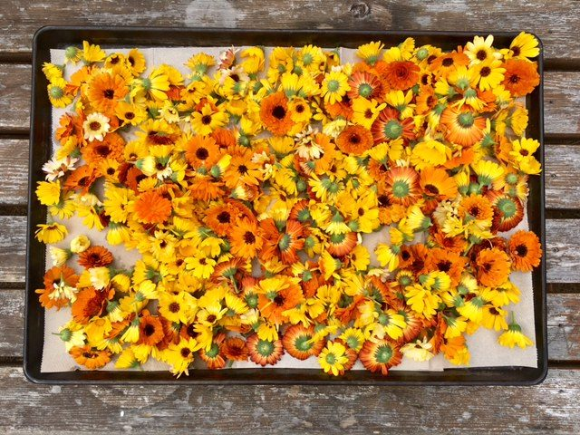
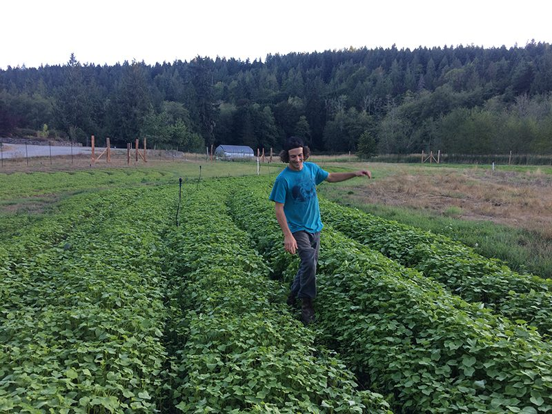
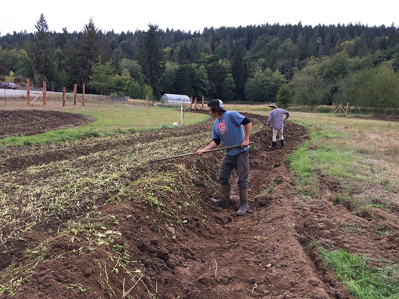
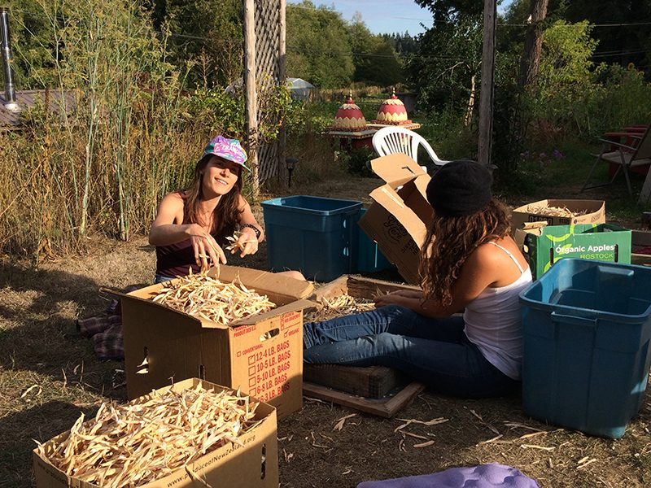
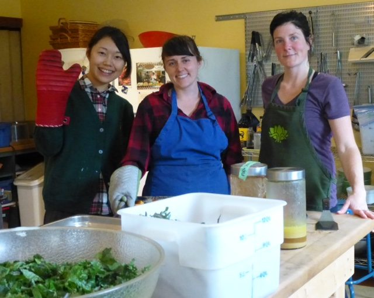
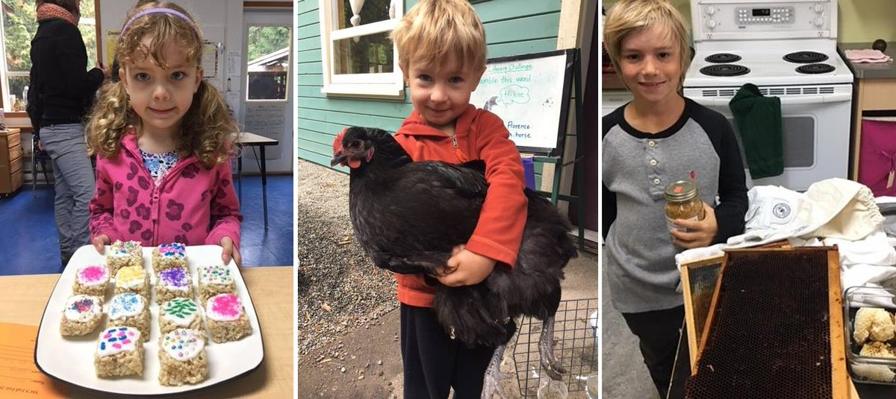

### *“I thank you God for this amazing day; for the leaping greenly spirits of trees and a beautiful blue true dream of sky; and for everything which is natural which is infinite which is yes.”* e e cummings

Hello everyone,
Summer has been slowly evolving into autumn as the leaves blow off the trees and the air cools down. There’s been some rain, and undoubtedly more is on the way, yet we’ve been able to enjoy the clear days and crisp nights during most of September. However, the land will happily soak up the much needed rain when it arrives.
This is the month of Canadian Thanksgiving. While we celebrate with family and friends - and eat a lot - we recognize that millions of people are suffering from the devastating effects of war, droughts, earthquakes, hurricanes and flooding. We send money when we can, and we send prayers, yet the need is so overwhelming that at times we can feel quite hopeless. It helps to remember that whatever we do in the world, our primary responsibility is to create peace within ourselves so that whatever we do generates more peace.
The farm is abundant, and we are enjoying spectacular meals from the farm harvest. A group of karma yogis has undertaken the project of food preservation beginning with jams and sauces, then onto dehydrating, fermenting and pickling.

# Milo’s farm update

 
> Well, Fall has certainly arrived with grace and compassion for farmers racing to bring dry goods from the field. The spuds are safe and sound in the store room, the winter squash is nearly ripe and our dry bean harvest will inspire many pots of chilli this winter.
> The solar dehydrator is complete and we look forward to loading her up with apples and pears any day now! Game changer for sure. Many thanks and a tip o' the hat to Tyler our carpenter.
> As you read this the Food Forest in the upper field is being planted to all manner of fruit and nut trees as well as fruit bearing canes and vines. After establishment this will be a VERY stable system. It will long outlast us in providing nutrient dense food and resilient nursery stock to future generations. Let's put up a few more. Any takers?

# Community Days

[caption id="attachment\_15382" align="aligncenter" width="640"] Kaori, Hope, Rebecca at work in the kitchen[/caption]
Wednesdays continue to be community days of connecting and working together. As we know, when everyone is on board, a lot gets done! Babaji was the model for that many years ago, and it’s still going strong.

# Centre School News

[caption id="attachment\_15378" align="aligncenter" width="620"] Highlights of the Centre School's Fall Fair[/caption]
There’s lots of activity at the Salt Spring Centre School as well. Following Salt Spring Island’s well-known Fall Fair in September, the Centre School does its own Fall Fair, with many of the same categories as the big fair, including the famed zucchini races. Here are a few photos of this year’s School Fall Fair.

# Meet Marquis

I’d like to introduce you to Marquis. She is keeping the Centre visible on social networks. Watch for more.
> My name is Marquis, I have a passion for yoga and marketing. I have the amazing opportunity to work for the Salt Spring Centre of Yoga and be able to express both of my passions. I am currently a marketing student and I am completing my co-op work term with the Centre, where I am learning more and more each day. I will be taking over the Centre’s social media channels, including [Facebook](https://www.facebook.com/saltspringcentreofyoga/), [Instagram](https://www.instagram.com/saltspringcentre/) and [Twitter](https://twitter.com/SaltSpringYoga). Follow our social channels to stay tuned for what is happening around the Centre.

# Farewells

It’s time to say farewell to three wonderful people who have been living at the Centre for the past year or so, contributing both their skills and the beauty of their being. Tyler (carpenter and maintenance guy extraordinaire), Svenja, and Angelo (kitchen magicians) are all moving on to the next phase of their lives. We will miss them, and send them off with love and appreciation for their huge contributions. They will forever have a place in our hearts.

# \*New\* Programs and Rentals in the Winter

Over the years we’ve had inquiries from people about visiting the Centre in the winter and asking about groups renting the Centre during the winter months, but instead we’ve chosen to focus on winter projects. However, this year, our program season is being extended. I’m happy to announce that we will be **accepting [rentals](https://saltspringcentre.com/facility-rentals/) during January and February of 2018**. **[Yoga Getaways](https://saltspringcentre.com/retreats-programs/yogagetaways/)** will also continue during January and February, with special winter rates. Information is on the website and social media. Stay tuned!
Also coming up: **[Yoga for Cancer](https://saltspringcentre.com/retreats-programs/yoga-cancer-workshop/)** on November 24-26: a workshop for yoga teachers with Tracy Chetna Boyd. This training will help yoga teachers in working with people who are dealing with cancer.

# This Month's Newsletter Offerings

Every year during [Yoga Teacher Training](https://saltspringcentre.com/yoga-teacher-training/), a number of gifted yoga teachers come to teach at the Centre. Lyndsay Savage is one of our senior asana teachers. Here she tells the story of her relationship with yoga, beginning with feeling responsible for speaking up for others, setting the record straight. It turns out this was not appreciated by her school teachers, hence the title, “**[Lyndsay….You just worry about Lyndsay.](https://saltspringcentre.com/2017/09/lyndsay-you-just-worry-about-lyndsay/)**” Although it wasn’t what she wanted to hear, she eventually turned it into a teaching. I invite you to read her story; you might even learn something about yourself.
We may be able to make time for yoga classes focused on asana practice, but somehow have a harder time making time for meditation, which is what Babaji means when he says “regular sadhana”. Tanya Gita Roberts, in “[**Reflections on Regular Sadha**na](https://saltspringcentre.com/2017/09/reflections-on-regular-sadhana/)” writes about how her daily sitting practice affects her life. I hope you will be inspired to jump-start your own sadhana practice.
As Babaji says, *wish you happy*.
Love,
Sharada
