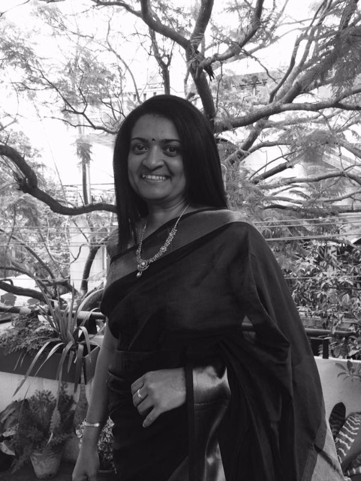
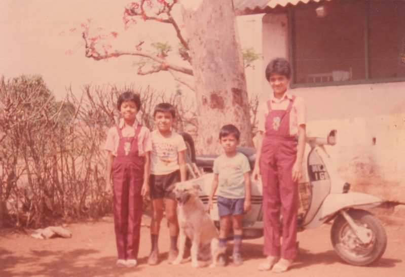
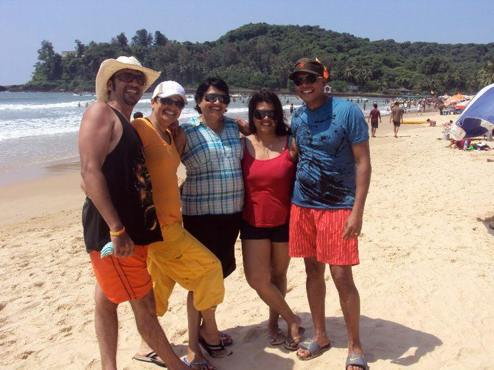
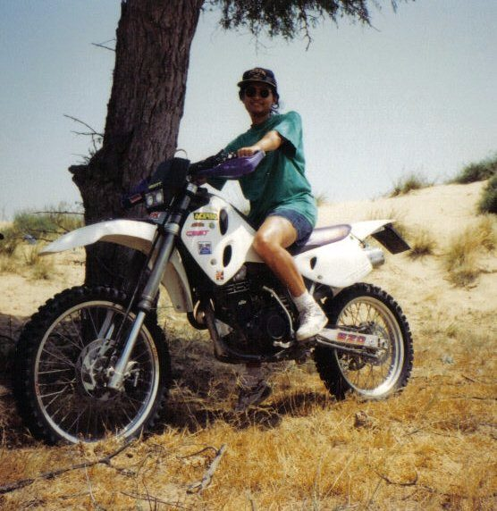
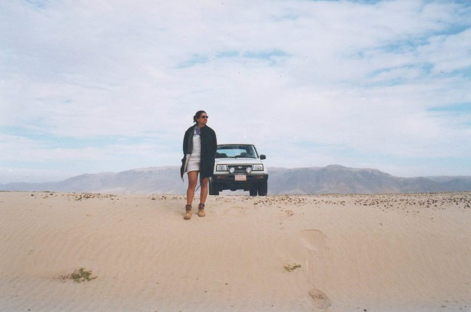
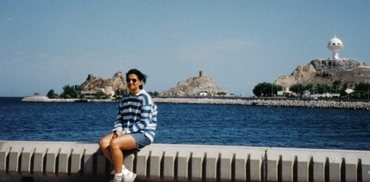
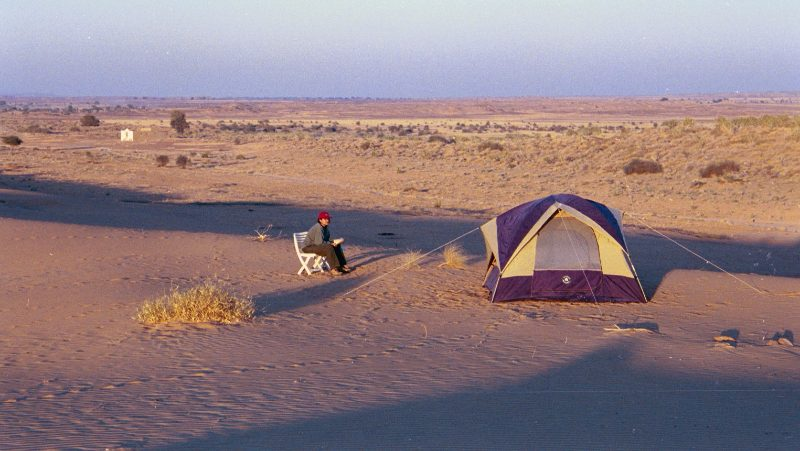
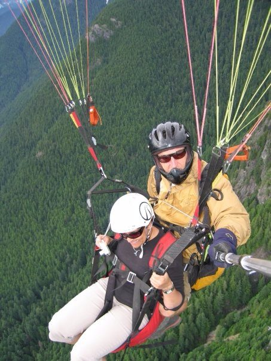
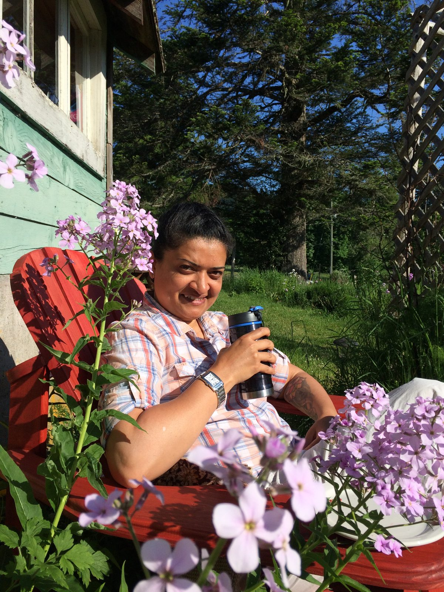

# Higher Love

## by Racquel Marshall

 Racquel - India, 2016
I have a slanted British accent, I think I look like an Indian, and I was born in India. My name is Racquel Marshall - not quite an Indian name. I don’t speak Hindi; instead I have dreamed in English as far back as I can remember. Quite the contradiction - who am I...?
I hail from a small mining town called Kolar Gold Fields (KGF), in south India, known to be one of the deepest gold mines of its time. This little mining town was also called “small England” during the British Rule in India dating back to a period before 1947 when India gained its independence. The mines were officially closed down in 2001 but while my family lived in KGF we saw the mining community and the ‘Anglo-Indian’ community slowly dwindle and move away. My Anglo-Indian heritage accounts for a mixture of British, Portuguese, Irish and Indian bloodlines. Growing up with an average of five ‘Anglo-Indian’ students in each class we were right away singled out in school for our fairer skin, sometimes blue eyes and our ability to speak better English, which we spoke at home, than the local population. It was uniforms and Catholic school until grade seven when my parents moved from this romantic little town to the big city of Bangalore about 30 kilometers away.
 Siblings 1981 (Andrea, Calvin, Smokey the dog, Rory, Racquel)
Today there is very little left of the large bungalows that some of our families called home. I have memories of fun-filled weekends spent with cousins playing hide-and-go-seek in the many bedrooms above the main house or skidding our knees learning to ride a bicycle in the large lawns that sprawled from the entry way of these bungalows.
I still make a pilgrimage back to KGF when I travel back to India to visit old haunts and dream up the good ole days.
 Family 2010 (Calvin, Racquel, Shireen (mom), Andrea, Rory)
Moving to Bangalore, the big city, was exciting and confusing, but you learn to cope with the madness and stress of new schools, new friends and at the age of fourteen being the eldest of three siblings, be the rock for my mother who had just walked away from a dreadful marriage to my father.
Life was rough. I grew up too fast and learned to adapt. I tried to pray; I knew there was something out there larger and more powerful than me, although finding God was way too confusing - for now anyway. I was baptized Protestant, and when my folks split up my mother christened us Catholic. I went through the motions of first holy communion and attended mass but none of it resonated with me. There would be time for God and religion - later.
I earned a secretarial diploma right out of school and started working at the age of seventeen. My escape was always in books. I was fascinated early on by Enid Blyton’s stories, the adventures of Nancy Drew and the Hardy Boys, but quickly progressed to the likes of Robert Ludlum, Wilbur Smith and Danielle Steele. I travelled in my mind and knew there was so much more to explore ‘out there’ in the real world that the pages in my books so vividly described. My ticket out of India came in 1995 when I got the opportunity to work in Dubai. It broke my heart to leave my family but I couldn’t wait to embark on my very own adventure.
An adventure it has been ever since. For seven years I worked, played, fell in love, married and saw everything there was to see of Dubai and the United Arab Emirates. I rode camels, camped in the desert, drove my 4X4 vehicle like a pro in the dunes of the desert and through the wadis of the Al Hajar mountains, snorkeled in the Persian Gulf and sang songs with the Bedouin of Oman.
 Dubai circa 1997
 Dune driving in Dubai circa 1998
 Sultanate of Oman circa 1999
I had many reasons to be thankful and I did thank God for my blessings, but who was He or She? I did try to go to church in Dubai, which lasted all of ten minutes one Christmas eve. I felt like I was being herded like cattle to get to a mass at the only church in the city for the thousands of Christians in a Muslim country. No thank you, God would have to wait.
It was off to Canada next. After wrapping up our life in the UAE, my partner and I decided to travel in India before immigrating to Canada in 2002. Discovering my motherland again was nothing short of spectacular. Little did I know that the seeds of my spiritual path would be planted during this time. The lovely Tara Buddha. I bought an ‘idol’ from a pesky street urchin and stuffed it nonchalantly in my backpack to be unearthed a few later in Vancouver with the astounding knowledge that she had been with me all along.
 Camping in Jaisalmer, India 2001
Arriving in Canada in 2002 was like coming home, I felt an instant affinity to the friendly people and instantly fell in love with the beauty of this country. Having landed in Toronto, the whirlwind life of the city quickly took a hold of me and my exciting new life as a Canadian began. Dubai had nothing on Canada. This was real life; the ‘fake’ material world of fast cars and money was soon fading along with my marriage that soon unravelled and fell apart.
Equipped with my library card and a quest for adventure I moved to Sudbury. My mettle was truly tested here where I not only weathered the storms in my heart, I battled the ice and snow storms on my way to and from work in what I had now came to truly know as North America. Better prospects beckoned and I was on the move again, this time to Grande Prairie, Alberta where the oil was flowing and jobs were booming. I secured a job with the RCMP and spent two years soaking up the countryside while being starkly reminded that my skin was brown and I didn’t quite fit in this one-horse town.
I set my sights on Vancouver as moving further west appealed to me rather than moving back to Toronto. A two-week holiday in Vancouver and Victoria brought me home to the west coast in 2008. I paraglided off Grouse mountain, drank in the beauty of Stanley Park and the north shore mountains, went for long walks in Steveston and spent a weekend in Sidney, Victoria. I returned to Grande Prairie high on life, a job offer in my pocket and my mind made up. Two weeks later I had packed everything I owned into my car, tunes blasting, singing my heart out, Grande Prairie in my rear view mirror, I was now on my way to a new chapter and life in British Columbia.
 Paragliding, Grouse Mountain, Vancouver 2008
Vancouver - you have given me eight beautiful years of love, laughter, friendship and beauty - a lifetime really, yet I still search for a higher love. I had over the years since Dubai practiced yoga sporadically. What cemented my belief in this practice was a single yin class that cured a year-long whiplash neck injury. It was during those early years in Vancouver that I stumbled upon a meditation class that had a profound effect on me. I unearthed Tara Buddha - the idol long buried in among my possessions, still wrapped in newspaper from my travels in India. I gobbled up all the literature I could find on Buddhism. I followed the teachings of Venerable Geshe Kelsang Gyatso every Tuesday in a meditation class taught by loving teachers who soon became guides and friends, a Sangha that still shines its beautiful light in my life.
In February of 2016 I was confronted with the death of my boss. I had just returned from a fantastic vacation with my family in India, life was grand, I was living in the best place on earth, I loved my job and the life I had created for myself in Vancouver. The universe or God had other plans for me. After a month of wading through the shock of losing the person I would see each morning at work who was just simply gone was too much. I needed a break to step back to breathe and grieve. On a whim I googled ‘yoga retreats’ and the Salt Spring Centre of Yoga showed up, and they were looking for administrative staff. I reviewed the website and the posting and couldn’t believe that such a place existed. I bookmarked the page and a week later it was still there and quite real.
It has now been six months since I moved to Salt Spring Island after I was accepted to fill the position. I live on the land and work as the office manager for the Centre. I took a huge leap of faith by giving up everything I knew to embark on ‘living in a conscious community’. I know with every fibre in my being that I was led here by a higher power. Once I had made up my mind to move, things just fell into place and magically happened. I have come to love this paradise I now call home, the Island, the centre, the community. I feel like I have lived many lifetimes already through this one life but I know that my truth lies here and now. I am grateful each day for all the blessings I receive and am thankful to Baba Hari Dass for creating such a sanctuary of living, learning, beauty and peace. No two days are the same, my days are filled with music, walking in the woods, planting strawberries, harvesting apples, pears, walnuts, tripping over garden snakes and perhaps spending a lazy afternoon listening to stories by the elders of this land.
Each day brings such joy to my heart and the best way to describe it is like repeatedly falling in love each and every day. If this is the higher love that I seek then I get to taste it every day from falling in love with the beings I encounter on the land and the beauty that touches me on so many levels.
So blessed.
~Namaste~
Racquel
