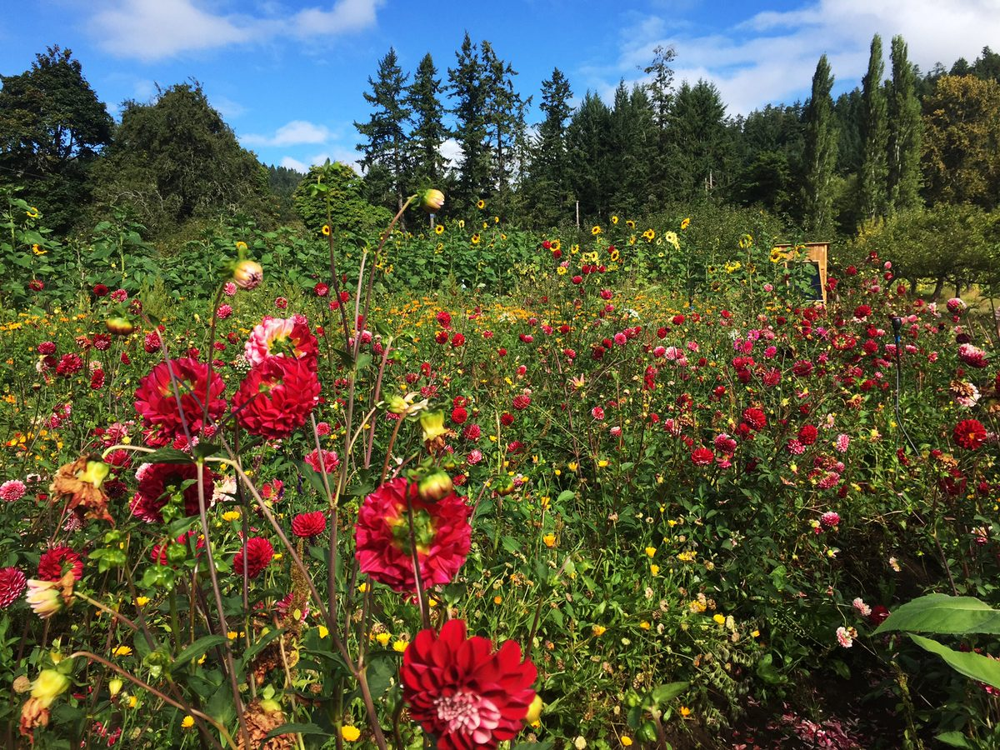
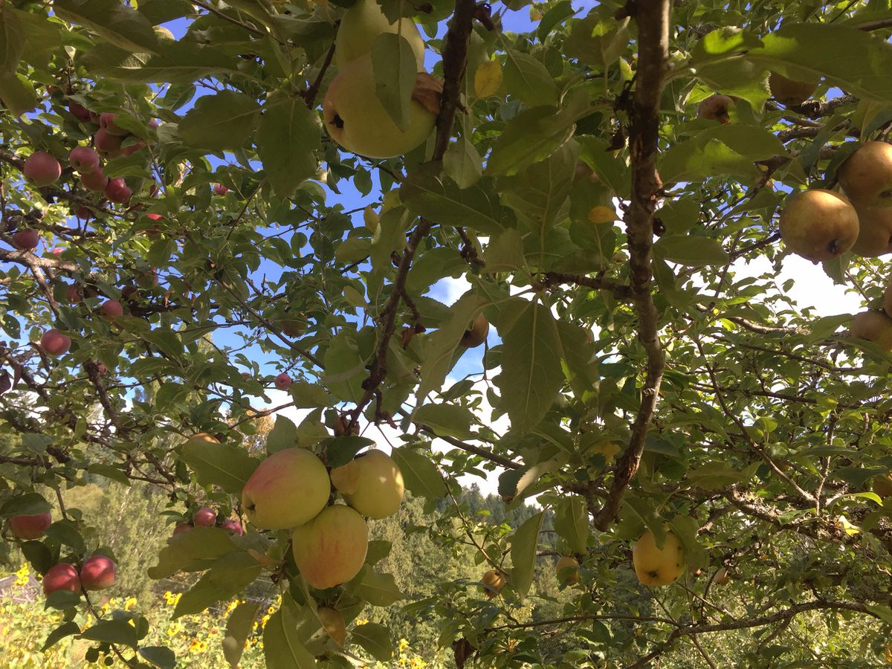
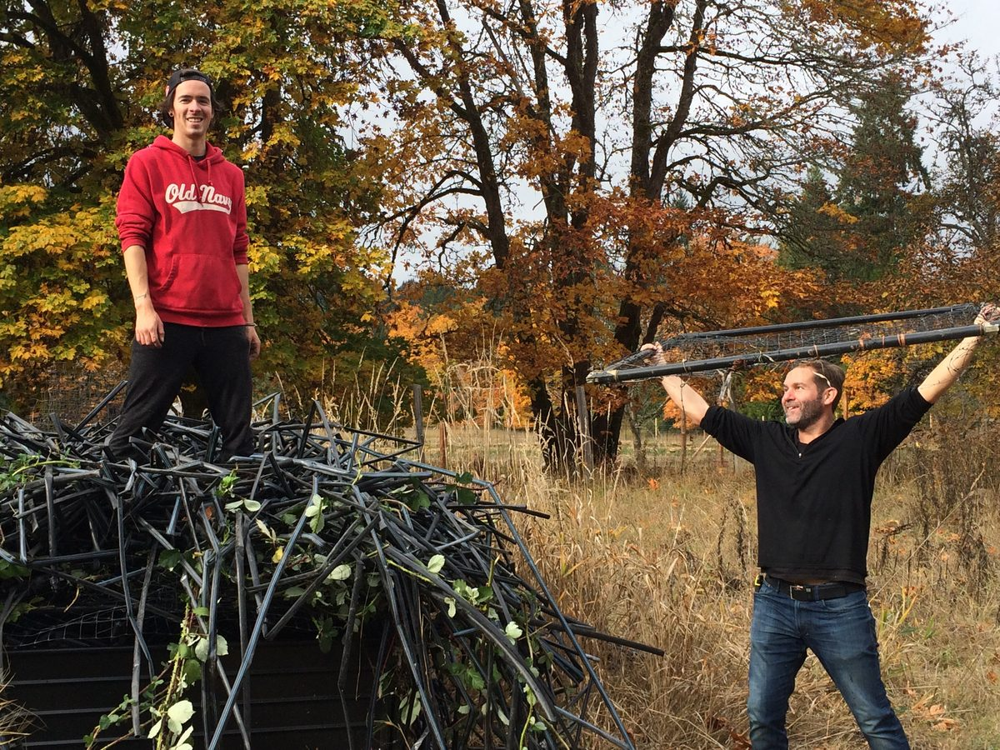
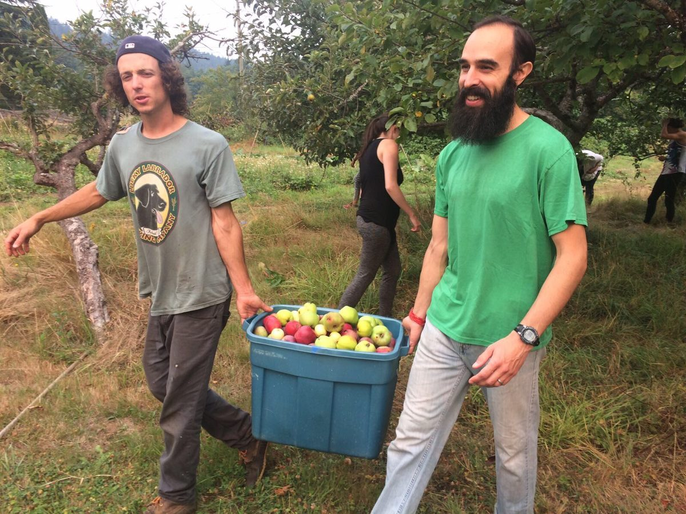
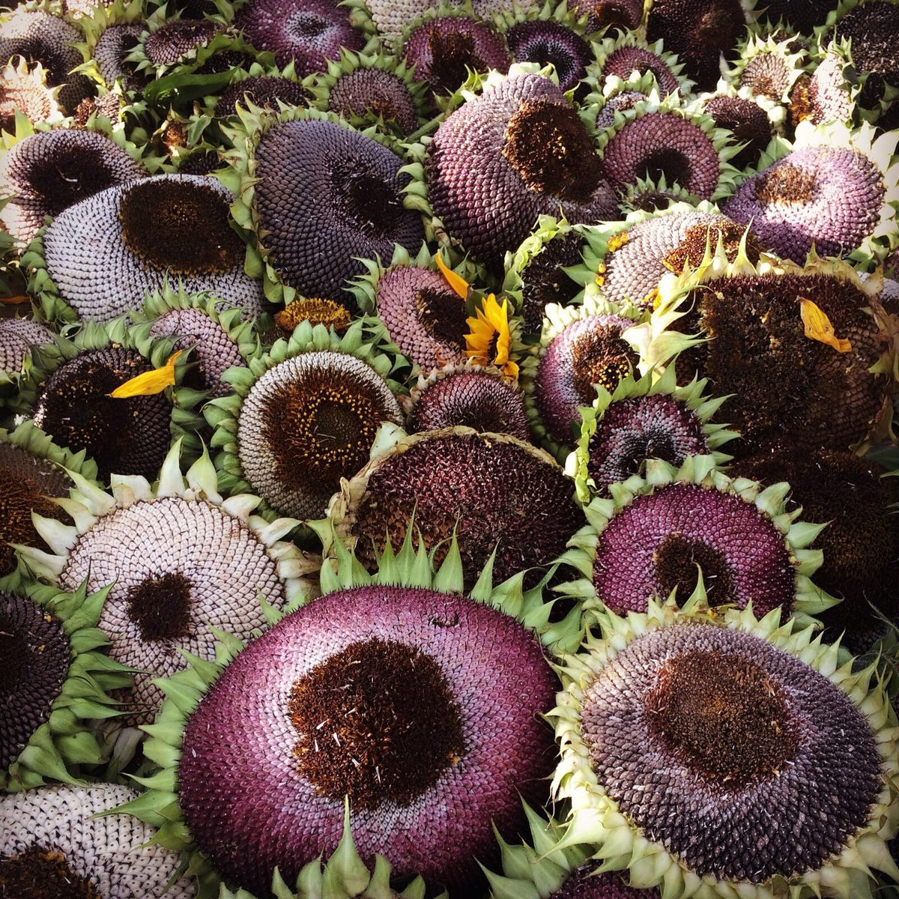
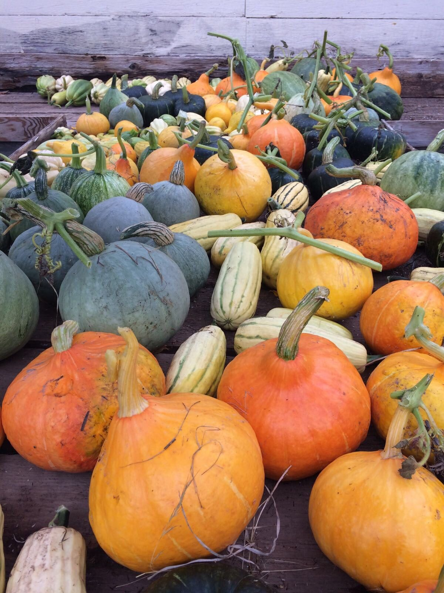
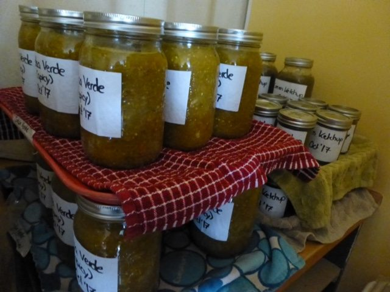
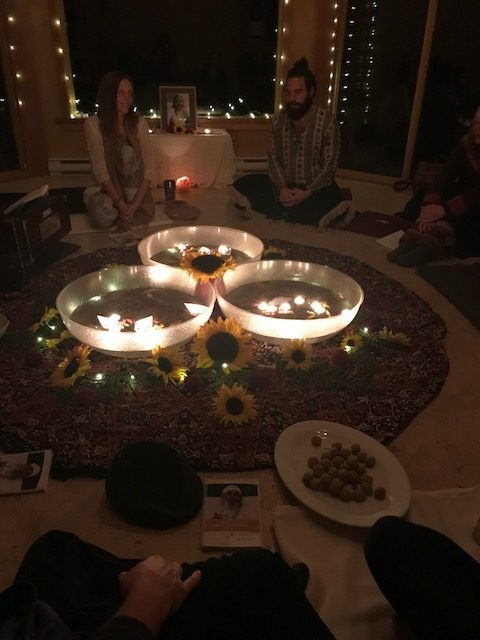
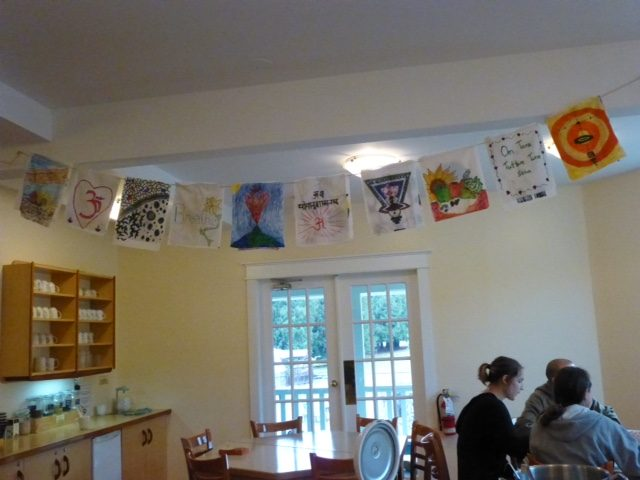
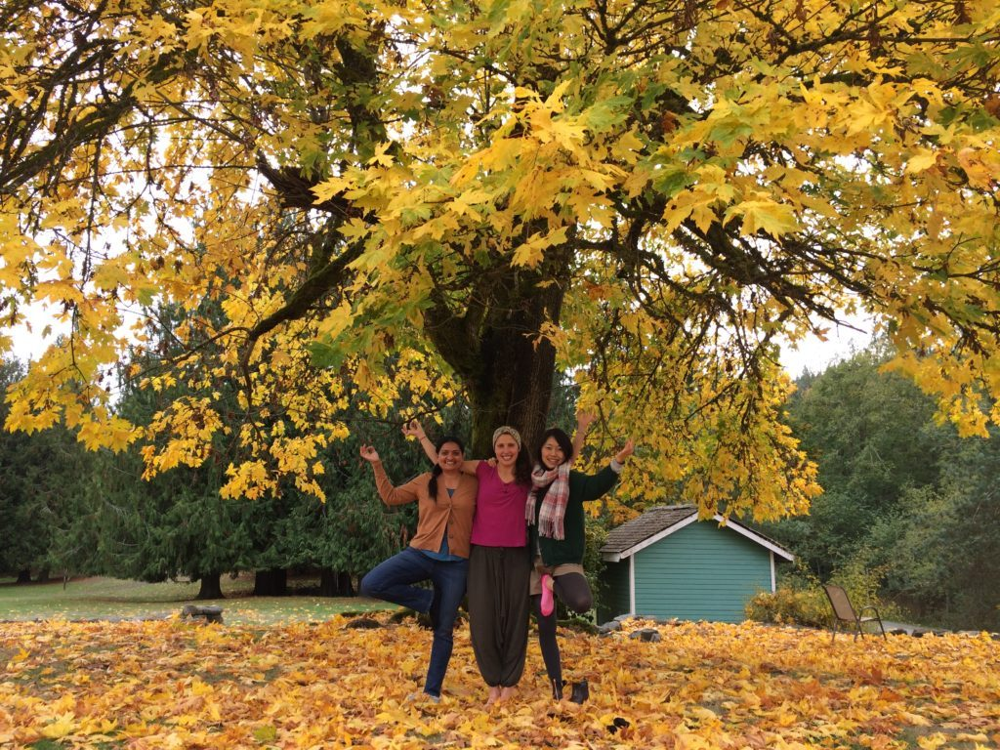

Hello everyone,
At this chilly time of year we are still being treated to sunny days (alternating with rain). Here are some photos of apples just before harvesting and flowers still abloom - but not for long.
 
While we’re on the subject of the garden, here’s...

# Milo’s farm update:

> What a gift those soaking rains have been! Our irrigation has been tucked away in preparation for hard frosts to come and the fields are harvested of their bounty. The Food Forest was planted in a fantastic flurry by a group of wonderful volunteers. Trees and shrubs stretched across nearly two acres are settling in for the winter and will be off to a flying start come Spring. I hope ya’ll like raspberries! Lots of time spent on the tractor these days as I finish up a few tiny ponds for critter habitat and water retention as well as a series of paddies for rice trials and small grain production!
> Our minds and hearts now look forward rainy days and a cozy winter of rest and contemplation. (Come on by for a cup of tea.) So many lessons learned this year. Thank you all for the support and smiles; it’s been a wonderful ride. Onward.

[caption id="attachment\_15526" align="aligncenter" width="620"] Seth and Martin - work party cleanup[/caption]
[caption id="attachment\_15521" align="aligncenter" width="620"] Milo and Yogeshwar bringing in the apples[/caption]
[caption id="attachment\_15525" align="aligncenter" width="620"] Sunflower seed heads[/caption]
[caption id="attachment\_15523" align="aligncenter" width="620"] Squash galore[/caption]
 
Much of the farm abundance has been transformed into treats for the winter by the ‘processing team’. Here are a few of their yummy creations to date: applesauce, pear sauce, apple and pear butter and jam, salsa verde (made from green tomatoes), green ketchup (really!), and hot sauce.
[caption id="attachment\_15522" align="aligncenter" width="640"] Salsa verde and green ketchup![/caption]
We had a wonderful Diwali celebration in the yurt a couple of weeks ago. Diwali is the celebration of the return of Rama and Sita to Ayodhya. Rama (universal consciousness) and Sita (individual consciousness) are reunited at the end of the Ramayana performances that we’ve done over the years, with the help of Hanuman, the embodiment of devotion and selfless service. Together, they return to the kingdom of Ayodhya where the people in the city light their way with candles. In Salt Spring’s version, we place tea lights in paper boats and float them in large bowls of water. We used to do it outside, but after getting rained out a number of times, we decided it would be lovely to be in a warm and cosy space.
[caption id="attachment\_15527" align="aligncenter" width="480"] Diwali celebrations[/caption]
As always, kirtan continues on Wednesday evening as does satsang every Sunday afternoon. Sunday evening has become yoga sutra study time, with Yogeshwar teaching this weekly class. If you happen to be on the island you’re welcome to attend any or all of them. There are also ongoing classes for the karma yogis at the Centre. In recent weeks, Usha led a class about the history of the land and Dan Jason taught a class about seed saving and food security. Om PK led us in an Ed Camp, an opportunity to share and brainstorm ideas, and we also spent an afternoon making prayer flags.
[caption id="attachment\_15528" align="aligncenter" width="640"] Our prayer flags[/caption]
In the midst of all this fun, cooking, cleaning and outdoor work continues.
[caption id="attachment\_15529" align="aligncenter" width="620"] Racquel, Olga, Kaori under the mighty maple on the mound[/caption]

# New Opportunity: Maintenance Coordinator

At this time we are looking for a Maintenance Coordinator to join the karma yoga resident community. If you or someone you know has maintenance skills and experience and is intrigued with the idea of doing that work in a spiritual community, please check the posting on our website.

# Seasonal Celebrations at the Centre School

The Salt Spring Centre School hosted their annual pumpkin walk at the school the evening before Halloween. Parents and community members joined the kids to walk the trail and see all the lit-up jack-o-lanterns carved by kids and parents, and vote on them in categories ranging from cutest to scariest.
At 6:00 pm on November 28, Usha will lead the school community, the Centre community and guests in the annual Celebration of Light (aka Advent). Each child, from youngest to oldest (including former students who come back to celebrate with us), walks a spiral of cedar boughs and stars while carrying an apple with a candle in it. In the middle of the spiral they light their candle from the candle in the centre before proceeding back through the spiral to place their apple and lit candle on one of the trays around the circle. While this is happening, everyone is singing songs of light from various traditions, led by Usha who has done this every year since the beginnings of the Salt Spring Centre School. It is a beautiful and uplifting event.

# Upcoming Programs

On the weekend of November 24 - 26, Chetna will be teaching [Yoga for Cancer](https://saltspringcentre.com/retreats-programs/yoga-cancer-workshop/), an experiential workshop for yoga teachers. This workshop is approved for continuing education credits through Yoga Alliance and is approved for 17 elective credits towards Mount Madonna Center’s YTT 500hr training.

# This Month's Newsletter Offerings

Here are a couple of articles for your enjoyment.
Continuing the series about people in our centre community, this month I’m pleased to introduce you to Racquel Marshall, someone you may have spoken with on the phone if you’ve called the office to register for a program or ask about the Centre. Racquel, our office manager, keeps things running smoothly in the office and is an active part of our residential community. Through her many adventures - beginning in India, with a number of years in Dubai and various other places - she found our community. I’m sure you’ll enjoy reading “[Higher Love](https://saltspringcentre.com/2017/10/higher-love/)” and seeing the photos of her adventures.
Spiritual teachers regularly remind us that peace can only be found in the present, yet how often are we really present? It’s so tempting to fantasize about how we’ll get it all together…..someday, or getting stuck in a reaction to something that happened in the past.  “[Choosing Peace](https://saltspringcentre.com/2017/10/choosing-peace/)”  offers some gentle suggestions to support us in coming back to this moment, the only moment in which true peace is possible.
Also in this edition, here are some “[Questions and Answers with Babaji](https://saltspringcentre.com/2017/10/questions-and-answers-with-babaji-2/)”. These particular questions and answers come from a 1994 edition of this newsletter, long before it was delivered electronically. A number of years later someone asked Babaji whether the quality of our questions had improved over the years; he replied, “Same questions, same answers.”
*As soon as a person starts thinking, “I want to be a better person,” that is the start of yoga.*
With wishes for a peaceful autumn and a warm entry into winter,
Love,
Sharada
