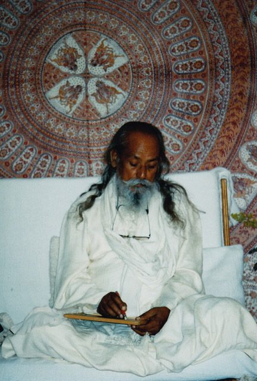

**Q: For someone who leads a busy life, how is it possible to keep one’s mind on God?**
B: God is not separate from its creation. Anything that you see, feel, experience is God. Identify it as God and that will keep the awareness of God.
**Q: It seems that many paths or practices can become a trap of meaningless ritual or a vehicle to liberation.**
B: Anything can be a trap. A hermit goes to a cave to get out of his worldly attachments, and then he gets attached to the cave. If we miss the point, then everything becomes a trap. Rituals are created to bring discipline in life, but people get attached to rituals and miss the discipline. The sagees experimented with millions of methods and came to the conclusion that if we are not aware of ourselves, then we can’t progress.
**Q: What does the term “maya” mean?**
B: Ma - it is; ya - it is not. Because this creation is seen and identified by the mind as real, so “it is”. But in fact it’s only the gunas acting within themselves and what we are seeing is only our desire, so “it is not”. Like when someone gives birth to a baby, it is real, but when the illusion of “my son” or “my daughter” starts,then it is not real. Maya is a divine power that controls everything in the universe.
**Q: What power have thoughts in creating samskaras?**
B: When thoughts change to action then that makes attachment and that makes an imprint on the mind.
**Q: Thoughts don’t make imprints?**
B: Only if one dwells.
**Q: How does liberation come from experience?**
B: Experiences themselves are bondage. That bondage creates memory and the cycle goes on. But when the experience creates pain, that pain opens up the mind and looks for the cause. The causes are always the five afflictions: ignorance (of our true nature), egoism, attraction, repulsion, and fear of death. When one identifies these causes, the path of liberation starts. When the mind sees the causes, then it automatically tries to remove them.
**Q: How do we know what’s real if we are always protecting our own world?**
B: That’s what we have to find out by yoga. Yoga is not one particular method. As soon as a person starts thinking, “I want to be a better person”, that’s the start of yoga.
**Q: Could you comment on the idea that difficult things in our lives are actually opportunities and so can be seen as God’s grace?**
B: Everything is God’s grace. We have our limitations in everything. Life outside is easier than life inside. You can change your environment if you don’t like it, but if you are miserable within, you carry it everywhere. So yoga always points to change within. Any pain which turns the mind toward God and creates the desire to seek for God is God’s grace.
**Q: An aspirant is supposed to be at peace and without desire, yet there is an intense desire for God, and the pangs of separation are not peaceful. How does one deal with this conflict?**
B: That brings peace. “Viyoga” equals separation from God and creates Yoga or union with God. Peace is our original nature. It is covered by attachment, desires, egoism, etc, and we feel disturbed. Wanting God - this desire is created because we want to end our suffering. When we feel separated from God, our peace is not disturbed. We are getting closer to peace. Our peace is disturbed when we are lost in the world.
**Q: How does one know what one’s purpose in life, or dharma, is - so that one can get fulfilled or liberated?**
B: The purpose of life is to attain peace. Anything that disturbs peace should be avoided, and that opens the path to liberation.
**Q: How does one choose their work in the world?**
B: Our mind knows our talents and what kind of work fits our nature, but we can’t find it because the mind is busy or distracted by the world. If we develop concentration, then we can see it clearly. Time to think. For clear thinking, you need single-mindedness.
**Q: How do we know what sadhana (spiritual practice) or guru to choose, or is the it the guru who chooses the disciple?**
B: Sadhana means to find the path which leads to eternal peace. Those who understand it, they don’t need a guru. When we understand the aim, then we start seeing the distractions which come in our path. But if we don’t see those distractions, then we need outer help. Union of guru and disciple depends on samskaras. (imprints in the mind)
