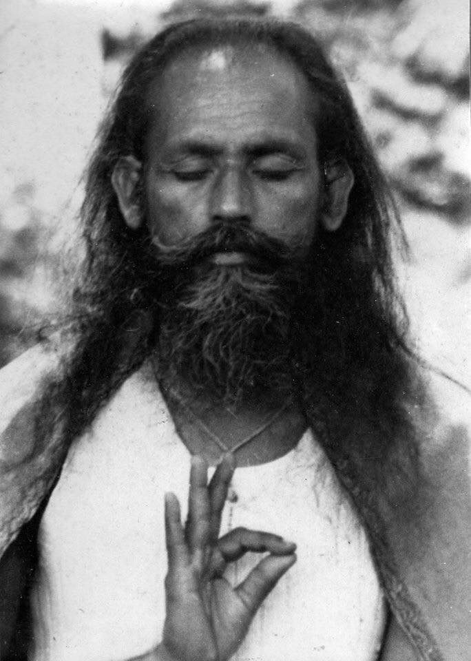

In the midst of the busyness and turmoil of daily life, do you sometimes forget that there’s something you can do to bring more peace into your life? This is a reminder that there is a path leading to peace and freedom.
The elders/senior teachers in this community were blessed with the rare opportunity to meet a teacher, Baba Hari Dass, a master yogi, who shared with us the classical teachings and practices of yoga, providing a light on the path. The process of following this path is one of unwinding, gradually stepping out of the world we’ve created in our minds and returning to the peace and beauty that already exists within us. The teacher’s role is to guide us on this journey.
A question that always arises is: What about me? I didn’t get to meet Baba Hari Dass. Do I need a guru? Here’s Babaji’s answer: *It’s not impossible to attain enlightenment without a teacher. Ramana Maharshi did it without a teacher. You can learn to drive without a teacher, but it’s wise to learn from a teacher and not take the risk of knocking the car here and there in the process of teaching yourself.*
*The aim of life is to attain peace. A guru or spiritual teacher teaches how to attain that peace. A guru doesn’t teach much except how to live in the world with truthfulness, with nonviolence, and with selfless service to others.*
The guru offers us wisdom teachings and practices, and it is up to us to follow them and do regular (meaning daily) sadhana, spiritual practice. Whether or not you’ve had the good fortune to meet your teacher, you still need to practice. The teachings and practices themselves are the light on the path.
*All answers are inside us and we have to realize them by ourselves. When one realizes that knowledge can be attained through one’s own sadhana, one’s own Self becomes the guru. Everything becomes clear step by step.*
It’s not always a straightforward path. Those of us who’ve been around for awhile have made our share of wrong turns. The trick is to look at the kinds of choices we’re making, and shift to a different route. We (all of us, including you) have sufficient wisdom to move toward Truth.
Sogyal Rinpoche, a teacher in the tradition of Tibetan Buddhism and author of the book, “The Tibetan Book of Living and Dying”, asks, “Who is the outer teacher (the guru)? None other than the embodiment and voice and representative of our inner teacher. The master whose human shape and human voice and wisdom we come to love with a love deeper than any other in our lives is none other than the external manifestation of the mystery of our own inner truth.”
*Faith, devotion and right aim are the three pillars that hold up the spiritual life. I don’t claim I can give enlightenment. I say that anyone can attain it by their own effort. As long as we are not responsible for cleaning out our own garbage, we carry that garbage with us everywhere we go. No on is going to clean out our garbage for us; we have to do it ourselves.*
*The understanding of love, God, or nothingness can’t be taught by words, correspondence, or by reading books, just as sweetness can’t be described. A teacher or guru can only point toward a tree and say, “Look, there is a bird sitting on a branch.” The guru’s duty is finished and the student’s duty begins. He or she tries to see the bird, moves his head up, down, sideways and sometimes asks, “Where is the bird?” The teacher again points a finger and says, “Look straight along my finger.” The student finally sees the bird. The act of seeing is within, and one only needs to use his or her vision in the right manner.*
*Keep the lamp lt, walk on step by step. You can’t go astray, but will merge in the light.*
*Wish you happy and success in your search for God.*
Contributed by Sharada
All text in italics from writings by Baba Hari Dass

---

 **Sharada Filkow**, a student of classical ashtanga yoga since the early 70s, is one of the founding members of the Salt Spring Centre of Yoga, where she has lived for many years, serving as a karma yogi, teacher and mentor.
