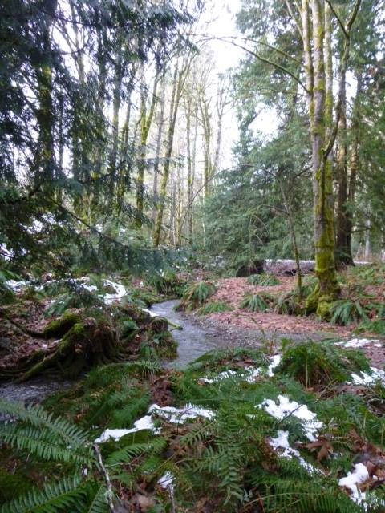
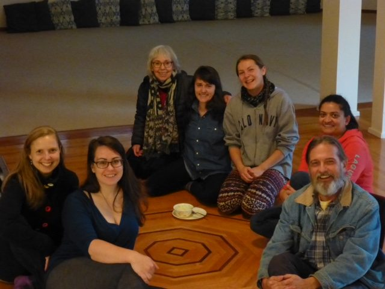
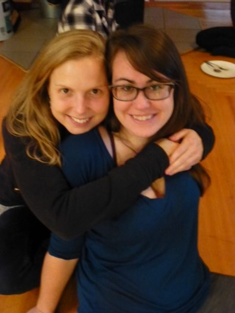
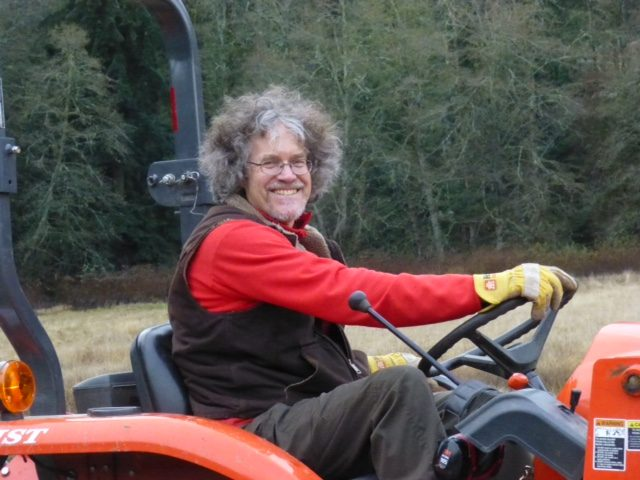
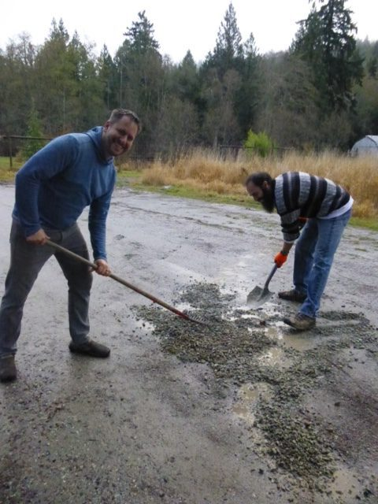
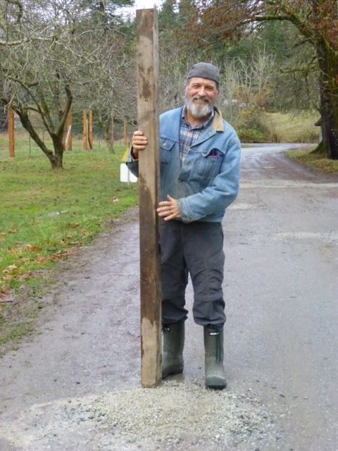
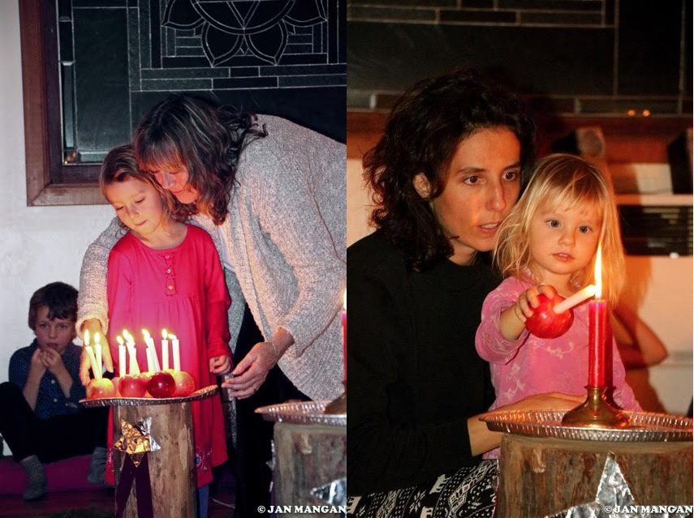
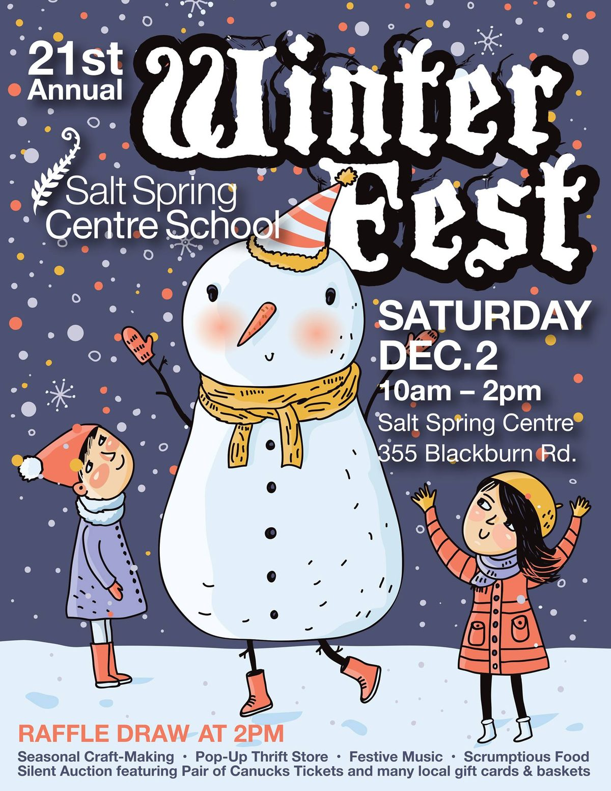

Hello everyone, 
December is here: the time of winter solstice, Christmas, Chanukah, and other seasonal celebrations of light; and, here in the Pacific Northwest, rain - lots of rain (except for one day of snow in early November that was gone the next day). That’s what makes this part of the world so green. November was a busy month, but December at the Centre is a quieter time. Our resident community is small, with a number of people taking this time to visit family or to travel.
[caption id="attachment\_15611" align="aligncenter" width="640"] lunch around the wood stove - Marta, Jessica, Sharada, Hope, Ellie, Racquel, Larry[/caption]
[caption id="attachment\_15610" align="aligncenter" width="480"] Marta and Jessica[/caption]
[caption id="attachment\_15613" align="aligncenter" width="640"] Om PK on the tractor[/caption]
[caption id="attachment\_15614" align="aligncenter" width="480"] Shyam and Yogeshwar filling potholes[/caption]
[caption id="attachment\_15615" align="aligncenter" width="480"] Larry pounding the gravel[/caption]
Satsang, kirtan and full moon yajnas continue throughout the winter. You can see what else is happening on our [website](https://saltspringcentre.com/), our [Facebook page](https://www.facebook.com/saltspringcentreofyoga) and [Instagram](https://www.instagram.com/saltspringcentre/). And here’s a note from the IT team:

# New Look in 2018

> Announcing the launch of our new website!
> The website has been redesigned to improve user friendliness, simplicity and appeal. In addition we have changed our colour palette to reflect the evolution of our centre and environment.
> Stay tuned for our new look in 2018!

# Seeking Maintenance Coordinator

We are still looking for a maintenance coordinator, so if someone you know is interested in contributing their skills while living in a spiritual community, please ask them to check the [job posting online](https://saltspringcentre.com/job-volunteer-opportunities/opportunities-how-to-apply/) and fill in an application.

# Centre School Celebrations

 
[caption id="attachment\_15629" align="aligncenter" width="855"] Moments from the Celebration of Light (photos by Jan Mangan)[/caption]
Toward the end of November the [Salt Spring Centre School](http://saltspringcentreschool.ca/) again hosted its annual Celebration of Light (aka Advent). Usha led school families, folks from the Centre and the wider Salt Spring community in songs of light as the children walked the spiral of cedar boughs and stars to light their candles, a reminder to keep the light in our hearts burning in this dark time of year.
On December 2, the school will be hosting [Winterfest](https://www.facebook.com/SaltSpringCentreSchool/photos/gm.1169411589868969/914172218730780/?type=3&theater) at the Centre. This is a family event for the Salt Spring community, with craft tables for the children in the satsang room and a concession with delicious vegetarian lunch options and sweet goodies for sale in the dining room. If you’re on the island, and especially if you have kids, do come by.

# In this month's Newsletter

I know you will enjoy Melinda Quintero’s story, [A Journey to the Centre](https://saltspringcentre.com/2017/11/a-journey-to-the-centre/). She writes, “I grew up in suburban Los Angeles and had a fairly uneventful childhood. I rarely made waves or strayed from the straight and narrow path. I believe the most rebellious thing I accomplished was convincing my family to allow me to go to university in New York City.” That is the beginning of a fascinating story of how life led her on many adventures, and eventually to the Salt Spring Centre of Yoga - and more, but I won’t give it away here. Read it for details and photos.
Here is a special treat for the holiday season brought to you with love from Bri and Rebecca: [Sourdough Bread](https://saltspringcentre.com/2017/11/sourdough-bread/). This is a love story about bread baking, complete with instructions for making sourdough bread at home for your family and friends. I hope you enjoy it as much as we do!
In the midst of this festive - yet also sometimes dark and lonely - season, we can all use a little reminder about the gifts life has given us. Please read [A Light on the Path](https://saltspringcentre.com/2017/11/a-light-on-the-path/), a reminder that we can all come home to our own true Self. Keep the lamp lit, walk on step by step. You can’t go astray, but will merge in the light.
As those following Babaji’s health updates from Hanuman Fellowship likely know, this fall season has brought a significant decline to Babajjis physical activity. For more information, please [read more here](https://saltspringcentre.com/2017/11/babaji-update-december-2017/).
Wishing you a joyful and peaceful holiday season.
Love,
Sharada
*Nonviolence in the mind and unconditional love in the heart bring eternal peace.*
