The Salt Spring Centre of Yoga abounds with precious gifts: the opportunity to learn and practice teachings that bring profound peace; the abundance, comfort and beauty of the land; and the unique and talented folks that it attracts. Other important gifts are the human connections that form, which can be deep and based on a shared passion and curiosity.
One such connection has been formed around a passion for homemade sourdough bread.
Although I had yet to make a loaf of sourdough bread myself, late this summer I was inspired to start my own sourdough starter. After consulting numerous websites and blogs, I found a method that worked for me. The starter was a success! Then, a marvellous thing happened; Bri, the resident sourdough bread baking yogini, offered to bake some bread together.
The first couple of loaves we baked were delicious, and quite dense. We continued to practice and noticed as the weeks went on the sourdough starter grew stronger the more we played with and used it! The enjoyment of the bread we baked, and the interest to continue to bake and perfect the loaves continued to move us forward in our experimentation.
[caption id="attachment\_15572" align="aligncenter" width="480"][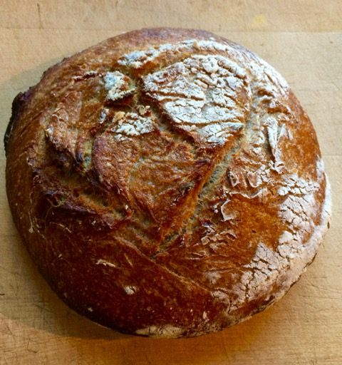](images/dd68d260_sourdough-4.jpeg) First loaf with brand new starter[/caption]
A spark had been lit and curiosity within the community grew. Many yogis wanted to take part in the experimentation process. Before she left the land embarking on a new adventure, Bri organized a playshop to share her sourdough bread making wisdom, which was a hit - several more yogini bread bakers were born!
Following is an outline of how the yogis at the Salt Spring Centre of Yoga are baking up bread to nourish our community! Feel free to join in the play by making your own loaves of sourdough bread. Keep in mind that bread culture is a vast and deep wealth of knowledge and technique. Many things affect the outcome of bread including humidity levels, altitude, temperature of the kitchen...even the baking equipment used! There are also countless bread bloggers sharing the methods that are working for them. This is the recipe we are finding works for us!
Speaking of recipes, we must give credit where credit is due. Some of the sourdough bread lovers out there will undoubtedly know of Chad Robertson and his cult status among bread lovers. We follow (for the most part) Chad Robertson’s Country Style Bread recipe from his first book, Tartine Bread. You can [find this recipe online](https://cooking.nytimes.com/recipes/1016277-tartines-country-bread). You can find his book in the Salt Spring Island library, and if you live off island, your local library will likely carry it, too. It is worth a read as it is full of tips and tricks that he passes on to beginner bread-makers like us.
Happy baking!
Love, Bri and Rebecca
*“For is there any practice less selfish, any labor less alienated, any time less wasted, than preparing something delicious and nourishing for people you love?”*
Michael Pollan, Cooked: A Natural History of Transformation

# Sourdough Bread

## makes two loaves

Making the starter: Allow at least a week or two for this step. This was an absolute experimentation for me and I honestly combined several methods. You can try [Chad’s method](https://cooking.nytimes.com/recipes/1016277-tartines-country-bread) mentioned above or you can try other techniques such as the one I incorporated by [Maurizio Leo](https://www.theperfectloaf.com/7-easy-steps-making-incredible-sourdough-starter-scratch/).
Basically, start with equal parts room temperature chlorine-free water and flour - 100 grams water and 100 grams flour. Mix together with a wooden spoon (yeast does not like metal!), pour into a jar, cover lightly and place in a warm location, like on top of the fridge. Feed the starter at least once daily by discarding all but 100 grams of the starter and then add equal parts flour and water. There should be bubbles forming; the size should grow and it starts to smell and taste sour. Don’t be surprised if you start to form a strong bond with your new living starter! When your starter is strong and acting predictably, store in the fridge between bakings and feed weekly (if you are baking weekly).
[caption id="attachment\_15579" align="aligncenter" width="480"][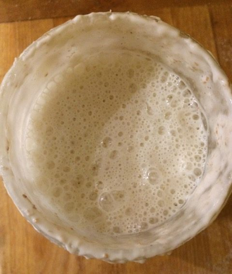](images/dd68d260_sourdough-21.jpeg) Bubbly starter[/caption]
**Making the leaven:** The night before making your bread (or 12-14hours before) mix 200 grams of flour and 200 grams water with 1 tbsp of your starter and place in a warm spot to ferment.
[caption id="attachment\_15576" align="aligncenter" width="480"][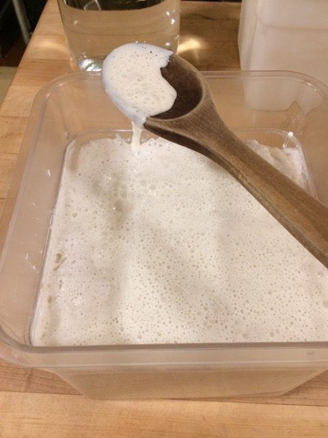](images/dd68d260_sourdough-18.jpeg) Bubbly and airy leaven[/caption]
**Float test:** after rising 12-14 hours your leaven will be very airy! It should float. Test with a spoon full on leaven dropped into a bowl of room temperature water. When it floats it is ready to use. If it doesn't float, continue to let it ferment another hour or so, and perhaps move it to warmer location.
[caption id="attachment\_15575" align="aligncenter" width="480"][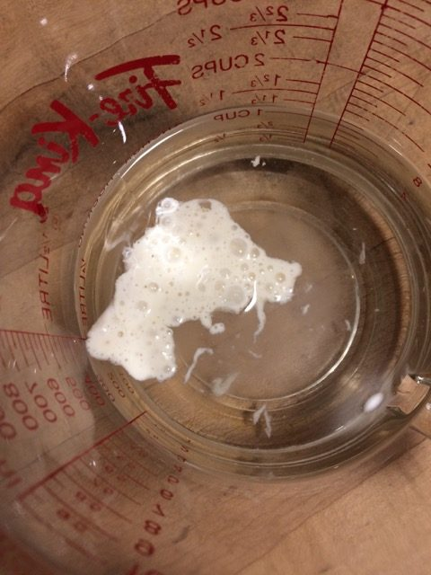](images/dd68d260_sourdough-17.jpeg) The leaven is ready when a spoonful floats on water[/caption]
**Making the dough:** Mix 200 grams of leaven into 700 grams of warm water. Add 600 grams of white flour with 400 grams of whole wheat flour into the water/leaven mixture. Different flours and humidity levels will change the water ratio. Start with the recommended amount and slowly add more as needed - just enough to incorporate all the flour into the bread dough! Mix together by hand. Dough at this stage should feel sticky and look unformed. Let dough sit for 30 minutes. (Keep the remaining leaven as this becomes your new starter, which you’ll feed as usual and store in the fridge until you are ready to bake again).
[caption id="attachment\_15573" align="aligncenter" width="601"][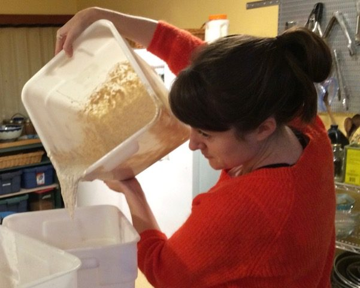](images/dd68d260_sourdough-5.jpeg) Hope mixing in the leaven.[/caption]
[caption id="attachment\_15577" align="aligncenter" width="480"][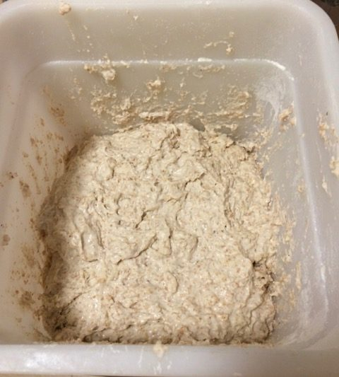](images/dd68d260_sourdough-19.jpeg) Sticky unformed dough[/caption]
Adding the salt mixture: Dissolve 20 grams sea salt into 50 grams warm water. Mix into dough by hand. Don't be afraid to really incorporate it by squishing and squeezing the dough. Get your play on! Adding salt after a 30 minute rest period allows for the flour to absorb all the water. After adding the salt let the dough sit another 30 minutes.
[caption id="attachment\_15578" align="aligncenter" width="501"][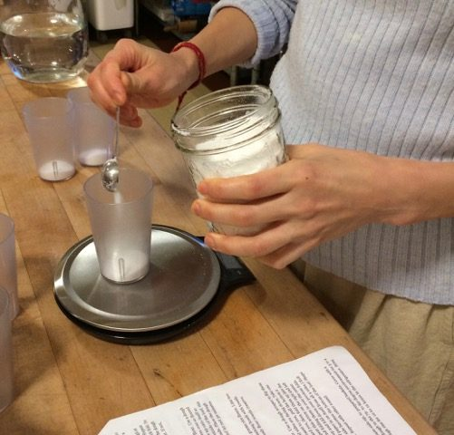](images/dd68d260_sourdough-20.jpeg) Measure out your ingredients with a kitchen scale to ensure accuracy.[/caption]
[caption id="attachment\_15580" align="aligncenter" width="576"][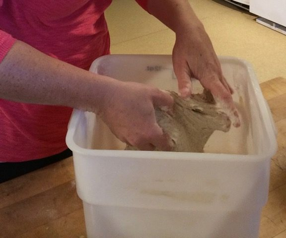](images/dd68d260_sourdough-9.jpeg) Mixing the salt into the dough, by hand.[/caption]
**Folding the dough:** By this stage the dough will start taking form. It is amazing how quickly this happens. With a wet hand reach under the dough and gently hold the edge at one of its corners. Then stretch it up, and fold it over the rest of dough. Repeat this three more times on each corner of the dough. Flip the dough so the fold seams are on the bottom. Let the dough sit at least 30 minutes before your next fold. It is best to continue this process for 2 1/2 to 3 hours or 4 to 6 more times. Notice how the bread dough continues to change and hold its shape! Notice the texture and how the dough easily peels off the bin, if it is sticky or not. Getting to know your dough in this way will only improve your bread in time.
[caption id="attachment\_15581" align="aligncenter" width="480"][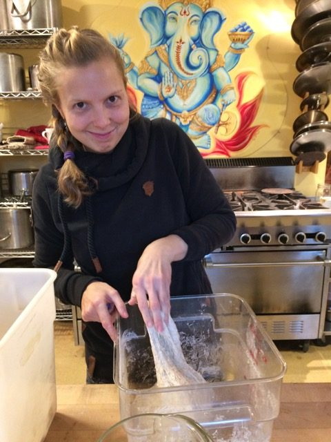](images/dd68d260_sourdough-7.jpeg) Marta folding the dough.[/caption]
[caption id="attachment\_15574" align="aligncenter" width="480"][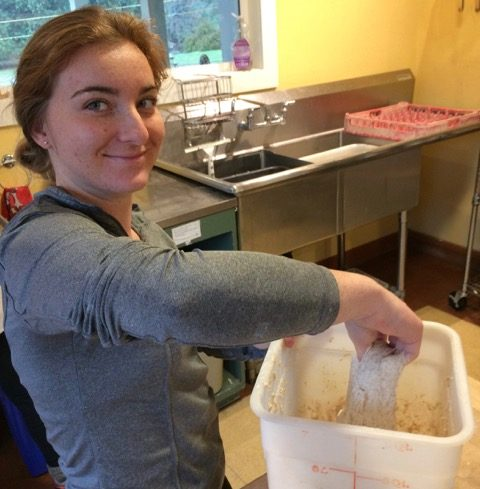](images/dd68d260_sourdough-6.jpeg) Marquis folding the dough.[/caption]
[caption id="attachment\_15582" align="aligncenter" width="539"][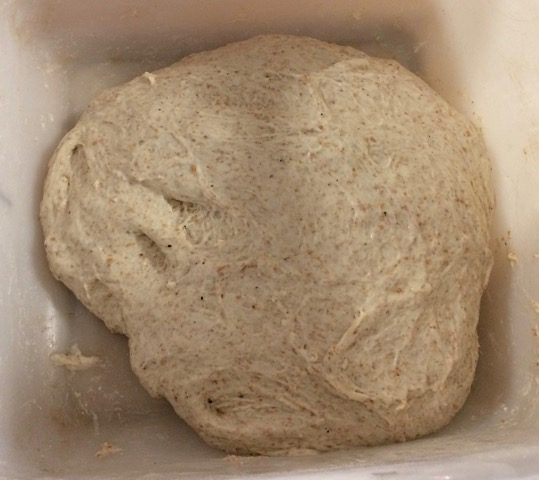](images/dd68d260_sourdough-10.jpeg) Notice the different consistency of the dough from the first mixing.[/caption]
**Shaping the dough:** Transfer dough to a surface, sprinkle the top of your dough with flour and cut into two equal pieces. We love using a bench scraper for cutting and shaping. This handy little tool is worth picking up if you plan on making bread often. Working with one piece at a time, flip the dough over so the floured side is on the bottom. As before, fold the dough onto itself by stretching up the corners. Ensure that the floured surface stays on the outside. Flip the dough over (fold seams down) and shape into a round by spinning and shaping with the bench scraper.
[caption id="attachment\_15583" align="aligncenter" width="480"][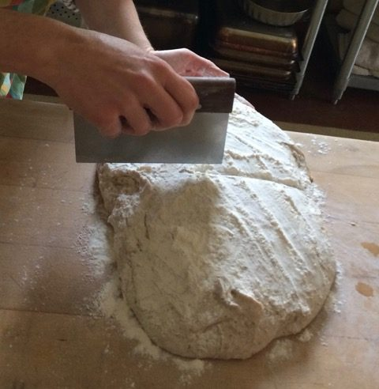](images/dd68d260_sourdough-14.jpeg) Cut dough into two. This recipe makes two loaves.[/caption]
[caption id="attachment\_15584" align="aligncenter" width="461"][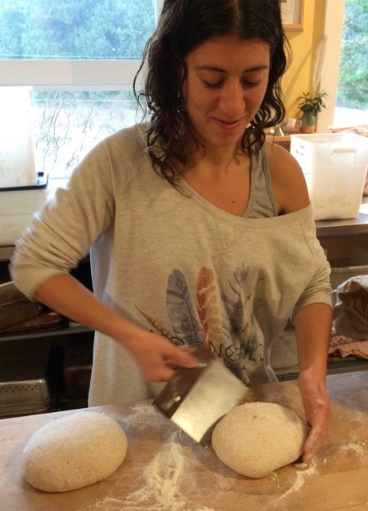](images/dd68d260_sourdough-13.jpeg) Bri shaping the loaves.[/caption]
[caption id="attachment\_15585" align="aligncenter" width="640"][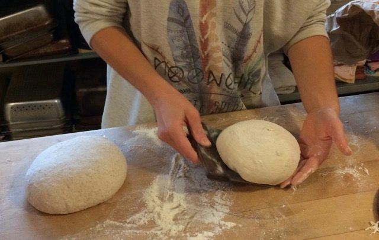](images/dd68d260_sourdough-12.jpeg) Shape the rounds by spinning the dough while you slide the scraper under the bottom.[/caption]
[caption id="attachment\_15586" align="aligncenter" width="480"][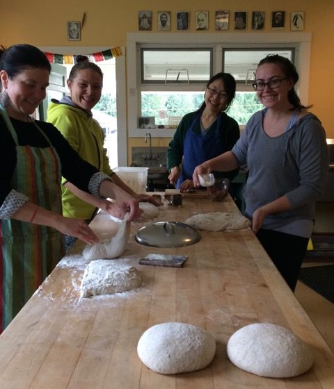](images/dd68d260_sourdough-15.jpeg) R-L: Jess, Kaori, Ellie and Rebecca having fun making bread at the playshop.[/caption]
**Proofing the dough:** Line two bowls or proofing baskets with a tea towel and dust with flour. We use a blend of wheat flour and rice flour mixture at this stage. Any flour works at this stage and rice flour helps to make your crust really beautiful. We just grind up white rice in our Vitamix. Let dough sit for three to four hours in a warm spot.
[caption id="attachment\_15570" align="aligncenter" width="640"][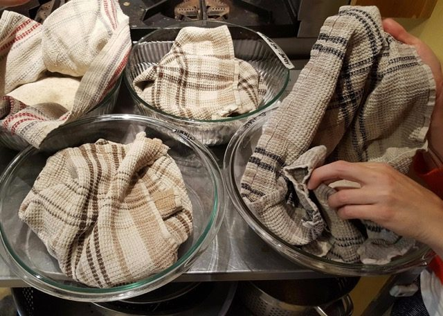](images/dd68d260_sourdough-2.jpeg) Loaves resting in the proofing bowls.[/caption]
**Baking the dough:** Place two cast iron pots with lids into the oven and heat to 500F for 30 minutes. Carefully remove the pots from oven and place the dough into them. Use a sharp knife or razor to score the top of the loaves. Place the loaves into the pots, reduce the oven temperature to 450 and bake for 20- 25 minutes with lid on, until the crust is just starting to turn brown, then continue baking 20 minutes without the lid until the bread turns a beautiful dark golden brown. Remove from oven and cool the loaves. Listen to the symphony of sound that the crust creates. Cut into quarters for slicing and share with the people you love.
[caption id="attachment\_15587" align="aligncenter" width="532"][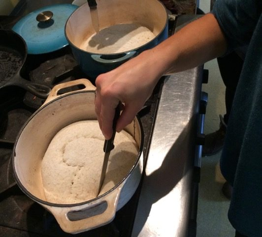](images/dd68d260_sourdough-16.jpeg) Scoring the top of the dough just before it goes in to bake.[/caption]
[caption id="attachment\_15569" align="aligncenter" width="480"][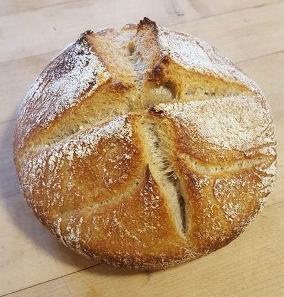](images/dd68d260_sourdough-1.jpeg) Gorgeous sourdough loaf.[/caption]
**Some extra notes:** We love following Chad's basic bread recipe, and it is very time consuming! There are countless other sourdough recipes out there that take way less time to prepare. Find one that suits your lifestyle needs. Sourdough bread is really delicious and it is the most nutritious way to consume gluten. There are many bloggers out there manipulating Chad’s recipe to make for quicker bread with the same results. Before Bri left we tried making bread by making folds every 10 minutes for up to 4 turns, with a 24 hour rest period in the fridge as our bulk fermentation. Then we let the dough come to room temperature (about an hour) and continued on in the regular steps. This seemed to work well!
Lately the bread yogis have been getting creative! Adding olives, fruit and nuts...even making cinnamon buns! The play and learning never ends!
[caption id="attachment\_15571" align="aligncenter" width="482"][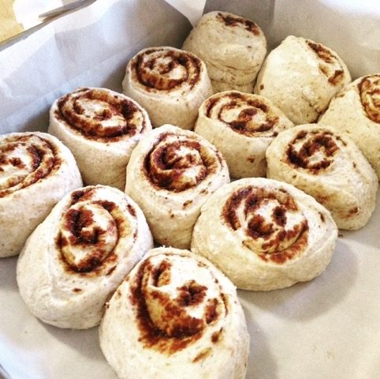](images/dd68d260_sourdough-3.jpeg) Sourdough can be used for cinnamon rolls, and even makes a delicious pizza crust.[/caption]
