## by Marianne Butler

[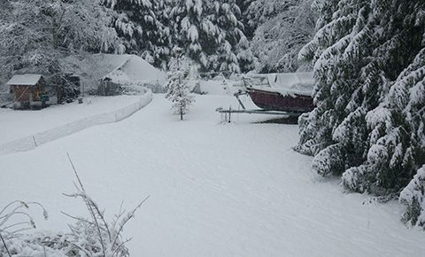](images/8299a7be_MB-winter.jpg) The view from my bedroom window, 2017
Today is the winter solstice. My thirty-fifth winter in this life, my fourth on Salt Spring Island. How did I end up here?
[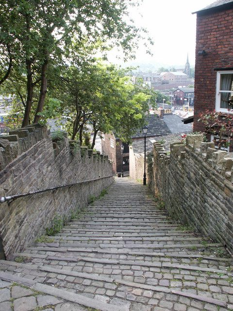](images/8299a7be_MB-macclesfield.jpg) View from the top of the 108 steps in my home town, Macclesfield.
I was born and bred in the north-west of England, living with my parents and sister in Macclesfield -’silk town’ - until I began university in 2001. My childhood environment left me with strong legs, much resilience to rain and a prejudice against wealthy people. I don’t remember it as a happy time. I do remember feeling free when I was walking - especially in the hills. I remember feeling peace when I was drawing with a torch, bunkered-in behind my wardrobe. I remember finding endless satisfaction in organising nik-naks into tiny boxes, colour-coordinating clothes and re-arranging ornaments on shelves. I frequently had migraines and abstract nightmares which I still haven’t found the words to describe. I experienced daily anxiety around eating and socialising, avoiding both wherever possible. I remember being repeatedly tripped-out by the concept that I was this person with this name in this body.
[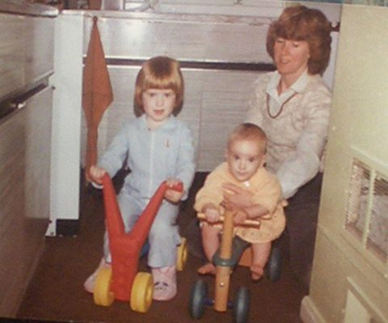](images/8299a7be_MB-1983.jpg) My older sister, Jayne, my Mum, Linda and little Me in our kitchen in Macclesfield, 1983
Like many teenagers of the 90’s I heard about Yoga via the mediums of Sting and Madonna. By then I was obsessed with movement, dreaming of being a dancer or an aerobics teacher, and practicing pilates from library books. Life had become much more manageable for me since I started secondary school and my Mum stopped pushing me to have friends or eat hot meals. In fact, I forged a few deep friendships then with people who are still among the best I know. The natural desire for acceptance arose in me. I stopped resisting life and became overall much more light hearted. Key memories from this time include my friends and I being begged to stop singing in class by our Maths teacher, re-enacting hollywood witchcraft in the park, and very intentionally training ourselves to drink strong black coffee.
[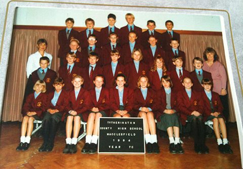](images/8299a7be_MB-1994.jpg) Me, front centre, with my secondary school form group, 1994
When I was 14 I got my 1st steady job, cleaning hotel rooms for £1.50 per hour. I loved it and spent most of my free-time budgeting to buy pretty things and sugary drinks. That year I also read the first book that made me feel the tingle of truth: In Search of Schrodinger’s Cat.
When I turned 17 my Mum told me there was £100 put aside for me to start driving lessons if I wanted. I hated cars and I wanted to be thin. I chose to spend the money on a 12-month gym membership. Over the years that followed it became obvious to me that when I exercised regularly I was happy and motivated, and when I didn’t I was depressed. I vowed to make my body strong and to enjoy it, rather than condemning it for not looking good enough.
My A-Level physics teacher told me that I could breeze an engineering career, because I was a woman. He also told me I should follow my heart. I felt the sentiment of that statement, but I didn’t know what it meant. I was baffled about how to choose a career. Coming to the conclusion that the purpose of University was to expand one’s mind, I opted to study humanities, enrolling in a Visual Culture Degree at the beautiful and prestigious University of Nottingham. I remember taking a bus to see my sister in Newcastle-Upon-Tyne shortly prior to this, and catching a glimpse of the Angel of the North. I was moved to the core by that sculpture, and I think I wanted to understand how Art worked. Two years later I left Nottingham and enrolled in Art college in Newcastle.
[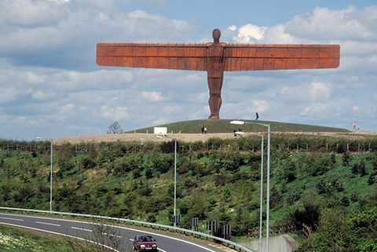](images/8299a7be_MB-angel.jpg) A glimpse of powerful beauty in Anthony Gormley’s sculpture
After much academic wriggling around, funded by bar-work and fuelled by tea and gin, I eventually graduated with a BA in History of Modern Art & Design. In my undergraduate dissertation I wove together theories of water, memorial, hyper-reality, myth and quantum mechanics. It was well received and I felt somewhat satisfied to have reconciled my thoughts on life. I also felt pretty disillusioned with academia, disappointed in the secondary education system, and more resolutely convicted to the truth to be found in visual beauty. I felt pretty sure I wanted to become an Art teacher.
[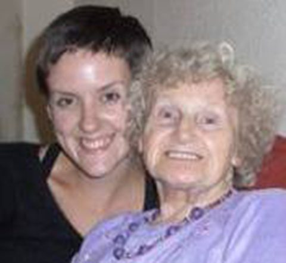](images/8299a7be_MB-2006.jpg) Me with my Nanna, Lily, a lighthearted woman with sparkly blue eyes, 2006
Fast forward to 2006, I found myself teaching English in South Korea. Desperation during my first month there led me to read a book left behind by the previous teacher: Chicken Soup for the Soul. The penny dropped for me. I couldn’t feel peace if I was struggling day to day in a role which I didn’t enjoy. I needed to align my life direction to a more natural path. It was that year that I learned what introversion is, on an online forum for teachers. More pennies dropped. I vowed to honour my physiological need for quiet.
[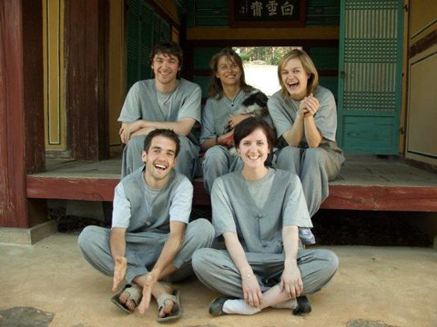](images/8299a7be_MB-2007.jpg) A fun visit to a Buddhist monastery in South Korea
Life in Korea evolved into a really fun one. Two Canadian women in particular became my good friends. A seed was planted. In a year of teaching English, I saved enough money to buy a laptop and an online certificate course in Web Design. I started the course the day after I returned to the UK, and completed it during various stints of living in Australia and Asia. In 2009, I started a New Media internship in London. The years that followed saw much professional wriggling around, fuelled by coffee and cigarettes, offset by a growing Yoga habit.
[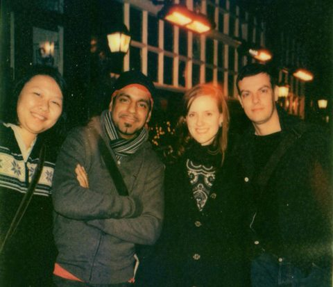](images/8299a7be_MB-2011.jpg) Me with some digital team-mates in East London, 2011
I lived happy and busy years in London. I filled my days with work which sent me right into the flow state, spent my evenings learning from amazing Yoga teachers, and my weekends visiting galleries with friends. In 2012 I started an MA in Graphic Design, and began to research Movement Visualisation. I fell in love with the work of Rudolf Laban and was delighted in its applicability to Yoga. At this point I was practicing pranayama and asana six or seven days a week, with occasional kirtan, trekking all over the city to access different classes. I was inspired and motivated. I had a found a movement practice, and a framework for describing it, which seemed to offer an endless resource of joy.
[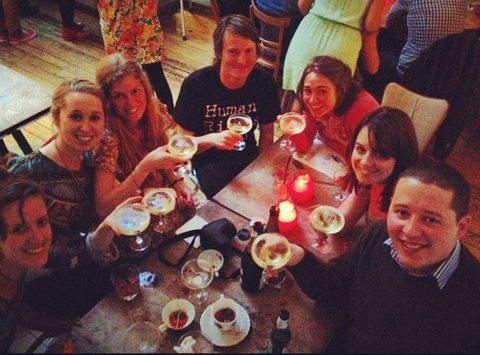](images/8299a7be_MB-2012.jpg) Me with some friends in a fun cafe in North London, 2012
By the beginning of 2013, I was recognising signs of exhaustion. Over-worked, under-nourished and hyper-sensitive, my nervous system was breaking down. So, 29 years old, tired and overwhelmed, I retreated to the North East with the intention of building a less stressful life on the coast near Newcastle. Later that year I fainted in a meditation class. Unfortunately it was a standing meditation, on a concrete floor. I fell like a tree, and face-first.
[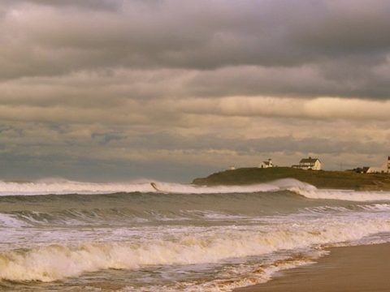](images/8299a7be_MB-2013.jpg) My hearts home, Northumberland coast, 2013
Fast forward to Spring, I’m 31. My broken jaw had healed perfectly and my asana practice was stronger than ever. I was also the loneliest I’d ever been. Heavy hearted and desperate to be saved. I had read enough about Yoga to know what was going on. So, I stopped choosing wine and chocolate. I started meditating every day. I journaled relentlessly, researched volunteer Yoga opportunities, and a plan emerged.
At the end of May 2014, having secured a working holiday visa, I flew to Vancouver, spending two jet-lagged days in the city before catching the ferry to Long Harbour to begin YSSI at the Salt Spring Centre. I hoped to find a strict yoga program, the company of kindred spirits, perhaps a way to heal my addiction to work. I was most excited about sleeping outside for three months. I wanted to rest and focus and prepare myself for the Yoga Teacher Training which I was intending to embark on in the Fall. I must’ve loved that summer because I ended up extending my stay, ultimately taking a year long position as Programs Coordinator.
[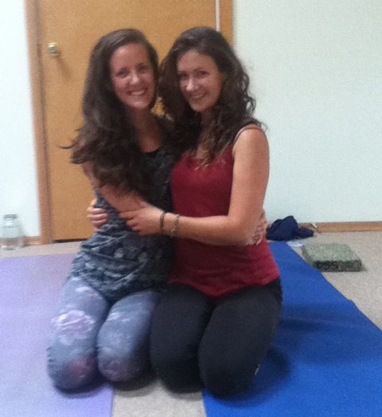](images/8299a7be_MB-2014.jpg) Hugasana: Olivia and I blissed out after Leslie Ormiston’s beautiful class, ACYR 2014
During my time in YSSI I remember feeling long moments of bliss, and of peace. Wednesday kirtan and Sunday Satsang were pretty electric that year, and I had fun experiences of all kinds. There were too many gems to mention, but my favourite practice from the Centre was that of the hand mudra sequences. Perhaps what really captured my heart for so long was the inspiration I found in the lives of the residents and elders. It seemed that everywhere I looked were sparkly eyes, rock solid integrity and another magical story about the 1970s. There were elements of cultural discord for me, of course. But the friends I made at the Centre, and the respect I felt for the elders, convinced me that I never wanted to leave.
[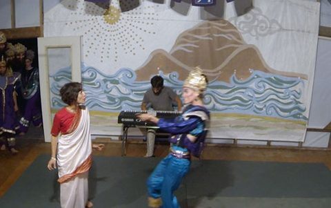](images/8299a7be_MB-2014-2.jpg) Me tormenting Sita in the Mini Ramayana, ACYR 2014
I know that the philosophical teachings of SSCY have influenced me more than I know. I’ve received a lot of them via the medium of Sharada, and when they come to my mind, they are usually in her voice. My favourite is something to do with a game of golf in India, and gave me a useful ‘mantra’ for 2015: “Play the balls from where the monkeys dropped them”. That year for me was chaotic and intense. And yet, I never failed to be amazed at how profoundly peaceful most visitors would feel after just 20 hours of a Yoga Getaway. I came to understand the Centre as an arena to practice being grounded amidst the storms. A wise friend told me “if you can learn to handle the stress here, then you’ll be able to handle it in the rest of the world”.
[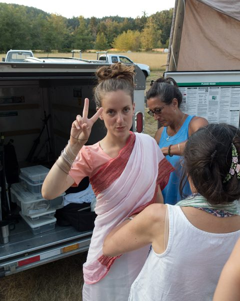](images/8299a7be_MB-2015.jpg) Me being dressed as Sita for the Mini Ramayana, ACYR 2015
Well, that’s a work in progress. I’ve realised recently that I am my own monkey. Dropping golf balls all over the place, trying to pick up the thread. I’m currently completing my 3rd Yoga Teacher Training program in three years, a study which has continued to bring me back to sanity. I love movement, and that is still my primary driving force. I balance that with the stillness of Meditation. I’m grateful to SSCY and its teachers for helping to solidify (for want of a better word) my Meditation practice. I thrive on quiet, and that is still my greatest desire. I’m grateful to SSCY for giving me a beautiful way to balance that with the buzz of group kirtan singing and ceremonies.
[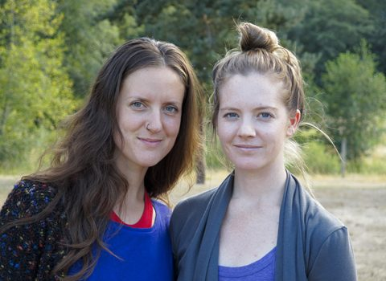](images/8299a7be_MB-2015-2.jpg) Sue Ann and I pretending to be serious for our teacher headshot, ACYR 2015
I’m also grateful for meeting my partner, Brandon at the Centre! We’ve shared a 2.5 year adventure since the 2015 ACYR Ramayana, and he’s the reason I still live on this crazy island.
[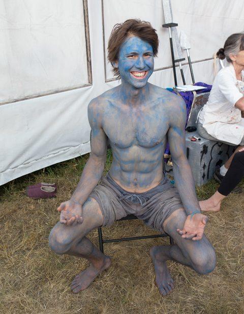](images/8299a7be_MB-ram.jpg) Brandon being painted Ram for the Mini Ramayana, ACYR 2015
During my years on Salt Spring, I’ve developed an increasingly deep love for my friends and family in the UK, as well as the country itself. In particular I’ve grown an understanding for my Mum, her faith and spiritual practices, and the choices she’s made because of them. Both my parents were committed Christians, and my Mum spent the past 15 years working as an Anglican Minister. I think this has also influenced me more than I know. I never liked or wanted Christianity - though I loved to sing at church as a child - its stories were so far away from my experience of truth, too figurative and dripping in patriarchy. But recently I saw, on flicking through a few books on my Mum’s shelf, that if I look past the names, the philosophy was essentially yogic.
[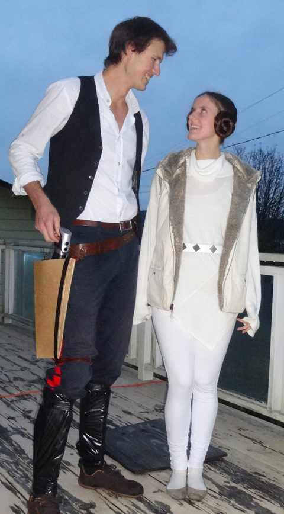](images/8299a7be_MB-2016.jpg) Sita Ram dressed up for Halloween, Salt Spring, 2016
I don’t expect to stay on Salt Spring for many more years, but I suspect that SSCY will remain lodged in my heart and psyche forever, and I will cherish the moments when I cross paths with my friends and teachers from there.
[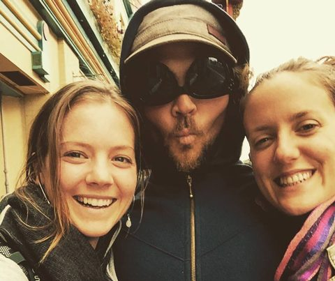](images/8299a7be_MB-friends.jpg) A treasured snapshot of a beautiful SSCY friendship, Victoria, 2015
