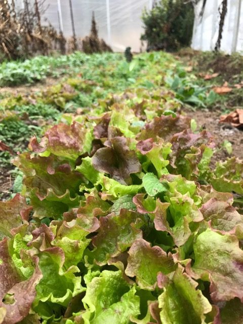
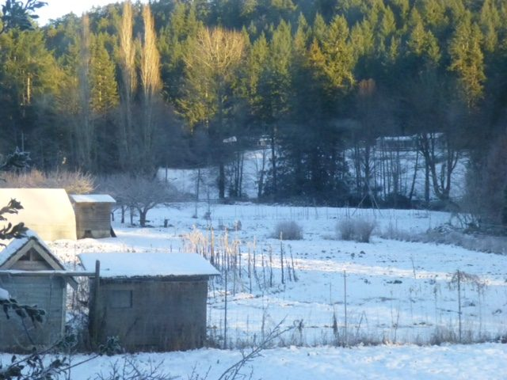
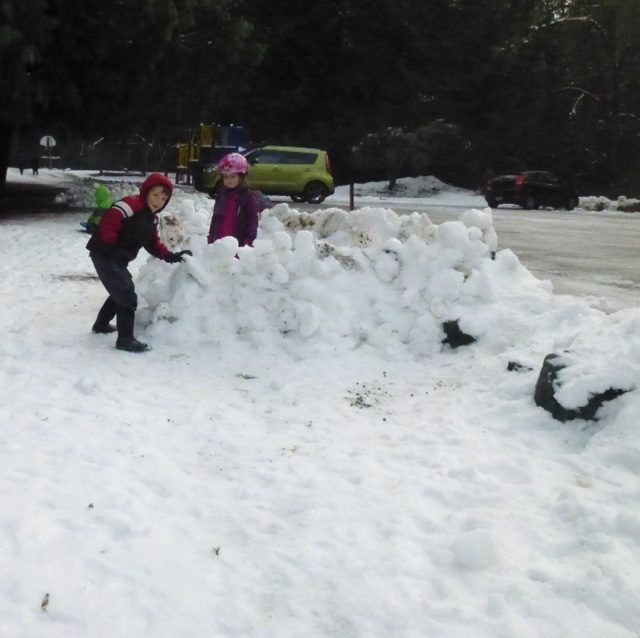

Hello everyone, and happy new year,
While we have much to be grateful for, we know these are challenging times for many people all over the world. As we watch the news it’s easy to be pulled into disturbing stories and react to them. We want to stay informed and engaged, yet to keep our balance and sanity, we need to remember our aim. Babaji says: *Be humble and seek for divine grace. Don’t get agitated by things you don’t like, don’t get attached to things you like. Sit in peace within and without. This peace is the divine light. Keep a calm mind and contemplate the divine light.*
The Centre’s residential community will begin to grow again this month as karma yogis who have been travelling return to the Centre. Welcome back to winter to those who have been visiting warmer places.
Since you will receive this email at the beginning of January, our New Year celebration will already have happened. At this writing, though, we’re looking forward to bringing in the New Year with prayer and kirtan. We continue to send our gratitude and love to Babaji, and we also send our love and healing prayers to to Keiko, our fabulous graphic designer, whose mum recently passed away.
[caption id="attachment\_15676" align="aligncenter" width="480"] Lettuces in our winter hoop-house![/caption]
[caption id="attachment\_15677" align="aligncenter" width="640"] A corner of the farm in the winter[/caption]
[caption id="attachment\_15678" align="aligncenter" width="640"] Last day of school before the holidays[/caption]
Although the weather is cold (and currently snowy), we are still enjoying food from the garden. The winter squash is sweet, the greens (even lettuce!) growing in the greenhouse (aka hoop-house) are delicious, and the canning and preserving done during harvest time add to the deliciousness of our meals. The inspired bread bakers in the community have kept the bread basket full.

# On the horizon…

## Join our community

Are you interested in becoming part of a spiritual community and deepening your understanding and practice of yoga? If so, our upcoming [Residential Karma Yoga Program](https://saltspringcentre.com/yoga-service-and-study/) may be for you!
**Our Program will offer opportunities for:**

- Sadhana
  - Instruction in asana, pranayama and meditation
  - Theory classes on the many paths of yoga
- Seva
  - Helping to provide a sanctuary for personal and spiritual development here at the Centre
  - Serving within our organic farm, kitchen, maintenance, housekeeping and landscaping areas.
- Satsang
  - Dedicated time for gatherings and community development
  - Living, working and practicing in a supportive environment with like-minded individuals

We will start accepting applications early in January for our April 2018 intake. The program will run in 10 week sessions. Check our website for more details!

## Stay tuned for new website

Our updated website will be up soon, making it easier to find the information you’re looking for.

## \*New\* Winter Yoga Getaways

Although our popular Yoga Getaways have generally not begun till spring, this year they begin in winter, the first two coming up shortly: January 19-21 and February 9-11. After a quiet December, life at the Centre is about to power up.

# In this month's Newsletter

As part of the Our Centre Community series, [meet Marianne Butler](https://saltspringcentre.com/2017/12/a-story/). Here she tells the story of her journey from anxiety, movement, and addiction to work, to deliberate lifestyle changes leading to yoga and finding balance, finding herself.
Places like the Salt Spring Centre of Yoga are keepers of the light that support us in our aim of finding peace and living in harmony with life. The ancient Vedic prayer beginning with the words “[Common be our prayer](https://saltspringcentre.com/2017/12/common-be-our-prayer/)” reminds us that we all share the same longing for happiness and peace, although we may express that longing in unskillful ways. What is it that keeps us apart when what we really want is love and belonging?
*Always remember your aim, which is to attain peace (God).*
 *Develop good qualities in your actions and thoughts, such as honesty, compassion, and love.*
 *Be nonviolent.*
May this year bring us together in love and harmony.
Love,
Sharada
