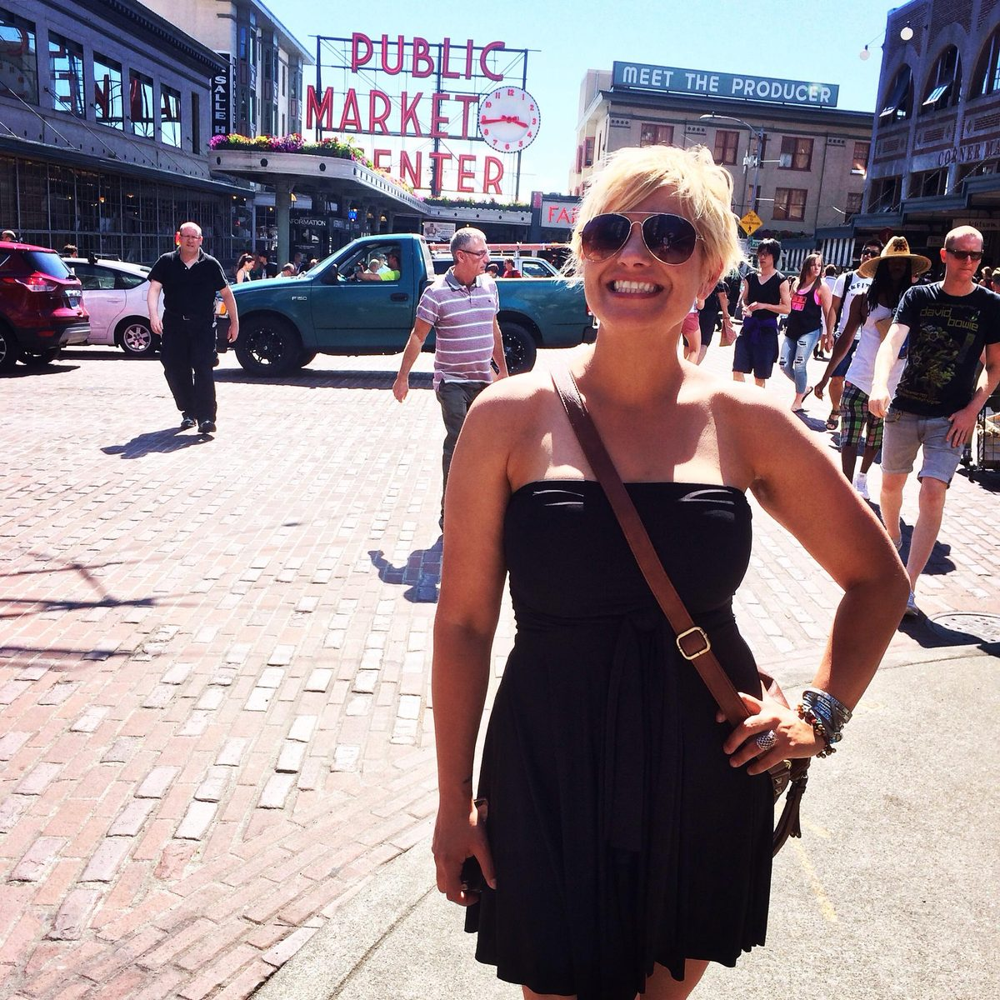
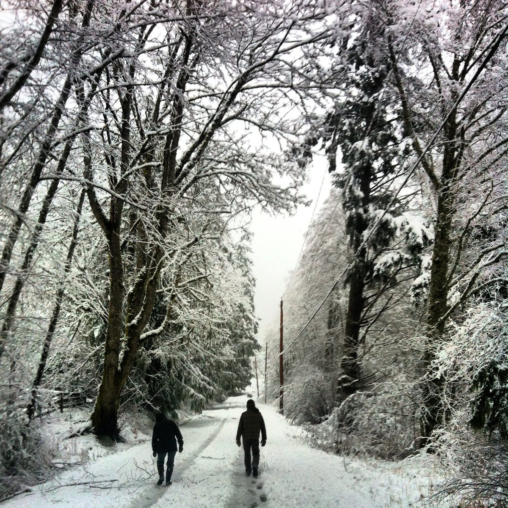
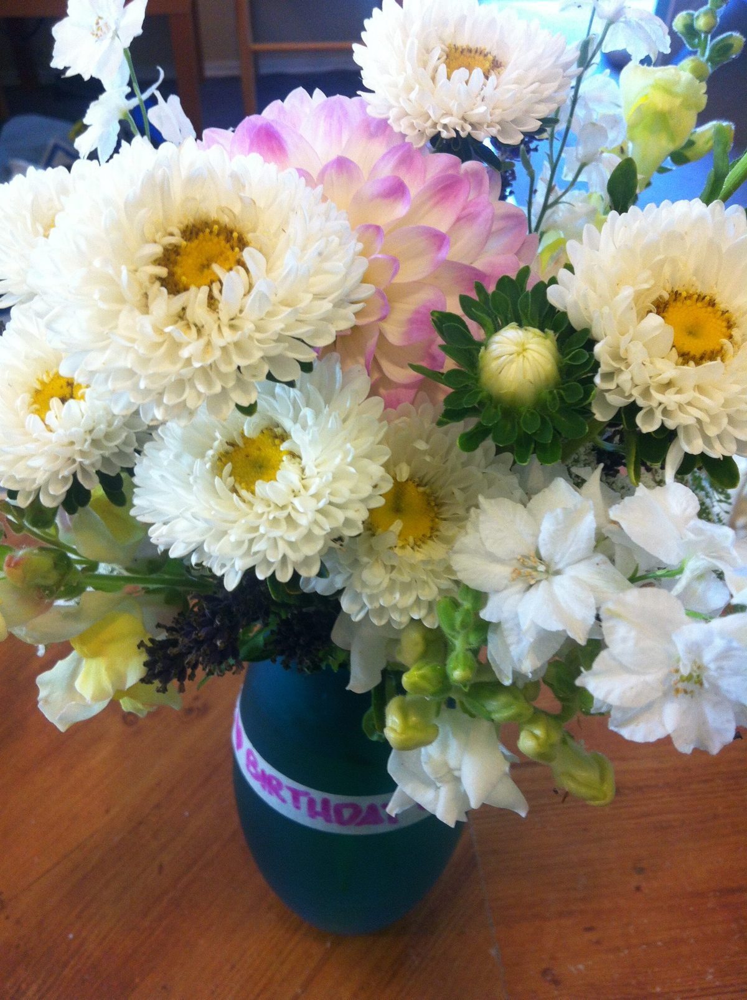
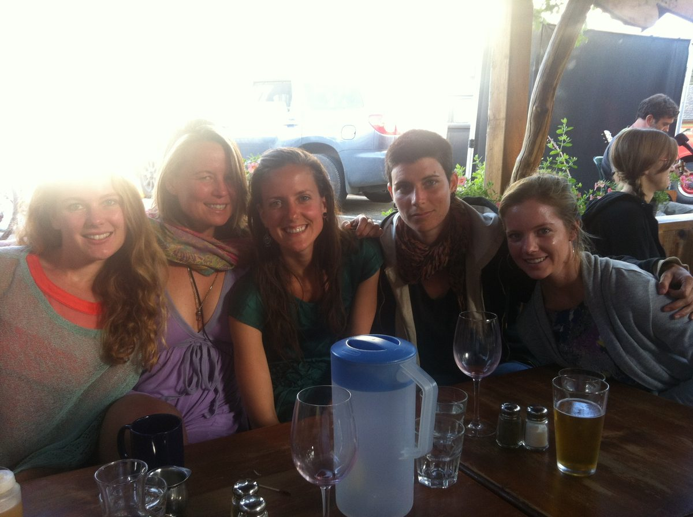

 Kris Cox, part of our Centre Community
Although I like to say that I manifested being at the Centre and I chose to stay a year longer than originally planned, there was so much resistance and defiance on my part that it’s a wonder to me that I came to look back at those years as life-changing, and one of the most beautiful times of my life.
I heard about the Salt Spring Centre of Yoga from a friend who spent a month as a karma yogi in 2010. She came back and used words like magical. Naturally I was intrigued. Though I had been practicing asana for some time, I had never looked into yoga centres and had no idea that karma yoga programs even existed. My practice was a primarily a physical practice at that time; however underneath, my spirit longed for something more.
 Snow day in February
I kept coming back to the SSCY website every couple of months, scouring every page, again and again, trying to understand exactly what this place was, and looking for opportunities for me to be there—not an easy feat for a single woman from Calgary, with a “career”, an apartment lease and student loans. It made no sense that I’d try to disrupt that with a ‘yoga holiday’. And yet, I kept looking.
Two years later as I opened the site—yet again—a full year’s position was posted that made me stop in my tracks. It seemed written for me. This was it.
In what seemed like a crazy couple of months, the universe conspired to help me with my plan, and on January 31st, 2013 I was getting off the ferry in Fulford Harbour. Entirely out of my element, that first night I hid in my room wondering if I had made a terrible mistake. The first few weeks I was completely out of my comfort zone: we said Om before meetings; we sat in circles; we chanted a Sanskrit meal prayer—while holding hands; and people threw around the word God like confetti (which gave me an allergic reaction). Every part of my rational mind told me this was way too woo-woo for me. Great for anyone that was into that, but not for me. A self proclaimed “downtown city girl”, I struggled to be in a place of so much quiet, insight and vulnerability. I knew I had asked for this, but I wasn’t prepared for being thrown so far into the deep end.
I had a position in the office as the first Programs Coordinator—a place I was quite comfortable with: office procedures, administrative organization, payment processes and the logic of website coding. It provided the structure in a place that seemed all about feelings. I struggled with the concept of the ‘correct’ way to do things, and witnessed that this place held space for all ways of doing things. The traditional business and leadership guidelines I was familiar with were replaced by allowing people to find their own way. People were given space to make mistakes, to grow, to struggle. It challenged everything I knew.
 Birthday flowers from my lovely centre friends in my first year.
At some point, a couple of months in, I had already decided that I was going to stay longer than the one year I had agreed to. It wasn’t really a conscious decision; I didn’t even realize I’d made the decision until the words came out of my mouth. I thought that I could help with the aspects of administration, organization and with continuity in a place that experiences transition often. Rationally this made sense, but I’ve learned that rationalization is often the ego’s justification. Looking back, I see what I couldn’t realize at the time: that the voice saying “I’m not finished with this place” was actually not my own, but something else. What it actually said was “this place isn’t finished with you”.
Daily life at the Centre challenged me in every way. The comings and goings of karma yogis affected me—the idea that I would develop friendships (attachments) to people only to have them leave, hurt me so badly that in my second year I created a large distance between myself and the new karma yogis. The rituals that appeared to mirror religious practice—arati ceremonies, weekly satsang gatherings, yajnas—made me question if this was right for me. I thought I didn't fit in, that I wasn’t enough of a yogi to be there. It was the guidance of the elders that alleviated my anxiety by telling me that yoga can be practiced in the way it’s best for each person. If my yoga was asana and working in the office, that was perfect for me. I felt so valued for what I was bringing to the Centre. I liken it to the way that a grandparent will often make each of their grandchildren feel like they are their favourite.
 At the Tree House Cafe
I did want to understand the philosophy of yoga so I attended some Bhagavad Gita study classes where we often spoke of the philosophy of oneness, of consciousness, of this word God. I remember saying after a Gita session that it all sounded good, but I wasn’t sure if I could really just believe it—the analogy that we are all essentially ocean waves who identify as separate, but if we just look beyond ourselves, we’d realize we were part of a connected expanse. I’ll never forget what I was told: “No one is asking you to believe. But maybe just try it on for a while and see how it feels”.
I’ve come to realize that being ‘right’ and ‘wrong’ have been such a key part of my identity, that the idea of accepting something so radically different than what I believed to be true was to effectively say that I had been wrong my whole life. I don’t know many people who would take that well. Being wrong in a belief or idea can feel like being wrong as a person. Follow the thread and people can think they are not useful or worthy—which is what most fears come back to: being worthy. So when I was told that I didn’t have to believe, that I could just try it on, my ego was able to let it in. To dip my toe in, like I could take it or leave it at anytime.
Someone standing at the edge of a body of water, dipping their toes in, braces the rest of their body so as to not fall in unintentionally—a counterbalance. That was me—being careful not to drink the Kool-Aid. At the same time though, I marvelled at the people at the Centre who’d jump straight in. Those who would attend the ceremonies and practices with openness and without fear—diving into the water—while I stayed on the edge, eventually letting my legs dangle in but not going any further.
There was so much interest and yet so much reluctance. I preferred the theological discussions rather than the practices, where I could study it, ask questions and analyze it at an arm’s length. Looking back I saw a constant struggle with my ego that needed the entire time I was at the Centre, and it took every person I met to play their part.
Some of the people I met at the Centre I will carry in my heart forever as friends and even mentors. I often think back to the lessons in acceptance, patience, compassion and love that some of these beautiful people taught me by just being who they are. And then there is what I lovingly call my greatest souvenir: the man who is now my husband. It never in a million years occurred to me that I’d meet a person on Salt Spring so special to me that I’d want to spend the rest of my life with him. And as fate would have it, less than 10 months after meeting, Mathew and I eloped in my hometown of Calgary.
 Wedding day
What I find most interesting is that once I left the Centre I finally started getting in the water—which isn’t to say that I’m practicing regular sadhana by meditating every day (I’d call it sporadic at best) or performing arati (though I’ve developed some of my own rituals). But the concepts and philosophies have permeated my thinking. I can see now what I was then resisting. I no longer have to fight against my own ego (mostly—ha!). I participated in my first kirtan two years later when I came back to teach at one of the Yoga Getaways. I cried as I chanted; the tears streamed down my face as my heart felt happy and I could use my voice to connect with something powerful.
It’s taken a couple years for me to immerse myself further in this yogic philosophy of oneness. (Some people call it God, but personally I still haven’t gotten over that allergic reaction). But I realize that my journey for decades has been a yogic one: “As soon as a person starts thinking, ‘I want to be a better person’, that is the start of Yoga” (Babaji).
People often think of transformations as something similar to TV makeovers with radical changes to how someone looks. I’m not sure if my transformation is tangible to others. I certainly hope I have more of the better qualities and fewer of the undesirable ones, and that those who are close to me have noticed. But ultimately, I can tell. Looking into my own headspace is completely different now, and I hope it continues to change. Babaji also said “If you work on yoga, yoga will work on you”. This I know to be true.
