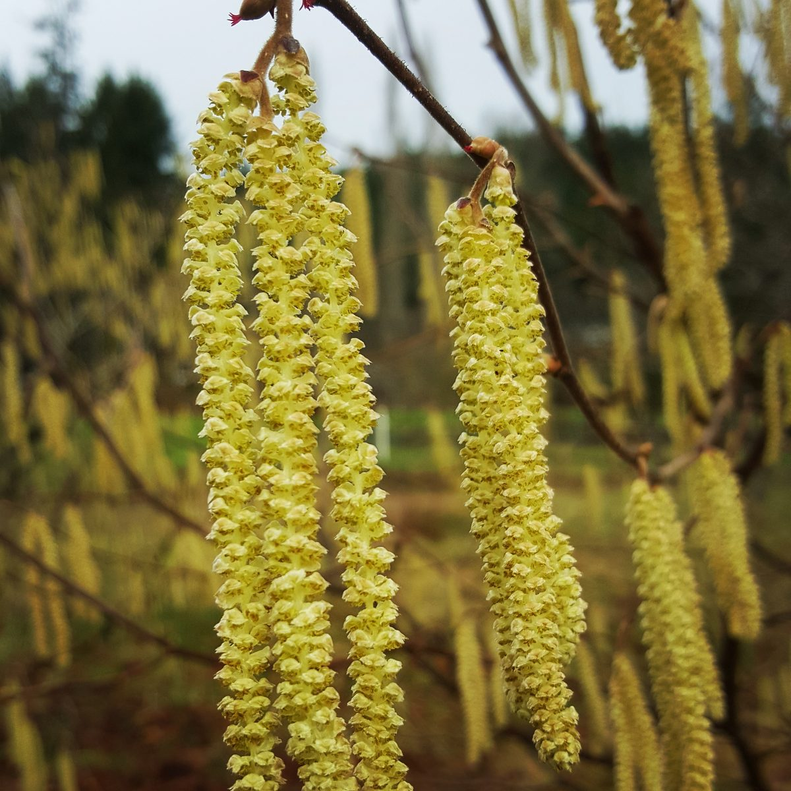
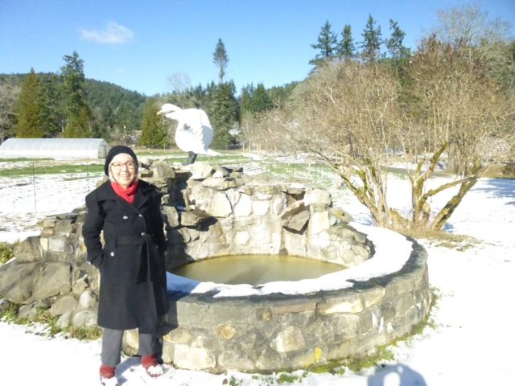
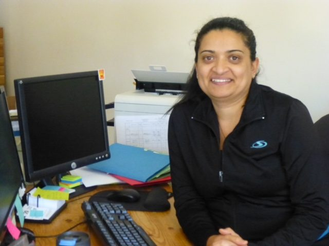
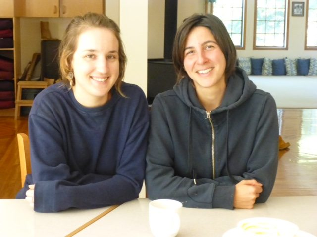
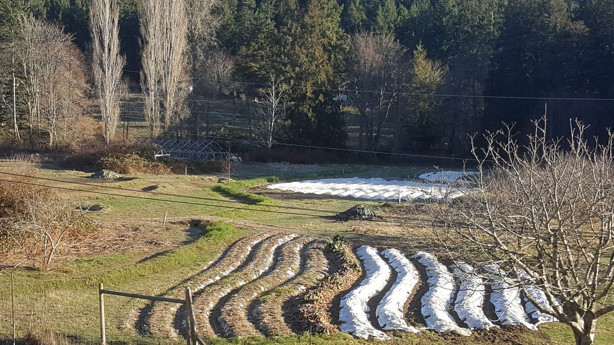
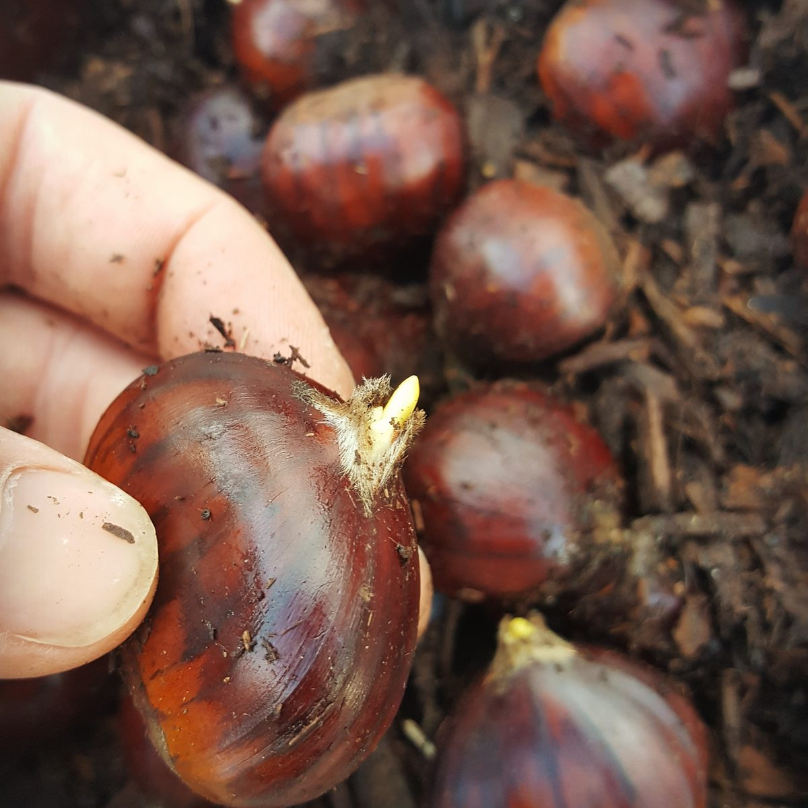
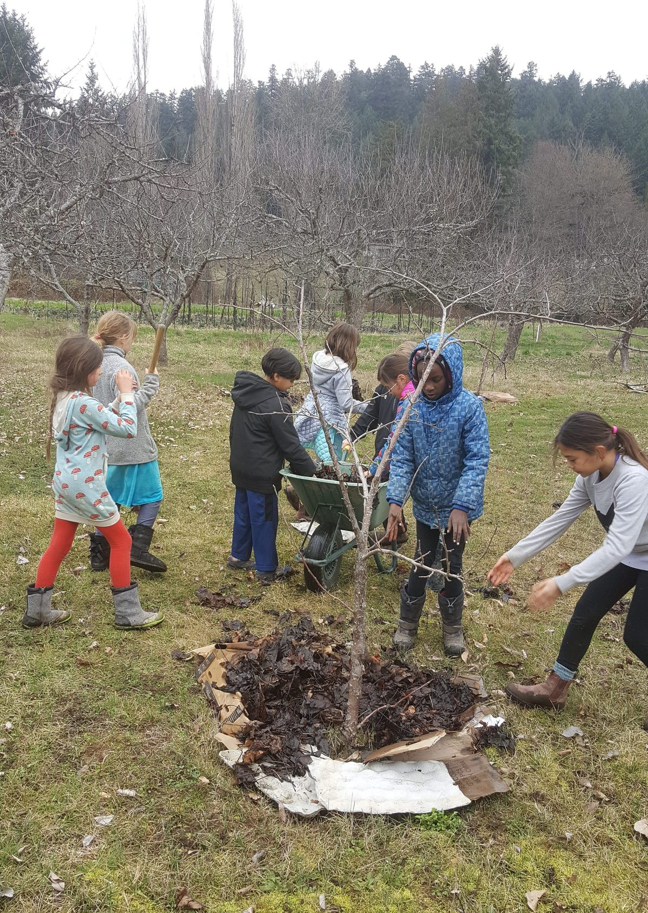

*Even after all this time*
 *The sun never says to the earth,*
 *‘You owe me.’*
 *Look what happens with a love like that.*
 *It lights the whole sky.*
—Hafiz
Hello everyone,
Winter at the Centre has been fairly quiet, but life is beginning to pick up speed. February surprised us—as it does every year (so why are we surprised?)—with winter’s last hurrah in the form of snow (now melting). Meanwhile, the trees are budding and the daffodils are ready to burst into bloom.
 Spring is on its way!
 Sharada, the swan and the snow
In the program house, we’re cozy around the wood stove, and our wonderful kitchen team continues to feed us delicious, nourishing meals.
 Racquel in the office
 Mariel and Muriel
**Shiva Ratri** was rich and focussed. Although somewhat smaller than last year, it was beautiful—and because this winter was warmer than last year, it wasn’t necessary to break the ice on the pond to walk into the pond with the offerings. Hara Hara Hara Mahadev!
Wednesday evening **kirtan** and Sunday afternoon **satsang** continue. Anyone coming for satsang is welcome to arrive earlier (2:00 pm) for **Yoga Sutra study in the library**, led by Yogeshwar. Also, **full moon yajnas** take place every month. All these events are listed on the [calendar on our website](https://saltspringcentre.com/calendar/). Note also that satsang happens in Vancouver and Victoria as well (details below).
All indications are that this is going to be a very busy year at the Centre, with lots of programs, rentals and personal retreat guests. As mentioned in a previous newsletter, we are beginning a new **[Residential Karma Yoga Program](https://saltspringcentre.com/karma-yoga-program/)** in April. Check it out!
Life is coming back to the farm. Here is...

## Milo’s March update

> Well hello again everyone!
> Things are starting to stir again here on the farm as Spring slowly tickles Winter out of place. Historically and presently, this time of year can be a bit rough for true homesteaders, as most of the winter storage crops have been munched and the early spring crops have yet to reach harvest.
> 
> Luckily, being "light" homesteaders, we have sun soaked California farmers to lean on for our current shortcomings AND I was able to work and cover a few of our upper fields before the last rains, which means we'll be getting an early jump on the season! Fresh greens and roots are on the horizon.
> 
> Frosty mornings of late have been spent crop planning, followed by mid-day seed sowing marathons, and evening walks through the fields. This is a big year for the farm as we plan to up our vegetable production and efficiency tenfold. Sweet chestnut trees will remain in the spotlight this year as I plant out the now-sprouting seeds into temporary nursery beds. I also suspect we'll find a great deal of joy in our new food forest this year as the raspberries will likely fall in by the bucket.
> 
> The Centre School kids are back on the farm, much to our delight. The Farm Team is steadily forming as well welcome new Yogis into the community. So, if I may be so humble, stay tuned for an exciting season!
> Onward!

**Dharma Sara Satsang Society** will be holding its annual AGM in May. If you are not a member but are interested in joining, you can read more information [here](https://saltspringcentre.com/dharma-sara-satsang-society/). This is an opportunity to develop a deeper connection with the satsang community and learn more about the many aspects of the society.

## Babaji update

Our beloved teacher, **Baba Hari Dass** has inspired, taught and guided us through all the phases of our community, our satsang. He is still living, but his body is frail. [Here is the latest update on his health](https://saltspringcentre.com/babajis-health-update-march-2018/).

## To read….

Our Centre Community this month features **Kris Cox** , a committed city girl on a career path who found herself here a few years ago. She had the office skills for the programs manager position she was hired for, but ended up with a lot more. I won’t give it away here; [read it for yourself](https://saltspringcentre.com/kris-coxs-centre-story/).
We humans are quite adept at making life complicated for ourselves. We stress about the past and worry about the future, winding ourselves up tighter and tighter. Our practice must be to soften and open, to relax into life. [Please read **Relaxing into Life**](https://saltspringcentre.com/relaxing-into-life/).
*Cultivate a sympathetic heart, humility in dealings, and selflessness in action. If these are practiced with earnestness and sincerity, then you will win the race of life.*
—Babaji
Love,
Sharada

---

#### **Vancouver Satsang**

Sundays, 6:30-8:30pm
[vancouversatsang@saltspringcentre.com](mailto:vancouversatsang@saltspringcentre.com)

#### **Victoria Satsang**

Mar 11 & Apr 15,  3-4:30pm
Anja Yoga (Theatre Lane)
[rpfeifer@centrebalance.ca](mailto:rpfeifer@centrebalance.ca?subject=Victoria%20Satsang)

---
