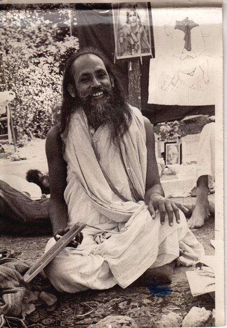

We all want to be happy, yet things don’t always go the way we want. In fact sometimes life is downright difficult. We struggle through the hard times, and even though we enjoy good times, difficult ones keep showing up—and we don’t like them! Even a worry that arises in the mind about something upsetting that might happen can lead us to tighten up and shut down. We live with an underlying anxiety that prevents us from letting go and simply enjoying life. This is a kind of hoarding, holding on tight because we’re afraid of opening up and letting go into what might happen, fearing it will be bad.
Pema Chodron writes: “Fundamental richness is available in each moment. The key is to relax: relax to a cloud in the sky, relax to a tiny bird with grey wings, relax to the sound the telephone ringing.” She goes on to say, “When we are able to be there without saying, ‘I certainly agree with this,’ or ‘I definitely don’t agree with that,’ but can just be here very directly, then we find fundamental richness everywhere.”
Life is always going to include all flavours of experience—the ones we enjoy and the ones we don’t. The energies of life keep spinning, guaranteeing that everything will change. One thing that can help when we’re struggling is to remember that it won’t always be like this. That includes the parts we enjoy, but for now it’s helpful to remember this when we’re struggling.
*This is life. It includes pleasure, pain, good, bad, happiness, depression, etc. There can’t be day without night, so don’t expect that you are anyone will always be happy and that nothing will go wrong. Stand in the world bravely and face good and bad equally.*
Accepting life as it is is the only useful way to deal with whatever is happening. You may be facing an argument with your spouse or a diagnosis of cancer—or anything in between. What happens when you resist? Apart from the fact that arguing from a stance of resistance or anger doesn’t work to resolve the problem, it also affects your health and general well-being.
Faced with potential danger, your sympathetic nervous system steps in with a fight-or-flight response; your heart speeds up and you’re ready to react. Your response in times of danger can save your life. Unfortunately the sympathetic nervous system isn’t so good at discriminating between real danger and situations that are difficult but not life-threatening, including something as simple as a comment or even a sideways glance from someone, that you interpret as hostile. If you stay in that state for a long time it will wear you down. The parasympathetic nervous system, on the other hand—the rest-and-digest mode—eases stress and allows the body and the mind to relax and return to its natural well-being. All the practices of yoga and other spiritual traditions are designed to bring you into that state.
There are many simple practices we can apply when faced with life’s challenges. Sometimes just stopping and stepping back, even for a few moments, can allow for some perspective and can change a situation. In those moments we can breathe, settle down and allow the parasympathetic system to come to kick in. In that more open space we’re more likely to be able to contemplate our initial response, and may even begin to wonder, “What was that all about”? If we can become curious instead of critical, we may learn both about ourselves and the person or situation we’ve been having a problem with. Curiosity can lead to generosity of spirit, recognizing that everyone is struggling; we’re all in this together. From that perspective we’re more likely to be able to see the innate goodness in ourselves and others.
Gratitude for what we have also has the power to change our lives. My brother recently told me about a visit with a friend of his who lives a simple life in a small town in Mexico. When he stepped into her house, his friend was washing the floor and singing joyously. When he asked her why she was singing, she said, “Why not?” Afterward she elaborated—“I’m alive, I have a house to live in, food to eat; why not be happy and sing?” Life is enough.
This is our practice. How can we soften into this moment and relax into life?
Ramana Maharshi said, “Whatever turmoil our mind may be in, in the centre of our being there always exists a state of perfect peace and joy, like the calm in the eye of a storm. Desire and fear agitate our mind, and obscure from its vision the happiness that always exists within it. When a desire is satisfied, or the cause of a fear is removed, the surface agitation of our mind subsides, and in that temporary calm our mind enjoys a taste of its own innate happiness.”
*Be persistent in withdrawing your mind from the world, from anger, fear, hate, jealousy, attachment, and pride. Remove malice from your heart. Be friendly to all. Establish love in your heart for everyone. Be selfless in your thoughts and actions.*
*One who has lost touch with the centre of his or her being becomes restless, confused and depressed. One gets back in touch with that centre by contemplation.*
*Be humble and seek for divine grace. Don’t get agitated by things you don’t like. Don’t get attached to things you like. Sit in peace within and without. This peace is the divine light. Keep a calm mind and contemplate the divine light.*
*When the mind is free from all past memories and imaginary cognitions about the future, it is in the present where there is perfect peace.*
*Wish you happy.*
Contributed by Sharada
Quotes in italics are from writings by Baba Hari Dass

---

**Sharada Filkow**, a student of classical ashtanga yoga since the early 70s, is one of the founding members of the Salt Spring Centre of Yoga, where she has lived for many years, serving as a karma yogi, teacher and mentor.
