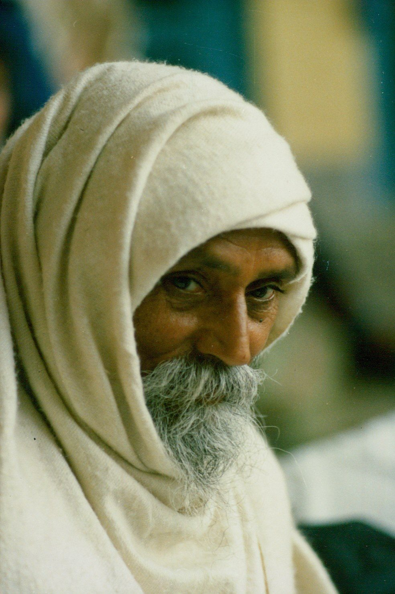

> “If you’re invested in security and certainty, you are on the wrong planet.”
> - Pema Chodron

One thing is certain: Whatever is happening now will change. Everything in this universe is in flux, so if you think you will reach a place where you finally get it all together and can coast to the finish line, you are in for a surprise.
You know from your own experience that nothing stays the same. You began this life as a baby; then you grew and became a child, and then an adolescent. Now you’re an adult. Can you imagine being older than you are? If you live long enough, you will get old, with all the accompanying changes age brings. None of this is either good or bad; birth, growth, decay and death are the laws of nature, and no one is exempt. The strange thing is that although we see others getting older and dying, we don’t fully grasp that this will also happen to us.
These changes apply to all living beings, and they also manifest in what humans have created over the centuries - cultures, societies, theories, organizations. All of history is a story of change. Impermanence is the nature of life; difficulties arise when we resist.
Why do we resist? Because we worry that the change will be bad. Ultimately we are afraid of dying, and change can feel like a kind of death to the ego. We want to hold on. Even if things are difficult, at least we know what’s going on, and we’ve gotten used to it. Change rocks the balance.
*A kind of experience accepted by the mind is called pleasure, and when that experience is rejected by the mind it changes to pain. Pleasure and pain are self-created illusions. The world itself is an illusion, and we have to go through all these pleasures and pains to attain the truth.*
When asked why there is pain in this world, Babaji answered, *If you think about this deeply you will come to the conclusion that it exists because we search for pleasure. The mind compares, “This is pleasure and that is pain.” Pleasure and pain are nothing but the mind’s acceptance and rejection of experience.*
*In our everyday life we identify things as good or bad. If something doesn’t support our ego, the mind labels it as bad, and if it does support our ego the mind says it is good. Our ego, according to its likes and dislikes colours every object, thought or idea and gives judgement accordingly.*
To remove the pain we carry with us requires that we become willing to look at things from another perspective. Babaji says *it is only a matter of switching the mind*. As Shakespeare wrote, “Nothing is either good or bad but thinking makes it so.”
Switching the mind requires that we pay attention to our thoughts and our speech. Each of us has well-cultivated habitual reactions to what shows up in our field of consciousness. Even in the same situation, not everyone will respond in the same way. Some get angry and argumentative; some are engulfed by a sense of hopelessness and sadness; some tune out, withdraw, or sit in confusion. Actually, all these responses are attempts to find some solid ground to stand on, forgetting that this too will shift. Noticing our thought patterns is a first step toward freedom. *If we are not aware of ourselves, then we can’t progress.*
How can we live in the midst of instability and uncertainty? The main thing is to remember your aim. If you want peace, you have to choose peace.
*Always remember your aim, which is to attain peace (God).*
 *Develop good qualities in your actions such as honesty, compassion, and love.*
 *Be nonviolent.*
 *Remember God.*
 *Perform selfless service such as helping the poor, old, sick or orphaned.*
*This is life. It includes pleasure, pain, good, bad, happiness, depression, etc. There can’t be day without night. So don’t expect that you or anyone will always be happy and that nothing will go wrong. Stand in the world bravely and face good and bad equally. Life is for that. Try to develop positive qualities as much as possible.*
Contributed by Sharada
All quotes in italics are from writings by Baba Hari Dass

---

 **Sharada Filkow**, a student of classical ashtanga yoga since the early 70s, is one of the founding members of the Salt Spring Centre of Yoga, where she has lived for many years, serving as a karma yogi, teacher and mentor.
