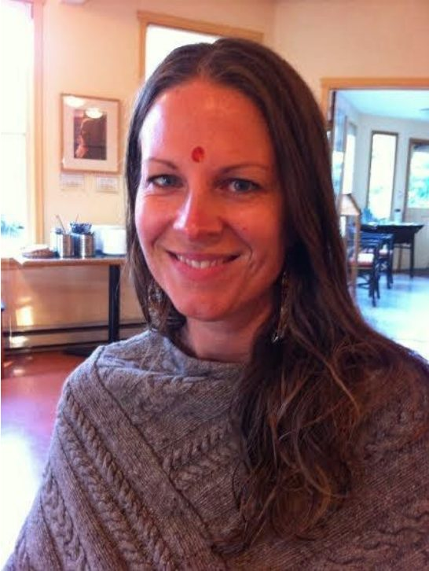
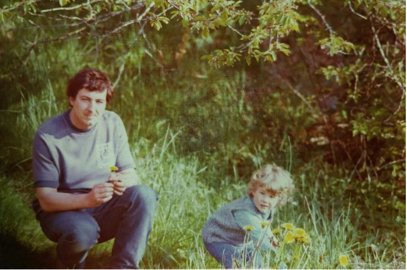
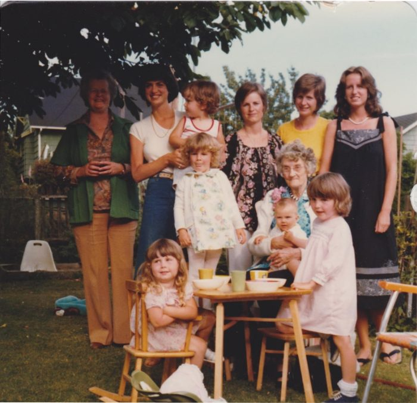
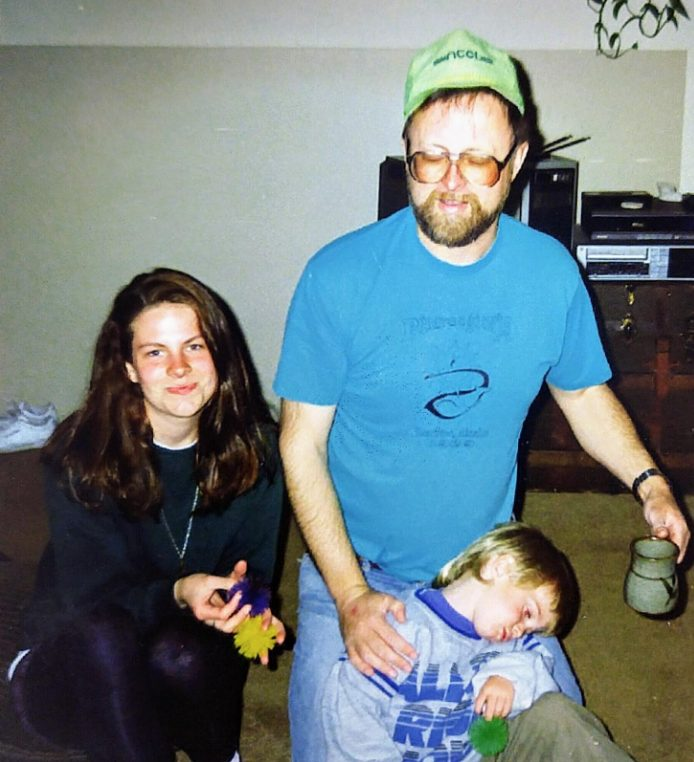
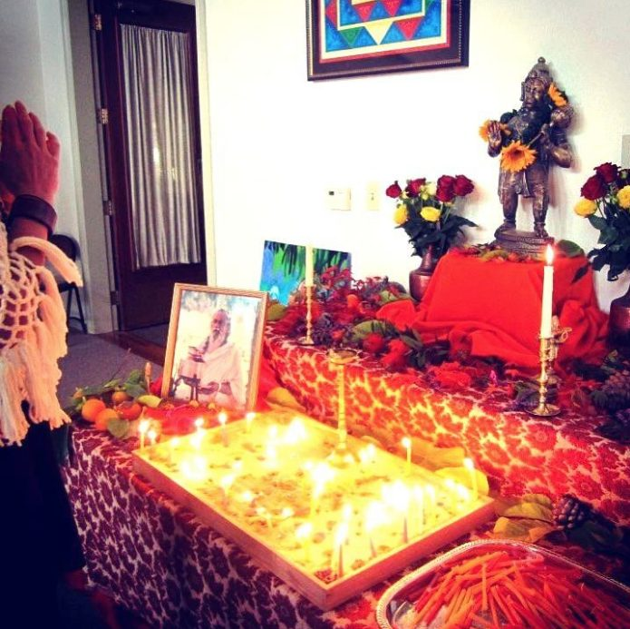
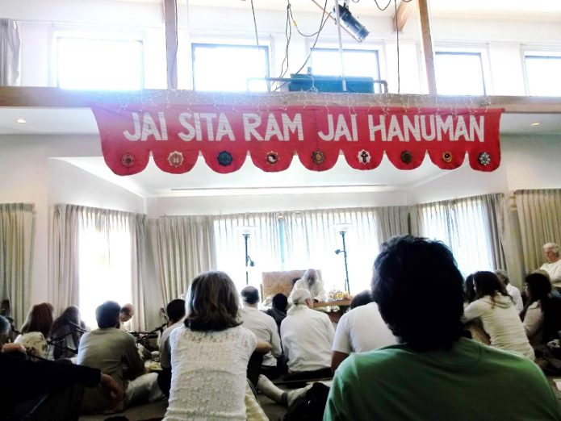
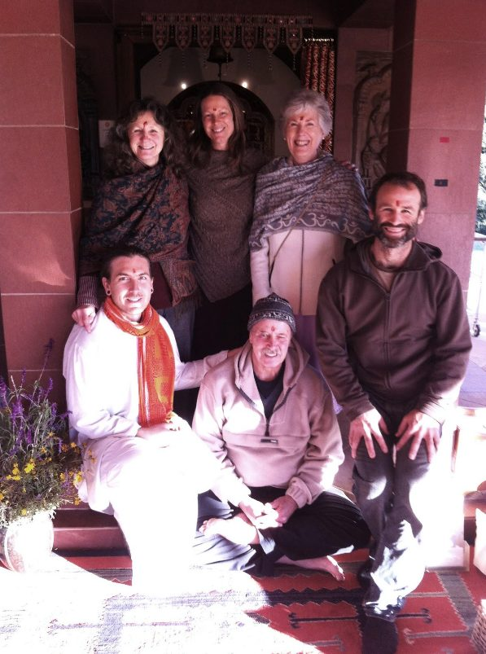
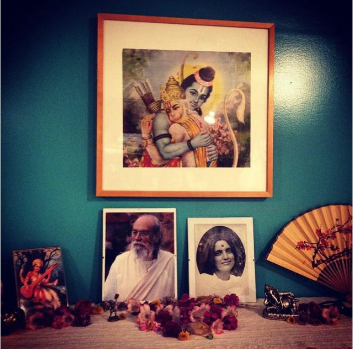
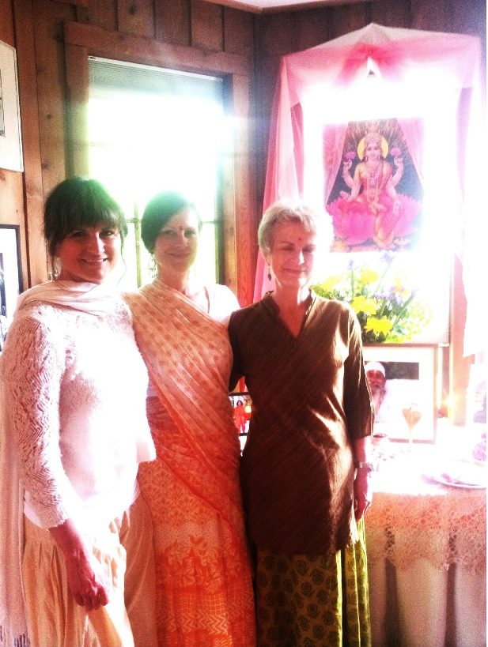
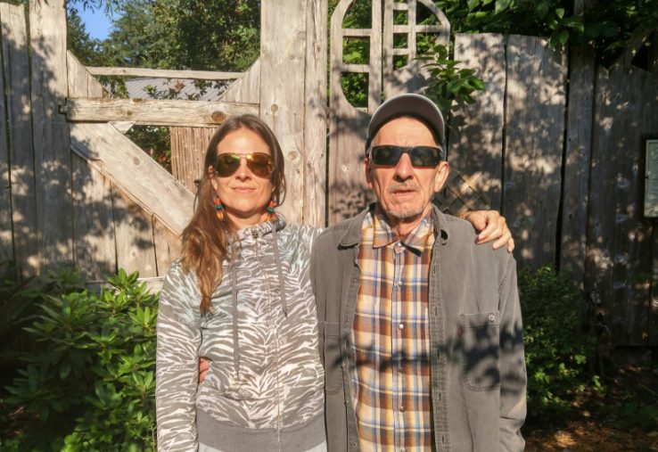

### by Christine MacDonald

> “There is an inner silence. It cannot be heard by the ears, only by the heart.”
> -Baba Hari Dass

 - Salt Spring Centre of Yoga (2015) -
To start off, it occurs to me that I am getting more out of preparing this article for the Salt Spring Centre of Yoga newsletter than you will get out of reading it. This time of reflection has been valuable to look back at how I came to be enveloped in the teachings of Baba Hari Dass. From childhood, through my teen years, and into my adult life, I have had deep questions and painful struggles that I felt so alone in. Today, I can say that I am now a believer in miracles and do feel a connection with others both in my joy and pain. Here, I will share a bit of this journey with you, since Sharada asked me to. Thank you, Sharada.
 - Dad and I (1976) -
I was born in Burnaby, BC of a mother from Vancouver, BC and a father from Mahone Bay, Nova Scotia. I recall a generally happy early childhood with lots of time in nature at our Sunshine Coast cottage and boisterous family gatherings playing with cousins. When I entered kindergarten, I felt that my childhood was somewhat over, as worries began to flood my mind. My teacher was punitive and had favourites and I knew deep inside that this was wrong. I struggled with the fact that this teacher had power over us students and that she abused it. This set a tone of scepticism in authority figures and a keen recognition of those teachers that could be listened to more wholeheartedly.
 - That’s me in the middle sticking my tongue out at 2 yrs old. My mom is to my right with the black and floral blouse. Grandma, aunties, cousins and my baby sister on great-grandma’s lap too (1976). -
At age 5 it occurred to me that we will all die. I became fearful of loved ones passing away and this worry would keep me up at night as my mind would spin out on ‘what ifs,’ projecting into the future. I approached my mom and dad with this dilemma many times, but this particular evening my mom told me to talk to my grandma. My grandma sat at the dining room table under the warm glow of an amber stained glass lamp. She was rhythmically tapping her fingernails on the oak table while playing a solitaire card game. I asked her if she was afraid of dying. She said that she was not at all afraid. She even smiled with a comforted look on her face and said that she missed her mother, who had already passed, and that said she looked forward to being with her again. Well, I thought if my grandma isn’t afraid, and she is old, then why should I be afraid? My feeling, though, was that I was still worried and I needed some more guidance. I felt as though I was the only one around with this fear of dying.
In my teen years, I sensed that there were answers to my deeper questions and imagined something like a fountain of ancient wisdom. However, I did not know how to access this knowledge. I went through high school with the added pressure of my mother’s breast cancer treatments, the family pain of my parents’ divorce and dad’s serious drinking problem. I was so saddened by my dad’s drinking because it was like he was dying slowly. As our relationship with him deteriorated, my sister and I grieved the loss of him. I would escape into my relationship with my boyfriend and try to forget about the problems. After graduation from high school, I experienced crippling anxiety with panic attacks and long periods of sleepless nights. My mother took me seemingly everywhere for help: the hospital, naturopathic doctors, talk therapy, healing touch, and even a sensory deprivation flotation tank. I also tried medications – all of which made me sicker. Again, I felt terribly alone in my pain and struggle.
 - Myself at 16 yrs, Uncle, and cousin Tyler (1990) -
I was fortunate that Uncle Stephen, my mom’s brother, was really close with our family while my parents were together and after their divorce. He was a father figure to us, and also struggled with alcohol as my dad did. Uncle, however, with the help of Alcoholics Anonymous and that fellowship, he stopped drinking when I was about 12 years old. This created a huge shift in my worldview. I realized that it was not normal to have a parent drunk every day. I learned from Uncle about the disease of alcoholism and the treatment available. Although intellectually I knew these things, I still went down the road of drinking and learning for myself through experience. And although Uncle tried to help my dad, he continued to drink.
I found that alcohol lulled me into a self-medicated state of numbness. I preferred this numbness over piercing panic with a racing heart and mind, and also liked that I could get my own ‘medicine,’ that was not reliant on a doctor. For 11 years, I oscillated between problem drinking and trying to stay on track to complete a post-secondary education. My relationships with men were unhealthy, with power dynamics that placed the control with them for the most part. I continued to struggle with anxiety and thought that if it got really bad, I would just walk into the wild ocean at night. This thought was oddly comforting and I would eventually get some sleep. I presented as both humorous and studious to friends and fellow students; however, inside, I was terribly insecure.
I searched for that thing that you can see in someone’s eyes when they have it: a sense of peace, or is it faith? I read self-help books, attended twelve step groups, and had sessions with counsellors – all of who asked me to access my higher power, or simply God. Life became increasingly unbearable with physical illness, personal loss and a high stress job as a child protection social worker. I was moved by a force greater than myself to step out of the tracks laid down before me in search of truth, health and inner peace. These life paths, or samskaras, were well worn grooves, and I was certain that if I continued on them I would end up chronically ill and messed up mentally. I felt in my heart that there was another way. But how? With whom? Where?
I sought guidance from my sister, Claire, who had a familiarity with yoga. She said go to Baba Hari Dass’ centre on Salt Spring Island. I looked into it and prepared a plan. It was the fall and Salt Spring Centre was winding down for a quiet winter. I wanted a full immersion into yoga life - to be saturated. I wanted to learn how to live. For me, I felt like there was so much conflicting information out there about health, and my own cultural background did not give me the tools to pray, eat healthy, or have meaningful ritual in my life. So this is what I was after. I considered this my opportunity to go and get the education that was meaningful to me.
 - American Thanksgiving at Mount Madonna, California (2012) -
I started out at Mount Madonna for their 3 month Yoga Service and Community Program. I do have a photo of myself cleaning a toilet at Mound Madonna, but will spare you the details. It is important because I do recall someone saying that enlightenment can come when you are cleaning a toilet. Seriously. At Mount Madonna, I was drawn to the Temple. The ritual included a sensory experience with bells, incense, flowers, fire, water, chanting, a touch on the forehead with a tilak, a handful of sweets and lots more chanting. All of this pulled me in and the mystery grew deeper. I found myself arriving at Temple at 6:30am and then being drawn by the bells and incense in the evening again when duties permitted.
Baba Hari Dass has said that “yoga is a bag of tricks.” I see that there is the physical practice of asana, selfless service, call and response chanting (kirtan), scriptural study, breath control (pranayama), repetition of divine names (mantra), meditation and so on. And within these practices, there are inner phenomena, such as concentration, noticing our thoughts as simply thoughts, and the gradual development of positive qualities, and so forth. It is within this vast array of yoga practice offerings that one will likely gravitate to something. For me, the ceremony at the Temple and the chanting drew me in. Asana, on the other hand, did not grab me. Generally, when I tell people that I practice yoga, they assume that it is the stretching and bending of the body, such as in a workout. This sometimes gives me an opportunity to expand on what yoga is. There should be no judgement of where it is we begin our journey with yoga, or any spiritual practice for that matter, and where that practice takes us. This is unique to each person. As Baba Hari Dass has said, there are as many religions in the world as there are people.
 - New Years day at Mount Madonna, California (January 2013) with Baba Hari Dass and students -
At Mount Madonna, I witnessed Baba Hari Dass interact with his students with great love, patience, and an intimate remembering of each person. I saw him as father, grandfather, teacher, master. I feel that the word teacher and student does not adequately express this relationship. It is of a deeper connection of heart and spirit. I could sense that Babaji came from a place of unconditional love and deep knowing. I then began to listen even closer to the teachings - through the heart. The 3-month program was coming to an end in California and I felt that I had much more to learn. So, I applied to work on the farm at the Salt Spring Centre of Yoga.
In my first year at the Salt Spring Centre of Yoga, I was a farm yogi. I would be outside all day toiling away and then drag a bunch of dirt and straw into the main building, keeping the housekeepers busy. One day, I shared my interest in devotional singing with Kishori, a long time student of Baba Hari Dass, and chanter extraordinaire. She sat me down and started teaching me songs on the harmonium. I don’t think I was quite ready to learn the chants, and so told her that what I really had fallen in love with was the light ceremony known as arati. As so, the journey of learning arati and then offering arati was initiated. Kishori kept me on my toes and walked me through the ceremony with patience and a loving presence. Arati, officiated by Raven or myself, became my anchor at the Yoga Centre. Amidst the ups and downs of community life, relationship issues, and emotional meltdowns, I had a focus.
 - Mount Madonna Temple with (left to right) Rajani, myself, Chandra, Ben, Sanatan, and Raven (Nov 2013) -
Rajani, also a long-time student of Baba Hari Dass, was a part of the Temple revival too. She encouraged some of us younger generation to learn and practice arati. I had already been practicing with Kishori and had a great love of ceremony. In fact, in my study of arati, I learned that the word can be translated as ‘complete love.’ This meaning connected what I felt in my heart about the ceremony with a mind concept. (A devotional-type yogi (bhakti) can always use a little study to connect the dots.) Anyhow, we organized a trip down to California to apprentice under Janardaan,( known a J.D.), who is the head pujari at Mount Madonna, as well as Ramsharan, also a pujari. These teachings are precious to me, and when I practice arati, I can feel these teachers’ spirits with me. When we returned to BC, I prepared to spend another year at the Yoga Centre. I was still not finished learning.
 - The laundry room altar at Salt Spring Centre of Yoga (2014) -
So, from farmer to housekeeping coordinator I went. For the next two years I was doing laundry and sweeping or taking part in arati and kirtan. I remembered, back in Californina, Mount Madonna, I was helping out in recycling with Vishwanath one day. I entered the recycling building and was struck by images of deities and chanting coming from a cd player – order, spirit and beauty. It felt like a sacred temple! Inspired by Vishwanath, I created a laundry room altar to the Divine. This just clicked for me, supporting my service at the Yoga Centre, where work and prayer and play could merge. With the culmination of inspiration from important spiritual mentors, I had stepped out of the social norm that I grew up in, and was beginning to create a space that honoured spirit.
> “Don't think that you are carrying the whole world. Make it easy. Make it play. Make it a prayer.” - Baba Hari Dass

 - My sister (Claire), myself, and my Mom at Salt Spring Centre of Yoga altar (2016) after officiating the Ma offering of light for Divine Mother’s Day. -
I must explain my connection with call and response chanting, kirtan. Oddly, I used to be uncomfortable around people who were expressing themselves with music in a small venue or setting. The vulnerability that was present made me feel anxious and I would awkwardly giggle or want to dash out of the room. It happens to be through this very act of intimately expressing myself through devotional song that I could sense a connection with God. The breathing practice came to me naturally – to inhale when the caller is singing, and then to exhale while singing the response. I was hooked on kirtan and would write instructional sticky notes of my observations of the chanters and songs and plaster them all over a song book. Ramanand called me the “post-it girl.” In total, I feel it is the loving support of the community that created a safe space for me to explore this musical connection with the sacred, and to sense deeper peace and joy. Kirtan opened my heart.
After 3 years immersion in the yoga teachings of Baba Hari Dass, and Yoga Teacher Training under my belt, I was ready to step back out into the world. I moved to Gabriola Island, and soon became worried that I would lose the teachings and practices with the physical distance. I continued the yoga practices and set up altars in my home, and then discovered a deeper connection with Guru – a connection not dependent on location or circumstances. Babaji was everywhere! I have recently moved back to Vancouver, and have connected with Vancouver Satsang and sadhana practice, which is a true blessing.
In my adult life, love relationships have come and gone. Where I lay my head at night has changed many times. Through all this impermanence, I have come to sense that home is in the teachings and practices of yoga, love is within the community of truth seekers and in my relationship with Guru. It is from here that love emanates outward – from this inner space of self-love. Yoga has been the thread through these life experiences that helps me be present with what is - to pay attention to the simple breath and to value peace of mind over worldly desires. Of course, easier said than done, right?!
At one time I used alcohol, shopping or food to escape uncomfortable or painful emotions. I now more often see it through with the guidance of Guru and the repetition of the many names of the Divine. The Gods and Goddesses crowd out the anxious thoughts. Thankfully, both my dad and I are sober today and have not had alcohol for over 13 years – truly a miracle! I also feel blessed to share, with my family and friends, some of the ritual and singing of the yogic traditions, a journey that began with 3 months, which became 3 years, and now with me for a lifetime (and perhaps some more lifetimes).
 - Dad and I (2016) -
Growing up, I sensed that there were answers for my deeper questions. I imagined a fountain of ancient wisdom. I went out in search of truth, health and inner peace. I discovered a source of all this, however did not expect to fall in love with a little man from India named Baba Hari Dass and his many students, and to find myself chanting in an ancient yogic language. I am deeply grateful to Guru, to the Elders of this community who, with spirit, share the teachings, and to the many people who put energy into the aim of the Centre. My heart is more open now to tune in and listen to the love and connection that is all around us.
Om peace, peace, peace
