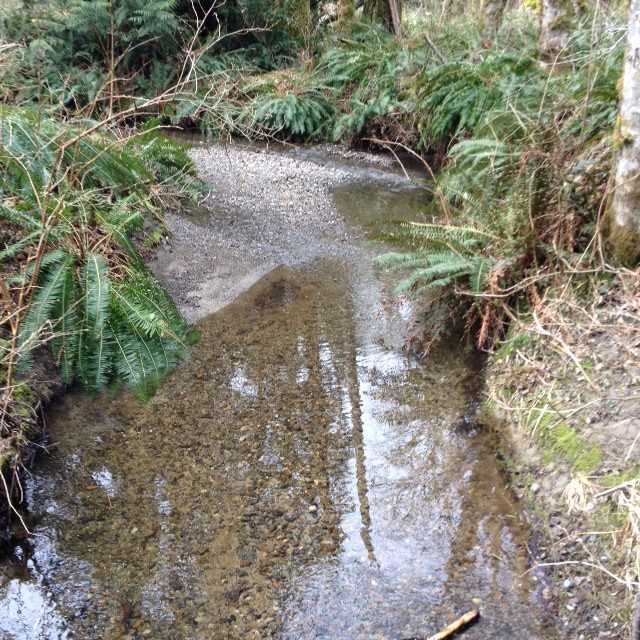
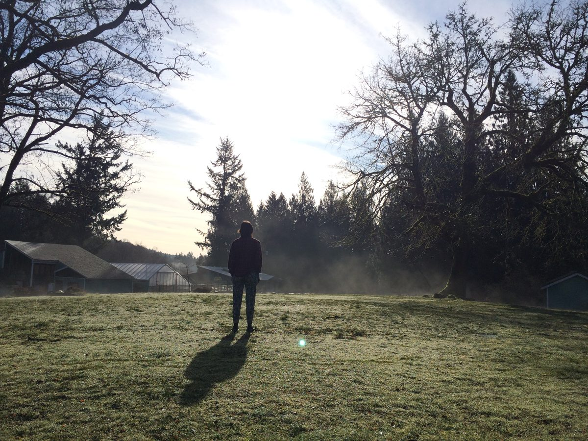
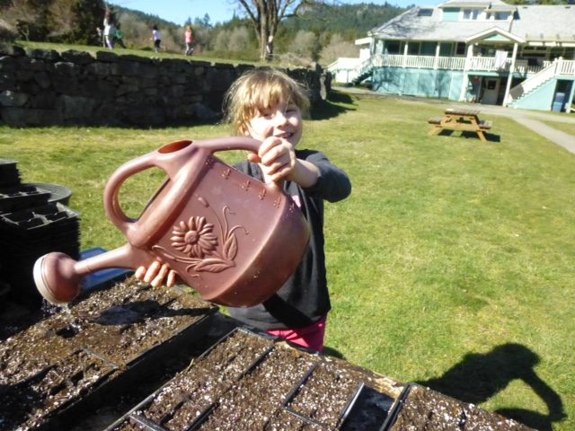
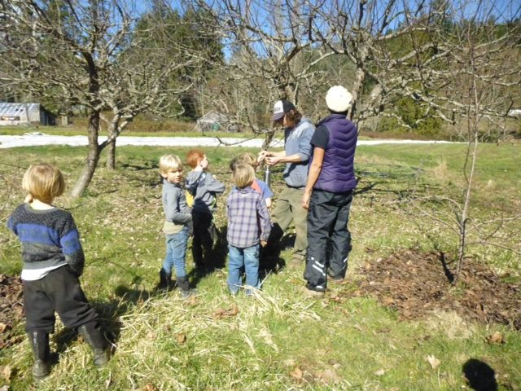
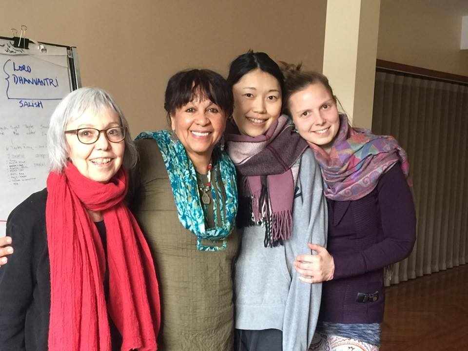
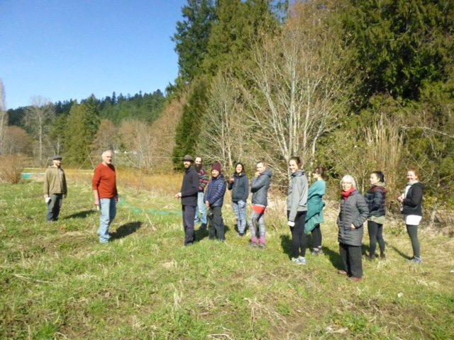

*Don’t think
that you are carrying the whole world.
Make it easy. Make it play.
Make it a prayer.*

Hello everyone, and happy spring. (If you live in the southern hemisphere, happy autumn.) At the Centre, the annual cycle of life has brought us flowers and budding trees, along with warmer weather - not tropical, but warmer than it was.
[caption id="attachment\_16795" align="alignnone" width="600"] - Spring creek along the trail -[/caption]
[caption id="attachment\_16793" align="alignnone" width="600"] - Muriel on the mound one misty morning -[/caption]
The Centre School kids are glad to be working with Milo again now that spring is here. Here are some photos of kids watering seeds they’ve just planted, and learning how to tell which tree in the orchard is an apple, pear or cherry tree.
[caption id="attachment\_16794" align="alignnone" width="600"] - Watering freshly planted seeds -[/caption]
[caption id="attachment\_16792" align="alignnone" width="600"] - Learning how to identify trees in the orchard -[/caption]

## Here is Milo’s farm update:

> This fairly dry and crisp Spring has been fantastic, hey? While a bit more rain would be welcome, the lack thereof has sparked a quick start to the season. The orchard is getting its yearly haircut, new fruit trees are being grafted into existence and berry cuttings are rooting in the glasshouse.
> I’m also happy to report that we have a fresh farmer by the name of Dan who has joined us to co-coordinate the farm happenings this year! Our hoop-houses are nearly full and we’ll be munching away happily on fresh veg by the end of the month.
> That’s all for now. Happy planting everyone!

[caption id="attachment\_16790" align="alignnone" width="600"] - Sharada, Girija, Kaori & Marta -[/caption]
[caption id="attachment\_16791" align="alignnone" width="600"] - Herb walk with Dan Jason -[/caption]
Sorriso is another addition to the karma yogi team, heading up the maintenance department. More karma yogis are joining us today (April 1) for the [Residential Karma Yoga Program](https://saltspringcentre.com/programs-retreats/karma-yoga-program/). During the past few months the resident staff at the Centre took part in the first run of this program. In recent weeks Girija Edward taught classes on Ayurveda, Dan Jason led us on an herb walk through the garden and the trail, and David Macdonald introduced us to beekeeping.

## Returning Karma Yogis

If you've lived and worked at the Centre in the past, and you'd like to spend some time with us this year, let us know! With the arrival of spring at the Centre, our residential community of karma yogis is growing, and there's plenty of work to be done and fun to be had.
Those who've completed a session of YSSI, or who've spent at least three months as a volunteer here, or who've completed YSC at Mt. Madonna Center, are welcome to apply to come live and work with us as returning karma yogis. As such, they're welcome to live here on an even work exchange for up to six weeks, or to participate in our Residential Karma Yoga Program for a steeply discounted rate.
To learn more, or to fill out an application, please visit: [www.saltspringcentre.com/job/returning-karma-yogi](https://saltspringcentre.com/job/returning-karma-yogi) or write to [operations@saltspringcentre.com](mailto:operations@saltspringcentre.com)

## Thanks to Daphne, AGM & Membership

We are sorry to report that Daphne Hollins has stepped down from her position as Centre Manager. Her business acumen and tireless dedication to our mission has contributed so much to the ongoing development of the Centre. She has continued to attend meetings and offer support during this period of transition. We bid her farewell with wishes for peace and wellbeing.
Daphne’s departure from the Centre has added extra impetus to already ongoing conversations about future directions at the Centre. To hear more about the activities and directions of all the departments of the Salt Spring Centre of Yoga, the Vancouver and Victoria satsangs, and the Salt Spring Centre School, Dharma Sara members are invited to attend the upcoming DSSS AGM on May 12. Members will be receiving further updates about the meeting and the election of officers to the DSSS Board, as well as all activities planned for that weekend. If you are not a member but would like to be more involved, you can [find out more](https://saltspringcentre.com/dharma-sara-satsang-society/) and [apply for membership](https://saltspringcentre.com/form/?fid=7) on the Centre’s website.

## In this Month's Newsletter

Every contributor to the Centre Community series brings a unique focus. This month Christine MacDonald, in “[Listen to Love](https://saltspringcentre.com/listen-to-love/)” shares her story of transformation from a life of depression and destructive habits to one of meaning and purpose through the path of devotional practices.
Adam Santosh Bernath takes us through “[Utthita Balakasana - Child’s Pose](https://saltspringcentre.com/utthita-balakasana-extended-childs-pose/)”, with Mariel Ahlers demonstrating the poses. He says of Child’s Pose, “If you find yourself in moments of overwhelm or anxiety, I invite you to take a little sacred pause from your list of activities and try spending 3-5 minutes connecting with a slow, deep and steady breath in Extended Child’s Pose.”
Like it or not, life changes. How we respond matters. “[Life Changes](https://saltspringcentre.com/life-changes/)” reminds us what happens when we resist and what we can do instead - useful information. How can we live in the midst of instability and uncertainty? The main thing is to remember your aim. If you want peace, you have to choose peace.
*Nonviolence in the mind and unconditional love in the heart bring eternal peace.*
Love,
Sharada
