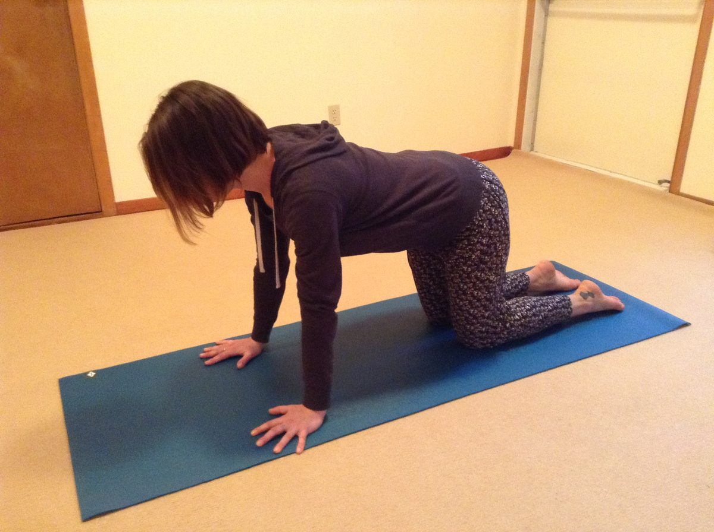
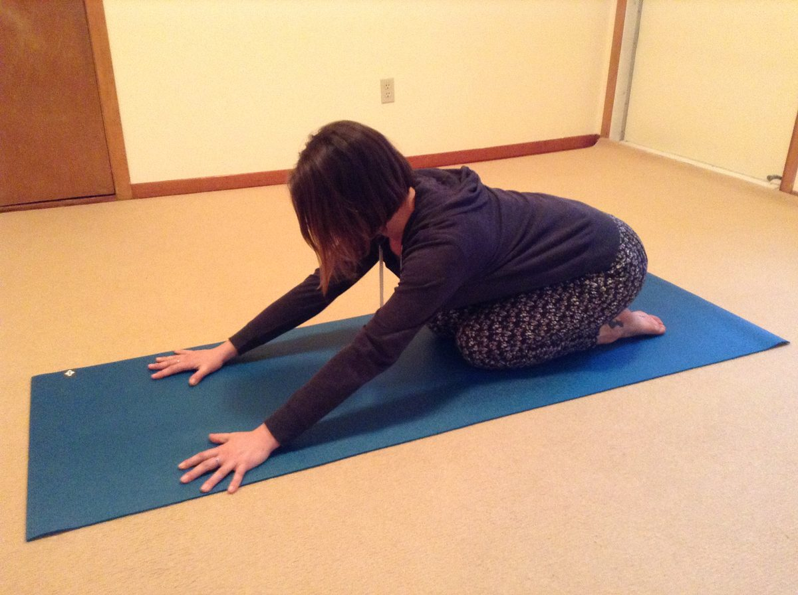
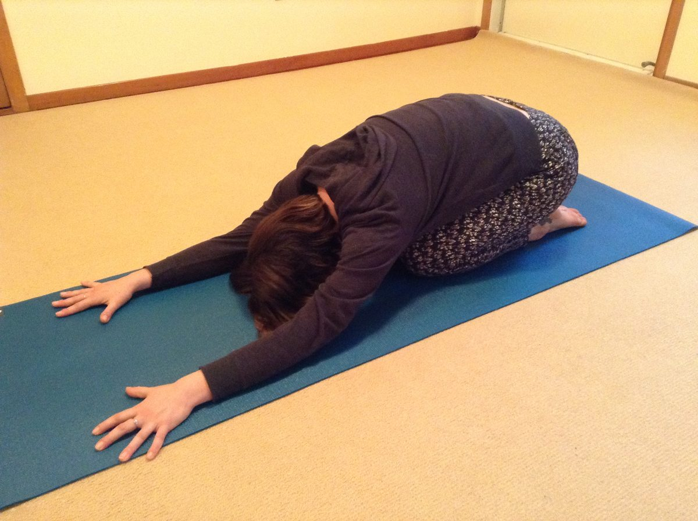
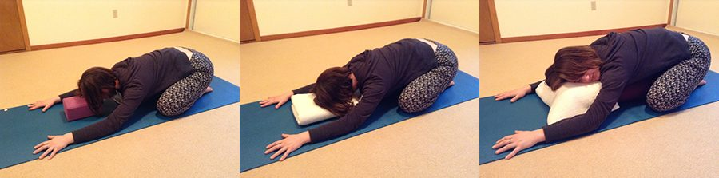
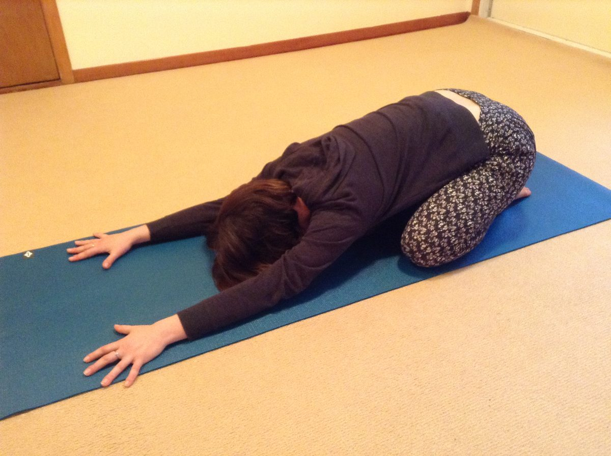

## Benefits

This pose has always been a favorite of mine. It is a regular part of my personal practice and is always included in the classes I teach. I feel that part of it’s beauty lies in it’s simplicity, as it is generally very easily accessible at all levels of experience.
It may be simple, but it can offer some very beautiful soothing and restorative effects on the body and mind. I think that having tools like this at hand is essential in balancing the levels of stress many of us face with the pace of life in modern times.
If you find yourself in moments of overwhelm or anxiety, I invite you to take a little sacred pause from your list of activities and try spending 3-5 minutes connecting with a slow, deep and steady breath in Extended Child’s Pose.
Further benefits of the pose are increased memory, strengthened eyesight, a relaxing effect on the brain, and a tonic effect on the lungs, the gastro-intestinal system and many of the glands of the endocrine system. It also tones and lengthens the spine and spinal muscles, opens the shoulder joints and aides in the circulation of blood.

## Getting into the Pose

- Begin in Table-Top pose with the hands straight down from the shoulders and the knees straight down from the hips.

- As you exhale, slowly lean back, moving the buttocks toward the heels.

- Gently place your head on the floor and relax your neck.
- Lengthen the arms out in front of you away from the head.
- Breathe deeply and relax into the pose.
- To come out of the pose, inhale and slowly lift yourself back into Table-Top pose.

## Modifications

- Place a soft foam block or blanket under the forehead if the head doesn’t comfortably touch the floor.
- For a less intense stretch, keep the hips lifted and away from the heels.

- To deepen the hip opening, bring the knees out wider to the sides of your mat before moving the buttocks back toward the heels.
- You can also place a bolster under the buttocks and torso if your hips don’t reach your heels.

---

## About your Instructor

### Santosh Adam Gibson Bernath

Adam brings to his teaching practice over fifteen years of experience cultivating the fruits of the ancient path of Yoga, a path that has opened his heart to a wellspring of insight into our true nature. Adam completed his 200 hour Yoga teacher certification in Classical Ashtanga and Hatha Yoga in August of 2010 at The Saltspring Centre of Yoga. Adam currently resides at The Centre as a volunteer staff member, where he delights in offering the gifts of Yoga to all.
> “My teaching practice is steeped in the wisdom of the heart. Through the cultivation of mindfulness and deep presence in each pose I offer students the opportunity to expand their awareness and discover new depths of being. Helping others to heal is my greatest inspiration and I find immense joy in creating a beautiful and supportive atmosphere for health, happiness and growth.”  -Adam

---

##### Thank you to Mariel Ahlers for demonstrating all the variations of this pose.

---
