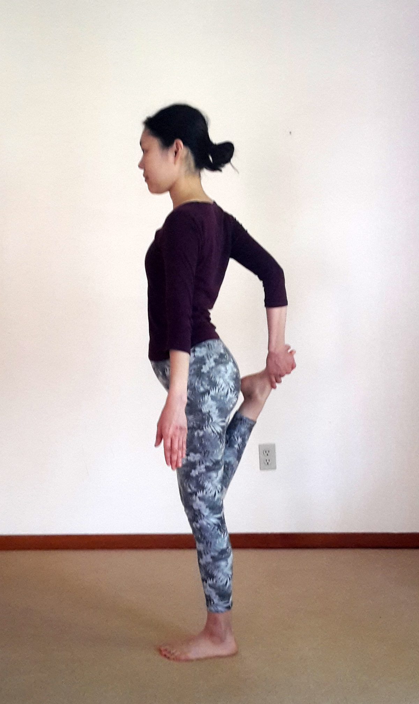
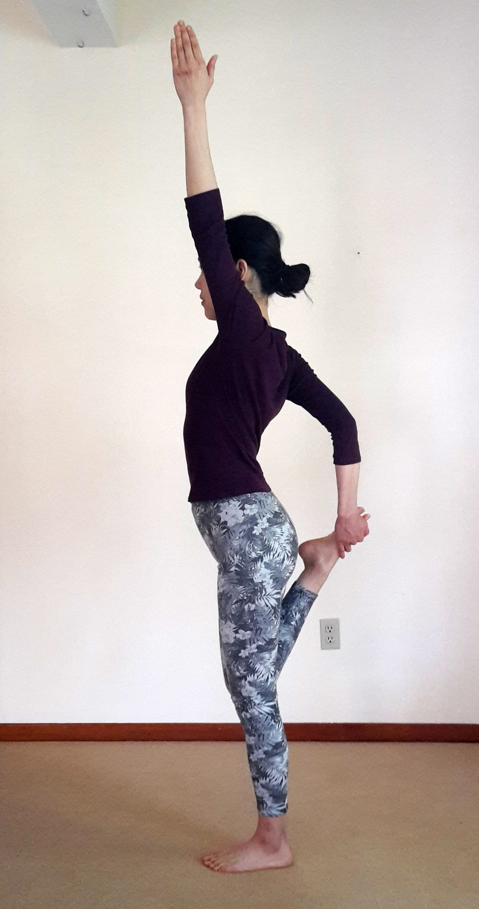
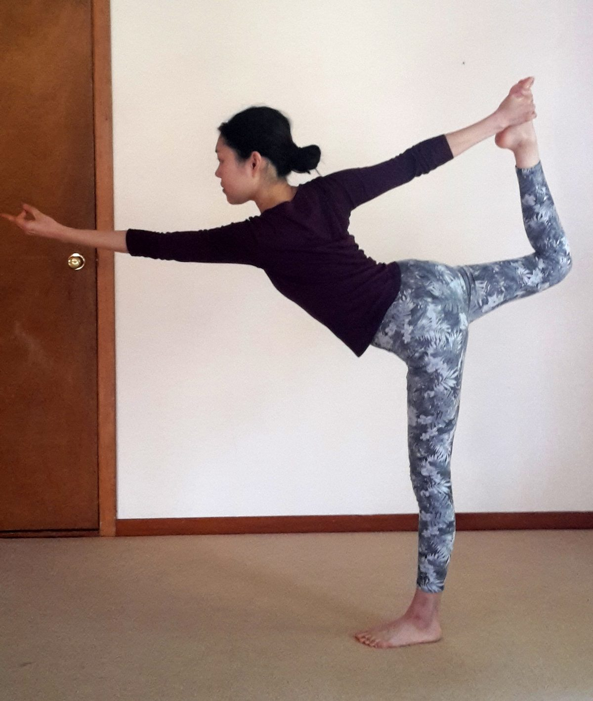

Natarajasana (Dancer’s Pose) is one of my all time favourite poses. It is playful, yet powerful; graceful yet strong. It is a wonderful opening pose for the shoulders, chest and hips, while strengthening the legs and core. It also improves the balance and flexibility of the back and hamstrings. I think it is a wonderful pose to practice at this time of year, as it reflects the beauty and power of nature’s reawakening after the winter months.

## Step One

Stand in Tadasana (Mountain Pose). Ground down evenly through your feet and engage your legs and core. The spine is in a neutral position; the pelvis and chin are tucked slightly.

## Step Two

Transfer your weight onto your left foot and bend your right leg, keeping your knees parallel. Hold onto the inside of your right foot with your right hand, making sure that your shoulder is rotating externally.

## Step Three

Lift your left hand to the sky, with your left shoulder rotating internally.

## Step Four

Kick your right foot into your right hand and fold forward any amount, keeping your hips as level as possible and your chest open to the front of the room. Hold the pose for up to five breaths.

## Step Five

Repeat Steps One to Four on the other side.

### Pointers

- To improve balance, focus on an unmoving point in front of you (drishti point).
- Natarajasana is a strong pose, which lends itself well as a peak pose. Before you come into the pose, make sure to warm up with a few sun salutations and some simple chest and back openers, as well as some light shoulder and thigh stretches.
- If you are prone to hyperextension, keep a small bend in your standing leg to protect your knee.

### Modifications

- If balance is challenging, you can steady yourself against a wall or a partner using your free hand.
- If you are having trouble reaching your foot, you can use a yoga strap to help connect your ankle with your hand.

---

##### Thank you to Kaori Makifuchi for demonstrating Natarajasana for this article.

---

*Mariel completed a 200 hour yoga teacher training with Karma Teachers in August 2015. Her love for yoga and community brought her to the Salt Spring Centre of Yoga in June 2017, where she continues to reside. She enjoys practicing with residents and visitors to the community alike. Every class she teaches is an invitation to become fully present in the body, using the vehicles of movement and breath. Mariel has experience teaching Vinyasa, Hatha flow and Yin classes.*
