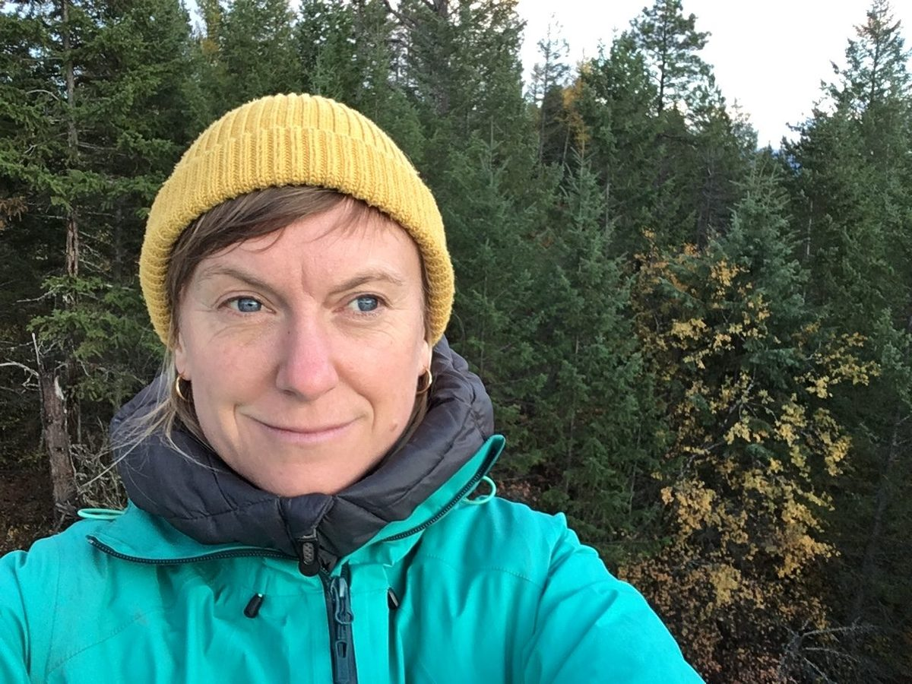
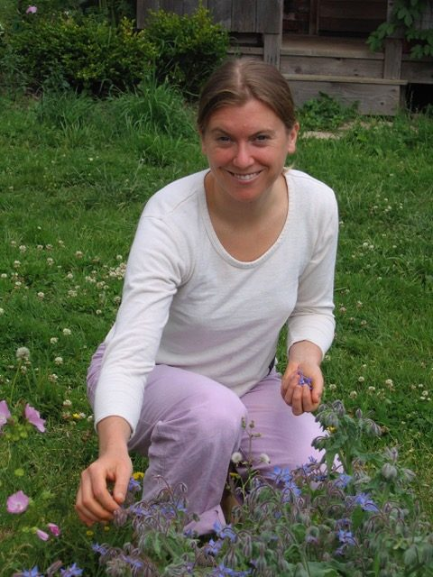
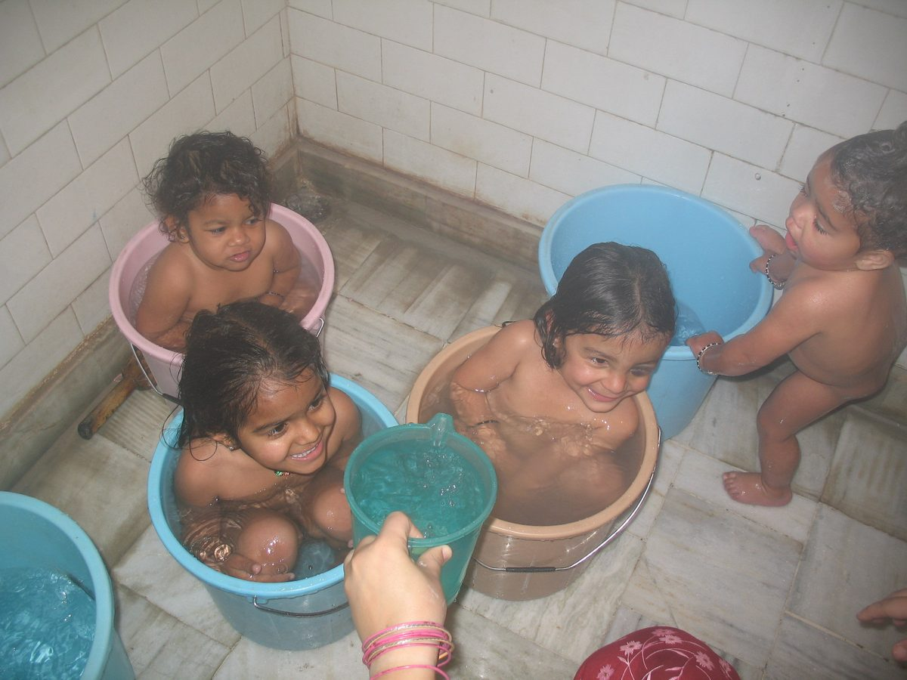
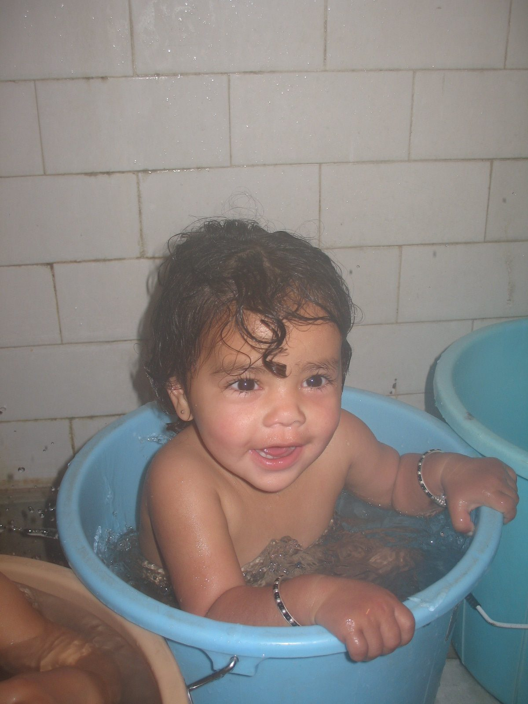
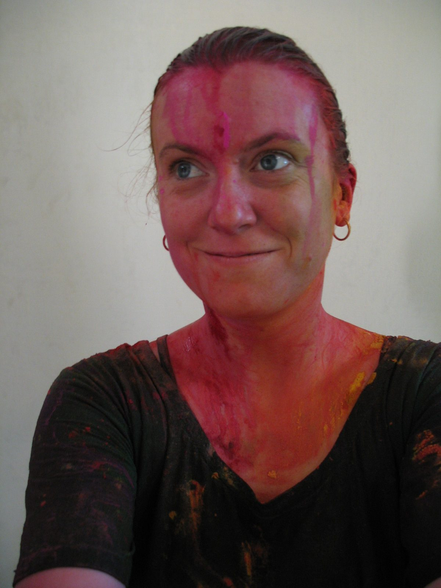
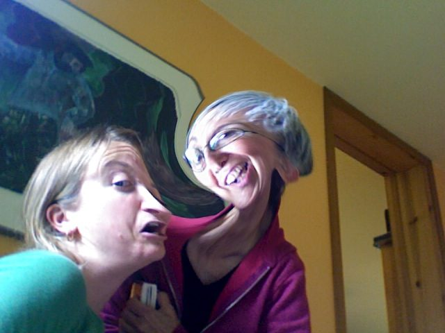
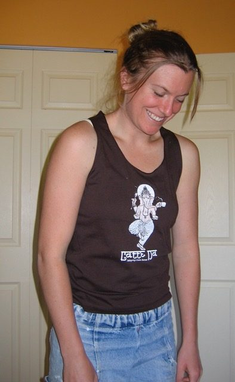

### Our Centre Community: Ali Roux

[caption id="attachment\_16837" align="aligncenter" width="600"] ~ Ali at her home in the Kootenays ~[/caption]
Hi, my name is Ali Roux and I live in Nelson BC, but my heart lives at the Salt Spring Centre. Over the last 14 years it seems like I can’t stay away. The magnetism of the centre began back in the summer of 2002 when I came to Nayana Filkow’s wedding. The wedding took place in the campground by the creek amongst the mystical woodland forest. I knew that the place was magical; in what way I did not know yet.
[caption id="attachment\_16831" align="aligncenter" width="600"] ~ 2005 at the Centre - harvesting edible flowers for salad ~[/caption]
I showed up in the spring of 2004 as a Karma Yogi with a broken heart and a wide open excitement to go deeper into my yoga practice. I remember Anuradha running around smiling as she magically appeared in every corner of the land all at once. The centre was held by the fluidity of the feminine. Sitting through Kirtan with Anuradha, Savita, and Kishori leading the way was divine. I still to this day call upon their voices to teach me to sing. The Karma Yoga program was a very dynamic adventure. I found myself helping out in all facets of the runnings of the centre. Folding linen, cleaning showers, weed whacking the lawn, collecting seeds with Dan Jason, cooking kitchari with Mayana, clearing the woodland trail, painting the outdoor shower stalls, everything and anything was done by all. It was a freeform Karma Yoga whirlwind and it was magical.
I decide to come back again the next year to continue with the Karma Poga program and do the Yoga Teacher Training. The YTT program gave me a broad spectrum of what Yoga encompasses and a strong foundation to go deeper into my practice. The centre gave me the curiosity and opened the door to the depth of the practice of Yoga.
I wanted to explore the origins of the centre and Yoga so I took off to India for four months in the winter of 2006. I went to the Sri Ram Ashram for two months and got into a routine of waking up at 5:30 in morning to go and bathe and dress the babies; a very sweet time. On the other hand it was an eye opener seeing what unfolded in the motherland. It was painful to see so many little girls left at the orphanage because of a tradition that fails them. India was heartbreaking and deeply awakening for me.
[caption id="attachment\_16833" align="aligncenter" width="600"] ~ Morning bath time at Sri Ram Ashram ~[/caption]
[caption id="attachment\_16835" align="aligncenter" width="600"] ~ Priya enjoying her bath ~[/caption]
I came back from India, left my community in Nelson, BC and moved back to my place of origin, back to Montreal. While in Montreal for two years, I continued the explorations of Yoga while reconnecting with my family. I studied with Hart Lazer, going deeper into the intricacies of the Asanas and Tantric Buddhism. The Salt Spring Centre opened up a curiosity of inner wakefulness within me, and at that point on I explored many facets of mindfulness practices. I returned to the centre in the summers in between my frigid Montreal winters; it was my refuge to remember that I am always supported in my practice and held in wholeness.
[caption id="attachment\_16832" align="aligncenter" width="600"] ~ Celebrating Holi at Sri Ram Ashram ~[/caption]
I finally did come back for a longer stint in 2009 to work on the farm with Sofya Raginsky - and thus formed the soil sisters: a group of four women interns and Sofya, back to the feminine Salt Spring Centre. It was a summer of getting the soil deeply embedded into our hearts and the rootedness to hold and nurture each other. The joy of providing nourishment, and playfulness through tending to plants was such a gift. It was once again a magical time: to be completely supported by practice, kind hearts, working with the roots of life in the garden, this all held in the nest of Babaji’s Satsang - a place to surrender to truth and the deep love within. I still try to check in once a year at the centre - as one friend put it, my happy place. It is my happy place that reflects back to me what is most valuable, authentic presence of like-minded beings. I am eternally grateful for this refuge, a place to be held in presence.
[caption id="attachment\_16834" align="aligncenter" width="600"] ~ Ali and Sharada playing around (circa 2005) ~[/caption]
[caption id="attachment\_16836" align="aligncenter" width="394"] ~ Latte Da tank top (2005) ~[/caption]
