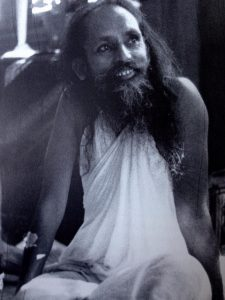

Have you ever found yourself thinking that some people you know - maybe even many people - manage life so much better than you do, and that you’re not quite good enough?
I remember thinking, years ago, that If I could be like my friend who went through life with self-confidence, my life would be so much better. Comparing myself with her, I was always going to come out the loser. What I couldn’t  see was that I was peering through a very small, limiting lens, and in doing so, failed to see my own strengths. I could never be her, but I could be myself.
The Bhagavad Gita says it’s better to live your own dharma (your own life path) poorly than someone else’s well. We all come into this life with certain qualities - gifts and limitations, our nature-born qualities.
You have the body you have, and the temperament you have. You can see it in very young children: some are easy going, some are fiery; some cry easily and others seem relaxed and unfazed by what’s going on around them. Some learn quickly but forget easily while others are slow to learn but never forget anything; some are natural leaders while others prefer to be supporters. These qualities play out in the way you live your life. Wishing you were someone else only creates suffering for yourself. Jealousy and envy are self-destructive.
> If a person lives and functions according to their own nature-born qualities, then there will be no mental resistance and that person will function in peace and harmony. The duty of another is hard, like swimming against the flow of a river, whereas one’s own duty is conducive to mental peace, welfare, and progress.
> (Bhagavad Gita, chapter 3, verse 35)

 
Whatever work you’re doing, do it to the best of your ability and give it your attention. Live your dharma with a positive attitude.
Several years ago, I was living at the Centre, working at the school, and cooking for programs on weekends, all of which I enjoyed, and I asked Babaji what I should be doing. (Silly question, right?) Naturally he said live at the Centre, teach at the school and cook for programs on the weekend. I seemed to have an idea that my work wasn’t important enough, or maybe I was looking for a pat on the back, which I certainly wasn’t going to get. The message was simply do your work and don’t make a big deal about it.
There’s a wonderful Hasidic story about a rabbi, a very humble man,  who lived in the 18th century in eastern Europe.
When Rabbi Zusha was on his deathbed, his students found him in uncontrollable tears. They tried to comfort him by telling him that he was almost as wise as Moses and as kind as Abraham, so he was sure to be judged positively in Heaven. He replied, "When I get to Heaven, I will not be asked Why weren't you like Moses, or Why weren't you like Abraham. They will ask, Why weren't you like Zusha?"
Wise teachers have always said “be yourself”, which sounds easy, but we sometimes make it more complicated than it is.  What does it mean to be yourself? It’s really quite simple. Take care of what’s in front of you with attention, care and kindness. Do your best, and cultivate your best qualities.
According to the Buddha, “You can search throughout the entire universe for someone who is more deserving of your love and affection, and that person is not to be found anywhere.”
> God is not somewhere else; you are God. You are God and you are in God. It’s simply a matter of acceptance. Accept yourself, accept others, and accept the world. You will see that everything is full of love, and love is  God.
> Baba Hari Dass

 
Contributed by Sharada

---

**Sharada Filkow**, a student of classical ashtanga yoga since the early 70s, is one of the founding members of the Salt Spring Centre of Yoga, where she has lived for many years, serving as a karma yogi, teacher and mentor.
