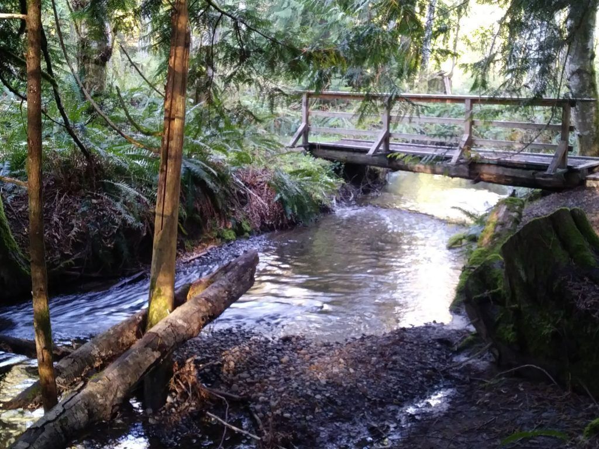
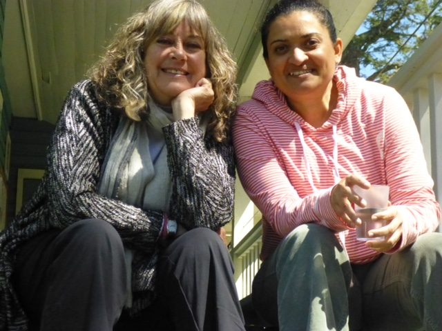
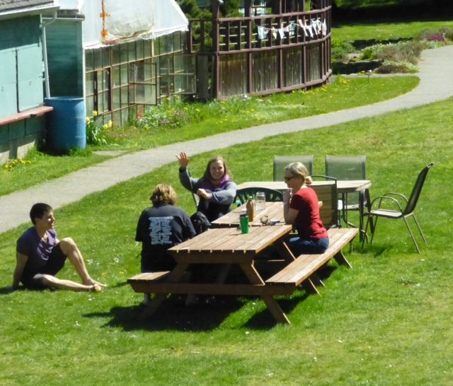
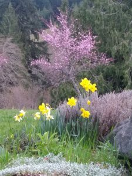
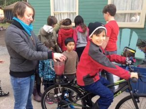
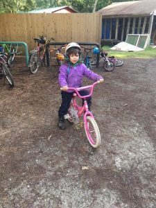
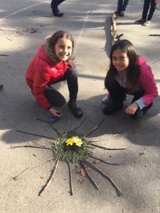

> "Love everyone, including yourself. That is real sadhana."~ Baba Hari Dass

Hello everyone, Warmer weather has returned! After a mostly rainy April, everyone is happy to see the sun again.
 The creek is flowing nicely!
The Residential Karma Yoga program is well underway. The first session began on April 1 and ends on June 10. There is still room in the next session that runs from [June 13 to August 24](https://saltspringcentre.com/karma-yoga-parogram/).
 Lakshmi and Racquel enjoying the sun
 Time to eat outside again!
Those in the program are enjoying it fully: from work assignments to classes, from the delicious meals to being part of the community. [>>> Learn More](https://saltspringcentre.com/karma-yoga-program/)
Programs and Rentals are in full swing, with most weekends booked, etc. Planning is currently underway for this summer’s ACYR, the 44th consecutive, annual community yoga retreat, with many, many classes offered plus a program for children.  More information will be posted on the website soon, with details about this year’s schedule and pricing.
Also coming up this summer is our 200 hour Yoga Teacher Training. This YTT is unlike many others in that it is taught by a faculty of about 20 experienced teachers, and is an immersive residential program. It runs over two sessions, July and August , allowing for time to absorb and integrate the teachings between sessions.

## Position Available

The Salt Spring Centre of Yoga is looking for a Programs Coordinator!
The Programs Coordinator books and coordinates the rentals, programs, and yoga classes that are the lifeblood of our operation. Broadly speaking, the position involves engaging new teachers and presenters, securing contracts, and liaising with other coordinators at the Centre to ensure that agreements with our clients and guests are fulfilled.
The Programs Coordinator also guides our ongoing marketing on social media and elsewhere, and serves as the primary point of contact for public inquiry. The role also has the assistance of an office volunteer for work on clerical and administrative tasks, and works in concert with our Finance and Operations Coordinators to form the Centre’s Administrative Team. Someone who has an ability to communicate clearly, a keen eye for detail, and a friendly and caring personality will do best in the role. [>>> Learn More](https://saltspringcentre.com/job/programs-coordinator/)

## Annual General Meeting

Coming up soon May 11 - 13)  is Dharma Sara Satsang Society’s Annual General Meeting. If you are a member, please join us for reports from all departments as well as discussion about future directions. There is also an election of officers to the DSSS Board. The AGM weekend also includes classes and work fun projects, and of course, fabulous food. If you’re not a member but are interested, [you can apply here](https://saltspringcentre.com/dharma-sara-satsang-society/)

## 9th Annual Divine Mother Satsang - Mother's Day, 2018

The Salt Spring Centre of Yoga is delighted to host the Divine Mother celebration again this year, on Mothers' Day, Sunday, May 13, from 2 pm until 5:30 pm. During this special satsang celebration, our attention will be focused on all mothers divine, with all kirtans and prayers offered to attributes of all divine mothers.
The celebration will begin with arati, followed by the recitation of the Devi Suktam, a Sanskrit prayer in praise of the Divine Mother. At  2:45 there will be kirtan plus a reading of Baba Hari Dass' translation of the Devi Suktam. The celebration will end with a short film by Swami Nirvananada, called "Just Give Me Ma".
All are welcome! JAI MA!

## Schools in!

The Salt Spring Centre School is a happening place. May is the month of May Day - weaving ribbons around the maypole,  the whole-school play called “Shakespeare Rocks” - and bikes!
   

## In this Month's Newsletter

May’s community profile is from Ali Roux, who first came to the Centre 14 years ago. Over time,  she served as a karma yogi, did her YTT training here, and also worked as a farm yogi for a full season. Although she lives in Nelson, she says her heart lives here, and she keeps finding her way back. Please read [Refuge](https://saltspringcentre.com/refuge-ali-roux/)
This month’s Asana of the Month features [Natarajasana](https://saltspringcentre.com/asana-of-the-month-natarajasana/), also known as Dancer’s Pose, by Mariel Ahlers. Mariel describes this pose as playful, yet powerful; graceful, yet strong.
During your travels through life,  you may find yourself questioning what is your purpose in life and what you’re meant to be doing. We can manage to make life quite complicated for ourselves. Please read “[Living your Dharma, Living your Life.](https://saltspringcentre.com/living-your-dharma-living-your-life/)”
> "Work honestly, meditate every day, meet people without fear, and play."~ Baba Hari Dass

 
Love,
Sharada
