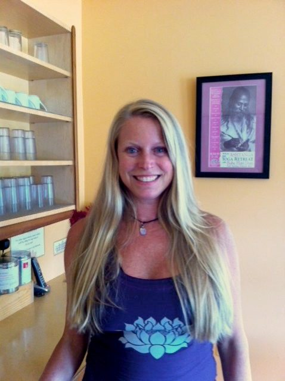
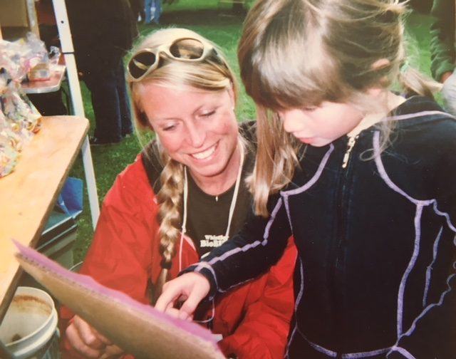
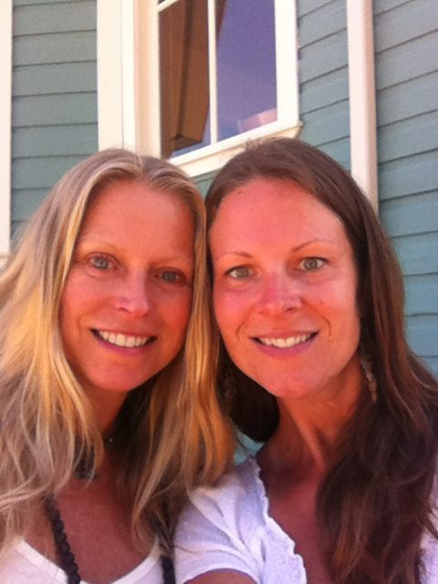
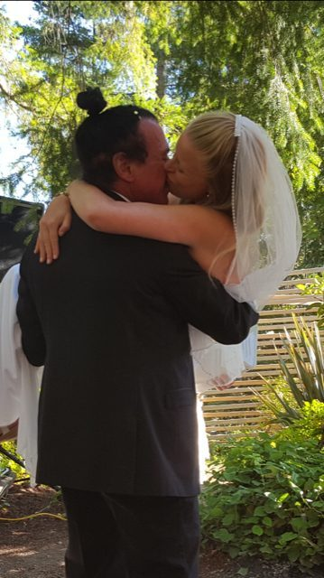
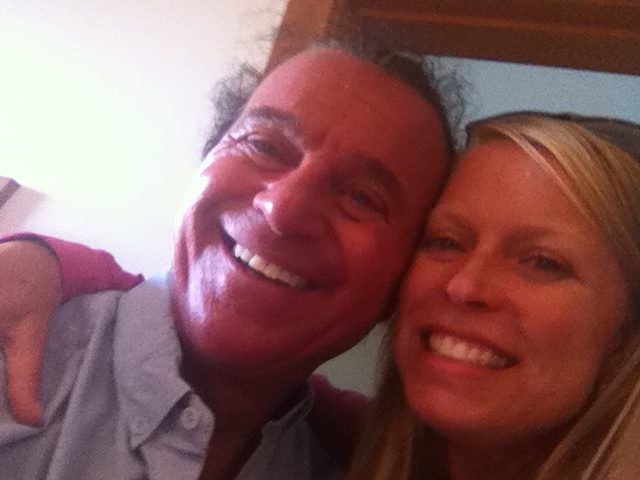
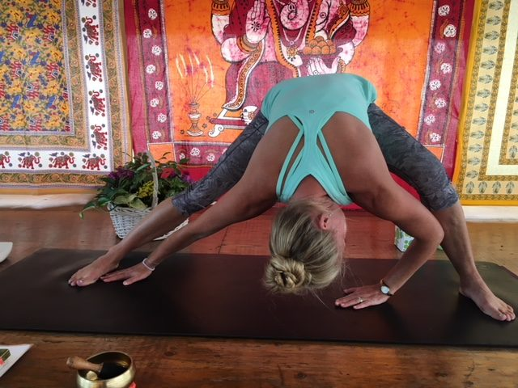

## ***“Let there be light and there was light…”***

Starting at a young age, I would often wonder: Why am I here? What is my purpose? Something, I later learned, yogis refer to as “Self-Inquiry.” The more questions I asked, and the more I asked for guidance, the more answers I would receive.

My grandparents, Jean and Gordon, would take me to church, and say grace at every meal. They were a very positive influence on me. I always loved the sacred prayers, and peaceful time I spent with them. My mother, Helani, taught me the “Serenity Prayer.”

**Serenity Prayer**

*God grant me the serenity to accept the things I cannot change,*  
*courage to change the things I can,*  
*and wisdom to know the difference.*

I said this prayer often, and it always gave me the courage to adapt or make necessary changes in my life.

Inspired as a child by the peaceful allure and enchanting beauty of nature, I would spend hours playing in our garden in Toronto, and endless days by the lake at our family cottage. The glistening brilliant light of the sun danced and sparkled on the water as the sunny summer days brought smiles and laughter to all our faces. It was in nature, walking barefoot in the grass,“earthing,” that I felt real peace and solace from the noise of the world.

My father, Bruce, would often remind me to “keep the faith”, when faced with a challenge.  I later learned to take great ‘leaps of faith’, and trust that the universe will provide.

Here is a prayer that I say to “keep the faith”.

*Faith, oh the power and might of it!  
May the fire of faith burn in my heart  
Shining like the sun, to guide and protect me  
May this fire of faith be a guiding light  
To all who cross my path*

*Cara, 5 years old*

My mother would take me for walks in nature pointing out the wildflowers and creatures in the forest. With time I grew up with a deep love of and dedication to the conservation and preservation of the forests, lakes, oceans and animals, so I moved to Whistler, British Columbia, became an ecologist, environmental educator, and a mountain eco-tour guide, and worked in the field of environmental conservation for ten years.

*Working as an environmental educator in Whistler*

At the same time, it became clear to me that if our planet Earth had more healthy, conscientious people as responsible caretakers of our precious resources, then we could have a healthier, more balanced, life-sustaining planet, so I started teaching outdoor sports and became a certified fitness instructor, ski instructor, and swimming instructor. I also became a certified nutritionist, so that I could encourage others to make healthier, more holistic lifestyle choices for themselves.

I started to feel deep, heart-felt compassion for people struggling with health challenges, injuries, and the difficult emotional demands of life. That's when I discovered the incredible, healing benefits of yoga and meditation. I found that a daily commitment to my yoga and meditation practice helped me to attain the same inner peace and solace that I found in nature, which also helped me fully recover from my own major sports injuries.

After some quiet time in meditation and self-inquiry, I learned the power of earnest prayer, and I learned how to listen to my “Higher Self,” for direction and guidance. I learned to listen to my heart, and an unrelenting “Heart-Calling.”

I had been visiting and participating in yoga classes, the Annual Community Yoga Retreat, satsang and full moon yajnas at the Salt Spring Centre of Yoga for 15 years. I was always called back to deepen my spiritual practice and learn more mind-expanding, inspirational lessons from my honourable teachers, elders like Sharada, Lakshmi, Chandra Rose, and friends there. The Salt Spring Centre of Yoga called me back again and again, like a big heart-magnet. I found myself missing the kind, loving, light-filled people, Sharada's wise, inspirational readings and the beautiful teachings, to the point of heartache.

*Cara and Christine*

One day I had a profound realization. I realized that the most powerful, healing practice I had come to know in my lifetime was yoga, so at the age of 48, I graduated from the 2014, 200 hr. Yoga Teacher Training program as a Certified Hatha and Ashtanga Yoga Teacher, but not without some challenges.

I received more love, kindness, compassion and discipline than I had ever known in my life, from my yoga teachers and fellow students. I was in awe and so grateful!—especially since I was struggling through the program with a painful, torn meniscus knee injury from skiing. My kind-hearted yoga teacher, Kalpana, would encourage me with her words of wisdom, “Let your Injury be your teacher,” she would say. She brought me ice packs as my gentle pranayama and meditation teacher, Chandra Rose, helped me prop up bolsters, blocks and blankets so I could learn to sit for meditation with my injury. I was amazed and relieved to learn all the helpful modifications, with props, that an injured person can use to sit in meditation comfortably, and still do yoga postures with all the countless healing benefits.

I returned to my life in Pemberton and Whistler with a heavy heart, reluctant to return to my job of ten years, on the cold snowy mountain and the busy, impersonal tourist town. I found I never really fit into the Après Ski lifestyle, since I didn't drink or smoke, and was offended by the use of profanity. I promised myself I would return to the Salt Spring Centre of Yoga to immerse myself in the three month “Yoga Service and Study Immersion program” the following year, and commit to a lifetime daily practice of prayer, meditation and yoga.

That year was long and cold. I missed the sound of sweet prayer songs and beautiful kind words, and I missed the peaceful, pure yogic lifestyle back at the Salt Spring Centre of Yoga. "Don’t think you are carrying the whole world. Make it easy, make it play, make it a prayer.” was one of my favourite teachings from our beloved teacher, Baba Hari Dass. This was to become my daily mantra, to lift my spirits and bring the light of pure love and hope to my darkest days.

It was time for a really big change.

I gave away all my belongings, and tearfully left my job and marriage of ten years, to live my truth as a yoga teacher on Salt Spring Island. I felt compelled to give back and offer some assistance to the Salt Spring Centre of Yoga, my teachers, elders and community. I knew I wanted to contribute my love and service, since they had given so much to me.

With my new-found freedom, I returned to live at the Yoga Centre full-time for the three month “2015 Yoga Service and Study Immersion” program. It was pure heaven for me. I was warmly welcomed back by my beloved teachers and friends, studying yoga and practicing pranayama and meditation, with group prayers of gratitude at every beautiful, organic, vegetarian meal. I loved it so much that I stayed as a full-time karma yogi, living simply and joyfully in my tent, for a total of six months. Little did I know, I was in for a big surprise!

On Mother's Day, my mother and I were invited to attend the annual, “Divine Mother Celebration,” graciously hosted by Sanatan. It was a beautiful evening of prayer, singing, ceremony, friends and flowers. As I got up to adjust my seat, I looked up... and there... were the most captivating bright green eyes I had ever seen. Our eyes held a deep, spiritual gaze of twin soul recognition and unity. I quickly looked away, returning to my seat, I wondered, who was that handsome, mysterious man?

A few days later, I received an email from someone who was looking for a yoga teacher to teach him private, gentle yoga classes. Sanatan had recommended me as a teacher. So with some curiosity, and a little nervousness, I drove to his house to teach a private yoga class.

As I slowly pulled into the driveway and parked, he stepped out of the house, beaming a great big smile at me - and dancing! I remained in my car, in sheer amazement with some hesitation, then..... I slowly got out of my car..... and started dancing too! It was the man with the captivating, bright green eyes! Five years later, we are happily married, and celebrating our 6 year anniversary of the day our eyes first met. We do yoga every day, meditate, read spiritual books to each other each night, and say our prayers together at every meal.

*Our Satsang Wedding 2016*

His first words to me were, “My blissful little cosmic pumpkin.” I bowed my head, and said, “Yes I am.” Love at first sight.

*Sam and Cara*

I started teaching a “Gentle Hatha Repair” Yoga class at the Salt Spring Centre for Yoga every Sunday. I was so pleased to be able to offer yoga classes as a pay-what-you-can, donation class, affordable to senior citizens, anyone with a low income, and local farm workers. I began specializing in offering gentle, healing yoga classes for people recovering from injuries, health challenges, and who just needed to find more peace of mind.

*Teaching Yoga at the Salt Spring Centre of Yoga*

I still offer this class every Sunday, 6 years later, as well as a “Restore & Renew,” restorative yoga class, every Wednesday (by donation), with my wonderful, supportive husband, Sam, attending every one of my classes and beaming that smile at me. Together, we donate 100% of all the money we receive from my yoga classes to support the Salt Spring Centre of Yoga.

“Let your injury be your teacher,” I tell my students with a smile.

**An offering: A Poem by Hafiz  
The Extraordinary Influence You Can Yield**

*At some point one's prayers will become*  
*so powerful that they can shake a full tree*  
*in an orchard in heaven and fruit will roll*  
*through the streets of this world.*

*But, dear, until you can do that,*  
*maybe apprentice yourself to someone who can,*  
*and they will help your destiny achieve the*  
*height of the extraordinary influence you can yield.*

Today, as I finished writing this story, Sam and I just completed writing a book together called:   
SPARK to LIFE...Every Day at Every Age.

Namaste,  
Cara
