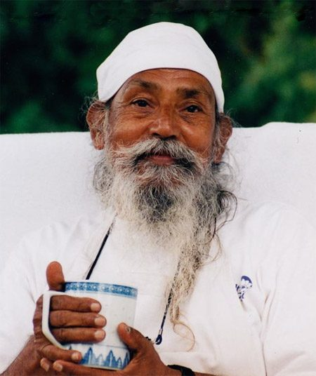

## sutra 33, book 1 of the Yoga Sutras

The Yoga Sutras of Patanjali are an ancient system of yoga, a map or set of guide-posts whose purpose is to help us navigate the mind, leading us from the restless and turbulent mind to the still and peaceful mind, in preparation for eventually transcending the mind itself. There are many translations and commentaries on these texts, including those by Babaji. So far, three of the four of these books have been published and are available at both the Salt Spring Centre of Yoga and Mount Madonna Center, and hopefully it won’t be too long before book four is also published.
As with so many traditional Indian philosophies, the Yoga Sutras begin at the end, by stating what yoga is: yogash-chitta-vritti-nirodhah - the cessation of thought waves in the mind. When the mind is free from its endless, ongoing commentary about life, there is peace. Peace is there all the time, but we’re so busy thinking and doing that we’re not aware of it.
All the practices of yoga share the aim of stilling the mind. As Babaji has told us many times, there are millions of methods, and that yoga is *a bag of tricks*. The purpose of these "tricks" is to purify our minds, to allow us to becomes still.
One verse in the Sutras that has always been an inspiration for me is Sutra 33: T*he mind becomes serene by the cultivation of feelings of love for the happy, compassion for the suffering, delight for the virtuous, and indifference for the non-virtuous.* Serenity or peace is the outcome of the development of these qualities, which happens when the mind is not occupied with defending its territory. Developing those qualities is also a method of practice. Indifference or neutrality for the non-virtuous means not getting caught up about what we judge to be bad or wrong, so that we don’t lose our centre. It does not imply acceptance of negative actions, but rather, the practice of not attaching to our reactions, not taking things personally.
Our usual habits of reactivity - in the form of attraction, attachment, jealousy, anger, aversion, etc. - keep us locked into our misguided belief that we are the centre of the universe and everything should go the way we want it to. However subtle these judgements may be, indulging them leads to suffering.
*A mind clouded by negative emotions is not fit for meditation.* First we have to notice and acknowledge that these thoughts or feelings exist in our minds. Then we can make a conscious choice to replace those thoughts with positive ones.
The practice is that of *changing the angle of the mind*. When stuck in a critical mode of thinking, what’s required is a shift in thinking. While writing this, I - apparently randomly - opened Pema Chodron’s book, “No Time to Lose”, and found this passage: “Rejoicing in the good fortune of others is a practice that can help us when we feel emotionally shut down and unable to connect with others.”
She continues by saying, “Rejoicing generates good will. The next time you go out in the world, you might try this practice: directing your attention to people - in their cars, on the sidewalk, talking on their cell phones - just wish for them all to be happy and well. Without knowing anything about them, they can become very real, by regarding each of them personally and rejoicing in the comforts and pleasures that come their way. Each of us has this soft spot: a capacity for love and tenderness. But if we don’t encourage it, we can get pretty stubborn about remaining sour.”
No matter what is going on, we have the choice in every moment to open our hearts and allow the natural state of peace that exists in our hearts to arise.
*Peace in the mind,*
*love and compassion in the heart*
*bring the scattered world*
*into one reality.*
May all beings be happy.
May all beings be free.
May happiness be unto the whole world.
contributed by Sharada
All text in italics is from Babaji’s writings

---

**Sharada Filkow**, a student of classical ashtanga yoga since the early 70s, is one of the founding members of the Salt Spring Centre of Yoga, where she has lived for many years, serving as a karma yogi, teacher and mentor.
