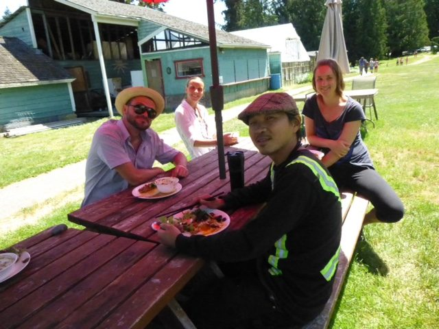
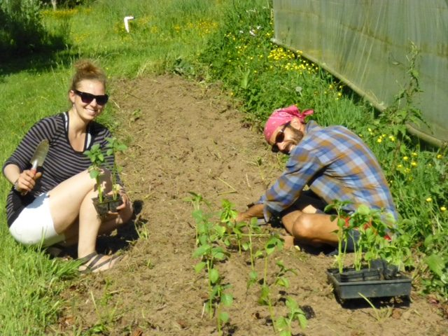
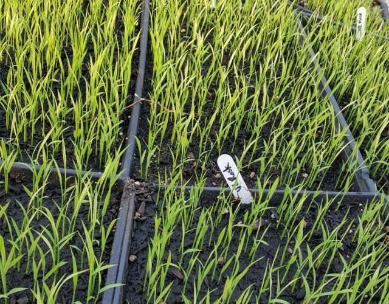
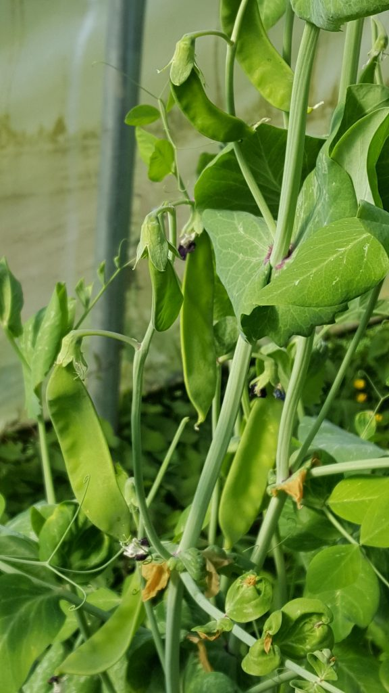
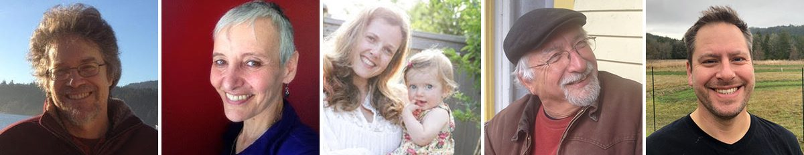
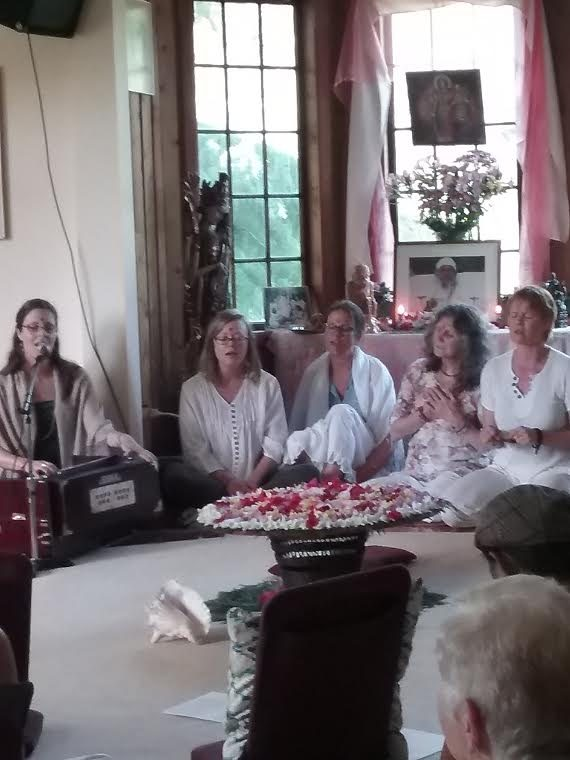
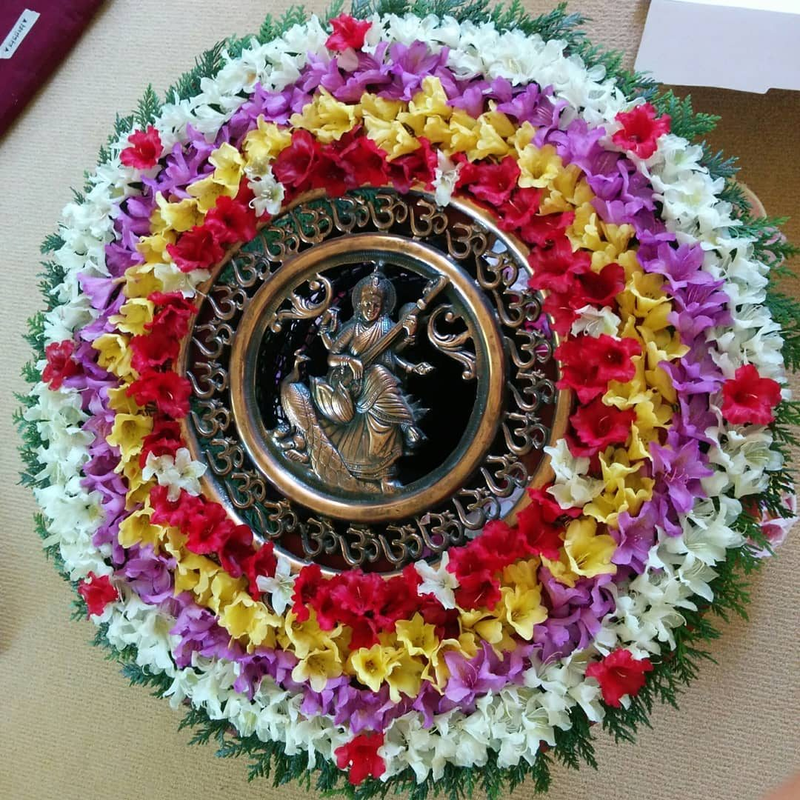

Hello everyone,
Although summer doesn’t officially begin till June 21 - summer solstice, the longest day of the year - it’s been feeling like summer for quite a while. Very few people eat indoors on these warm, sunny days, light-filled days. We hope this isn’t the beginning of a long, very dry summer, but meanwhile we’re loving it.
[caption id="attachment\_17105" align="aligncenter" width="640"] Adam, Crystal, Mariel, Sorriso[/caption]
[caption id="attachment\_17106" align="aligncenter" width="640"] Marta and Dan on the farm[/caption]
We welcome a new group of karma yogis to the June-September session of the Residential Karma Yoga Program, adding to the ever-changing face of the centre community. At the same time, some have left and others will be leaving. Milo and Jules (and, of course, Avo) have moved off-land, and Sorriso will be moving off-land soon. Marta has moved back to Calgary (not too far for occasional visits) and Kaori will be flying back to Japan. Japan is a lot further away. Come back when you can, Kaori!
Dan, co-coordinator of the farm, is taking over the monthly farm update from Milo, and here is his June update:

## Dan's Farm Update

It's hard to believe how quickly we've moved into the heart of the growing season here at the yoga centre. We've been harvesting dozens of pounds of greens and radishes weekly throughout May for our kitchen and for weekend guests. Meanwhile, the first round of lettuce and spinach that we planted in the hoophouse has already been replaced by cherry tomatoes and basil.
[caption id="attachment\_17107" align="aligncenter" width="640"] This is rice, to be transplanted into the rice paddies in June.[/caption]
The hoophouse is also the temporary home of 3 varieties of rice that Milo seeded. It is the hottest spot on the land right now and ideal for the very warm temperatures that rice requires during its initial germination and vegetative stages. The next phase of the rice-growing pilot project will occur in early June when these seedlings will be moved into the rice paddy to be transplanted. If all goes well, the Centre's kitchen could be cooking with locally grown rice for the first time in its history. Here's hoping for a little more rain before summer to help keep our rice paddy flooded. And some late-breaking news—by the time this newsletter gets circulated, we will have completed the season's first harvest of snow peas.
[caption id="attachment\_17108" align="aligncenter" width="576"] snow peas![/caption]
In gratitude,
Daniel Naccarato

## Dharma Sara AGM

[caption id="attachment\_17119" align="aligncenter" width="640"] Board members - Om PK, Bhavani, Meera, Sid and Sean[/caption]
On the weekend of May 11-13, we held Dharma Sara Satsang Society’s AGM weekend, filled with sadhana and asana classes, work parties, delicious meals, and of course the meeting itself. There were numerous reports about all areas at the centre as well as Vancouver and Victoria, and of course the election to the Board of Directors: Mark Classen as president, Sid Filkow as treasurer, Meera Bennett, Bhavani Chlopan and Sean Crabtree as members at large. In addition there will be three board interns: Regina Pfeifer, Eduardo Sousa, and Bruce Hayes.

## Divine Mother!

[caption id="attachment\_17111" align="aligncenter" width="570"] Celebrating the Divine Mother[/caption]
 The AGM weekend was followed by a heartwarming Mothers’ Day celebration, honouring the divine feminine, at our annual Divine Mother Celebration. There were about 80 people singing the praises of the Mother, in all her forms.

## Coming Up

This year’s [Yoga Teacher Training](https://saltspringcentre.com/programs-retreats/yoga-teacher-training/) begins on July 3. There are still some spaces available, so it’s not too late to register. This YTT is unique in a number of ways: a faculty of 20 experienced, knowledgeable and certified yoga instructors in a residential program that immerses you in the traditional teachings and practices of Classical Ashtanga Yoga and Hatha Yoga, without distraction - and it’s located in the heart of beautiful Salt Spring Island.
Our 44th [Annual Community Yoga Retreat](https://saltspringcentre.com/programs-retreats/annual-community-yoga-retreat/) is coming up on the first long weekend in August, beginning on August 2. Mark it on your calendar and and plan to join us for a few days of yoga classes, kirtan, evening programs, Hanuman Olympics, Latte Da treats, and a great kids’ program. Whether you come on your own, with a friend, or with your family, come join us for the 44th consecutive annual yoga retreat! Details about this year’s retreat will be posted on the website soon.
Have you ever wanted to experience India with a group of great people? Our sister centre, Mount Madonna Center in California and Sri Ram Ashram, a home for orphaned and destitute children in India begun by Baba Hari Dass in 1984, will be hosting [Yoga Diwali India](https://www.mountmadonna.org/calendar/yoga-diwali-india-2018) 2018, October 29 - November 10.(link) This is an amazing opportunity to practice yoga together while living at Sri Ram Ashram, celebrating the light of India during the festival of Diwali.
Satsang continues every week at the centre, from 3:30-5:30, and also kirtan every Wednesday evening If you are in Victoria or Vancouver, there’s satsang there, too.
In Victoria satsang is held one Sunday a month at Ajna Yoga, 2185 Theatre Lane in Oak Bay. The contact person for queries is Regina [rpfeifer@centrebalance.ca](mailto:rpfeifer@centrebalance.ca).
In Vancouver satsang is held Sunday evenings from 6:30-8:30 every Sunday at Yoga on 7th (156 East 7th Ave, at Main) until the end of May. Satsang will begin again in mid-September and continue until mid-December (every Sunday except long weekends), and) and start again near the end of January. For more information contact: vancouversatsang@saltspringcentre.com We ask people to enter through the door off the alley rather than the front.

## Some reading for you

This month Cara Graci tells her lovely, uplifting story in [Let there be Light!](https://saltspringcentre.com/let-there-be-light-by-cara-graci/) Cara’s light shines through her words, and those who who know her will certainly feel it. Cara did her YTT training at the centre a few years ago while she had a torn meniscus knee injury! For being able to participate she credits the loving care of her YTT teachers who taught her, “Let your injury be your teacher.” Cara is a well-loved teacher at the centre, where she teaches “Gentle Hatha Repair” and a “Restore and Renew” classes each week.
Recently I’ve been looking through posts from a few years ago, and have decided to reprint a few of them. For this edition here is [Making Space for Peace: sutra 33](https://saltspringcentre.com/making-space-for-peace/), book 1 of the Yoga Sutras, originally posted in 2014. I’ve always loved this sutra, and found it to be a valuable reminder of the aim of yoga. *The mind becomes serene by the cultivation of feelings of love for the happy, compassion for the suffering, delight for the virtuous, and indifference for the non-virtuous.* Serenity or peace is the outcome of the development of these qualities, which happens when the mind is not occupied with defending its territory. Developing those qualities is also a method of practice.
*Purity in thought, purity in speech, and purity in action bring divine presence in the heart.* ~ Baba Hari Dass
Love,
Sharada
