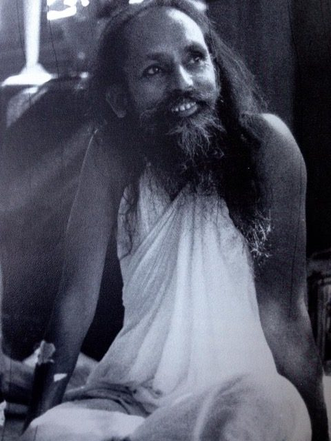

I am well qualified to talk about worry, having had years of training and practice. Worry is a habit cultivated over many generations that has coloured my response to life. Growing up, I wasn’t aware of this; it was in the very air I was breathing, and therefore invisible to me. There isn’t anything unusual about this; we all imbibe the atmosphere of our families and culture.
There are many varieties of experience and learned reactions to experience, all of which are attempts to protect our fragile sense of self. All creatures want to stay alive. Not being aware that the individual self, the person we believe ourselves to be and that we are attempting to keep safe, is not real but is a creation of of habits, it’s natural to protect it. Anxiety, the background of so many people’s lives, is a response to the instability of the world and our longing to be safe.
Worry is always about the future, as regret is about the past. Neither regret not worry is helpful. The only place anything ever occurs is in the present. If we are regretting the past, we’re thinking about it in the present; if we’re worrying about the future, the worrying happens in the present. When the anticipated ‘something’ happens (or doesn’t happen), it’s in the present. Everything happens in the present. What happened in the past doesn’t exist except as a memory, or print, in the mind. The future also doesn’t exist - it lives in the world of imagination or fantasy, with its accompanying emotions.
*If we dwell on our past, which we can’t change, or if we dwell on the future, which is indefinite and unknown, then we can’t work in the present.*
*The present is the most important thing in life.*
*If the present is passing in peace, it will make a peaceful past and sow a seed of peace to grow in the future.* 
Worry or anxiety is a pattern of thoughts, a particular form of colouring in the mind. Just because we believe our thoughts doesn’t mean they are true.
*What is the world in which all individuals live? There is a perceptible world, or true reality, over which a conceptual world, or false reality, is superimposed. The perceptible world is no more than the aggregates of the five elements: earth, water, fire, air, and ether (space). The conceptual world is not visible; it is only a colouring of desires, attachment, and egoism imposed upon the perceptible world.*
Patanjali, in the Yoga Sutras,(book 1, sutra 2) , defines yoga as the cecassion or control of thought waves in the mind - Yogash Chitta Vritti Nirodha. Stilling the movements in the mind is yoga. The following sutra says that when thought waves are controlled, the seer is established in his own true nature. (Note the Sanskrit word for seer is masculine; the seer is neither masculine of feminine.) In other states (when the seer is not established in his true nature), the seer appears the same as the thought waves in the mind, and therein lies the problem; that is, we believe the thoughts to be real, to be who we are. This leads us to experience ourselves as a separate individuals who then defend ourselves from potential threats.
*We live in the world only for ourselves. In everything the mind finds self-interest. In a way our whole life is controlled and guided by this self-interest.*
*In our everyday life we identify things as good or bad. If something doesn’t support our ego the mind labels it as bad, and if it does support our ego the mind says it is good. Our ego, according to its likes and dislikes, colours every object, thought, or idea and gives judgement accordingly.*
The good news is that it is possible to change this perception. It’s not easy, but it is possible; otherwise there would be no point in practice.
*You start from where you are.*
*Though there are millions of methods of yoga, the aim is one and that is to make the mind free from thought waves. For making the mind free from thought waves, meditation is the most important practice But it’s not so easy to meditate because many obstacles interfere.*
The conditioning in the mind is the strongest obstacle. To overcome it the mind needs to be purified. Babaji recommends two methods for purifying the mind: 1) pranayama and meditation and 2) cultivating positive qualities.
*If we want to attain something, we put all our energy into it. If we really want peace and want to overcome the ignorance of this world, we have to practice every day.*
*If you have to hike to a mountain top, you walk through the hills and dales, woods and rivers, snowy cliffs and ravines. You face all the odds and make it to the top. The spiritual life is not a highway.*
*There is fear in everything, but we have to face the fear, fight the fear, and finish it forever.*
*Wish you happy and success in sadhana.*
Contributed by Sharada
All quotes in italics are from writings by Baba Hari Dass

---

**Sharada Filkow**, a student of classical ashtanga yoga since the early 70s, is one of the founding members of the Salt Spring Centre of Yoga, where she has lived for many years, serving as a karma yogi, teacher and mentor.
