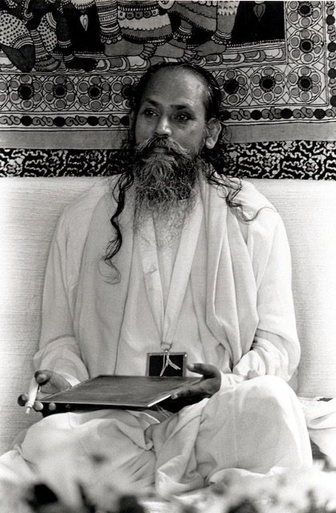

## (from a 1993 newsletter)

**Q: What is the best way to realize the illusionary nature of ego?**
**B:** *Develop awareness. We act like we are intoxicated or in a dream. Things happen and we don’t know it is happening. By developing awareness we identify with every action and its cause; the ego is the cause.*
**Q: What is ego?**
**B:** *Ego is an energy which indicates separateness from others and strengthens our own individuality.*
**Q: How do we get free of it?**
**B:** *It is our power on one hand and on the other, it traps us into the world. So we try and purify our ego, make it positive*.
**Q: What are the signs of positive ego?**
**B:** *Love, compassion, selfless service, etc.*
**Q: How do we purify the ego?**
**B:** *By dwelling on positiveness in thoughts and actions.*
*If a person walks on a beach all alone and someone comes from the other side, our first reaction will be negative. We will think “that person may be a violent person” because in all of us fear predominates. All actions are based on fear, a fear of losing our ego.*
**Q: What do you do when you become aware of the fear?**
**B:** *Face it, fight it, finish it.*
**Q: What’s a good way to change bad patterns?**
**B:** *All actions are based on feelings. It’s the main problem which binds us in ignorance. Our mind rules over us and we don’t have control over it. The Yoga Sutras are written about it: Ignorance, egoism, attraction, repulsion, fear of death; all our problems are based on the five afflictions. They are removed by:*
*Yoga*
*Devotion*
*Selfless Service*
*Understanding*
**Q: What is the result of effort in sadhana (spiritual practice) when we are still not attaining a specific goal?**
**B:** *In sadhana there are two main forces: vairagya (dispassion) and purushartha (persistent practice). Without persistent practice we can’t progress. Our progress is not visible, just like high in the sky a person in an airplane doesn’t feel its speed. Because there is nothing to compare with we have no awareness of our progressing - or we think we are not progressing.*
**Q: How can one increase willpower to do sadhana?**
**B:** *I know only one formula: kick yourself early in the morning. The mind says, “not today - tomorrow for sure.”*
**Q: What is good sadhana?**
**B:** *Calming the mind.*
