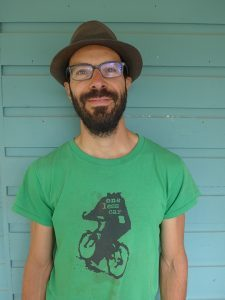
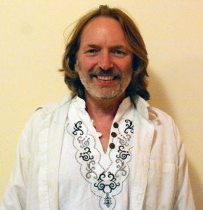
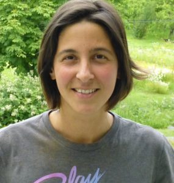

Here are the prompts people were given to stimulate some reflections about their lives at the Centre. You may want to consider these questions yourself (perhaps with a little revision to fit your life).

- *What have been the highlights of your time at the Centre so far?*
- *What have you learned – about yourself, yoga practice, living in community?*
- *What teachings and practices have inspired you?*

Three of our current karma yogis have shared some of their reflections about how their experiences of living and working at the Salt Spring Centre of Yoga have contributed to their lives and their outlook on life. It is my pleasure to introduce you to Dan Naccarato, Bernie Farley and Muriel Tournaire.

---

## Dan Naccarato

I arrived at the yoga centre to a chorus of tree frogs and a clear sky beaming with unfamiliar constellations on the night of the new moon in March, and the sense of serenity I felt in that moment remains one of the highlights of my first few months here, as well as a foreshadowing of the wonders that can be discovered on this land if you keep your eyes and ears (and heart) open.
I’ve learned a lot about myself in just a short while, in particular that I thrive in community settings, and that my communication has improved considerably thanks to some nonviolent communication exercises and countless opportunities every day to have meaningful conversations. While there are always challenges to community living, I feel that most of them can be overcome by being adaptable, developing problem-solving skills, and keeping your ego at bay. I’ve also been able to strengthen my yoga practice, and though I know yoga isn’t a competitive sport, I find that I’m often inspired and energized by fellow members to bring my practice to another level.
But I would say the simple pleasures have provided most of my favourite moments at the centre — sharing tasty and nutritious meals which I’ve contributed to, walking through the woods and finding mysterious plants, harvesting greens amid the buzz of hummingbirds and native bumblebees, and bonding with other members of this community.

## Bernie Farley

Highlights: Everyday my eyes open at this beautiful yoga centre. I have been working mostly on the farm and have enjoyed every day of pulling weeds, planting plants, harvesting. Yes, harvesting - from the snow peas to the endless lettuce fields. We have to make sure that vegetables taste good, so field tasting is a big part of it, as is the conversation with the other farmers. But every time the dinner conch sounds, that is the highest of the highlights!
My yoga knowledge was limited to the physical side. The weekly lectures and shared knowledge of the people here have broadened my learning of yoga; it is more than a good sweat.
Living in this community has been an uplifting experience. In the city we rarely speak to our neighbors. Here we work together, share meals and have group discussion and activities. Everyone is friendly and easygoing.
Pranayama and meditation is a gateway to a world that has been long lost in the west, and something that was missing in my yoga practice. The yoga classes vary from relaxing to challenging, and everything in between.
The reason I became a karma yogi was to learn what the Centre is like from the inside. This is the real deal, and I am looking forward to the Yoga Teacher Training.
Namaste
Bernie

## Muriel Tournaire

I feel very grateful that I have had the chance to spend almost a full year at the centre. I've loved witnessing the cycle of the seasons, in this gorgeous nature around us, and in myself.
Last summer, I enjoyed the high energy of the really cool crew of karma yogis, and I was very excited to learn how to serve the community as part of the kitchen staff. I also loved spending most of my free time at the lake, in the forest or in the garden.
The winter and early spring were an opportunity to focus more on inner work, and I learned a lot about myself and about community, and how to build more self-awareness on my own feelings and reactions in my interactions with others.
I now feel ready to deepen my yoga practice, which I'm going to do very soon by taking the Yoga Teacher Training at the centre!

### For information about the Salt Spring Centre of Yoga’s Residential Yoga Study and Service Immersion Program program, visit:

[Residential Yoga Study and Service Immersion Program](https://saltspringcentre.com/programs-retreats/residential-yoga-study-and-service-immersion/)
