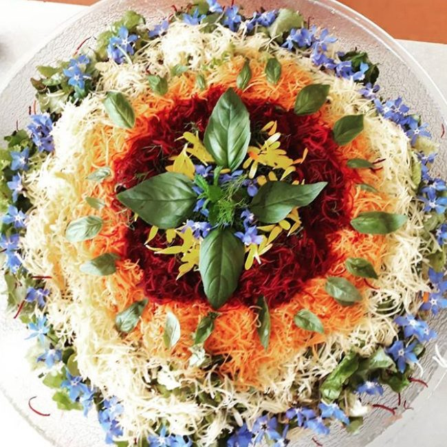
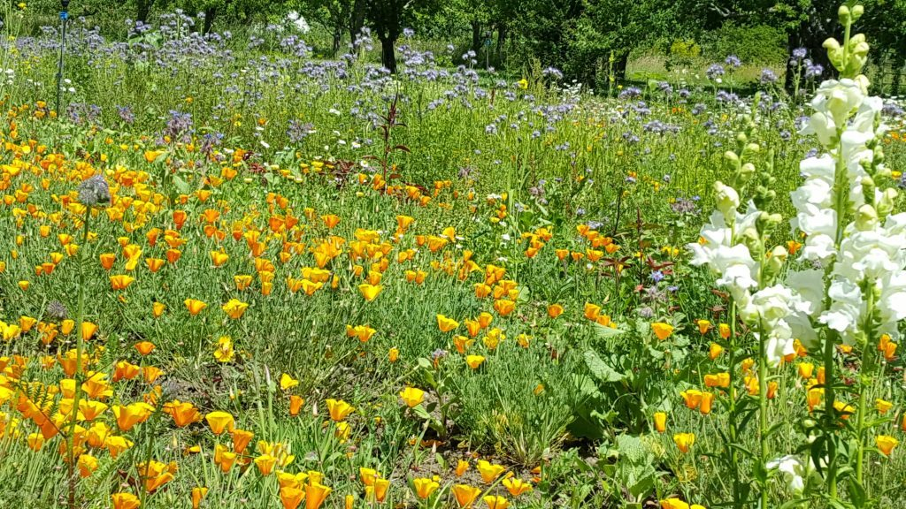
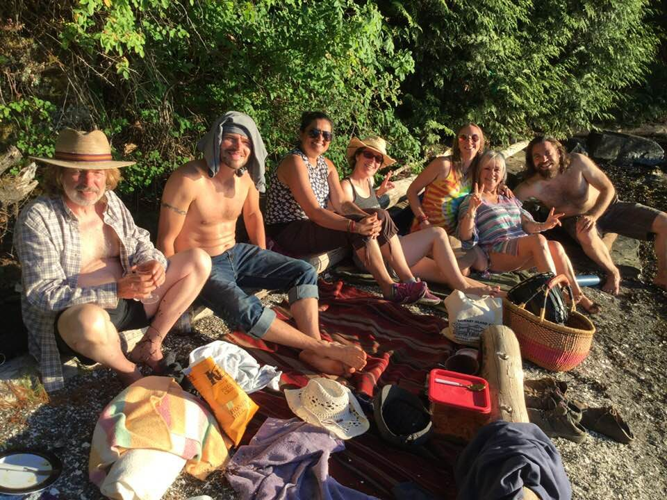
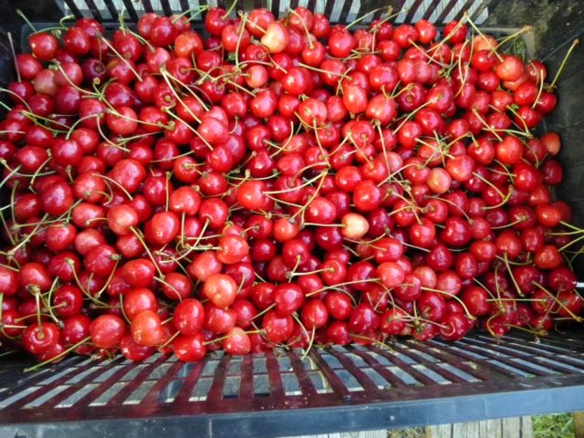
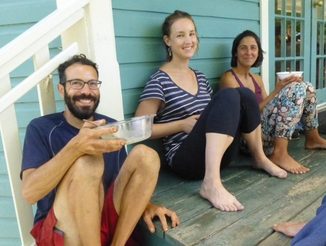
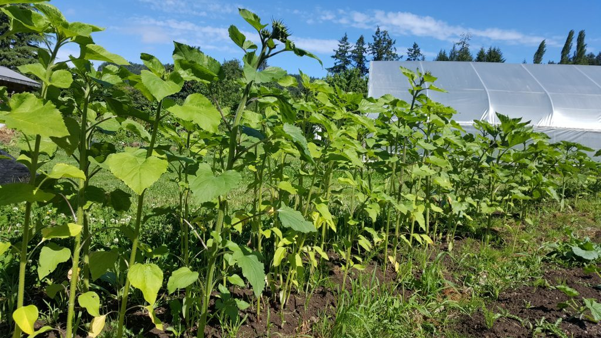
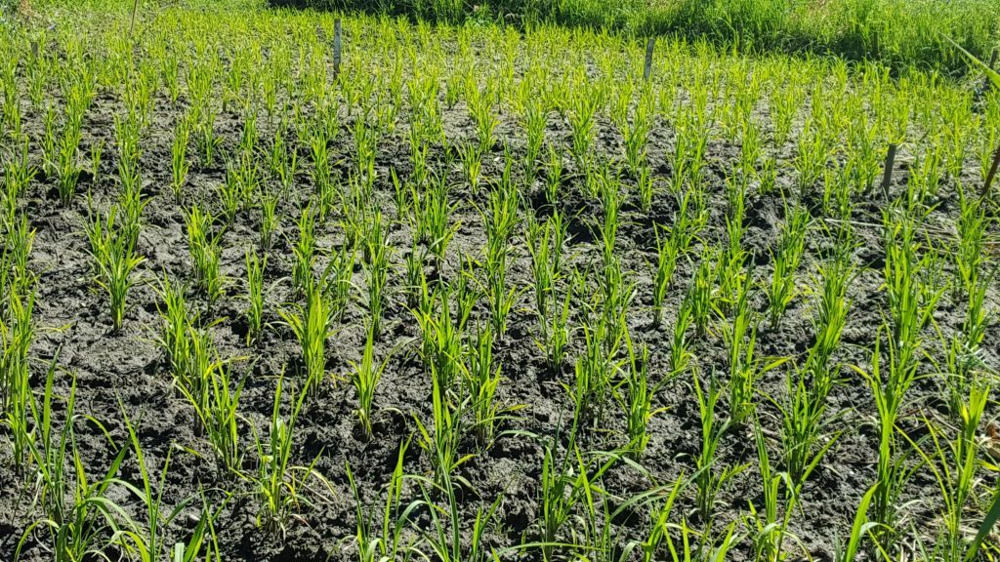

#### “If the only prayer you say in your life is thank you, that would suffice” ~ Meister Eikhart

---

Hello everyone,
Summer at the centre is a busy time, with a growing residential community and programs in full swing. What have community members been doing? Here’s a brief update.
[caption id="attachment\_17206" align="aligncenter" width="600"] summer blooms![/caption]
[caption id="attachment\_17202" align="aligncenter" width="600"] Celebrating Jesse's birthday at the beach![/caption]
[caption id="attachment\_17201" align="aligncenter" width="600"] Fresh picked cherries![/caption]
[caption id="attachment\_17203" align="aligncenter" width="600"] Dan, Mariel and Muriel lunching on the back deck[/caption]

## Goings & comings

Recently we bade farewell to Katie and Sorriso. Katie came here for the karma yoga program that began in April, and because of her background experience, was able to contribute as a valuable member of the office team. Sorriso has been the centre’s maintenance manager for several months, but family matters have drawn him away. Along with his skills Sorriso added a unique, playful flavour to the community. He promised he’d come back for ACYR.
In mid June we welcomed a new group into the [Residential Karma Yoga Program](https://saltspringcentre.com/programs-retreats/karma-yoga-program/). As always it doesn’t take long before the new folks become an integral part of the community. Other recent additions include Emily Stewart as programs coordinator and Courteney Cullen as housekeeping coordinator. Welcome aboard!
[Yoga Teacher Training](https://saltspringcentre.com/yoga-teacher-training/) begins this week. Energy is building as we prepare to delve into our 17th rich, in-depth program of study and practice. Three people in our resident community will be joining the YTT program this year: Racquel, Muriel, and Bernie.
We’ve added an extra [Yoga Getaway](https://saltspringcentre.com/programs-retreats/yoga-getaways/) this month - July 20-22. In addition, there are Yoga Getaways on the following dates: August 31 - September 2, September 21-23, October 12-14, and November 16-18. These programs are transformative. Many people return again and again to have another taste of self-care and ease, and to remind themselves that it’s possible to continue to support peace in their lives as they head home.

## Other upcoming programs

[**Jnana Yoga: Awakening through Understanding**](https://saltspringcentre.com/jnana-yoga/). On the weekend of September 7-9 Alan Shankar Martin will be leading a program on jnana yoga, transcendence of the mind through understanding. Participants in this workshop will investigate deep-seated beliefs about who we are and what yoga is. Jnana yoga, the path of knowledge, sometimes called the direct path, sheds light on the dark areas of our misunderstandings and awakens us to the deeper reality of who we are.
[**Guru Purnima**](https://saltspringcentre.com/guru-purnima-full-moon-yajna/), the celebration and homage to the Guru (“one who removes darkness or ignorance) will take place on the full moon on Friday, July 27, beginning at 9:00 am in the pond dome. This is an opportunity for us to honour Baba Hari Dass and all other spiritual teachers. Read [Guru Purnima](https://saltspringcentre.com/guru-purnima-full-moon-yajna/) for more details. If you are hoping to attend and stay at the centre the night before Guru Purnima please notify the office.
If you work on yoga, yoga will work on you. Please join us at our [**Annual Community Yoga Retreat**](https://saltspringcentre.com/programs-retreats/annual-community-yoga-retreat/), and work on yoga with your satsang community. This is the 44th annual consecutive retreat, running from Thursday, August 2 through Monday, August 6. You can come for the whole retreat or just the weekend. [Register now!](https://saltspringcentre.com/annual-retreat-registration) Each day there are many yoga asana class options, morning shath karma (cleansing practices), pranayama and meditation, afternoon and evening programs, one of these including yet another entertaining performance of the Ramayana, a program for children, and time to simply enjoy being together on this beautiful land.

## Our wish list

In preparing for ACYR, we’ve discovered that some of our yoga props (bolsters, mats) have wandered off, and we would love to bring them home. This has led to the idea of posting a centre wish list, providing an opportunity for you to [donate to the centre](https://saltspringcentre.com/donate/), for a specific item such as props or a toward general support for the Centre.

## News from farm

[caption id="attachment\_17209" align="aligncenter" width="600"] sunflowers standing tall![/caption]
[caption id="attachment\_17205" align="aligncenter" width="600"] Rice growing - its a pretty big deal![/caption]
The farm is in major production mode. The greens are amazing, and there’s more coming. Here’s Dan’s farm update.
> After a cool and grey start to the month, our hot crops—tomatoes, cucumbers, squash and eggplant—are at last getting the sunshine they need to begin flourishing in the greenhouses. Our cherry tomato varieties are starting to flower, and I’ve even spotted the first few tiny fruit appearing on the vines. We’ve planted nine different tomato varieties in all, and the pruning parade has begun on three of them.
> The farm team has doubled in the past couple of weeks thanks to the arrival of a new round of karma yogis who are proving just as eager and capable as my original crew. We continue to haul in dozens of pounds of salad greens, snow peas and beets every week, but the highlight of our last few harvests has been the bounty of cherries we’ve been collecting from the orchard. Although the robins and waxwings have started flocking to the trees in recent days, there seem to be enough cherries to go around.
> There has also been a burst of colour in our flower field, as the marigolds, daisies, cosmos and borage are now in bloom, while elsewhere on the farm the sunflowers are starting to outgrow some of the farmers and are on the verge of producing heads. And finally, the much-anticipated afternoon of transplanting our rice into the paddy took place a couple of weeks ago with the help of community members and off-land volunteers, and the early results are positive, as all the varieties seem to be healthy and growing well. Here’s to continuous growth throughout the summer.
> In gratitude,
> Daniel Naccarato

## To read

The karma yoga experience: Three karma yogis from our resident community have shared some thoughts about their time at the centre, reflecting on what they have learned about yoga, community living, and about themselves in **[Karma Yoga Ponderings](https://saltspringcentre.com/karma-yogi-ponderings-3/)**. I’m happy to introduce Muriel Tournaire, Daniel Naccarato and Bernie Farley.
Periodically I review **[questions and answers with Babaji](https://saltspringcentre.com/from-the-chalkboard-of-baba-hari-dass/)**, recorded during earlier yoga retreats. Here is a selection from a summer yoga retreat of 1993. One year someone asked Babaji if the quality of questions had improved over the years, he responded; “Same questions, same answers”.
There’s plenty in life that we find worrisome, and while that can prompt us to take action, worry in itself is debilitating. [**Freedom from Worry**](https://saltspringcentre.com/freedom-from-worry/) explores the background of anxiety that pervades our lives. Worry or anxiety is a pattern of thoughts, a particular form of colouring in the mind. Just because we believe our thoughts doesn’t mean they are true.

#### A cotton thread can cut an iron bar if passed over it daily. If you work on yoga, yoga will work on you.

 
Love,
Sharada
