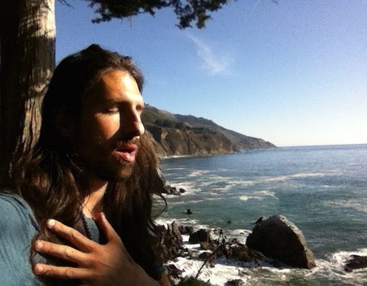
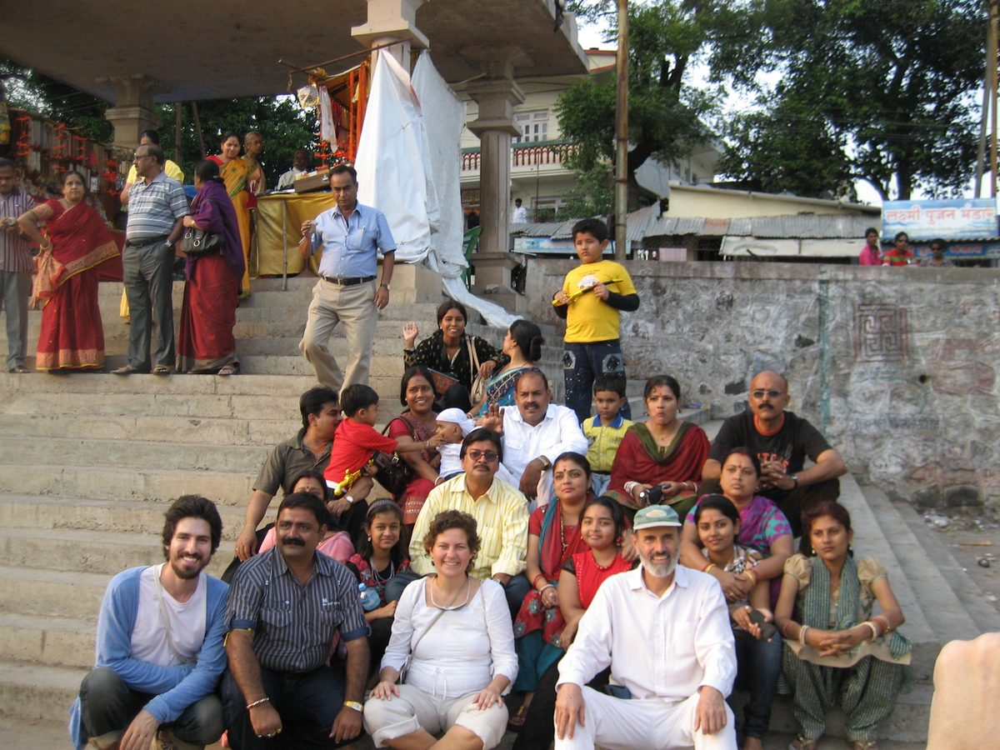
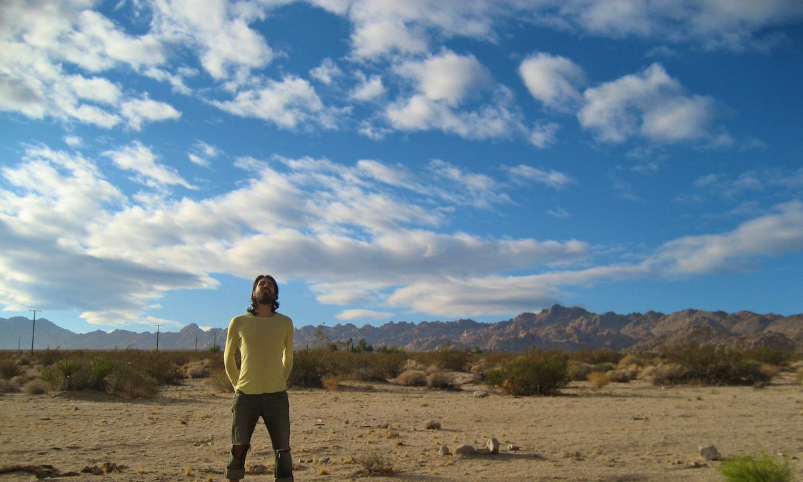
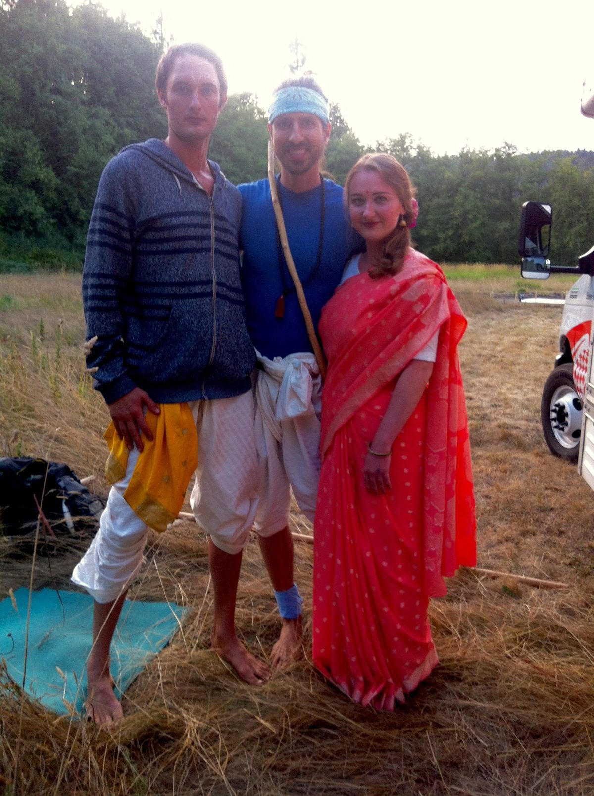
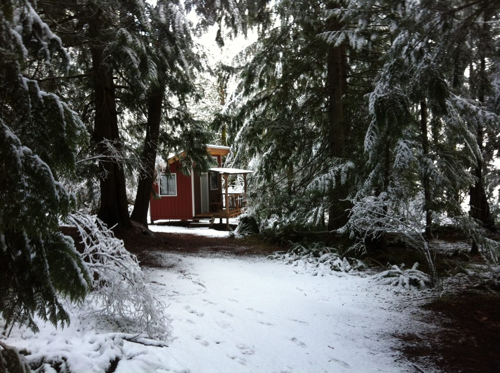
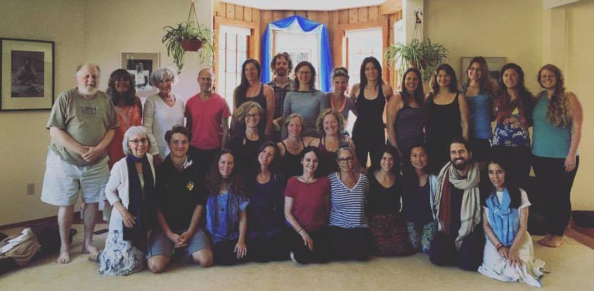

*the drum beat
the heart beat
led me
here*
*a story in poetic verse
by angelo rosso*
I heard the drumming
the chanting calling me in
Her voice familiar
calling me
this me
Deeper
into a place
that place
this place
that is.
‘the desert is vast & does not lie’
a wise old woman once told me
with her deep piercing soft blue eyes
& sun drenched face.
I asked her, “what is it about the desert?”
& she looked into me deeply & proclaimed:
“in the desert, there is nowhere to hide.”
the journey of this soul, in this life is varied
the only way I know how to write this story
is in poetic verse, sprinkled with prose
& so
we all know the terrain
we all know it well
covered with hills, valleys, rivers, ocean, mountains, city,
town, desert, village & forests
bus, train, stroller, boat, plane, automobile, bicycle, skateboard, subway
roller blades, ice skates
two feet
& I walk
inside the deepest parts reveal what we have always known
 bambino angelo
& so it was for me, as a child, a deep knowing
for such a young human still close to the other world
in which I came
before this world
before this time
still in touch with the other time
still in touch with the deep Buddha nature
recall as a boy, lying on the grass
watching clouds pass
father blue sky
vast & free
sitting on a limb ancestor tree
as wind swayed its message
cool calm felt embrace of a gust
meditating without knowing it was called that
witnessing a black bird lying lifeless
passing away on the road in front of my house
flying around just moments ago
knowing where it came from
not knowing where it will go
in absolute awe of it all
a kind loving father
a tailor who held me well
he took me to where he worked
where he created & I saw where he went
when he left our home in the morning light
I saw him in his glory
a charming man
what a sight
a kind loving mother
who kept the home fires burning
a warm home of heart in hearth
childlike, sweet deep compassion
beautiful mother love
a woman of devotion
four sisters
Yes
4 sisters
four beautiful teachers
who loved me as brother & friend
& me the only boy
blessed to be a prince among princesses
what a gem
a charmed upbringing
comfortable love
well taken care of
very little strife
high fortune in this life
I had a deep desire to serve
to help my mother in the kitchen cooking
to prepare tea for my dear grandmother
to help my sister with her homework
finding joy in this doing
in this helping
for the pure intention
being of service
karma yoga was playing on me
without me knowing it was called that
In reflection yoga was there & has been all along
before I knew the names
before I read the books
before I went to India
before I learnt how to meditate
before I sat for hours
in full lotus
before I lost it all
found it
& lost it again
all along
In a way I had to learn the names to remember
my Christ Nature
my Krishna Consciousness before
I knew what all this meant
before I heard the words asana, pranayama,
bhakti, karma, jnana, hatha, yoga….
before I knew
I knew
beyond words
It was there all along
& yet sometimes to leave the very branch
that holds us
to go out to meet that horizon
that future self
imagination self
an impulse comes
through blood in bliss
at 13 years old boyhood into manhood
I sold my guitar to buy fancy clothes
for my journey into high school
& so it began
the becoming
the need to prove, achieve, acquire
the need to prove something
beyond the pure beauty of this true self
 in awe of mama ocean big sur california
pure awareness lost in a sea of noise
& the horizon, that far off place
out there held some promise
more valuable than where I stood
& so I went out to meet that horizon
to touch that future self
to know
to dive deep into the form
a necessary journey
to know
and so it began
a thought away
as Ram Dass teaches: ‘one thought away
from where the action truly is.’
one thing to do
before I could be
be here now
a true bhakti of the present moment
who I am
I became good at achieving
making all the right moves
being in the right places
talking to the right people
I studied business in college
being groomed to take over
an empire
yet I heard the drumming
Her voice
that flute in the forest calling
in the middle of the silent night
the famous ancient flute
they say:
the wise ones from the other time
there comes a moment
when we all hear our flute or drum
calling us
to our true nature
back Home
back Om
& then the courageous motion is to abandon all
rational paths that lay clear
to follow that still small voice
that has no clearly marked path
yet
is the True way
The only Way
to return
to where
I never left
& so it goes…
I followed that ancient flute
inside my chest
inside my breast
to the big city, the big apple
Le Grosse Pomme
New York City
to study theatre & find Spirit
In art
explore the potential of my artistic
realms of expression
so blessed to have been able to play in such a vast ocean
of support, talent & allowance
releasing all the old stuff
purging through art
what the obvious world could not hold
putting it on the page
on the stage
thank you dear Ibsen, Chekhov & Shakespeare
& once all the stories had been told
success poured
& I gently bowed out
exit stage left
feeling complete
and ready
to let go of
the Angelo story
into the ocean
it was time to go into the darkness
where the light has eyes
to know me
again
& so….
an opportunity to engage in
Wilderness preservation work called
Spirit Tree
led me out west
B.C. forests
to the trees
I sat & listened
returning to the limbs that once held me
to re-member as the great Antonio Machado wrote:
‘At the shores of the great silence’
to the message
to be still & know
be silent & know
& it was time now
after the cathedral of Trees
passed on their medicine
made me strong & ready to go
to begin the journey further in
as wise woman poet friend speaks in her great
poem ‘Wild Geese’ Mary Oliver shares:
*You do not have to be good.*
*You do not have to walk on your knees for a hundred miles through the desert repenting.*
*You only have to let the soft animal of your body*
*love what it loves.*
so…
he packed a bag in the middle of the night
& walked out of the story
Fully
the courageous first step led to farms
across Canada & U.S.A
tending the soil
to get closer in
knelt down to the earth once again
& smelt the soil from which
my bones are kin
to engage in what Masanobu Fukuoka speaks:
“the ultimate goal of farming is not the cultivation of crops,
but the cultivation & perfection of the human being.”
Amen brother!
 beautiful family in nasik india 2011
I
traveled
served
loved
let go of it all
wandered
yet was not lost
& in going out
went deeply in
Further
India
Guatemala
Mexico
by foot
then
& then
Joshua Tree
 joshua tree
it was there in stripped down
pure vast desert land I met White Feather
& he whispered in my ear
in my Heart
my secret name
given to me before the I came
There in a clear blue sky,
Father sky wide & free
& remembered that boy
lying on the grass
& then
it was clear
is clear
I am
this is all
then I heard the drumming
I heard the drumming
the flute
the drum
the harmonium
chanting calling me in
the drum beat
the heart beat
Her voice familiar
calling me
this me
Deeper
into a place
that place
this place
that is
Kirtan
Devotion
Heart opened wide & wider & wider
beyond the thinking mind
wide through a doorway
crossing a threshold
Salt Spring Island called
from across the desert
& I crossed an ocean
to meet it
to visit a friend
& then like a wave coming to the shoreline
a Sunday summer satsang
it was clear
the Salt Spring Centre of Yoga
Was
Is
going to be a container for deeper work
Hanuman & Ganesha,
a fountain
a pond, a lake, a maple tree, a circle of smiling souls
a drum, a flute & her voice calling me in
as human man spirit yogi farmer cook poet lover friend brother mentor…..
 ramayana 2016
& all the other roles taken on and shed
only to take on and shed again
RS, RS, RS
the Angelo story is sweet
this life is pure bliss
I am grateful for the Centre
for the way Babaji holds me
Lovingly guides me
how many times I would sit in the satsang room
Light the candle by the table
look at his face in that photo
Smile
Yes
I know
Yes
I know
& so I go
back in
to that place that I never left
 sscy winter cabin 2017
& so came the dive into
Yoga Teacher Training
Deeper teachings
sitting in so many various shaped circles
community life
full of teachings
lessons
never ending
always beginning
 YTT 2017
serve the food
Let go
Be kind
RS
Regular Sadhana
Do the work
& so I share these words
In deep gratitude
For the Triple Gem
I have auspiciously arrived into
This life
A true gift
Triple gem precious
to have been incarnated in human form
to come to the teachings of self realization
& the most high
most high & precious
is to have sangha to support
the growth, evolution & expansion
of consciousness
to Be
Once again
to Be
This beautiful child
Lying on Mama Earth looking up at vast
Blue Father sky
& knowing
Deeply
Deeply
What only
Truth & Love
can Speak.
~ Jai Gurudev
