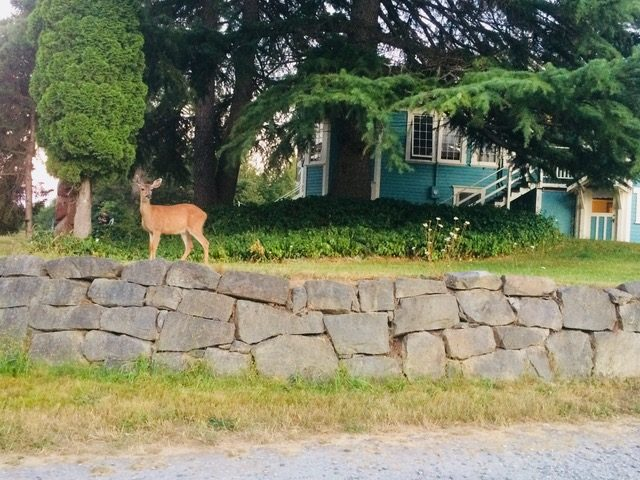
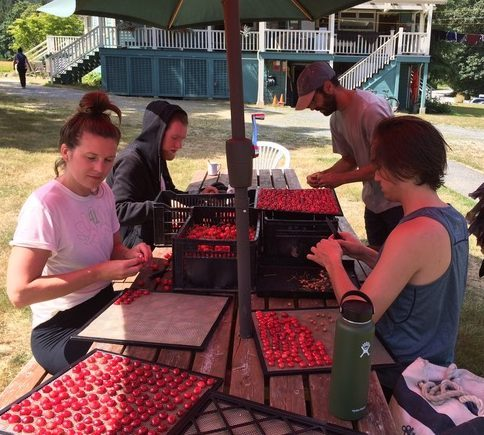
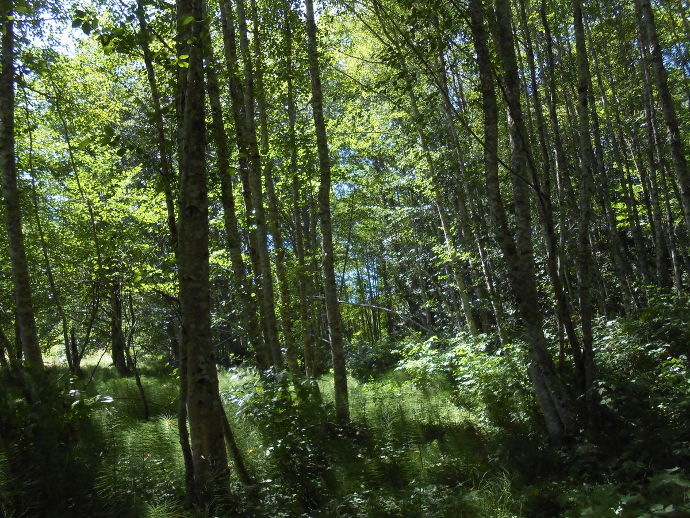
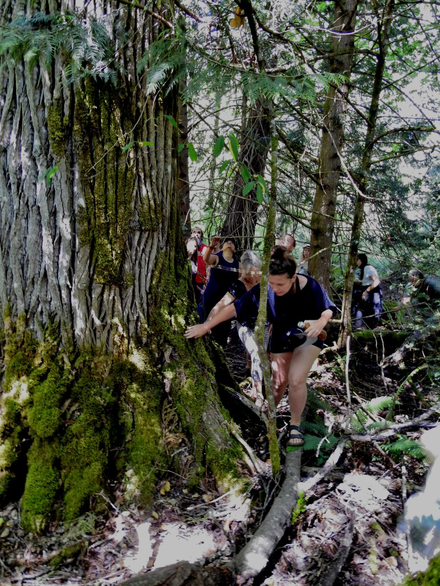
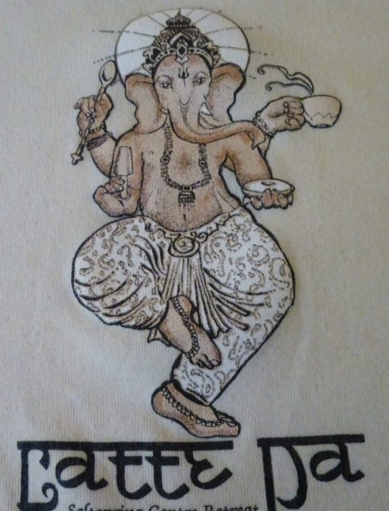
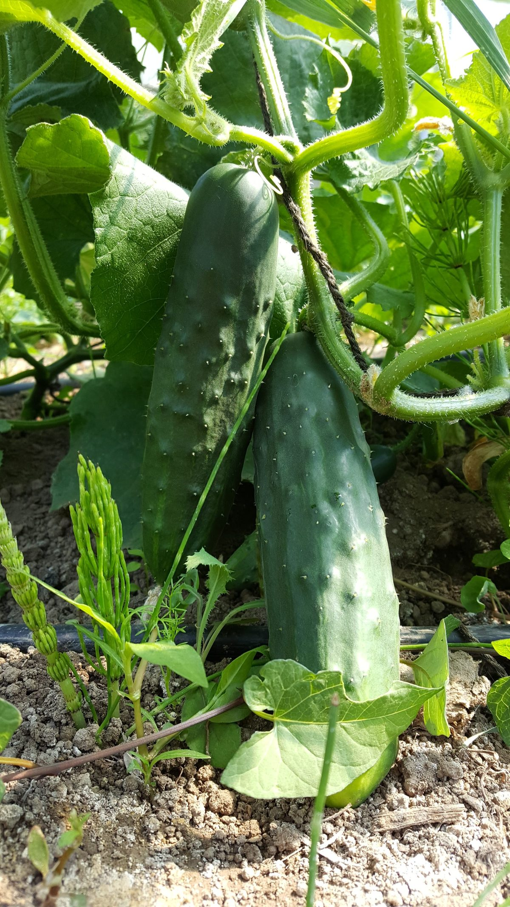
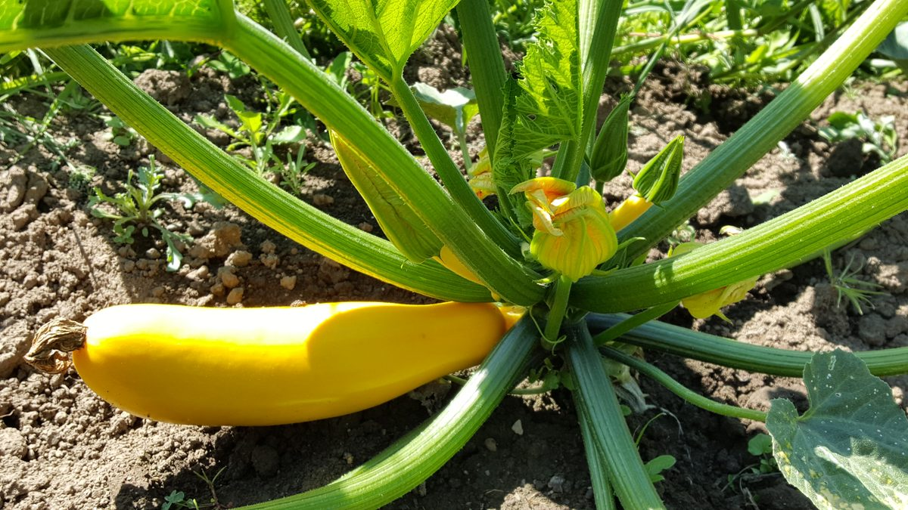
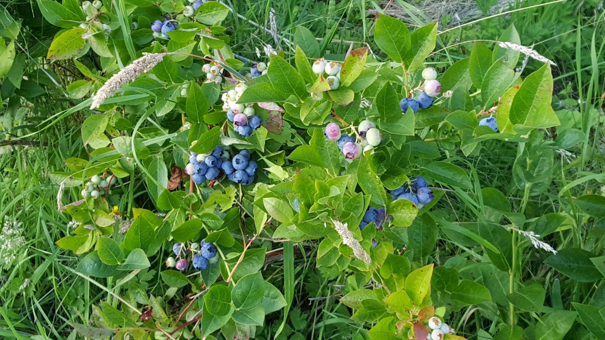

#### If you work on yoga, yoga will work on you. ~ Baba Hari Dass

---

Hello everyone,
We’re halfway through summer, in the midst of our busiest season. Life at the Centre is filled with the daily tasks of supporting programs and enjoying community life - work and play.
 dear deer
 cherry pitting party

## Magical Dandaka

One afternoon Raghunath Polden led the community on a walkabout through the Dandaka.
 Walking through the Dandaka forest
 Walking through Dandaka forest
Here’s what Raghunath shared about this magical corner of the land.
> Dandaka is a beautiful and unique world of cedars, maples, giant cottonwoods, ferns, wildflowers and lush forest-floor plants, that was named by Babaji after the ancient forest in India that Ram and Sita chose as their fourteen-year retreat home-in-exile after being banished from the court of Ayodhya.
> Dandaka is very rare, an undisturbed tract of almost-primordial cedar-swamp, with pools and braided creek flows in winter/spring that go underground in summer, purifying water on its way to the drinking-water lakes of Blackburn and Cusheon; once many places looked like Dandaka, but now almost nowhere does. That it is home to populations of rare Red-legged frogs, Pacific Side-band snails, California Myotis bats, owls and woodpeckers, we have confirmed, and now studies led by biologists are seeking to identify the many other important and fascinating flora and fauna Species-At-Risk for whom it is habitat. Dandaka is a treasure.

## Our annual gathering

 LatteDa Tshirt
Our **[Annual Community Yoga Retreat](https://saltspringcentre.com/programs-retreats/annual-community-yoga-retreat/)** - the 44th - is about to begin, with a full lineup of activities, including sadhana classes, asana classes, lots of kirtan, Sunday satsang, a yajna on Monday morning, a program for kids, and more, including Ramayana! ACYR runs from August 2-6. If you want to attend all or part of the retreat but haven’t registered online, you can do so when you arrive. To find out more, check [the Centre’s website](https://saltspringcentre.com/programs-retreats/annual-community-yoga-retreat/).
This year we’re bringing back the original Latte Da shirts from several years ago - the ones with Ganesh on the front and Om…. Jai….Thanks for the chai! on the back. They will be available at the Jai store during ACYR.

## Good eating

As always, we continue to eat well, with lots of produce from the garden. Here’s Dan’s Farm Update:
>  cukes galore!
> While the summer sun and heat has been slowing some of us down, our summer crops are loving it. Cherry tomatoes are overtaking one of the greenhouses and provided us with our first harvest just over a week ago, while the cucumbers followed suit just days after, and are flowering like mad so we expect to be picking quite a lot of them throughout the summer.
>  zukes galore!
> Meanwhile, our zucchini plants have also become steady producers over the past couple of weeks, thanks in part to the row of sunflowers beside them, which has lured a consistent flow of native bumblebees and other pollinators. And just as the last cherries were being plucked from the trees, lo and behold, the blueberries began ripening and have been keeping the farm team busy and well-nourished almost daily as we try to keep up with them.
>  blue beauties!
> Although some rascally rabbits have been making their way into our lettuce patches lately, we've still been able to provide our kitchen and yoga teacher trainees with some nice and colourful salad varieties.
> In gratitude,
> Daniel Naccarato

## Upcoming Programs & Retreats

**[Jnana Yoga - Awakening Through Understanding](https://saltspringcentre.com/jnana-yoga/) - with Alan Shankar Martin - September 7-9.** Shankar has been a student of Baba Hari Dass since 1975 and has served in many roles at SSCY, including Director. Previous to that he was a university professor. If you are drawn to inquiry, you will find this program very helpful. Jnana yoga, the path of knowledge, sheds light on the dark areas of our misunderstanding and awakens us to the deeper reality of who we are.
**[Yoga Getaways](https://saltspringcentre.com/programs-retreats/yoga-getaways/)** continue monthly until November. Take time for yourself to rejuvenate and recharge.

## Fresh readings

Here is a beautiful, poetic story from Angelo Rosso, part of Our Centre Community. If you know Angelo, you can imagine him speaking these words - [**I heard the drumming**](https://saltspringcentre.com/i-heard-the-drumming/) in spoken word style.
Each year, folks who attend retreats are inspired deepen their yoga practice with renewed enthusiasm. We all know, though, how easy it is to fall off the wagon. Staying true to our aim is the theme of “**[Showing Up](https://saltspringcentre.com/showing-up/)**”.
*No one can please everyone. Your mental peace is more important. If you are in peace, then others around you will feel peace, so your best effort should be to work on yourself. ~ Baba Hari Dass*
Love,
Sharada
