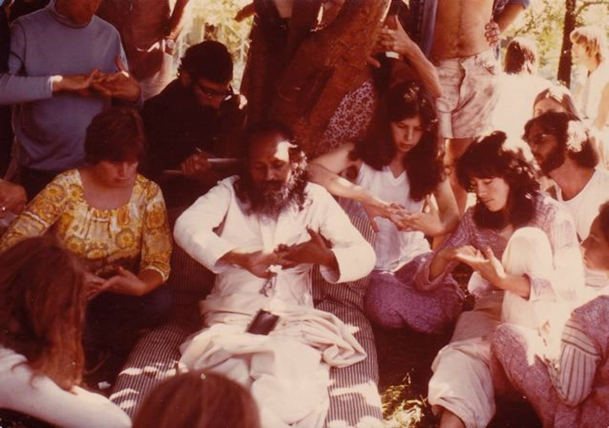

Wherever you are in your life and in your practice - whether you’re a beginner wanting to establish a practice or someone who’s been practicing intermittently over the years - you might need to give yourself a push. Whatever practice you want to develop or reinforce, showing up is the first step. If your thought remains nothing more than a wish, nothing happens; you have to take action by showing up and beginning.
Showing up is making a commitment to yourself, acknowledging that you’re worthy of taking this next step. That is a big deal.
*If you want to attain something, we put all our energy into it. For example, those who participate in the Olympics or those who climb mountain peaks practice every day. In the same way, if we really want peace and want to overcome the ignorance of this world, we have to practice every day.*
When you recognize that your habits are not helping you find the ease and happiness you want, you may try to look for it in many places, only to find that the same dissatisfaction arises. It all seems good for a while until something changes. That’s the nature of life. The problem that we run into is we keep thinking it’s something outside us that makes us happy or unhappy. There is nothing ‘out there’ that will bring us only what we like and keep us happy forever.
The answers are not ‘out there’, but inside. Showing up for sadhana (spiritual practice) every day can be the beginning of deep understanding. It takes work, and we know from experience that it is easy to be pulled off-course and to use whatever distractions arise as an excuse to avoid the very thing we’re trying to commit to. It takes self-discipline to stay true to what we really want.
*It’s hard to be responsible for our own progress. We always seek for someone to carry us and put us on some higher level. We have to understand that our progress is based on our own efforts.*
When you commit to showing up for practice, you’re acknowledging that you have hope that something worthwhile could happen. Take the first step and see what happens. Show up; don’t give up.
*There is a hope of finding something. One doesn’t proceed in darkness, but takes a lighted candle, which is sadhana. The more you step forward, the more the path appears in the light of that candle.*
Pay attention to the underlying yearning for peace of mind; keep your aim in mind and it will guide you. Your mind will try to pull you away, telling you it’s too difficult, it’s not going to work, and wouldn’t you rather relax and eat ice cream? It’s a test. The mind has many ploys to pull you off track, so you have to watch your mind carefully, questioning the thoughts that arise, remembering your ultimate aim of peace.
*If everything goes easily you can’t test yourself, and you can’t understand where you are. Go forward slowly and firmly.*
*Yoga is calming and pleasant if you build it up like a building. Do some each day; otherwise it will be a burden and you will run away.*
*If our aim is strong, then all our activities will become supportive of our aim*.
Contributed by Sharada
All text in italics is from writings by Baba Hari Dass

---

**Sharada Filkow**, a student of classical ashtanga yoga since the early 70s, is one of the founding members of the Salt Spring Centre of Yoga, where she has lived for many years, serving as a karma yogi, teacher and mentor.
