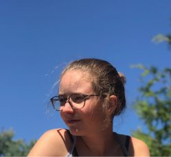
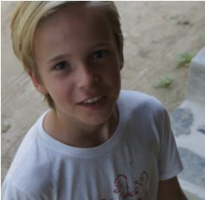
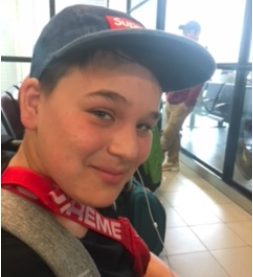

These kids are awesome!
Meet Sierra, Noah, Jack, and Diego, a few of the kids at ACYR who agreed to answer some questions for the newsletter, about their experiences at ACYR and what they love about coming here.
Sierra has been coming to ACYR with her mom for her whole life. This year she brought her friend, Noah. Jack and Diego have been coming to ACYR for years.
These kids have a lot to teach us about finding our place in community, belonging, and contributing while having fun.

---

## Sierra Pochay-McBain

Hi, my name is Sierra Pochay-McBain. I am 14 years old and have been coming to ACYR for 14 years.
***What different parts of ACYR have you taken part in over the years?***
Over the years I have taken part in the kids' program which I always loved. It was a great place to make new friends and do all kind of fun activities including tie-dying and the nature walks which were always my favorite. I have also taken part in playing capture the flag with all the other kids. I started off as a little kid being helped by the older teenagers that would come, and now I'm that older teenager playing with the younger ones and helping organize. I have also taken part in the Hanuman Olympics and the Latte Da stage night almost every year.
***Have you ever gone to any classes or ceremonies?***
As a little kid I attended some of the young children's classes with my mom and really enjoyed them. As I got a bit older I tried attending a couple adult classes but found it very difficult to stay silent for that long and never lasted through a whole class. However this past summer I attended a class and really enjoyed it. Two years ago I also went to observe the yajna and thought it was very interesting. I was offered a spot as an offerer but being young and growing so much I could not last that long without food. Hopefully in a couple years once I stop growing. ;)
***Have you ever contributed as a karma yogi?***
Yes I have. It all started when I was about 8 or 9 years old and Sid recruited me for the Latte Da Cafe. The first year I went in a couple of times and helped with little things. Sid, Rajani, and Om taught me how to make the delicious sid special bagels with the right amount of ingredients to taste good and save on money, as well as run the shop. The next year Sid gave me a Latte Da shirt and told me it was one of the only originals left. Then I was hooked. Since then I have worked there as much as I could, being the only child allowed inside the cafe, and two years ago I was finally registered as a karma yogi. This past year I brought one of my oldest family friends, Noah, and we worked at the cafe 3 shifts a day with Amita and Ian who were nice enough to let me and Noah work with them, and great company. Now I cannot wait to go back and help out again next year.
See you all next year!

## Jack Kettles

Hi, my name Jack, I am 10 years old and i have going to the ACYR since I was 3.
I have taken part in Hanuman Olympics, the Ramayana, restorative yoga, satsang, kirtan and asana. I have also helped set up the Hanuman Olympics for 3 years now. My favourite parts of ACYR are the Ramayana, Sid's stories and Latte Da. I have also done some dishes.
ACYR is not just a place where people come to do yoga. ACYR is a place where people come to see friends away from home, meet new friends, have fun at the Hanuman Olympics, sing songs and show off their hidden talents at Latte Da Stage.

## Diego Ardiles

I’m 14 years old, and I've been coming to the ACYR for, I believe, 10 years now.
I've been involved in the kids program, Restorative Yoga, Capture the Flag, Latte da talent show, the Ramayana and the Hanuman Olympics. I've done two restorative classes, helped build the Hanuman Olympics, participated in the Olympics and the Latte Da talent show, and helped organize Capture the Flag. I haven't been a karma yogi, but I have helped in these events.
My favourite thing about coming to the ACYR is the people, and disconnecting from the outside world.
Salt Spring is awesome!

## Noah Gauley

My name is Noah Gauley, and I am 13 years old. This year was my first year coming to the retreat.
***What's your favorite thing about ACYR?***
One of my favourite things to do at the retreat is to work at the Latte Da cafe. I like working there with my friend Sierra. It is very fun because you get to meet so many people and they are always so nice. This way when you see them around the retreat you can always say hi and start a conversation with them because you have already met and you don’t have to awkwardly introduce yourself.
***Have you ever taken part in any events at ACYR?***
This year right when I got to the retreat I heard some singing in the pond dome so I decided to go check it out. It ended up being a Ramayana rehearsal and my friend and I were instantly recruited to be monkeys. We were each given two lines and we were taught the choreography for all the dances. It ended up being a lot of fun and a great experience. If I have a chance I will for sure do it again next year.
I hope to return next year and bring my mom and maybe even my aunt so I can show them all the wonderful things about the retreat. I also hope to keep returning for years to come.
