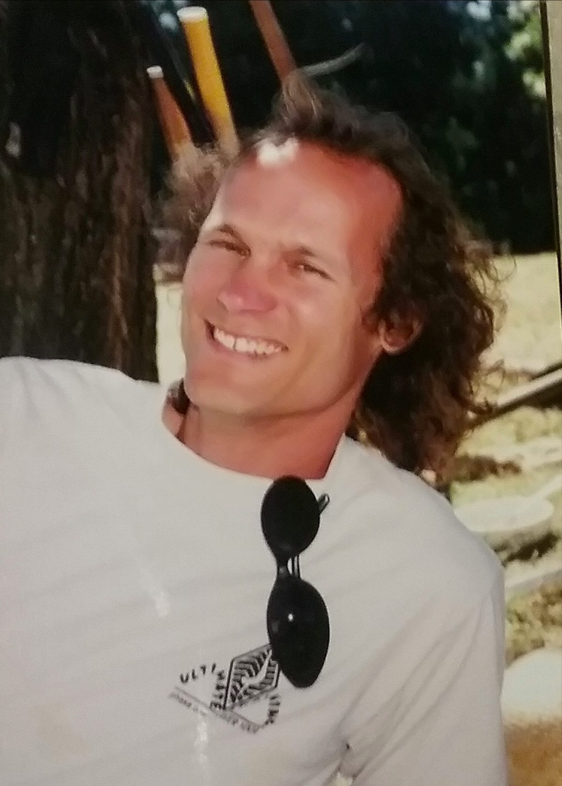
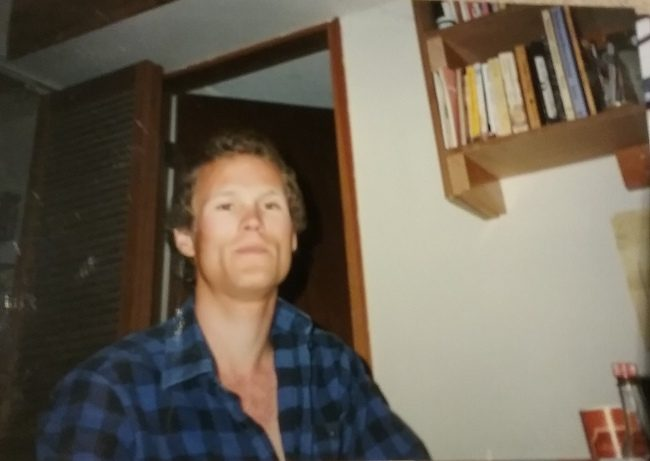
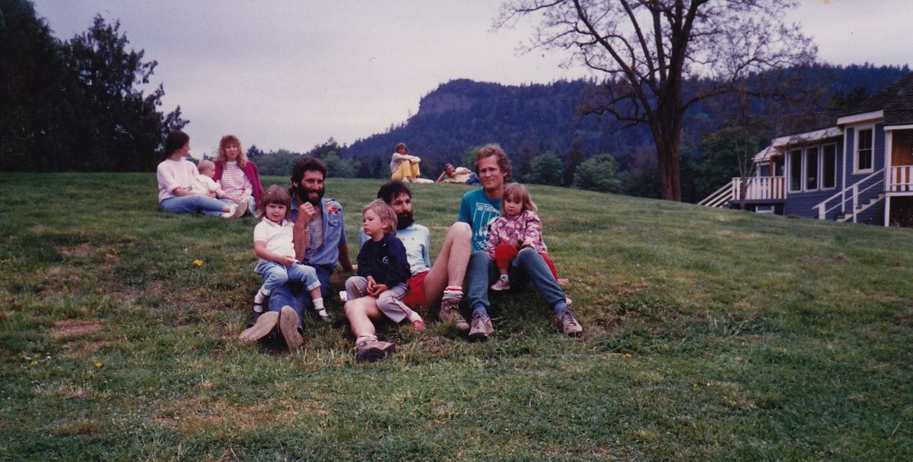
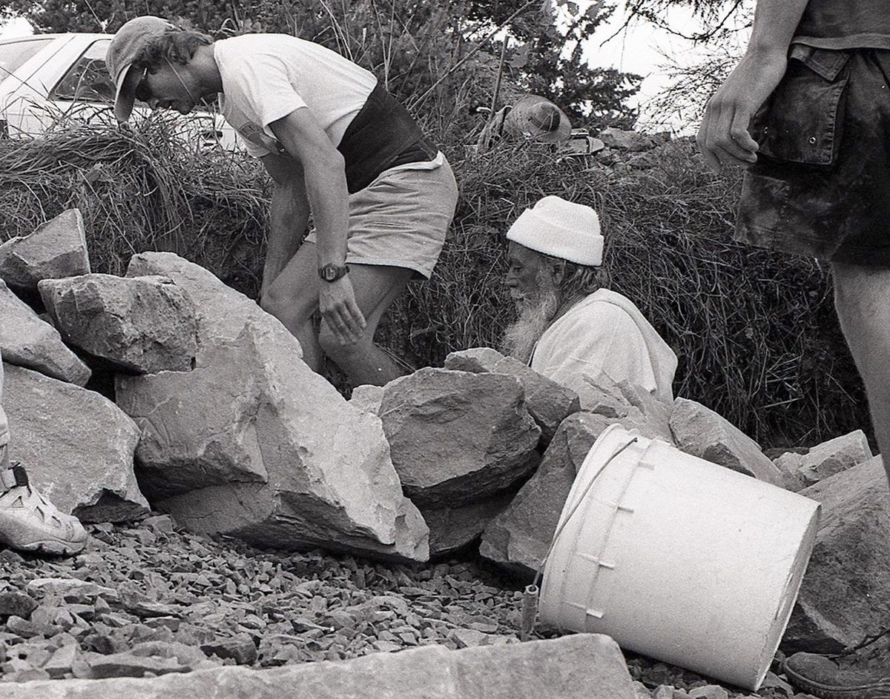
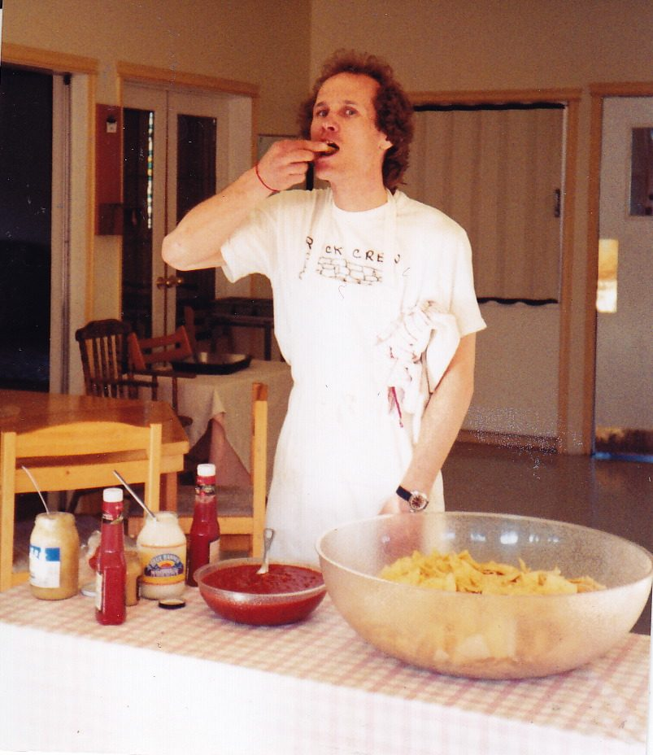
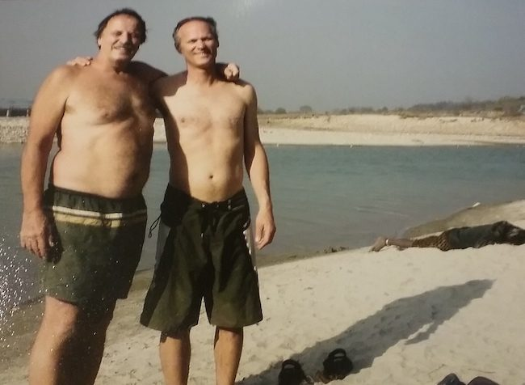
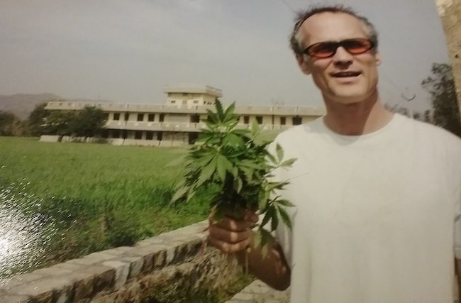

When I was 17 years old, in high school, I read a book that my brother had, called Youth, Yoga, and Reincarnation, by Jesse Stein, which talked about hatha yoga, with all its physical and spiritual benefits. I found it fascinating, but I thought, “I don’t need this stuff at this stage of my life”, but I knew someday I would, so I logged it away in my memory so I’d know where to find it. Now I knew there was something available, and that something was yoga.
At age 18 I told my dad I was going to Whistler for a year, and then I’d go back to Winnipeg and go to school - but that didn’t happen till I was 30. I was always a seeker, but I didn’t have a clue what I was looking for.
[caption id="attachment\_17483" align="aligncenter" width="732"] Early 90's[/caption]
I had always wanted to go to Hawaii, and when I was 22 I finally did. The plan was to go for six weeks and then go back to Whistler for the ski season. While I was there I took hang gliding lessons, and I cracked and broke my foot. There was no point in going back to Whistler, hobbling around on crutches, so I decided to stay in Hawaii and hang out on the beach.
About a month later, no longer on crutches, I met a fellow who told me about a fantastic yoga class. I told him my back was really bad, and he said this yoga would really help my back. It was Ashtanga Yoga, Pattabhi Jois’ system. I went to those classes six days a week for three months. One day I went into the teacher’s kitchen to get something, and there on the table was a photo of Babaji. When I asked the teacher who that was, he said, “That’s Baba Hari Dass, a real wild yogi who is silent and teaches Ashtanga Yoga” - but the thing I remember is Babaji’s eyes. I never forgot them and I never will.
[caption id="attachment\_17482" align="aligncenter" width="650"] Early 90's in Whistler[/caption]
I went back to Whistler and continued practicing Pattabhi Jois’ system for about 3 months, and then went back to Hawaii one more time for another three months, finally coming home and practicing on my own.
In April of 1983 I was in Vancouver, and saw a poster for the first spring retreat at the Salt Spring Centre with Babaji’s picture on it, and I just knew I was going.
I’ll never forget the first time I met Babaji. I was expecting a procession of people carrying him on a palanquin or something like that, but he just walked in like a regular guy, through the aisle between the men’s and women’s sides of the room, and sat down at the front. It was a five-day intensive. I sat in the front row the entire retreat; I couldn’t take my eyes off Babaji the entire time, madly in love with him then and ever since.
[caption id="attachment\_17484" align="aligncenter" width="650"] Dad and kids - Rajesh & Mamata, Ramanand & Joah, Devendra & Serena, 1989[/caption]
In 1989 my family and I moved to Salt Spring. The school building had been moved to the land but it was just a shell at that time - walls and roof. I worked with a few guys -Ramanand, Ramesh Meyers, Om (not Om Prakash - another guy), Darshan and another guy named Patrick, renovating the building, adding stairs, deck and bathrooms.
In 1995 we moved to the Centre as a family. I helped complete the Garden House during the retreat, and then moved into it at the end of August. I ended up staying at the Centre for 2 ½ years, and the kids went to the Centre School.
In the spring of 1999 my family and I moved to the Kootenays, but kept coming to the summer retreat every year. It was always the highlight of my year.

## Retreat memories

[caption id="attachment\_17479" align="aligncenter" width="650"] Rock crew with Babaji - 90's[/caption]
Rock wall building: In the early 90’s I started doing rock wall building with Babaji during retreats - always a great time. I remember one year when we started building the front wall of the mound. Mahesh had his bobcat and there was also a backhoe. There were about 30 guys, and there was a lot of noise! One confused retreat participant asked, “What’s going on here? I thought this was a yoga retreat!”
In between rock-wall building and classes with Babaji, I taught power yoga upstairs in the school.
[caption id="attachment\_17485" align="aligncenter" width="650"] Caught snacking, '89[/caption]
When the mountain-fountain was completed, everyone jumped into the water in the fountain. I was up on the scaffolding in front of the Ganesh Temple, which we were working on, and I jumped in wearing my carpenter belt with all my tools. When Babaji climbed up the mountain to plant the flag at the top, we were nervous; after all, he was 80! But of course he was fine!
How did I end up running a small engine repair shop? I was living at Mount Madonna Center in 1985, having done YTT that summer, and was heading back to Vancouver to study massage therapy and be a yoga teacher - and make absolutely no money. When I talked with Babaji he suggested I be a mechanic, which I wasn’t really interested in - until I discovered small engine repair. I realized I could open my own shop and not work for someone else, and that’s what I’ve been doing ever since, in Winlaw, BC, in the Kootenays. It’s been a good life.
[caption id="attachment\_17481" align="aligncenter" width="650"] Sanatan and Devendra by the Ganges in India, 2009[/caption]
[caption id="attachment\_17480" align="aligncenter" width="650"] Devendra at Sri Ram Ashram in 2009 - with marijuana that grows wild all over the place[/caption]
I became a grandfather in May of 2017. Fortunately my grandson lives on Salt Spring Island with my daughter and my son-in-law, and my son as well. I’m grateful to have a chance to share some of the things I’ve learned in my life with my grandson whenever I see him.
Sadhana has given me a foundation for life. When I started this yoga journey back in 1981, I’d never have predicted I’d still be doing this at almost 60. Pleasure and pain are the same; things don’t perturb me as they used to. It’s just the play of life - and it’s not who we really are.
Jai Babaji
