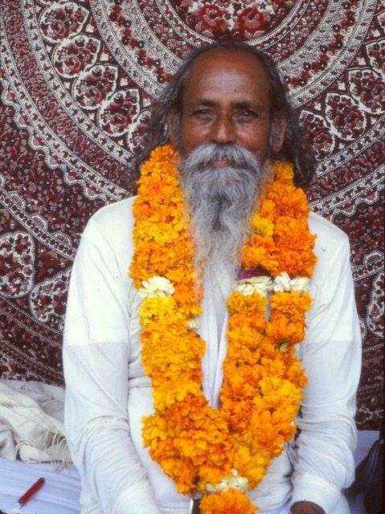

****
**Question: How does one know if he or she is on the right spiritual path?**
**Babaji:** When the mind gets calmer and reduces its attachment to the world, that indicates that the path is right.
**Question: Seems my sadhana (spiritual practice) goes through times of being hot and cold. How can I keep it strong?**
**Babaji:** In the beginning, when one starts sadhana, there is an excitement or achieving something. If that excitement is not backed by devotion and dispassion, then it fades away. As long as aim is not stabilized, the mind goes back and forth in sadhana. Doubt arises and aim gets weaker. If the aim is firmly established, then the will to achieve the goal gets stronger and devotion to God will get stronger. Sadhana practiced with faith and devotion always brings positive results.
**Question: What characteristics would a Master most want to see in students?**
**Babaji:** Desire to get real knowledge.
**Question: What sort of feelings do you have towards your disciples?**
**Babaji:** Equality. Never think someone is a disciple, because we are all learning in this world equally. Different grades.
Spirituality is a positive way of living which brings peace and happiness. Non-spiritual way of living is an undisciplined life.
**Question: What kind of activities constitute a disciplined life?**
**Babaji:** Regulating all activities according to time. Eating at the right times, the exact quantities. Sleeping and waking up at the right time. Doing things which are necessary for life at the right time. All the ten rules of yama and niyama create a disciplined life.
Yamas (restraints): nonviolence, truthfulness, non-stealing, controlling sexual energy (non-lusting), non-hoarding.
Niyamas (observances): purity, contentment, austerity, scriptural study and self-study, surrender to God.
**Question: Sometimes my mind resists discipline.**
**Babaji:** Human mind doesn’t like to be controlled. Keeping a discipline means controlling the mind’s freedom. If there is no discipline in life, then the mind will have no object as a support and no aim to achieve. Yes, the mind will resist discipline and the seeker should force it to do spiritual practice.
**Question: How do we remove all conflicting thoughts in order to find peace?**
**Babaji:** When you walk along the edge of a cliff how many thoughts come in your mind?
Question: Not many.
Babaji: When the mind finds out that our one mistake will throw us down in the ditch of the world, then it becomes one-pointed like a person who walks on the edge of a cliff.
**Question: How long does it take to achieve liberation?**
**Babaji:** There is no time limit to understand the ultimate truth. You can get it in one second or you can take several lifetimes. When a person attains human form he/she is close to enlightenment, but the sense of individuality becomes a big block if not channelled in the right direction. The human incarnation is at the door of liberation all the time but our ego is keeping the door shut. We can’t see beyond our ego-consciousness.
**Question: What is the highest good we can do?**
**Babaji:** To find peace; nothing is higher than that.
