*In the stillness of the quiet, we can hear the whisper of the heart giving strength to weakness, courage to fears, hope to despair.
~ Dr. Howard Thurman*
[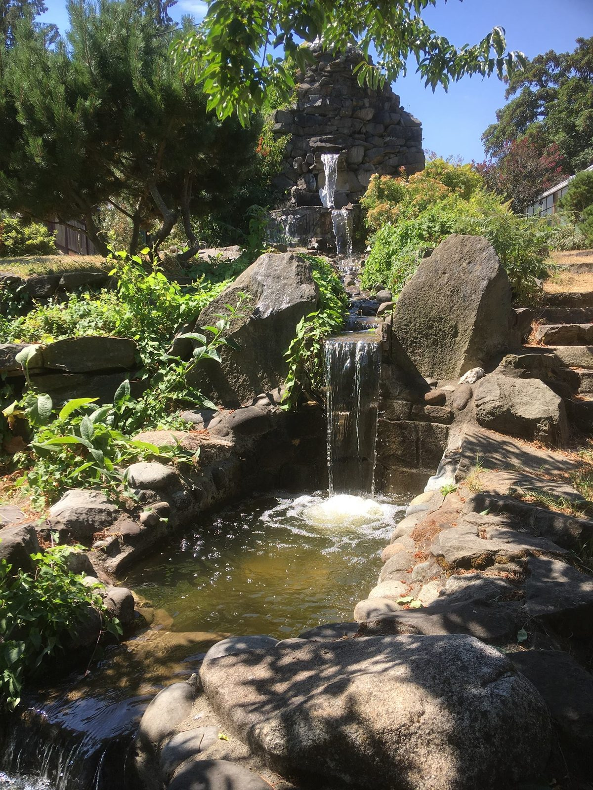](images/d105fe69_Fountain-2018.jpg)
Hello everyone,
Welcome to fall!. Summer was very hot and dry on Salt Spring, and in much of BC (and many other places). Because of the many wildfires, smoky skies set in later in August, making breathing more difficult for many. For once, I welcome the cooler weather of the autumn season. Meanwhile, here are some summer season updates.
A new group of YTT grads are now off to begin teaching yoga classes or deepening their own practice of these profound teachings, following the reminders they heard frequently: Regular Sadhana and Teach to Learn.
[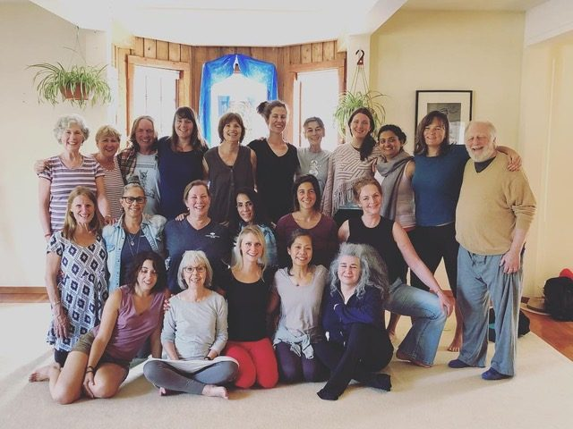](images/d105fe69_YTT-Grads-2018.jpeg) 2018 YTT grads & teachers! (absent in this photo: Satya and Anand)

## The Annual Community Retreat was superb!

There were about 200 adults and lots of kids! In addition to the many yoga classes (asanas, pranayama & meditation, satsang, Yoga Sutra class with Divakar ,Latte Da and Hanuman Olympics, there were some special events. Here are some highlights: Stories of Babaji with a panel of his long-time students - both elders and second generation, Ramayana (as usual, brilliantly pulled together by Anand and Piet in 9 days!), rock crew project - repairing the leaks in the mountain fountain, a Monday morning yajna with Bhavani and Yogeshwar leading it as pujaris.
[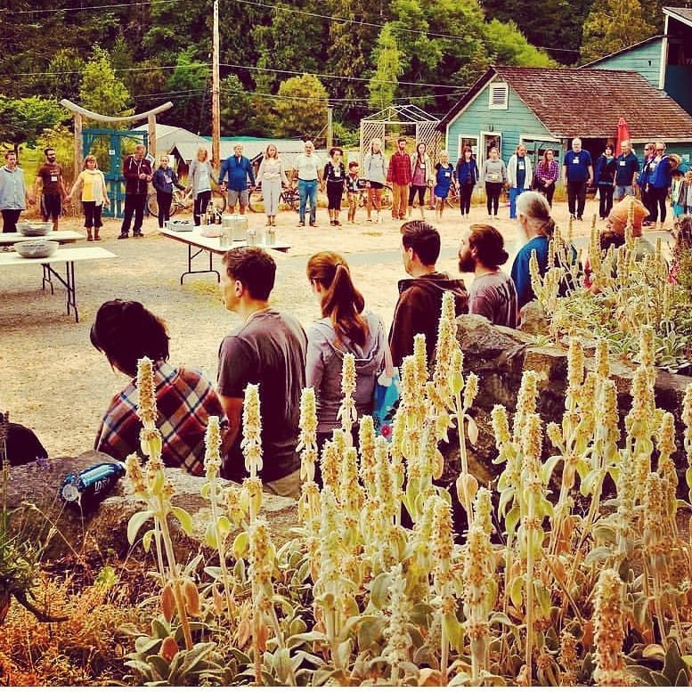](images/d105fe69_acyr-group.jpg) ACYR meal circle
[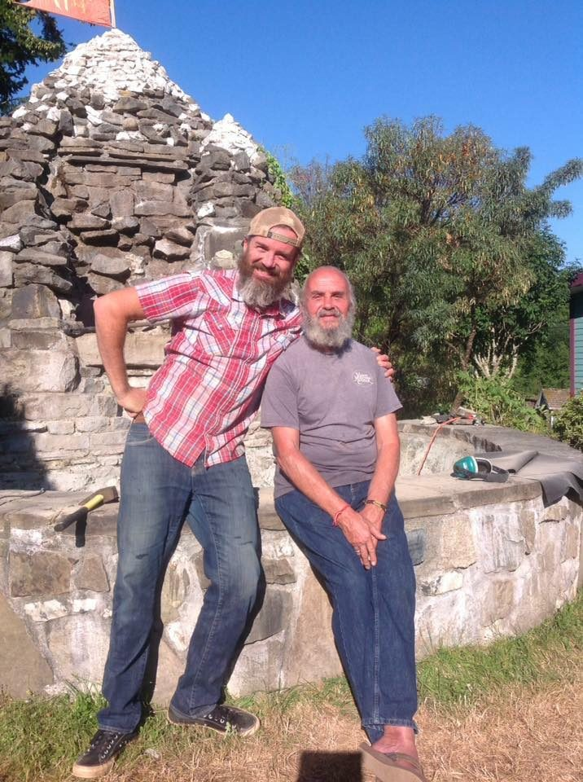](images/d105fe69_ACYR-Jai-Ramsharan.jpg) Jai and his dad, Ramsharan repairing the leak in the fountain during ACYR
[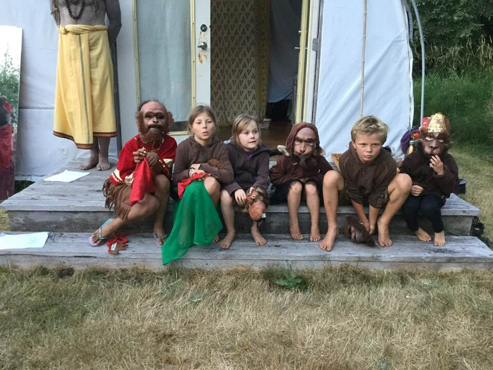](images/d105fe69_Ramayana-little-monkeys-2018.jpg) Little monkeys
[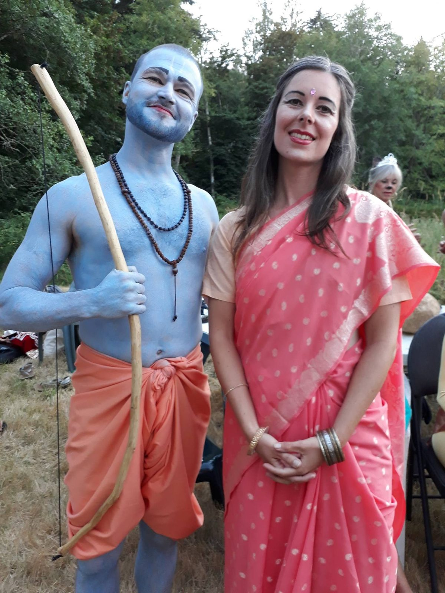](images/d105fe69_Ramayana-Ram-Sita-2018.jpg) Ram & Sita 2018
[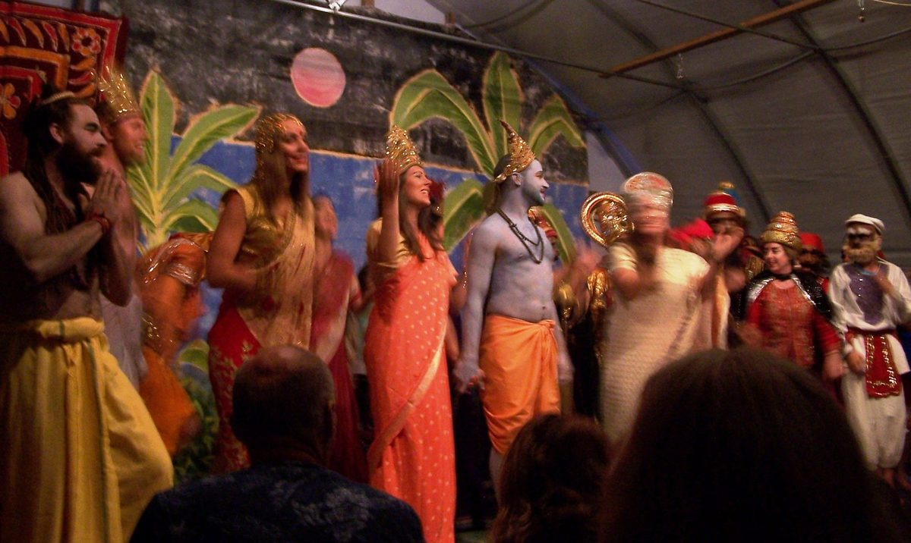](images/d105fe69_Ramayana-final-bow-2018.jpg) Final bow of Ramayana production
[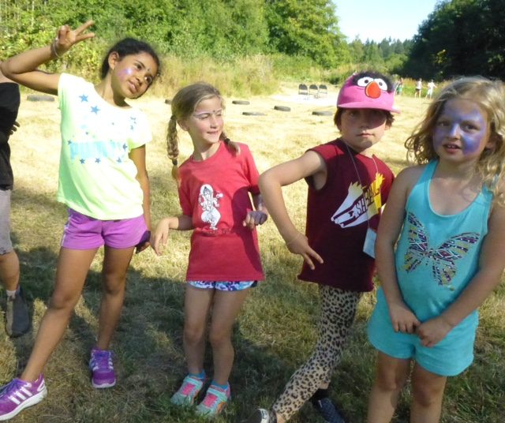](images/d105fe69_kids-at-Hanuman-Olympics.jpg) Kids at Hanuman Olympics

## Goings & Comings

Farewell to some of the wonderful karma yogis without whom we’d have a hard time doing everything we do: cooking, cleaning, doing endless dishes, weeding, doing recycling - and being actors in the Ramayana. Thank you to all of you! A new group of karma yogis has just joined us for the fall season. Welcome!
The farm has been very productive this year.

## Here’s Dan’s farm update:

> [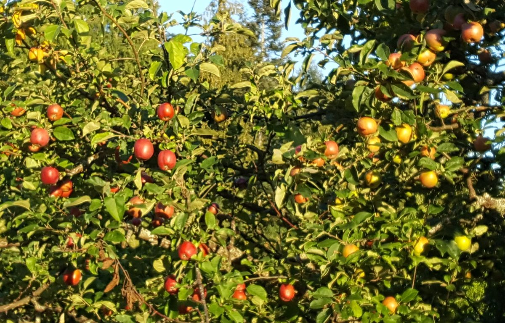](images/d105fe69_Apples-ready-to-harvest.jpg) Apples ready to harvest
> [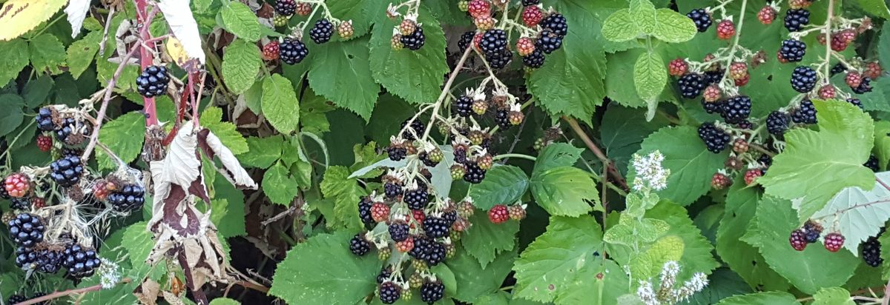](images/d105fe69_Blackberries-everywhere.jpg) Blackberries everywhere
> [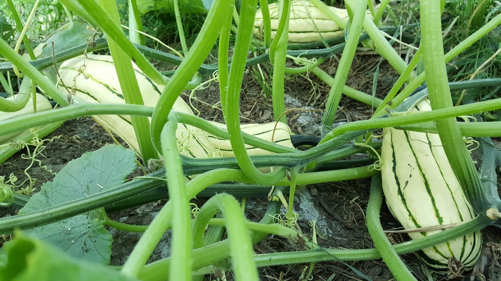](images/d105fe69_Delicata-Squash-ready-to-harvest.jpg) Delicata squash ready to harvest
> The summer keeps rolling along here on the farm, although much of the field work in August has occurred under smoky skies and a blood-red sun as a result of the numerous wildfires burning across the mainland of BC and Vancouver Island. While the reduced sunlight has slowed crop production a little bit at times, we’re continuing to harvest about a dozen cucumbers a day and several pounds of cherry tomatoes for salads and salsas, much to the delight of the yoga teacher trainees at the centre.
> A recent mulch-a-thon in our winter squash fields has started to bear fruit, as we’re beginning to harvest our first few delicate squash of the season and are hoping to see many more in the coming weeks. After weeks of regular harvests of green onions, we’ve just started picking the first leeks from our fields after a characteristically long growing season. The leeks were one of the first crops we seeded back in February.
> And the fruit bounty continues, as the end of our productive blueberry season seamlessly morphed into blackberry season, and the farm team has been bearing the telltale cuts and scrapes of treading through the brambles. By month’s end, we may also be gathering our bushels to harvest apples from our orchard. And it’s looking like a bumper crop this year, so it looks like the SSCY Preservation Society will soon re-emerge.
> In gratitude,
> Daniel Naccarato

## Programs continue through the fall

Coming up: [Yoga Getaways](https://saltspringcentre.com/programs-retreats/yoga-getaways/) in September, October and November, and a [Jnana Yoga workshop](https://saltspringcentre.com/jnana-yoga/) with Alan Shankar Martin and Cathy Arpana Valentine on the weekend of September 7-9.
Of course all our usual offerings continue: Wednesday evening kirtan , Sunday afternoon Yoga Sutra study at 2 pm, followed by satsang at 3:30. There are also regular pujas and yajnas - check the [calendar on the website](https://saltspringcentre.com/calendar/).

## Centre School ready for action

As things quiet down a bit at the Centre, the [Salt Spring Centre School](http://saltspringcentreschool.ca/) moves into action. The first day of school is Tuesday, September 4. The kids are always happy to see their friends again, and the kindergarten kids are excited to come to the Centre School for the first time. For those of us who live at the Centre, it’s such a delight to hear the sound of kids playing outside again. The school year is beginning with an enrolment of 47 students in 4 classes. The school will host a welcome back vegetarian potluck on Friday, Sept. 7. On the morning of Monday, Sept. 10, I will lead what has become a traditional school celebration of Rosh Hashanah, the Jewish New Year, with all the children.

## To read…

Devendra Hayes has been part of our satsang family for many years, and both his kids went to the Centre School quite a few years ago. Devendra’s search for meaning began when he was in high school. He says, “ I was always a seeker, but I didn’t have a clue what I was looking for.” It took a while -as it it often does - but once he met Babaji he was smitten: “I fell madly in love with him and have been ever since.” Although he lives in the Kootenays in a little place called Winlaw, his life has been intertwined with life at the Salt Spring Centre of Yoga since the 80’s. He says that when he began this yoga journey in 1981, he’d never have predicted he’d still be doing it all these years later. I’m sure you’ll enjoy reading Devendra’s story - **[A Bit of my Journey](https://saltspringcentre.com/devendra-hayes-a-bit-of-my-journey/).**
We all have moments when fear stops us in our tracks and keeps us from moving forward. Pratibha, a student for Babaji’s for decades, a teacher of yoga and ayurveda, and a wise elder in our community, says that over the years she’s learned to invite fear into the conversation. Her poem, “[**Walking with Fear**](https://saltspringcentre.com/walking-with-fear/)”, can guide us in our own journey of facing and overcoming our own fears.
Every year, for all the years we’ve been holding summer yoga retreats, we have run a program for kids. Some of those kids have been coming back with their parents year after year, and I thought it was time to interview some of them. It is my pleasure to introduce you to Sierra, Noah, Jack and Diego. **[Who are these kids?](https://saltspringcentre.com/who-are-these-kids/)** Read their comments and you will see that we can learn a lot from them about finding our place in community, belonging, contributing, and having fun.
Babaji’s wisdom has inspired and guided the Salt Spring Centre of Yoga, Mount Madonna Center, Sri Ram Ashram, and more. We have had the good fortune over the years to study and practice what he’s taught us. Please read **[From the Chalkboard of Baba Hari Dass](https://saltspringcentre.com/from-the-chalkboard-of-baba-hari-dass-2/)**, questions and answers from a class at a yoga retreat with Babaji a couple of decades ago.
*If you have love inside, it will spread everywhere. Love can't be made and shown if there is no love inside our heart. If there is love inside us we don't need to show it. It will reflect by itself around us and will light the hearts of others. What we have to do: not to hate anyone.**~ Baba Hari Dass*
Love,
Sharada
