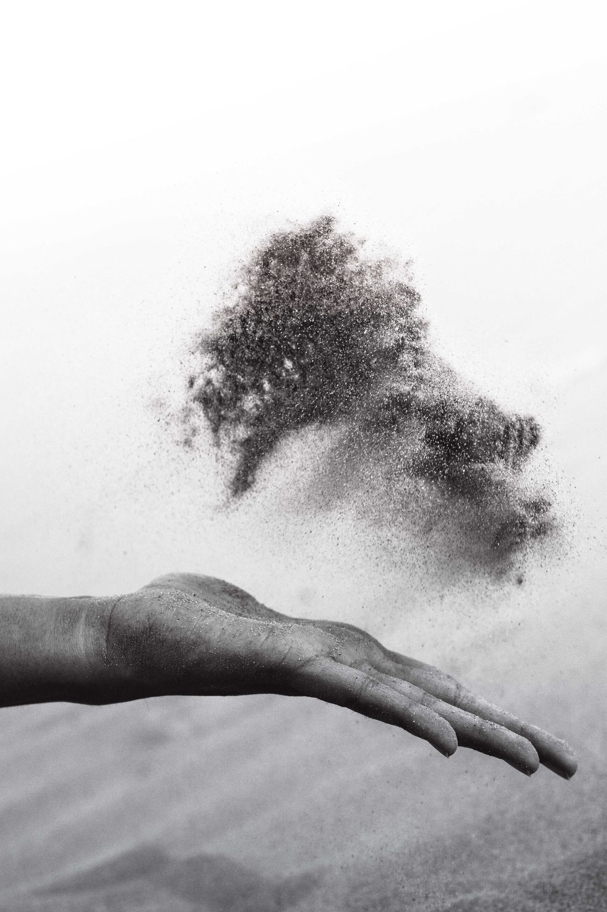

When Babaji was asked a question about fear ("Babaji, I want to go back to school, but I’m afraid I don’t have enough money," or “Babaji, I want to go to India with you, but I'm afraid of flying”), he would often reply with three little words: “Face, Fight, Finish!” Face your fear, fight with it, and finish it. Fear holds us back so much from moving forward, both on the spiritual path and in our life in the world. And in order to manifest our dharma (as well as to manifest our hidden talents), it’s important to keep moving forward.
In my own struggle with fear (fear of not being good enough, fear of feeling ridiculous, fear of rejection), I often held myself back from participating in life. And as the years passed, and the fears came to be seen as hindrances on the yogic path, I pondered how to fight with them. Having grown up with an aversion to fighting, and understanding the yogic maxim ‘ahimsa,’ (do no harm), it wasn’t quite clear how to approach the battle! And so, I invited fear into a conversation, and the following poem emerged:

## Walking with Fear

The way is dim and dusky,
Uncertain and confusing.
I feel you beside me, keeping pace,
A dense, dark, invisible presence,
On the right side,
As well as deep inside, below the sternum
Trapped tightly within the cells.
The sensation starts in the gut,
Right in the center,
Just below the sternum.
Cold and dull and hard,
A hard little knot pulsing with life force.
And then a spreading out feeling,
like the strong delicate strands of a spider web.

## Dialogue

“So, let’s talk,” I begin. “What’s up? What are you doing here?
“I’m everywhere. Why not here?”
“I didn’t ask you here. I didn’t invite you to walk with me.”
“I’m everywhere. Why not here?”
“I don’t want you here.”
“It’s not your choice.”
And fear continues, “I’m not separate from you actually.”
“Maybe not, but I still don’t want you here.
You make me feel uncomfortable, insecure, afraid.”
“Afraid of fear?”
“Well, duh!”
“The truth is I’m here to protect you.”
“From?”
“From yourself. From making wrong choices.
From going astray. From hurting yourself.”

## The Worst of It

“What’s the worst of it?” you ask.
“The worst of it is the sense of impending change,
and the knowledge that I won’t be in control,
and anything could happen if I’m not in control.
And anything probably means something painful,
something wrenching,
something cold, hard, and rejecting.
Yes, that’s the worst of it . . .
Cold, hard, rejecting
with no control.”
And fear replies . . .
“Can you sense that I’m here to protect you?
That I’m looking out of you,
That your safety and survival are what I’m here to ensure.
You have every right to your human life here . . .
You have been born into this body, with a mind and senses.
But do you have enough wisdom
to know what’s best for you?
So I watch out; I keep my eyes open all the time;
I watch and observe even as you sleep,
Making sure you are safe.”
“But still,” I wonder,
“Why is your presence so uncomfortable?”
“To get your attention.
To make sure you notice.
Sometimes the sweetness of life goes by
Unappreciated, unnoticed even,
Accepted without thinking.
Fear makes you alert, aware, awake.”

## Walking with Acceptance

Later, when I see you again, our dialogue continues.
“So, here you are again! Wanna come along?” I ask of fear.
“Maybe . . . Where are you going?”
“To do something scary!”
“Are you inviting me to come along?” fear wonders.
“Sure! Why not? I’m gonna do it anyway, whether or not you’re here!!”

## Companion

And so . . . we walk together now,
Fear and I,
Resting in the companionable knowing
That says, it’s okay for you to be here.
A sense of acceptance, no resistance.
Yes, fear is there, just like love,
Just like jealousy, just like joy!
The fear is here to wake me up
From the complacency, the boredom,
From the sleep of the dead.
And I welcome your presence beside me . . .
Moving forward together into each ever new moment.

###### ***Seabright bungalow &*** ***Salt Spring Island*** ***Summer 2012***

---

 Pratibha Queen
**Pratibha Queen** is an Ashtanga Yoga instructor and Ayurvedic practitioner who lives in Santa Cruz. She is a member of DSS who attends Salt Spring Centre of Yoga retreats on a regular basis.
Top hand photo by [Kunj Parekh](https://unsplash.com/photos/3s3JPEXRzUg?utm_source=unsplash&utm_medium=referral&utm_content=creditCopyText) on [Unsplash](https://unsplash.com/search/photos/fear?utm_source=unsplash&utm_medium=referral&utm_content=creditCopyText)
