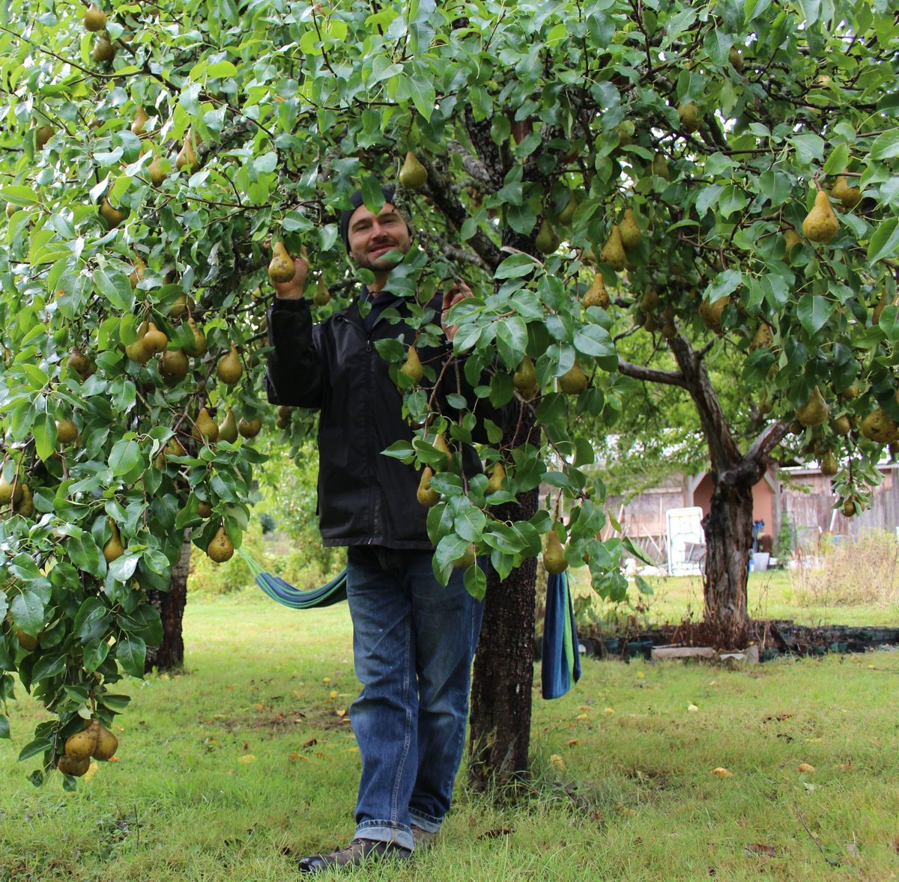
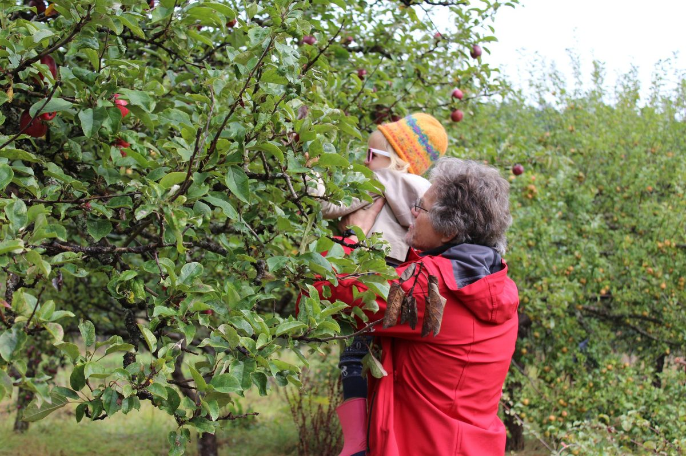
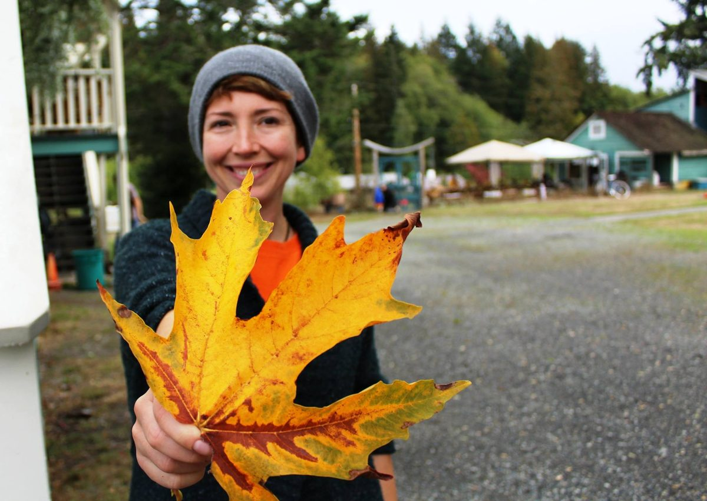
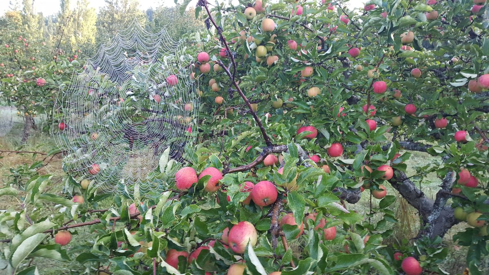
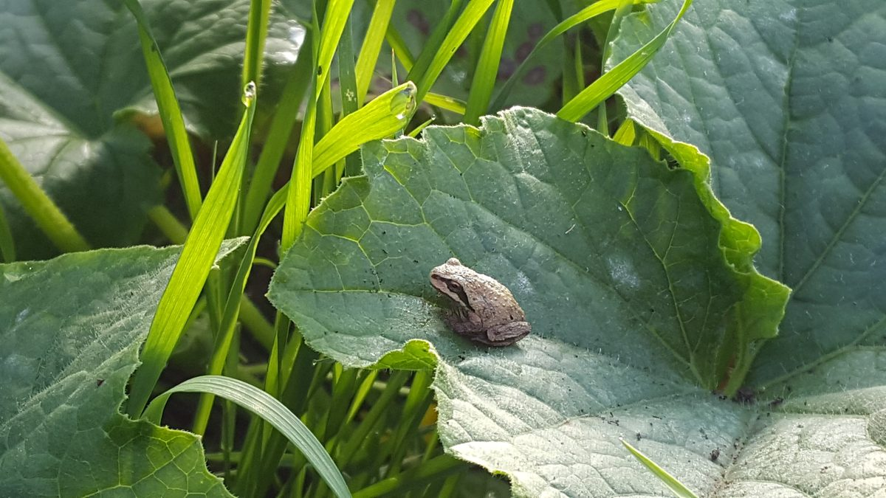
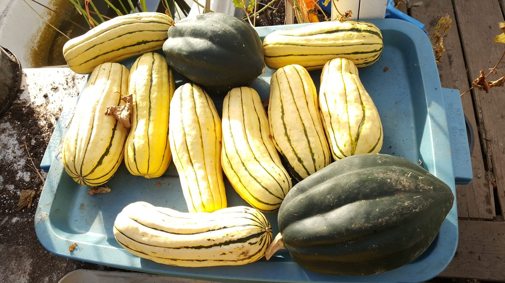
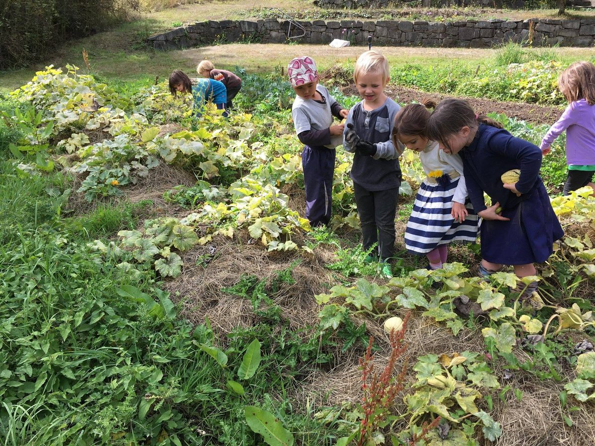
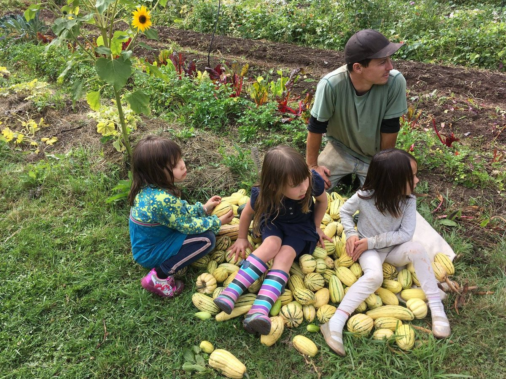

#### Baba Hari Dass (1923-2018)

Please visit our [website home page](https://saltspringcentre.com/) for more information.

---

*Faith, devotion and right thinking are the foundation of spirituality. Contentment, compassion and tolerance are the walls. When you have built this room for yourself you are safe and in peace...God is already with you.*
Hello everyone,
Harvest time, thanksgiving time! Gratitude is the theme of this month’s newsletter. Here are some photos of the Fall Fest we held on the farm.
[caption id="attachment\_17633" align="aligncenter" width="600"] Adam picking pears[/caption]
[caption id="attachment\_17632" align="aligncenter" width="600"] Om PK helping Honey pick apples[/caption]
[caption id="attachment\_17631" align="aligncenter" width="600"] Courtenay[/caption]
**Along the same theme, here’s Dan’s farm update:**
> Autumn is definitely in the air at the yoga centre these days. Rain is falling again, days are getting painfully shorter, and the harvest moon is peering above the forest as I write this update.
> [caption id="attachment\_17638" align="aligncenter" width="600"] Tree laden with dozens of apples and one spider web[/caption]
> Nevertheless, it provided a great opportunity to bring the satsang together for the centre’s fall festival in mid-September, where community members past and present carved pumpkins, made apple sauce, and harvested a few hundred pounds of apples and pears from our orchard, many of which have been sold at our farm stand, Earth Candy, and to our yoga getaway guests.
> [caption id="attachment\_17637" align="aligncenter" width="600"] Tree frog dwarfed by one of our cucumber plants[/caption]
> Apple and pear harvesting and preserving will continue into at least the first half of October, and although the cool and wet weather is slowing the growth of some of our crops, others such as tomatoes, zucchini, carrots, kale, leeks and salad greens are still going strong.
> [caption id="attachment\_17635" align="aligncenter" width="600"] Our first harvest of Delicata and Acorn Squash curing in the glass house[/caption]
> On a personal note, this will be my last update of 2018, as I’ll be heading back to Ontario to celebrate Thanksgiving with friends and family, travel around the eastern part of the country to see the fall colours, and to recharge from a great farming season. It has been such a joy to contribute to and share so many wonderful meals with the members of this community over the past several months.
> In gratitude,
> Daniel

The Salt Spring Centre School kids have also been doing some harvesting from their garden in preparation for their annual Fall Fair.
[caption id="attachment\_17639" align="aligncenter" width="600"] School kids harvesting squash[/caption]
[caption id="attachment\_17640" align="aligncenter" width="600"] School kids and Milo with their squash harvest[/caption]
We have a wonderful group of karma yogis at the Centre, contributing in every area. The abundant harvest from the orchard is being dehydrated for snacking, turned into apple and pear sauce, made into delicious crumbles and other goodies. The walnuts are just about ready for harvesting as well. We welcome volunteers to help, particularly for program weekends in October and November - mainly in the kitchen and housekeeping - so keep it in mind, and [contact the office](https://saltspringcentre.com/contact/) if you’d like to help.
Wednesday evening kirtan and Sunday satsang continue, as does our weekly Yoga Sutra study, and monthly full moon yajnas. [Check the calendar](https://saltspringcentre.com/calendar/) on the website for details. For those in Victoria or Vancouver, satsang is held there as well.

# For your reading enjoyment

Racquel Marshall, part of the Centre’s administration team, had the opportunity this past summer to take part in YTT, and she was inspired to write about her experience. I hope it will inspire you, too.  I invite you to read [Tapestry](https://saltspringcentre.com/tapestry/).
This month we introduce you to another member of Our Centre Community. Maheshwar Robillard, our sweet and funny satsang brother from Montreal, who has been part of our satsang family for many years, shares the story of his search for truth that led him to many places, and finally to Babaji: [Seeking the Path](https://saltspringcentre.com/seeking-the-path/).
This life is full of ups and downs.The search for happiness and peace isn’t always a straight line, or as Babaji says, “The path to enlightenment is not a highway.” It helps to look through life through the lens of gratitude. [What are you thankful for?](https://saltspringcentre.com/what-are-you-thankful-for/)
“If the only  prayer you say in your life is thank you, that would suffice. ~ Master Eckhart
*Do your sadhana every day and be happy.* ~ Babaji
With gratitude to Babaji,
Love,
Sharada
