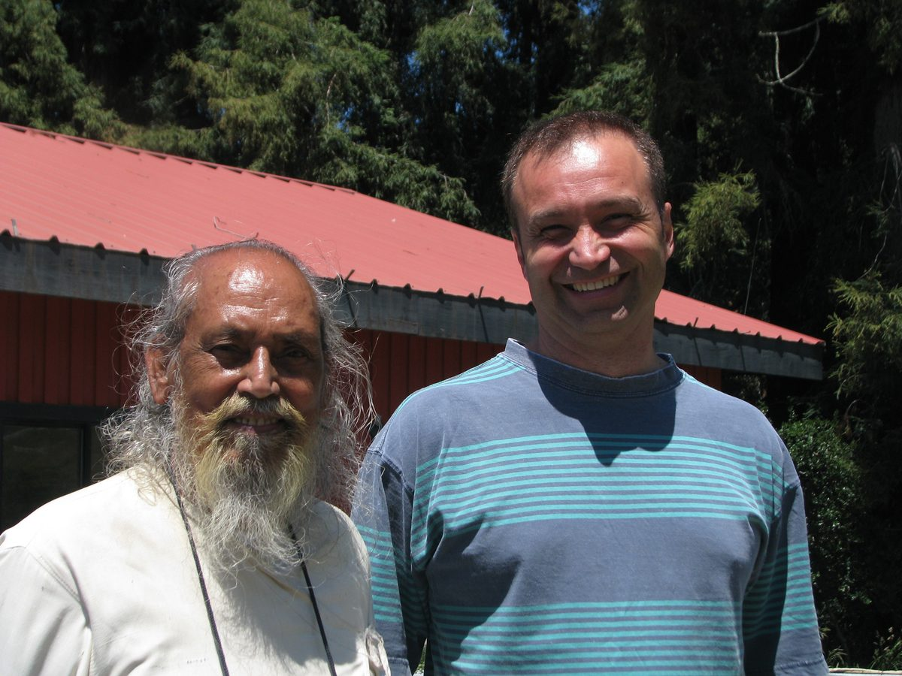
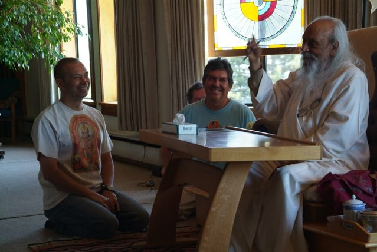
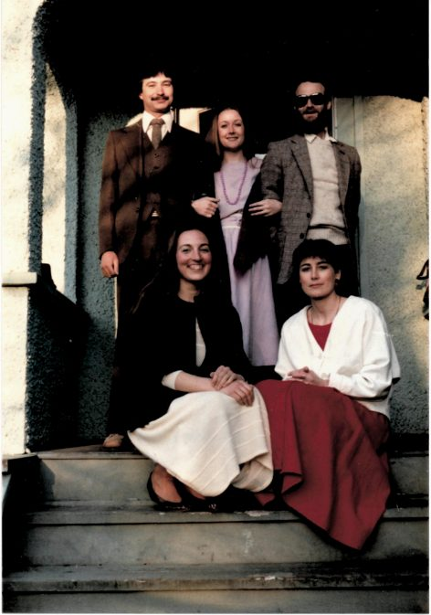
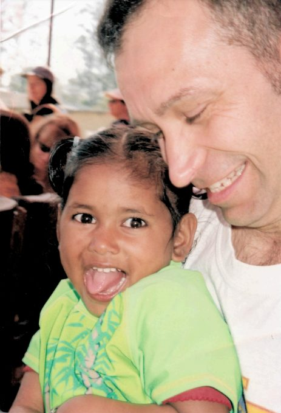
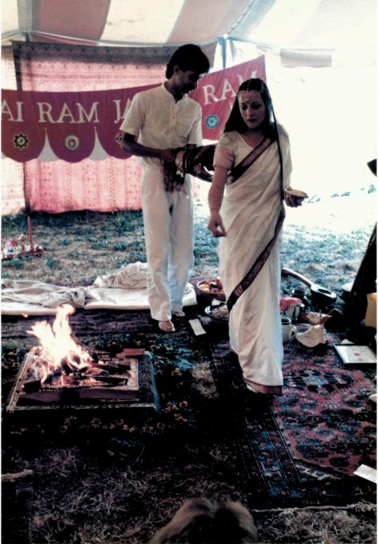
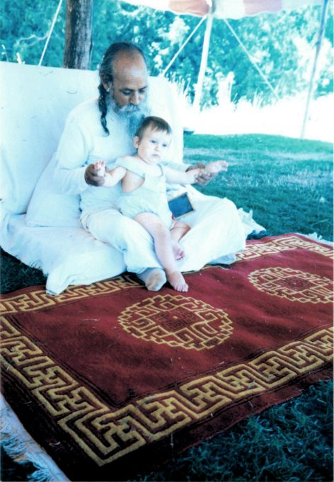

by Maheshwar Robillard
 Walking around MMC, 2010
I was asked to share my story, but I realize I have room here to share only a glimpse of it.  I can start by saying that I have always been  a seeker, in search of truth far bigger than the eye can see. I grew up in Montreal and was raised Catholic but I wasn’t into it; the rules and dogma did not seem to make sense to me. Being dissatisfied I started to look for what could resonate with me.  My first desire and opportunity to meet a guru was when I was 15; there was a gathering in Montreal with an Indian guru*,*but it was a school night and my parents wouldn’t let me go.
At 18 I started the practice of TM (transcendental meditation).  After a while the basic technique felt a bit limited to me, and to learn more was costly.  The idea of a high priced spiritual practice did not feel right to me. When I was 21 I decided go down the west coast and check out different paths, staying open to what I would see and trying to stay away from premade judgment. So I started from Vancouver and checked out different groups or centers like the Hare Krishna, a Christian monastery, Rajneesh (Osho), etc, but none of those paths resonated with me.
On my way down the coast I found myself in Bellingham, WA, where there was a Christian priest who taught yoga; he was a bit odd but knowledgeable.  I stayed with him for a few days and one morning I woke up remembering that during the night I had seen a bright white light coming through my window and falling on me in my bed.  I thought it was too bright to be the moon and was not sure if I had dreamt it or if it had really happened. I went for breakfast with the priest, and shared with him what happened and he told me I had a vision that meant I would meet my guru soon, but I didn’t take him seriously. On that same day one of his students arrived and said he had just come from Santa Cruz and had stayed in a center on a mountain where there was a silent monk. I thought okay, I’ll put that on my list of places to visit, and then left for a Christian monastery around Portland.
 Joking around with Babaji and AJ 2013
After that monastery I started hitchhiking for the next address on my list. I ended up waiting a very long time; no one would stop. After a long wait a guy finally stopped. He was driving straight to Santa Cruz. Even though I had been planning to make other stops along the way, my gut (or inner voice) was telling me to just go, so I did.
We got into Santa Cruz the next evening. It was dark, and the driver dropped me in the mall. Now, how was I going to find a silent monk on a mountain?  I did not know the name of the center, so I decided to ask people on the street. The first guy I stopped I asked if he’d ever heard of a silent monk in the surrounding mountains. He said, “Yes, he’s my guru. I’m going there tomorrow, you can come. Stay with me tonight and I’ll take you there tomorrow.” It turned out this man was Amar Dass, who was living in a satsang house with others. I stayed there overnight and was awakened early in the morning by the sound of a small bell. It was Amar Dass doing arati which I knew nothing about. I watched him and then we left for the Saturday morning class. When we arrived at the land, I walked into the main room and that’s when I first saw Babaji. I was in awe, as he looked totally luminous to me, like a big, bright white light.
Babaji asked me a few questions, as he did with all newcomers. After class I had a talk with the person in charge of newcomers and asked him if I could stay for a few days. He said no because they were preparing for a one month intensive YTT course that was going to begin the next day and they needed all available housing. I asked him for more information about YTT, and then said, “I’ll take it!”  He said no. I asked why not, and he told me people prepare for months or even years to be ready for YTT - but I insisted, and I did end up doing it.  I always remember it was 1980 because it was during the period of that course that I found out that John Lennon got shot. At that course I met Girija and Ramanand who were also doing YTT, and they told me about the Vancouver Satsang.
The teachings on yoga philosophy totally resonated with me.  I felt as if I had found my soul mate, not in a person, but in a path.  By the end of the YTT program I felt I did not need to go anywhere else, I had found what I was looking for. Then it came to me that when I first met Babaji, the luminous white light emanating from him was the same kind of white as I saw at the Christian priest’s house. From then on I never had doubt about my path, not just because of the light incident, but more how the teachings touched me
Babaji was always kind, playful and had a great sense of humour. While I was at MMC I asked him if I should become a monk, and he started laughing. He said I was a lot closer to being a monkey – and added that I even looked like one as I had long hair and beard.
 Last day on Laurel St around 1984
After three months at MMC I moved to Vancouver and started going to satsang regularly. One day Kalpana and AD approached me, saying they wanted to start a satsang house on Laurel Street.  I moved in and stayed in the basement suite with Vidyasagar.
For money I went tree planting with Chakrapani.  I think half of our crew were satsang members at that time, with Rajani as our cook. The crew included Girija, Ramanand, Madhav, Om PK, Henri, Prabhakar and others. For me it was great; I could do my sadhana in the tent before work, rain, shine or snow.
At age 24 I went on a 4 month trip to Asia, stopping in lots of places along the way before spending two and a half months in India where I went on a pilgrimage, moving from ashram to ashram. Towards the end of my trip I arrived in Haridwar at Arya Nivas where Babaji was staying. People would sometimes sit in his room with him. On one occasion I mentioned to someone that I wanted to buy a drum. After a while we all left Babaji’s room and I went out of the building. A few moments later, Babaji walked out by himself, came towards me and wrote on his chalkboard “you want to by a drum?: to which I replied yes. He then started walking away and at about 100 feet, turned toward me and made a sign or me to follow! We went to the market, tried some drums, and I bought one! I am not into shopping but that was the most enjoyable shopping moment I ever experienced!
 With Arpita at Sri Ram Ashram in 2005
When I returned to Canada I went back living at the Laurel St. house with Kalpana and AD. I was on the DS Board and was going regularly to the land for kama yoga points, and went to satsang on Sundays. One Sunday I met in the satsang room a woman that I thought was cute…. and the monkey had a marriage yajna a couple of years later on the centre’s mound.
 Yajna with Shraddha, 1987
Now I had to support my family, so I became a Biomedical technologist, taking care of hospital equipment.  There were not many jobs in that field in BC at that time, and by then my son had been born, so we decided to move to Montreal where there were many job opportunities. The move was supposed to be for 3-5 years, giving my son time to learn some French and get to know his grandparents and then move back to BC – but due to circumstances, I’m still there.
 Babaji with Jonathan in 1990
I have been doing my family duties in Montreal but have spent most of my holidays going to wherever Babaji was and just enjoyed being with him, whether at MMC, SSCY, Toronto retreats, or India. The times I spent with him were the most blissful and sacred moments in my life. I feel so privileged, so blessed to have had the opportunity to have such a quality guide in my life and to be part of such a beautiful tribe and satsang! Every time I hear that song called “The magic Man” by the group, “Heart”, it always makes me think of Babaji as I have seen so much magic around him over the years. About 10 years ago I was sitting with him at his home and asked him why he had been so kind and generous to me: had I extorted a promises from him in a past life that he would be there for me in the next one? He looked at me seriously and wrote down, “Yes, and you keep coming back, and back, and back…” I just laughed. It is probably true for most of us!   We are all so blessed!!!   May we all keep company with each other on the path, may we keep supporting each other until we reach… the infinite!
Jai Gurudev!!! Jai Babaji!!!
