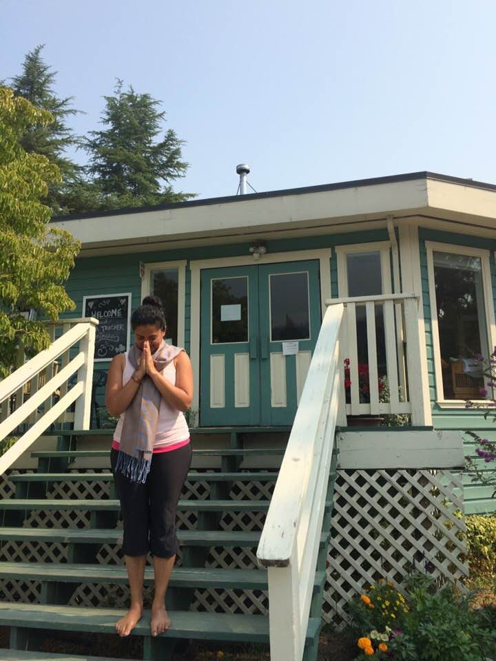

Life certainly has a way of taking you on a journey you least expect. Of all the "who would have thunk its" in my life I didn't ever think I'd train to teach anything much less train to be a yoga teacher. But, it's happening, happened and I'm loving every minute of this experience.
To my joy and amazement, I soon discovered that I was not presented with a text book, expected to know it cover to cover and write an exam at the end of it all. Nightmares from my school years in India.
Instead, I have been woven into a curriculum that is a tapestry of love for a guru - Baba Hari Dass, his teachings intelligently feeding into and overlapping the principles of Classical Ashtanga Yoga that manifest in the form of demonstrations, lectures, workshops, asana clinics, discussions and presentations. Seeds of wisdom to enhance personal and spiritual practices sprinkled like delicate flowers during meditation and asana classes, manifesting in the form of passages from sacred texts or books, learning the graceful art of hand mudras or singing a melodic kirtan.
The layers of this learning experience are gradually peeled back by the teachers with care, compassion, enthusiasm, fun, passion, grace, humour and love. Together they create a container from which this tapestry unfurls to embrace the student in its blended yet separate methods of stimulated 'teach to learn'.
What would the tapestry of my journey look like had these alchemists been transplanted into aspects of the formative years of my early life? Nothing short of magical, I think.
Today, I am proud to say that I am a certified Yoga Teacher. A rookie in this vast realm of ancient teachings and by no means ready yet to formally teach a public yoga class. I have a long journey ahead and much, much to learn, but excited for what is to come. The anxiety and stress leading up to the week of practicum exams are a distant memory. Washed away by the constant support and nourishment of the teachers, elders, centre staff and Karma Yogis that creates the container that is the Salt Spring Centre of Yoga. The richness of this experience will forever be imprinted in my memory. Friendship, laughter and tears made for strong bonds with my peers as we ploughed through our fears and cheered each other on and shared in our victories.
OM
Racquel
