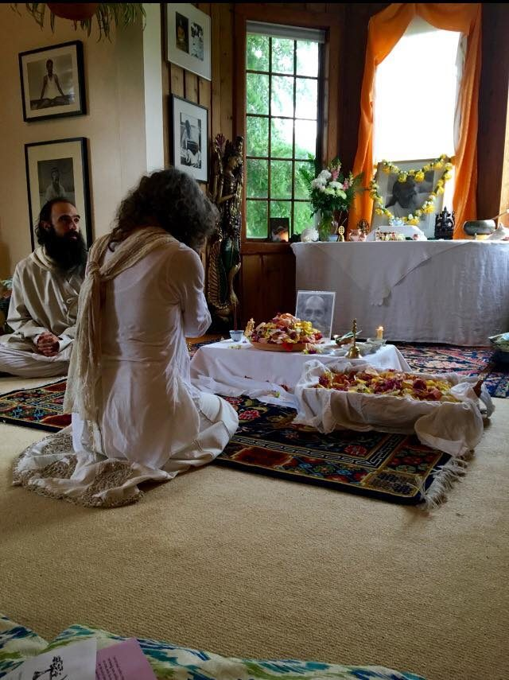
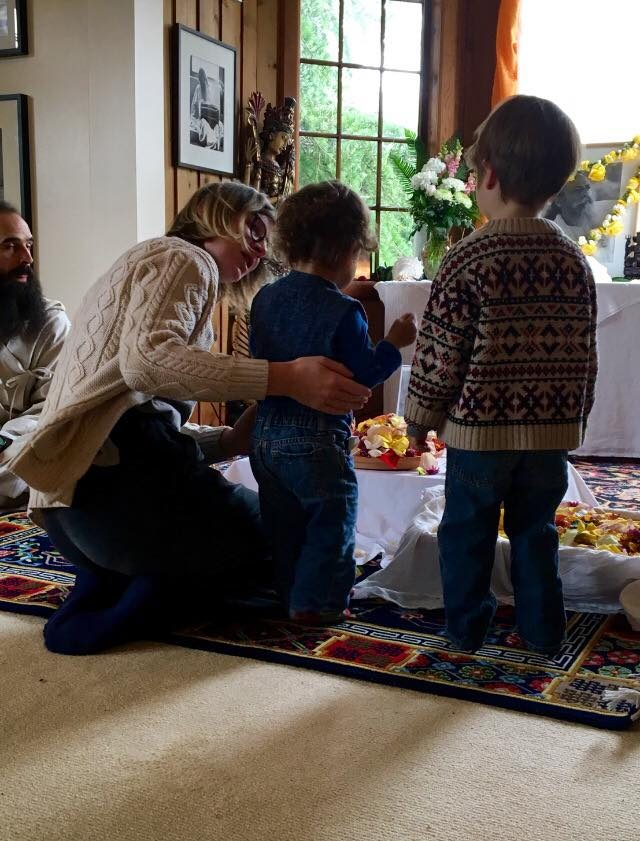
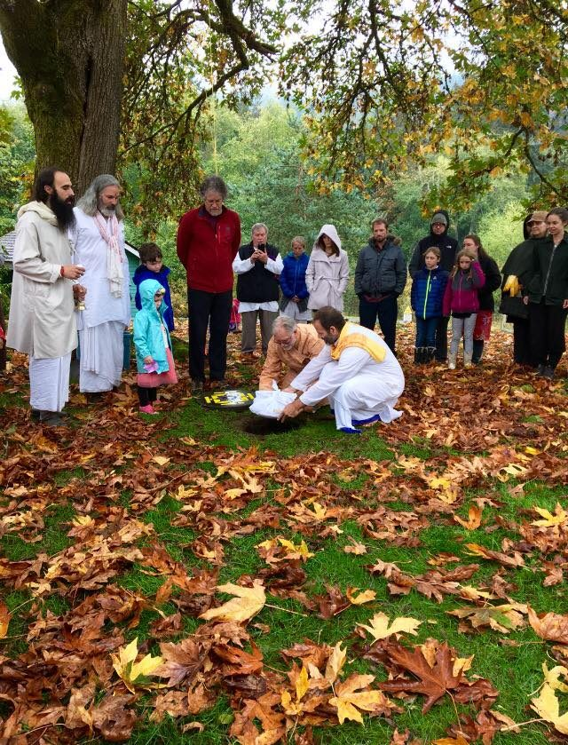
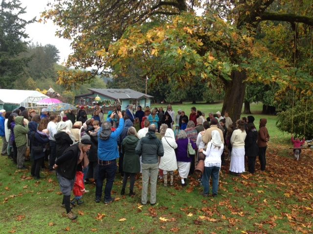
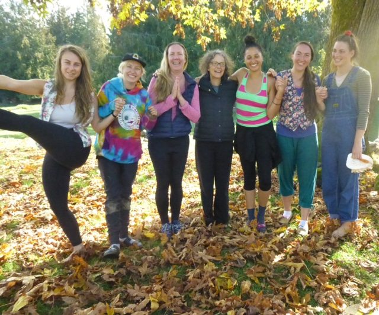

#### When the outer guru’s teachings and the inner guru’s silent whisper appear the same, then the seeker’s faith gets fixed without any doubts. ~ Baba Hari Dass

 
Hello everyone,
This has been a tender time for our community. Many people gathered to honour Babaji during the period of rituals following his passing on September 25. The śhrāddha on October 7 brought many people together, some of whom we haven’t seen for years, and in some cases, decades. There were tears and many hugs, but above all, a strong sense of unity and common aim. Babaji’s physical body is no longer present, but his spirit and teachings, which have touched thousands of lives, remain strong. May we continue to honour Babaji through our sadhana and through our love for each other.
Some people will be travelling to India for further celebrations of Babaji’s life at Sri Ram Ashram, and the releasing of his ashes into the Ganges on November 19.

 

## Gratitude

We are grateful for our pujaris - Yogeshwar, Ramanand, Jagganath, and Raven - for leading us through all the rituals to honour Babaji. Yogeshwar has also been serving as the Centre’s Operations Manager for the past year. He and his wife, Rebecca, will be moving off the land this month. Though he is stepping down from his role in the office, he will continue to serve as pujari and teacher.
We continue to sing together during Sunday afternoon satsang and Wednesday evening kirtan. Yogasutra study continues as well, although there will be a hiatus during most of November.

## Celebrating the Light

We will be holding a celebration of **Diwali** in the yurt on the evening of Tuesday, November 6. Diwali is a festival of light, signifying the victory of the forces of light over the forces of darkness. The celebration will include the story of Ram and Sita’s return from exile, greeted upon their return by hundreds of lights to mark their way home. We will make and sail little paper boats with tea lights in them, and sing joyous songs. Please join us if you can.
Another **Celebration of Light**, an annual gathering led by Usha, will take place at the Centre on November 27 at 6:00. If you plan to come, please aim to get here early; the whole thing takes only an hour. During that hour, all the children in the Salt Spring Centre School (plus siblings and former Centre School students) walk, one by one, through a spiral of cedar boughs sprinkled with stars, while carrying an apple with a candle in it. Each child lights a candle and places it on a tray on their walk back through the spiral, while the entire community sings songs of light from a variety of traditions. It’s always an uplifting experience.

## Memorial for a Satsang Brother

One of our satsang brothers, **Will Pegg**, passed away recently. If you are in Victoria and would like to attend his memorial service, here are the details: Saturday, November 10 at 2:00 pm at the Knox Presbyterian Church, 2964 Richmond Road.

## Volunteer support

[caption id="attachment\_17800" align="aligncenter" width="640"] Grateful for our karma yogis[/caption]
November is the last month of our 2018 program season. Our residential community has begun its annual winter shrinking, and we welcome volunteer support, particularly in the kitchen and housekeeping, during program times. Please contact the office if you are interested and available.

## To read….

All of us who spent time with Babaji over the years have stories about him, about our relationship with him. Yet, there are many people who have never met Babaji in person. Yogeshwar Humphrey, in [Reflections on the Guru](https://saltspringcentre.com/reflections-on-the-guru/) asks, “As life goes on, and we acknowledge the finality of Babaji no longer being here in his physical form, the question becomes not just ‘who was Babaji?’ but also ‘who is Babaji now?’ How does a relationship with a teacher like Babaji continue, for those who knew him? Or, how does a relationship even begin, for those who may never have met him in person?” Yogeshwar examines this question through the lens of Patañjali’s Yogasūtra. I invite you to delve into this fascinating inquiry.
I asked two participants in the recent fall session of the Residential Karma Yoga, Sukie and Courtney, the following question: During your time at the centre, what did you learn about yoga, about community, and about yourself? Their responses were deeply reflective and wise. I trust you will be inspired by them: [An Invitation to Stillness](https://saltspringcentre.com/an-invitation-to-stillness/) by Sukie Jefferson and [Support on the Journey](https://saltspringcentre.com/support-on-the-journey/) by Courtney Christensen.

#### The spiritual path doesn’t need any label. One who is developing positive qualities, one who is serving others with no selfish motive, one who loves God’s creation is a spiritual person. ~ Baba Hari Dass

 
Love,
Sharada
