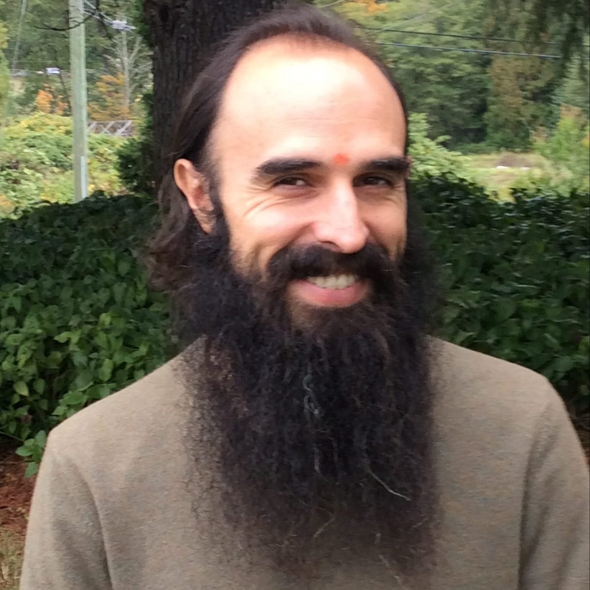

#### By Yogeshwar Humphrey

Over the past month or so, my thoughts have turned repeatedly to Babaji and to the idea of the guru. Following his passing, it felt like a tremendous wave of energy and emotion passed through me and many others here at the Centre. The tarpaṇam and śhrāddha rituals, along with other events here at the Centre, provided a powerful container for students and devotees of Babaji to gather, grieve, reflect, give thanks, and take comfort in one another’s presence.
As I listened to story after story of Babaji’s profound teachings and unwavering compassion, a sense of awe and wonder arose in me, and it distilled into a question: Who was that being whom we call Babaji? There may be as many answers to that question as there are people who’ve known him, or even known of him. The last few weeks have provided an opportunity to engage and celebrate this question, and to reflect on the profound ways that his presence has impacted our lives. It’s a question that will probably receive new answers again and again as cause and effect continue to play out in our lives, and I think it’s a question with which we need not hurry to find closure.
Indeed, one of the beautiful, yet unexpected gifts of the tarpaṇam and śhrāddha rituals, which Babaji instructed us to perform after his passing, is that these rituals go on for a while - 13 days after the departed’s death, to be precise. Implied in these 13 days is that this kind of loss takes time to be grieved and integrated, that a human life needs time to be fully remembered, and that we need not be in a hurry to turn from the charged mystery of loss to the self-assured rhythms of our so-called normal lives.
And yet, those 13 days have passed, and then some. As life goes on, and we acknowledge the finality of Babaji no longer being here in his physical form, the question becomes not just ‘who was Babaji?’ but also ‘who is Babaji now?’ How does a relationship with a teacher like Babaji continue, for those who knew him? Or, how does a relationship even begin, for those who may never have met him in person?
The obvious answer is that now this relationship must come through memories of Babaji, or stories told about him, through the writings he left and the temples he built, even through films and photos. Looked at with an everyday, worldly kind of mind, this answer is understandable, but maybe not so satisfying. Somehow, it just doesn’t seem the same. Memories, words on a page, or pictures on the wall are essentially different from being in the presence of a living, breathing human being.
This is undeniable, on one level. However, viewed with the mind of meditation, these memories, words, and images become much more compelling and interesting. To understand how this might be so requires a little detour through Patañjali’s Yogasūtra. According to some of the main lines of thought in the Yogasūtra, part of the yogi’s journey as a practitioner involves catching the mind in the act of creating the world as we normally know it, including ourselves and others as separate, individual egos within it. As the Yogasūtra explains, when we really watch our experience with a quiet, steady mind, we see that those things we took as being so solid, sure, and matter-of-fact are actually woven together out of different experiential moments. We start to discern how the objects we perceive are overlaid with names and stories from past experience, whether accurately or not. We discern how the physical objects of the world are amalgams of various sensations, be they sights, sounds, and the rest. And, perhaps most importantly, we see how the identity of the ego is also such a fabrication, one which serves to objectify and limit the pure awareness that is our true nature.
The traditional commentators on the Yogasūtra call this weaving together ‘vikalpa.’ Vikalpa is also one of the five main types of mental activity, or vṛitti, defined in the Yogasūtra, and it often gets translated as ‘imagination’ or ‘conceptualization.’ Once you get a sense of how it works, you start to notice it everywhere. To use a favorite example from the commentators, a brown and white perceptual form gets overlaid with the name ‘cow,’ and with the knowledge that it gives milk, eats grass, belongs to so-and-so, and a whole wealth of other associations. In some cases, these associations excite our deepest attractions and aversions, which can make this recognition of vikalpa a very intense practice indeed.
If we pay close attention, we can also see this vikalpa at work in our encounters with Babaji, however that may be. This being called Babaji, what each of us means when we say ‘Babaji,’ is woven together out of memories, mental images, physical images, quotations, and so on. When you see his picture, it likely doesn’t just present itself as a collection of shapes and colors, but is recognized as ‘Babaji’ and awakens any number of feelings, memories, and other associations. What’s interesting, of course, is that the same basic process would take place even if you saw him in person. Ultimately, it’s all modifications of the mind taking place in conscious experience.
This is not to say that any notion of ‘Babaji’ is therefore to be cast aside as an illusion of some kind, nor is it to say that any and all vikalpas must be gotten rid of immediately. Quite the contrary, for the Yogasūtra also explains in Sūtra I:5 that vikalpa, like any vṛitti, can be either afflicted (kliṣhṭa) or unafflicted (akliṣhṭa). That is, vikalpas can either deepen our identification with a finite self and the suffering that comes with it, or they can turn the mind toward the pure, witnessing consciousness that, according to the Yogasūtra, is our true nature.
Ultimately, we can’t really make an object of this witnessing consciousness. Any time that you do, it immediately raises the question as to what is then seeing or thinking that object. One way to look at the process at work in the Yogasūtra (and other related spiritual teachings) is as a continuous rooting out and shedding of all of the images we have of that witness, all of the ways we try to fix it as an object that must be developed, improved, and defended against a hostile world, instead of realizing that it was never born, never dies, and has no need of justification or improvement.
Nevertheless, as the Yogasūtra and other traditions of yoga tell us, it can help along the way to work with akliṣhṭa vikalpas, and except in rare cases, most of us do and already have been. I think Babaji is pointing to this in his characterization of the guru in Everyday Peace:
Guru is your own Self, which is projected outside onto a person who is more knowledgeable and capable of teaching… In the beginning, the aspirant seeks some support from outside. That support comes from a teacher. When the aspirant starts meditating honestly, then their own Self is revealed in the form of a guru or teacher. The aspirant starts listening to the inner voice and finds the path, which is shown by the voice of the heart.
One oft-repeated point to take from this is that the guru is “within” each of us as the Self, or pure, witnessing awareness. A slightly different, but compatible point to take from this is that the Self is given a representation in worldly experience as the person of a guru through a special kind of vikalpa. This representation serves to point the mind toward its source in witnessing awareness. When asked in Silence Speaks why a guru manifests outside in the world, Babaji replies, “You are manifesting your world. God manifests God. It’s all God, but we make it world. Your own desire is projecting it, and you are capable of finishing it.” It’s a little like dreaming of a figure who appears in order to tell you you’re dreaming and remind you who you really are.
Viewed in this way, the guru becomes something far vaster than we might initially think. Rather than just one single individual, it is the Self being announced to itself in the life around us. It is the witnessing consciousness being pointed toward by that which is witnessed. The guru can thus appear anywhere and in any form, so long as we have an openness and trust that allows such a form to turn us toward our true nature. As Babaji writes:
Sat guru is your own Self, the atman, which is God within a person...the guru-disciple relationship is based on faith and trust. This relationship is broken by rejection. But no one can break the relationship with the Self. The Self is the most pure consciousness in a being. That’s why sat (pure) is added before guru.
Seen in this way, all the memories, photos, stories, and words that remain from Babaji are part of a much larger energy at work in our lives. Every story, memory, picture, and practice can be seen as a different facet of the same gem, the totality that we call ‘Babaji.’ And, that being called Babaji is one possible reflection of this Sat-guru, this larger force toward awakening and liberation that is at work in our lives. Sometimes it works through the individual person we think of as Babaji, but we can encounter it in anything that we meet with openness and faith, and that in turn directs us to the peace that always already is our true nature.
So perhaps what matters is not whether there’s a particular physical presence with us now, or whether we ever met with that physical presence, or even whether we met with that physical presence fully and deeply enough while it was available to us. Rather, it’s whether we’re awake and open, moment by moment, to the call to rest into our true nature, in whatever form and at whatever time that call appears. Anytime I can do that, I feel that same peace I felt in Babaji’s presence for the brief time I knew him, and he seems just as alive to me as ever.

---

***Yogeshwar Will Humphrey** is the current Operations Manager at the Salt Spring Centre of Yoga, where he lives with his wife Rebecca. He first became involved with Babaji’s larger satsang during his time living at Mt. Madonna Center in 2006, as well as 2008-2012. He completed his 200-hour and 500-hour YTT there in 2008 and 2011, respectively. After that, he completed an M.A. in Religious Studies at the University of Calgary just for good measure in 2016, with a thesis comparing meditative states in the Yogasūtra with movements in 20th century continental philosophy. He was also a pujari at the Sankat Mochan Hanuman Temple at MMC, and he continues to serve as resident pujari at SSCY. He’s also been teaching pranayama, meditation, and yoga philosophy to residents at the Centre, and he hosts a weekly study group on the Yogasūtra at SSCY on Sunday afternoons. He’ll be resigning his position as Operations Manager this month and moving off the land, but plans to stay on Salt Spring Island and stay involved.*
