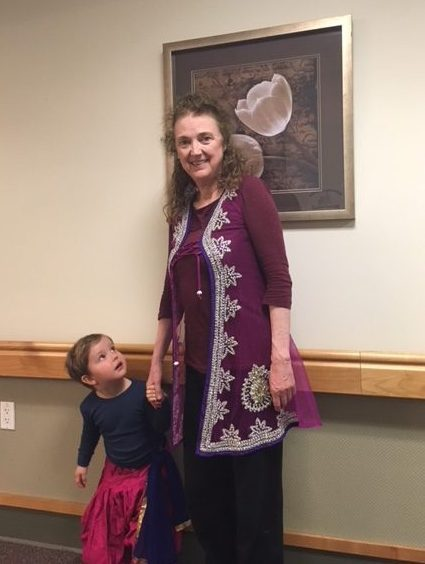
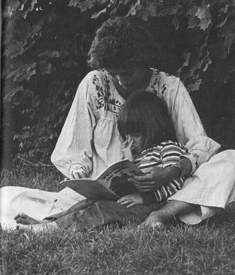
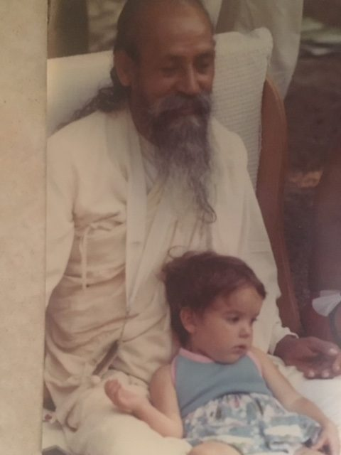
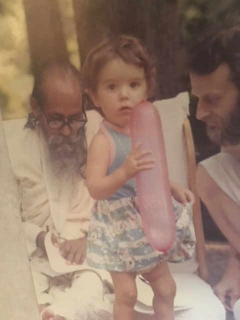
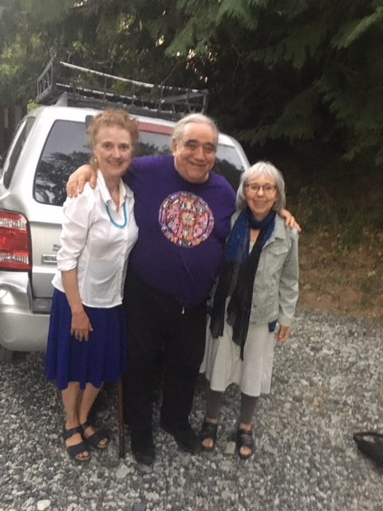
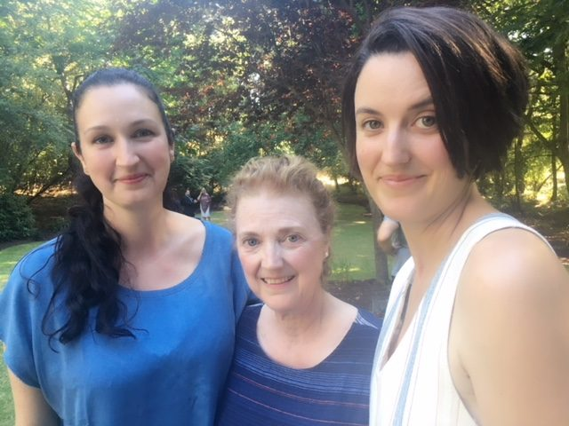
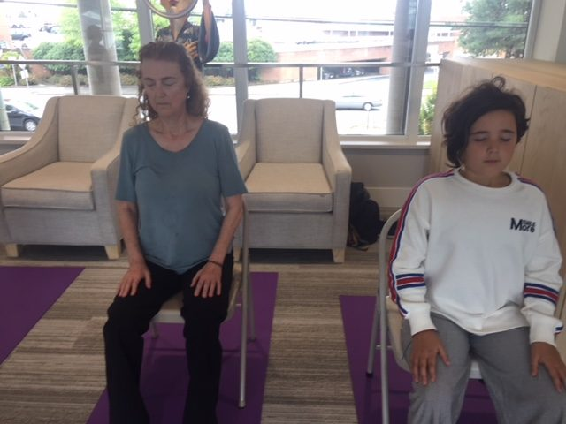
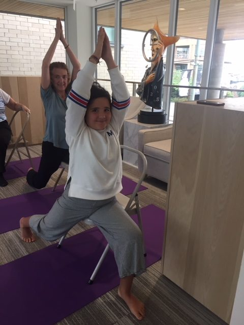
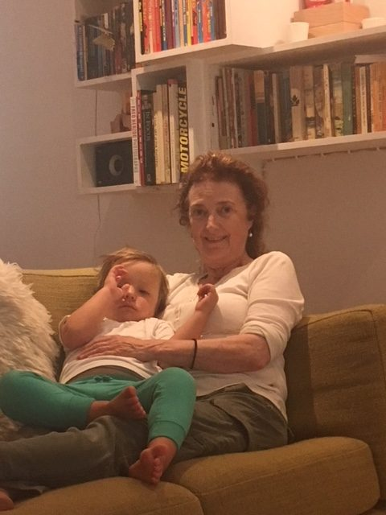

by Anusuya Adams
[caption id="attachment\_17890" align="aligncenter" width="425"] Party at work: Bowen with Anusuya, 2018[/caption]
In the summer of 1976 I moved to the raspberry farm in Abbotsford with my ten-month old daughter, Raya. I had just turned 21. I was in a very unhappy marriage and was looking for something spiritual.
[caption id="attachment\_17895" align="aligncenter" width="480"] Retreat in Oyama 1977 - reading a story to a child in childcare[/caption]
Ravi Dass and Aparna had just moved out of the cabin, and we moved in. Sudarshan and Sharada, Sanatan and Anuradha, and others were getting ready to go to the White Rock retreat, Dharma Sara’s first yoga retreat. Prem (then known as Panchanan) was there but didn’t go to the retreat, and he told me all about Babaji.
[caption id="attachment\_17896" align="aligncenter" width="480"] Kerry (Mangala) with Babaji, 1981[/caption]
[caption id="attachment\_17897" align="aligncenter" width="480"] Kerry (Mangala) with Babaji and AD, 1981[/caption]
I had actually met Babaji briefly before the retreat, and had seen a bright white light around him. He radiated calm. He looked straight at me - actually through me - and I got the message: Everything is okay now, you’re here, you’re safe. Moving to the farm in Abbotsford was like coming home to a loving family - like I’d been there before. There was a strong sense of belonging that I’d never experienced before.
A year later, Sudarshan and Sharada and Sanatan and Anuradha bought a property in Aldergrove that had two houses on it. Sharada said to me, “You’re coming with us” and I said, “yes, of course.”
[caption id="attachment\_17888" align="aligncenter" width="480"] Anusuya, Prem, Sharada , 2017[/caption]
When I wrote to Babaji, he told me I should try to work things out with my husband; I tried, but it didn’t work. I left and moved back to Aldergrove, this time with two daughters, Raya and Kerry. I lived there for a year, until the Salt Spring property was purchased.
[caption id="attachment\_17889" align="aligncenter" width="640"] Anusuya and her daughters: Raya (Jayanti), Anusuya, Kerry (Mangala)[/caption]
Life wasn’t always easy, but my faith kept getting stronger. Every single day, even through the roughest times, I always felt Babaji with me; he helped me to face the difficulties, fight my fears and finish them.
My parents had their own challenges, but they both met Babaji and were supportive of my involvement with the satsang. In fact my mom went to a retreat and did all the practices.
During a very stressful period in my life, I was having recurring nightmares of being chased by bad guys in my aunt’s house. Finally I got to the attic of the house. With nowhere to go and the bad guys getting closer, I called out to Babaji and asked for help. He told me in a clear, calm, matter of fact voice. “Just become liquid & go through the wall”. I did, and tumbled down at Babaji’s feet.
I sat up in surprise and said to a smiling Babaji, “oh Babaji !!!!” Then woke up. I never had another nightmare after that . Thank you, Babaji!
[caption id="attachment\_17894" align="aligncenter" width="640"] Anusuya and Frankie (Preeti) - medtation[/caption]
[caption id="attachment\_17893" align="aligncenter" width="480"] Preeti doing chair yoga class in a retirement home with Anusuya[/caption]
Thinking back, I remember so many stories. I remember when the Polden family arrived from England. Jaya and Hamsa were just three weeks apart in age from Raya. Before they moved to Salt Spring, Raya and I went to their birthday party in the back of the satsang room. Janaki was very special, as was Abha. (Mahesh really lucked out with her!) I remember ironing and steaming clothes on a few weekends in the Jai store.
I remember going to a yoga retreat at Camp Swig in California, and going to Babaji’s house, sitting in his room with Sudarshan and Mahesh. There were a few other people there, and they were crying about something, and I wondered what was going on. Babaji flashed a grin at me and said, “You’re not going to cry.” True; I didn’t cry.
Before the first production of the Ramayana in the barn at the centre, probably in 1982. Kishori was cast as Surpanaka, the sister of the demon king, Ravana. She had been rehearsing for the performance, but there had been a family emergency and she and Sri Nivas had to leave. I was asked to take over and play the part of Surpanaka. This was way, way out of my comfort zone, but somehow I did it!
I remember sitting with Babaji and a group of other people on the mound at the centre in 2007. There was a discussion about the meanings of names. Bhavani spoke about the meaning of my name - something about good things happening to me and spreading love. Babaji wrote “Yes” on his chalkboard and showed it to me.
[caption id="attachment\_17891" align="aligncenter" width="480"] Anusuya’s grandchildren, summer 2018: Edie, Bowen, Frankie (Preeti), with Fynn sitting on the bench behind them.[/caption]
For many years I’ve worked with elderly people in extended care, doing gentle massage and energy healing. The facilities I’ve worked in have always been filled with East Indian people, and I’ve done a lot of chanting, doing the healing mantra when people are ill or dying. AD’s voice is the imprint in my mind when I chant.
On the bus, on the way to work I do pranayama and mantra, but I must admit that on the bus ride home there’s a little dozing going on. I’ve been able to bring my life into my work; I see it as my karma yoga, a duty, and I love it.
[caption id="attachment\_17892" align="aligncenter" width="480"] Anusuya with sleepy Bowen[/caption]
Since Babaji’ passing, I have a strong sense of connectedness to all of Babaji’s devotees. The shraddha for Babaji on Salt Spring was so moving; the power of all of us doing mantras at the same time created a beautiful, surreal energy - totally transformative.
I feel enormous gratitude to Babaji, for his deep knowledge and compassion. This is a fertile time; seeds that were sown long ago are sprouting. Babaji has dedicated his life to us, and I dedicate my life to him and his teachings.
Forever grateful,
Jai Gurudev!
