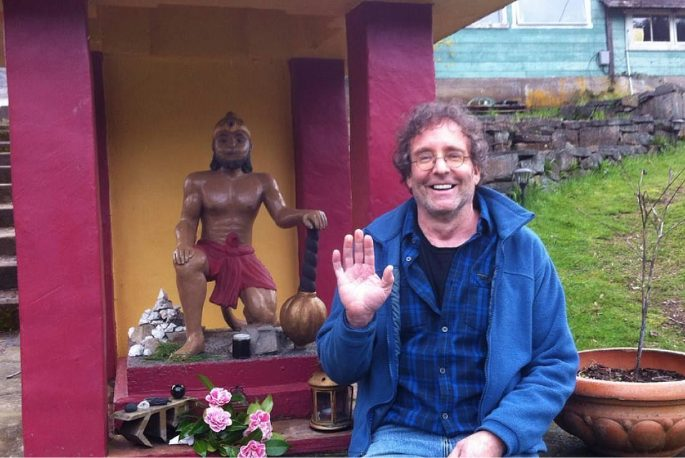
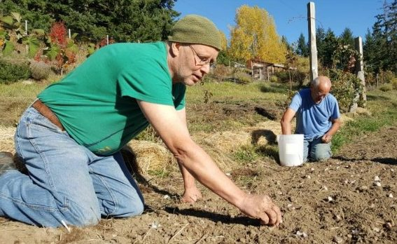
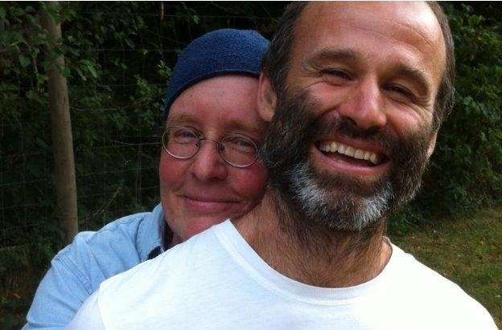
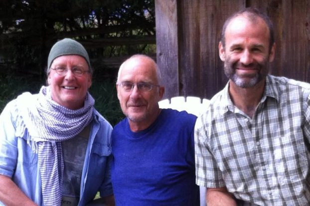
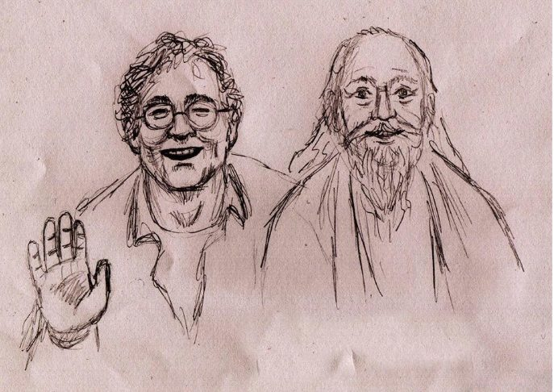

### March 21, 1959 - September 26, 2018

by Raven Hume

---

 
A satsang brother - a great, great satsang brother - has left his body, and I find myself compelled to say a few words. Will Pegg and I met in the tomato patch at the centre when Dan, Su and I were busy planting 350 varieties in 2004. He had come into contact with Babaji in the early nineties. He loved being around him and the unfolding dance of the Satsang, both on Salt Spring and at Mount Madonna. He would often comment on how in the early days, so powerful was the guidance and affection of mostly the women devotees of Babaji. "The Mas", as he called them, helped support his awakening in ground level ways, helping him get and keep his act together, get his discrimination in order, and give him a little nudge when he was veering off the path. Living in Victoria and working to cultivate a organic landscaping business and as much conscious community as he could, Will found that Babaji was nothing but supportive and friendly - of course - and apparently Babaji enjoyed speaking with him about different kinds of landscaping options for both centres. Babaji and Will had correspondence by mail, and he was counselled on various practices to undertake, and how to shift them when appropriate. He pursued his practice with astonishing faith, consistency and devotion, and the magic around Will's eventual death spoke to their unique bond.

When Babaji and Will met, they had a little conversation:
BBJ: "what do you do?"
W: I'm a gardener.
\*silence while writing\*
B: Do you grow pot?
W: Oh...No, Babaji.
\*more writing\*
B: Around here whenever someone says they are a gardener, it means they grow pot.
W: Hmmn. I guess I'm simpler than that.
\*scratch scratch scratch on the slate\*
B: to be simple is good.
Will also told a story whereby Babaji was being asked for a solution to a man's alcoholism. The man was imploring Babaji first for a mantra that would make his alcoholism go away, and then for some advice about the possible sobriety inducing effectiveness of a certain herbal preparation - described at great length - involving things like a rams horn stuffed with plant medicines buried out under the new moon in the northeast corner of a field, left for a fortnight and then pressed and ingested as a tincture, etc.
Babaji listened, paused and then began writing. His slate said, "Have you tried Alcoholics Anonymous?"
Will was a bit of a trickster, and in certain ways, despite his humility, he was a robust gourmand of spiritual community. When issues of group fidelity were brought up, Will would say, "well when it comes to that, I always just assumed we were all doing the same thing."
His most profound power, in my opinion, was the power of unconditional positive regard. He had a way of making me and hundreds of others feel as though we were truly loved, that we truly mattered, that we had a unique and wondrous gift to offer the world and were right to pursue it.
He also wouldn't take no for an answer when it came to connecting people. He would insist on making circles wherever he went and introducing everyone involved to each other with a little title that pointed to their passion and gifts. I was "Raven Hume of the Dharma Sara Satsang Society... He looks after our daily observances." He would always say these things with a twinkle in his eye, because on one hand, he also knew that these roles and labels were a bit of a lark, that it was the love within that mattered, but nonetheless it was as though he was taking unconditional human respect and dignity seriously, and holding the space for each of us to do the same thing too. Consequently, when he became ill with worst case bone cancer, scores and scores of people showed up to offer love, kindness and support. After a few days in the palliative care ward, the hallways and rooms of adjacent patients began filling up with flowers, and unsuspecting patients were finding themselves tucked in, pillows fluffed and gently lent an empathetic ear. Will was taken aside by a staff person on the palliative unit who said, "um Will, first thing is, your people have to stop smiling so much." This gives you a hint of what we're talking about when it comes to Will.
I came to see him as a profoundly adept master of Babaji's teachings to find Satsang, engage regular sadhana, develop positive qualities, and work as though it's an offering to God. Will himself was adamant in our relationship about focusing on the stanzas in chapter 12 of Babaji's Gita which offer different types of options for approaching the supreme...
 
***8***
***Fix your mind on me alone, let your intellect dwell on me. You will hereafter live in me alone. There is no doubt about it.***
***9***
***If you cannot fix your mind steadily on me, then, O Dhanajaya (Arjuna), seek to reach me by the yoga of repeated practice.***
***10***
***If you are unable even to practice repeated practice (abhyas yoga), be intent to work for me; you shall obtain perfection even by performing action for my sake.***
*In this verse the Lord gives a third alternative to Arjuna, if one is not capable of practicing yoga of repeated practice (abhyas yoga). The Lord advises that one should not struggle too hard if one is incapable of pursuing repeated practice because it can cause discouragement, sense of failure, and psychological suppression. However, those aspirants who surrender all actions to the Lord with devotion will not feel discouraged or feel failure in their efforts.*
*In performing action for the sake of God, the egocentric desires and attachment to worldly objects will start diminishing gradually. The mind will be purified, and the actions performed with such spirit of dedication will bring Self-realization.*
This list continues, but this last one was his favourite. What he liked about these verses was their compassionate nature... the way they communicate that there's always hope, that no one gets left behind in this opportunity to be supported into divinity. I think that Will found that he was prone to "struggle too hard" in his spiritual life. I also think that too much philosophizing would frustrate him. In my opinion (not to be confused with the Truth, he would say), he also couldn't bear the thought that these teachings would somehow separate us even further, nor that they might somehow exclude certain people. Indeed I think he found the potential and tendency towards dogma absolutely agonizing. And so, being intent to work for God, Will set to, starting a successful landscaping business, and consistently striving to develop positive qualities by participating and mentoring in various communities: twelve step, buddhist, quaker, counselling, and with our Babaji's community on Salt spring and in Victoria.
In the months prior to his death, Will and I would speak about Babaji almost daily. Will drew on Babaji and his legacy unwaveringly to guide him in the crash course in letting go that was his cancer diagnosis. To have exposure to someone who had gone all the way with God-realization and to consider the ways Babaji acted that out was deeply nourishing to him. His visits to the Salt Spring Centre in the last year of his life affirmed much of the deep archetypal support infrastructure that helped him navigate the labyrinth of decisions and understandings required to drop his body, which as it turned out, wasn't as easy as he had imagined.

A turning point was a chat he had with Sharada, whom he regarded with great veneration and love. He said to her at one point, "you know Sharada, when I'm here it feels like I've come home." And Sharada replied in a way that was perfect for him. She simply exclaimed, "well duhhh!!!" This bought so much delight to him right up until the end.
Will's unravelling was marked by bouts of extreme agony. He shared with me that at such times the only thing that would help him through it was to recall the memory of Hanuman's foot in the mandir in the Garden and to imagine himself there at Hanuman's feet. At other less painful times he would imagine sitting just above the mandir on the terraces, or in the satsang room beside the fire, or at the summer retreat's kirtan with the pond dome's batiks blowing gently in the wind and the children playing out in the field. It says a lot about the depth of peace Babaji has managed to bring through us to the world and into the hearts of devotees.
Will decided to end his life with the help of medical assistance. I was off island and had a few days to make my way back to Victoria when he eventually chose to make an exit. It was the day prior to the Doctor showing up at his wife Louise's place, and I was ferrying back to the city. The whole morning my travels were going unusually smoothly, and there seemed to be a glow to all my exchanges with people. Just after 10:30, I heard that Babaji had left his body. Rather than head into the city, I went to Salt Spring for the first two Tarpanams.
When Will found out he said, "I always knew we would go together."
So the next day I made my way into Victoria where a host of us were gathering at Louise's. We sang Kirtan and did ceremony, and Will spoke of things close to his heart. He implored me a couple of times to speak about the stanzas and sentiments in the above Gita verses, and after drinking the cocktail that would end his life, he went out chewing over their meaning and speaking about what Babaji said about them.
His body/mind went to a coma state and the room fell into a meditation for a little while. Afterwards, several of us would report having visions of Will joining Babaji during his time. One vision had Babaji waiting for him, and then them walking off together.
Babaji is grace made manifest, and I'm so grateful to be so moved by it. I have since realized that it was Will's faith in Babaji that managed to hold together the relationship of service that I had with him in the last several months of his life. It was though Babaji said, "I have a mission for you", plunked me in Victoria, and arranged for the diverse channels of energy so that it could work.
[caption id="attachment\_17851" align="aligncenter" width="687"] This drawing is by Jenny Jaeckel[/caption]
I'm ever grateful for Will's love and friendship, and also for his demonstration of what it looks and feels like to be a sincere devotee of Babaji's until the last breath. We are all better off for his courage and efforts.
Jai Will!
Jai Gurudev!
Please enjoy a recording of Will during his morning prayers.
[audio m4a="https://saltspringcentre.com/wp-content/uploads/2018/11/Will-Pegg-Morning-Prayers-2018-11-16\_14-14.m4a"][/audio]
