[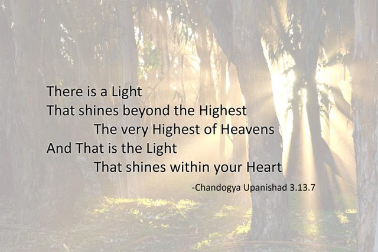](images/ddedf3e3_Upanishad-Final.jpg)Hello everyone,
Welcome to December and the official beginning of winter.
[caption id="attachment\_17877" align="aligncenter" width="640"][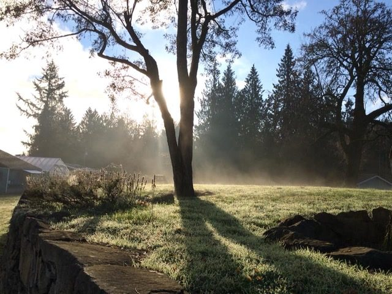](images/ddedf3e3_Misty-morning-mound.jpeg) Misty morning on the mound[/caption]
[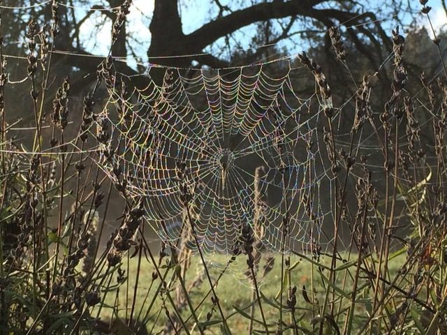](images/ddedf3e3_Dewy-spiderweb.jpeg)
In the past couple of months, we’ve shared information about Babaji’s passing and the rituals that followed, as well as a beautiful piece by Yogeshwar [about the guru](https://saltspringcentre.com/reflections-on-the-guru/).  The last ritual was the immersion of Babaji’s ashes in the Ganges River in India. Many devotees (including Rajani and Om PK, Lakshmi, and Raven from Salt Spring) made their way to India for [three days of events](https://www.babaharidass.org/memorial) with the children of Sri Ram Ashram, culminating in the immersion of the ashes on November 19.
[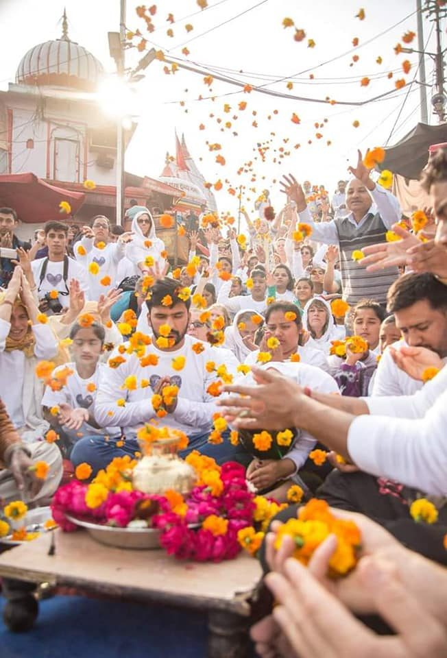](images/ddedf3e3_Babaji-ceremony.jpg)
[caption id="attachment\_17864" align="aligncenter" width="650"][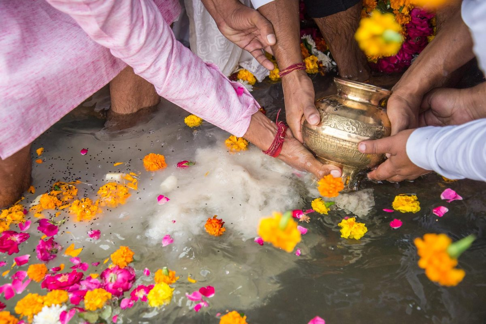](images/ddedf3e3_Babaji-ashes-Ganges.jpg) Babaji's ashes being released into the Ganges[/caption]
[caption id="attachment\_17865" align="aligncenter" width="640"][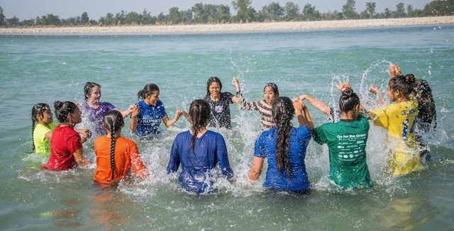](images/ddedf3e3_Sri-Ram-Girls-Ganges.jpeg) Girls from Sri Ram Ashram playing in the Ganges[/caption]

# Winter at the Centre

Here at the centre, our 2018 program season has ended. We’ve bid a fond farewell to the wonderful, dedicated resident karma yogis who have contributed so much to the centre for the past year. Big thank you’s to Mariel, Hope, Laurren, Luxmi and Bernie, Jesse and Crystal. (who came back for the last few weeks of the season) Those who will spend the winter here include Racquel, who has taken on an important administrative role in the office, serving as Interim Senior Manager, Courtenay (housekeeping), Ben (maintenance), Adam and Sharada. We’re a small but mighty group, and all activities will continue through the winter: Wednesday evening kirtan, Sunday satsang, yoga classes. Yoga Sutra studies will begin again this month. Yogeshwar and Rebecca are now back on Salt Spring, although no longer living at the centre. They’re still very much a part of the centre community.
[caption id="attachment\_17879" align="aligncenter" width="427"][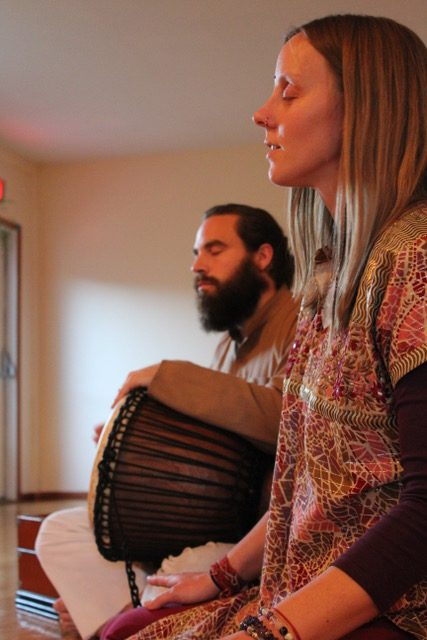](images/ddedf3e3_Satsang1.jpeg) Satsang - Jesse and Crystal[/caption]
[caption id="attachment\_17880" align="aligncenter" width="640"][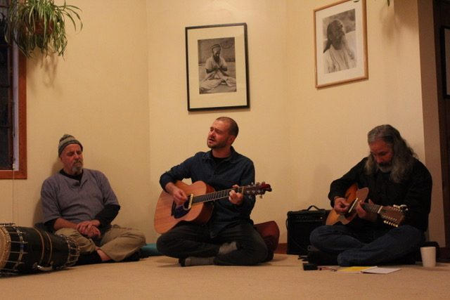](images/ddedf3e3_Satsang2.jpg) Satsang - Sanatan, Adam, Ramanand[/caption]
[caption id="attachment\_17867" align="aligncenter" width="480"][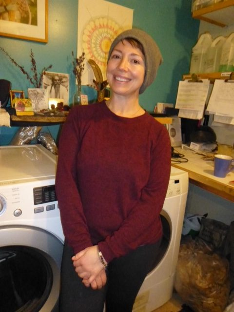](images/ddedf3e3_KY-Courtney-housekeeping.jpg) Courtney in front of the laundry room altar[/caption]

# Woodland Trail Upgrades

Here are some photos of people and projects at the centre. The upgrading of the woodland trail has been an ongoing project throughout the fall months.
[caption id="attachment\_17872" align="aligncenter" width="640"][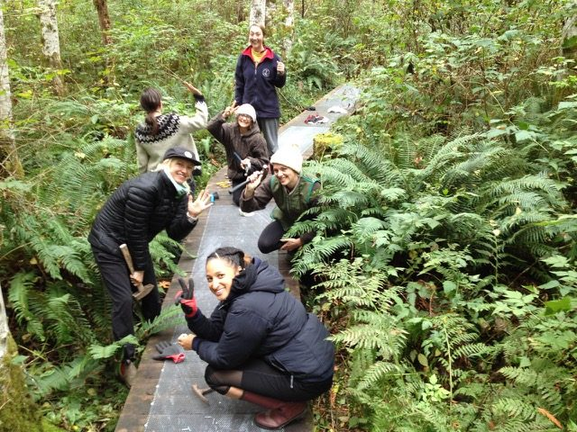](images/ddedf3e3_Trail-work.jpeg) Happy helpers working on trail upgrades[/caption]
[caption id="attachment\_17869" align="aligncenter" width="480"][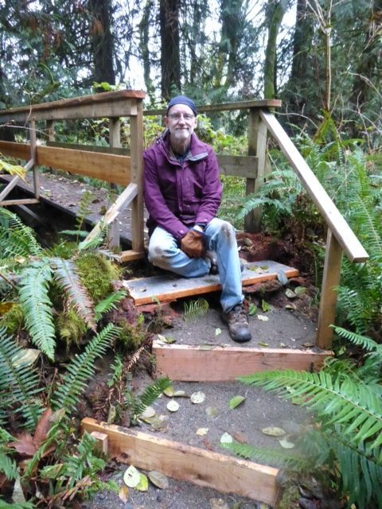](images/ddedf3e3_Trail-Ben.jpg) Ben and the new curved stairway on the trail[/caption]
[caption id="attachment\_17870" align="aligncenter" width="480"][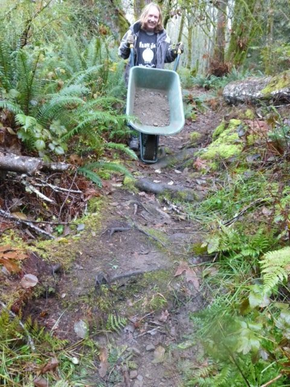](images/ddedf3e3_Trail-Bernie.jpg) Bernie making the rough parts easier to walk[/caption]
[caption id="attachment\_17873" align="aligncenter" width="640"][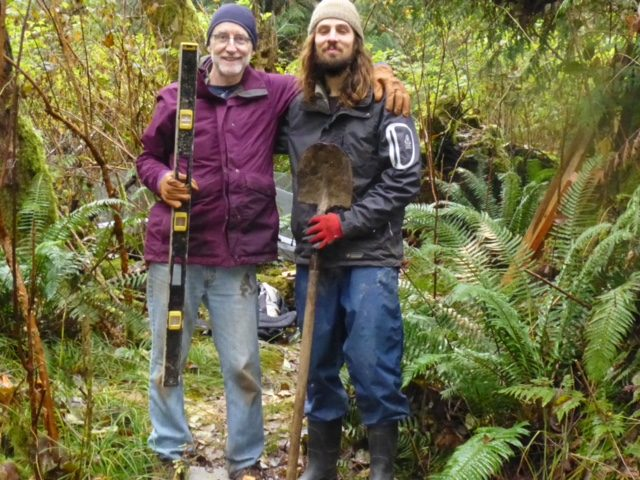](images/ddedf3e3_Trail-work2.jpg) Ben and Daniel[/caption]
[caption id="attachment\_17871" align="aligncenter" width="640"][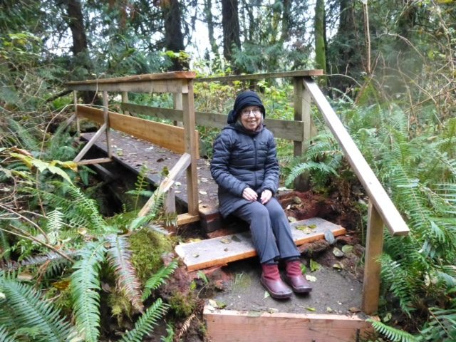](images/ddedf3e3_Trail-Sharada.jpg) Sharada getting a tour of the trail improvements[/caption]
Ben, our maintenance coordinator, and keeper of accurate records, has shared this breakdown of those who have contributed:
> **Total volunteers:**
> Daniel for 8 days
> 7 Zen practitioners on two separate occasions (during Zen retreat at the centre)
> 1 local trail user, “Will”, for 10 hours on 3 occasions
> Luxmi’s friend
> SN for support and design
> and more I’m sure. I can’t remember.
> Resident Karma Yogis
> 12 different Ky’s on 4 different occasions, including 7 of them carrying Will Pegg’s 18’ long wheelchair ramp into the forest in two sections on their shoulders
> Bernie
> Adam
> Luxmi
> Positive feedback from 8 different Salt Spring community member regular trail users and three very happy dogs.

# Survey: Share your skills in 2019!

In planning for the 2019 season, Racquel has created a survey for anyone who feels a connection to the Centre - people who’ve contributed over the years as well as those who haven’t but might be interested. It won’t take long to fill it out, and we’d love to hear from you. Please take a few minutes to let us know how you’d like to contribute your skills to the centre. We are all community and we all have skills to share. [Find the survey here](https://www.surveymonkey.com/r/RQ6RFGY).
This is a time of year with many celebrations. Earlier in November we celebrated Diwali with a lovely evening of story, song and light.
[caption id="attachment\_17876" align="aligncenter" width="567"][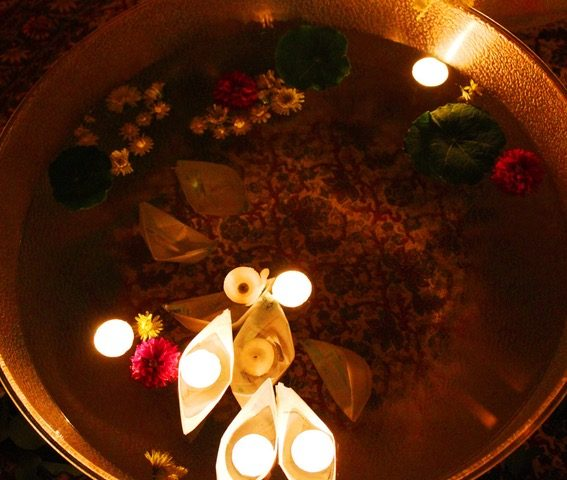](images/ddedf3e3_Diwali-2018.jpeg) Diwali celebrations[/caption]
[caption id="attachment\_17875" align="aligncenter" width="640"][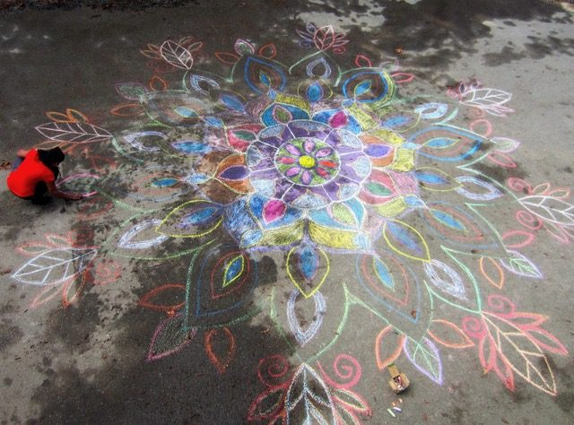](images/ddedf3e3_Diwali-2018-2.jpeg) Diwali celebration at the school[/caption]
In the last week of November, Usha led the school community and other Salt Spring families in the Salt Spring Centre School’s annual Celebration of Light (aka Advent), filling the space with song and light. This tradition was begun by Usha in the early years of the Salt Spring Centre School, and continues to bring joy to the community.
[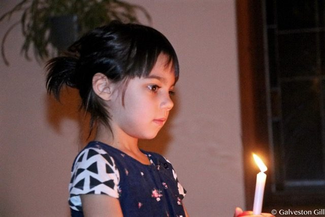](images/ddedf3e3_Advent-spiral-2018-1.jpeg) [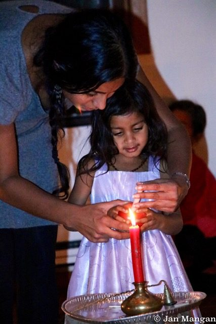](images/ddedf3e3_Advent-spiral-2018-2.jpeg)
Other seasonal celebrations that are coming up are Chanukah early this month, Christmas on the 25th.
The Centre School will also hold its annual Winterfest on December 8, a fun occasion for Salt Spring Island families - with food, crafts for the kids, silent auction, and festive music.

# To read:

Anusuya Adams tells the story of her connection to Babaji and the satsang family in ‘[An Introduction to my New Life.](https://saltspringcentre.com/an-introduction-to-my-new-life/)’ I first met Anusuya in 1975 when she came to live with us at the raspberry farm in Abbotsford. She showed up with her sweet ten-month old daughter and immediately became part of the family. Over the years her family has grown, as has her work of helping others. She has remained devoted to Babaji over all the years, with a focus on prayer and pranayama. She was so pleased to be able to come to Babaji’s shraddha at the Centre last month, and she plans to come to ACYR this summer with all her grandchildren.
Will Pegg was a longtime devotee of Babaji’s; he was a kind-hearted man who enjoyed connecting with and serving others, and who found himself surrounded by people who loved him when he was ill. At his memorial in Victoria, many people spoke about how Will had contributed to their lives. Raven was one of the people who supported Will during his last days (and for a long time before that). Here he shares his reflections on Will’s journey in ‘[A Devoted Life](https://saltspringcentre.com/a-devoted-life-will-pegg/)’.
We all thrive in the presence of compassion and love, when it’s directed to us, when we direct it to others, and when we are surrounded by it. The light in our hearts is the same light that’s in everyone else’s heart. As one of the Advent songs says, “Be a living light; take a little bit and pass it on.” Please read ‘[Seeing the Best in Each Other.](https://saltspringcentre.com/seeing-the-best-in-each-other/)’
*Love everyone, including yourself. That is real sadhana.*
Love,
Sharada
