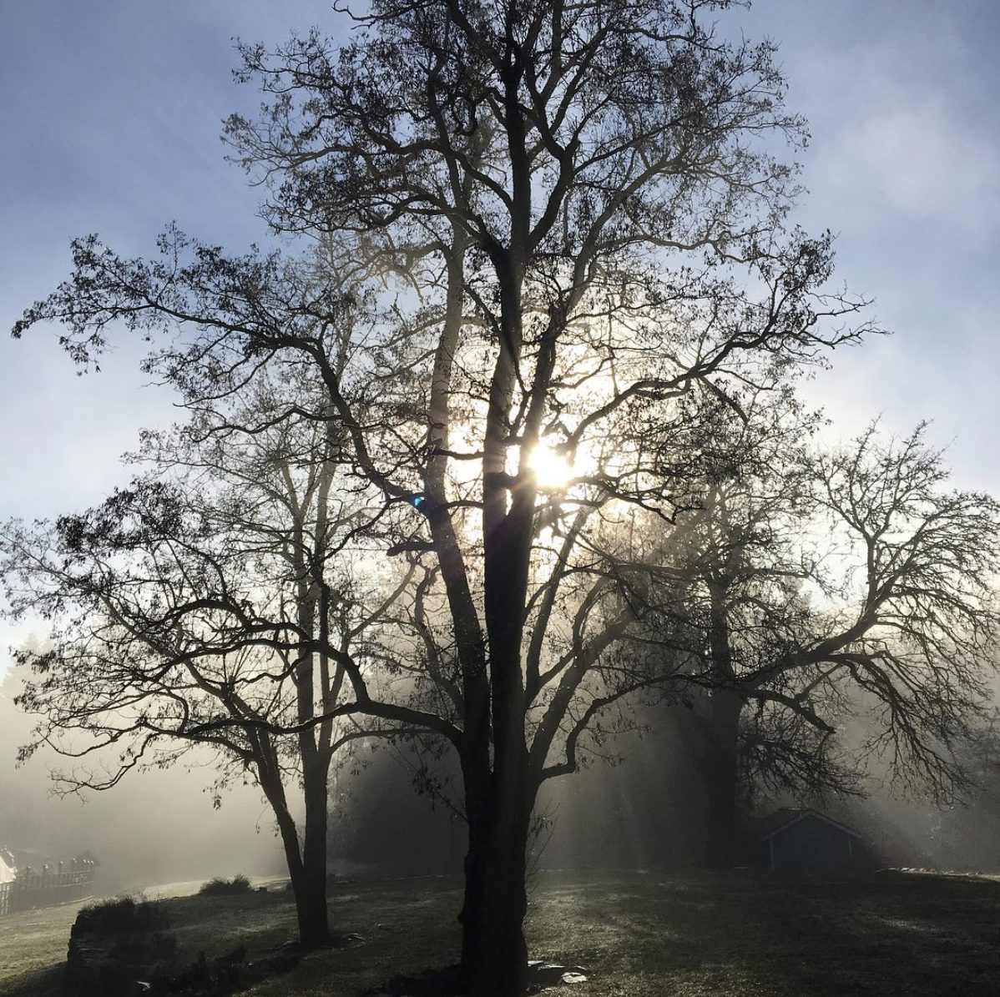

Happy New Year to you.
May this year bring you health and well-being, inner strength and wisdom, and peace always.
From Vinaya Chalisa, a book of forty prayers by Baba Hari Dass...

*O Gracious God, you are the embodiment of supreme wisdom. By your grace, may I be able to be friendly to all, may I be able to love all, may I be able to be true to all, may I be able to be non-violent, may I be able stand on my spiritual path unshakably.*

Because of December holiday time we’re not able to send you a full January newsletter. The regular newsletter will resume in February, but meanwhile here’s a bit of news, beginning with a letter from Om Prakash, Dharma Sara Satsang Society president:
> Greetings to our satsang members,
> As we begin this new year, the members of the DS Board send you our best wishes for ongoing love and kindness in your lives.
> Our dedicated manager of the past year, Will Yogeshwar Humphrey, has retired from his position to pursue family commitments. He will continue to participate in the Centre’s spiritual events such as yajnas and sutra classes. We thank him for his dedication in the past year.
> The Board has appointed Racquel Marshall, who has been managing the Centre’s administrative work, as Senior Manager to oversee general operations. Under her direction, we are confident that the coming year will be filled with exciting events, including another vibrant Family Yoga Retreat - our 45th.
> We look forward to greeting our members at the Annual General Meeting, scheduled for March 30, 2019. This earlier date will enable a newly elected Board to fully engage in the activities of the spring and summer.
> Mark Omprakash Classen
> DS President

# Looking ahead to the 2019 season

[Yoga Teacher Training](https://saltspringcentre.com/yoga-teacher-training/) information, with details about the course, dates and prices, are posted on our [website](https://saltspringcentre.com/yoga-teacher-training/). Here also is a link to a [YTT video](https://youtu.be/7qkljJtPURU) which is also posted on our [Facebook page](https://www.facebook.com/saltspringcentreofyoga/). Check it out!
Our program and rental calendar is already quite full. 2019 will be a busy year! [Yoga Getaway](https://saltspringcentre.com/programs-retreats/yoga-getaways/) and [Personal Retreat](https://saltspringcentre.com/programs-retreats/personal-retreats/) dates will be posted on the [calendar](https://saltspringcentre.com/calendar/) soon.
Postings for management positions in Operations, Programs, and Human Resources are posted on our website's [Current Opportunities](https://saltspringcentre.com/community/current-opportunities/) page. If you are interested in any of these positions and would like to be part of the office team, please be sure to fill out an application. We look forward to hearing from you.
Dates for the [Residential Karma Yoga Program](https://saltspringcentre.com/programs-retreats/karma-yoga-program/) will be posted soon - stay tuned. We are always happy to welcome new people to join the community as karma yogis.
Ongoing: Sunday satsang, Wednesday evening kirtan, and yoga sutra study on Sunday afternoon.
Love,
Sharada
