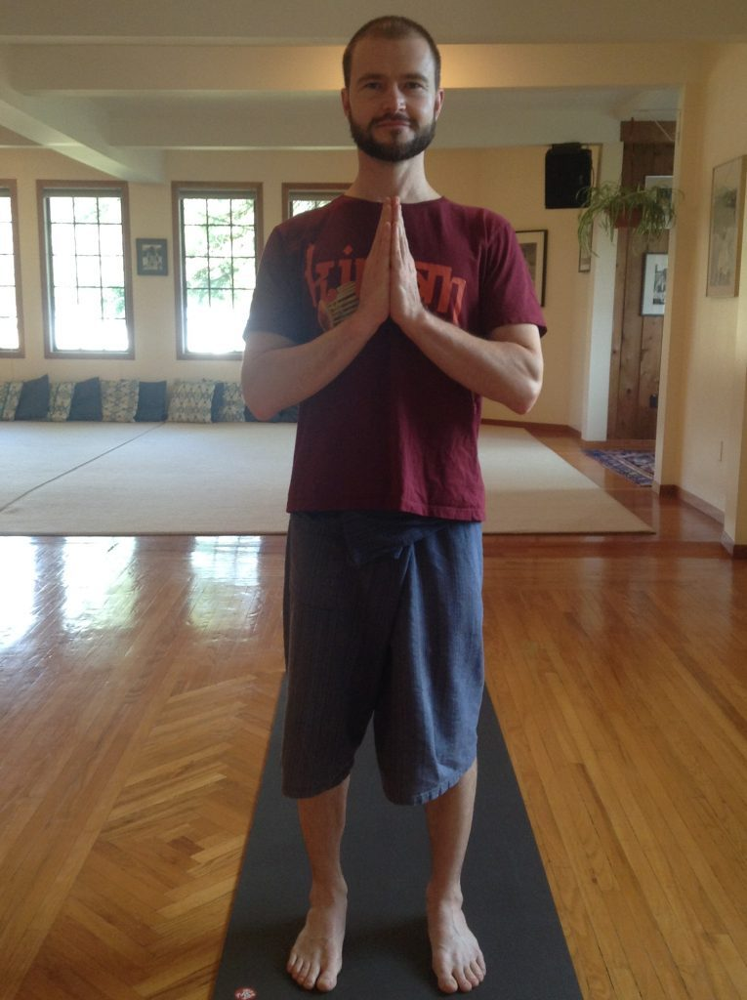
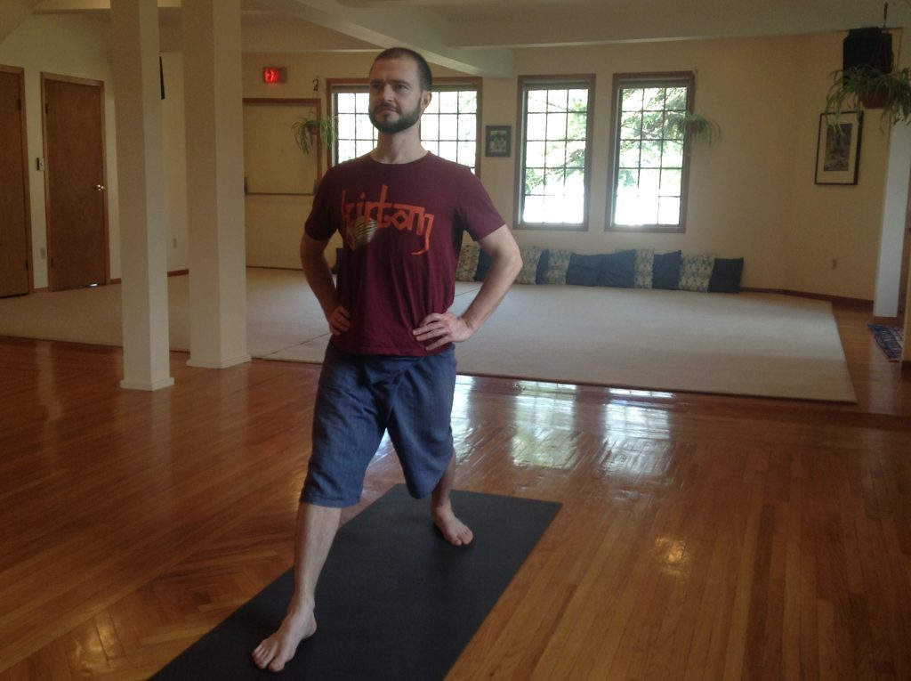
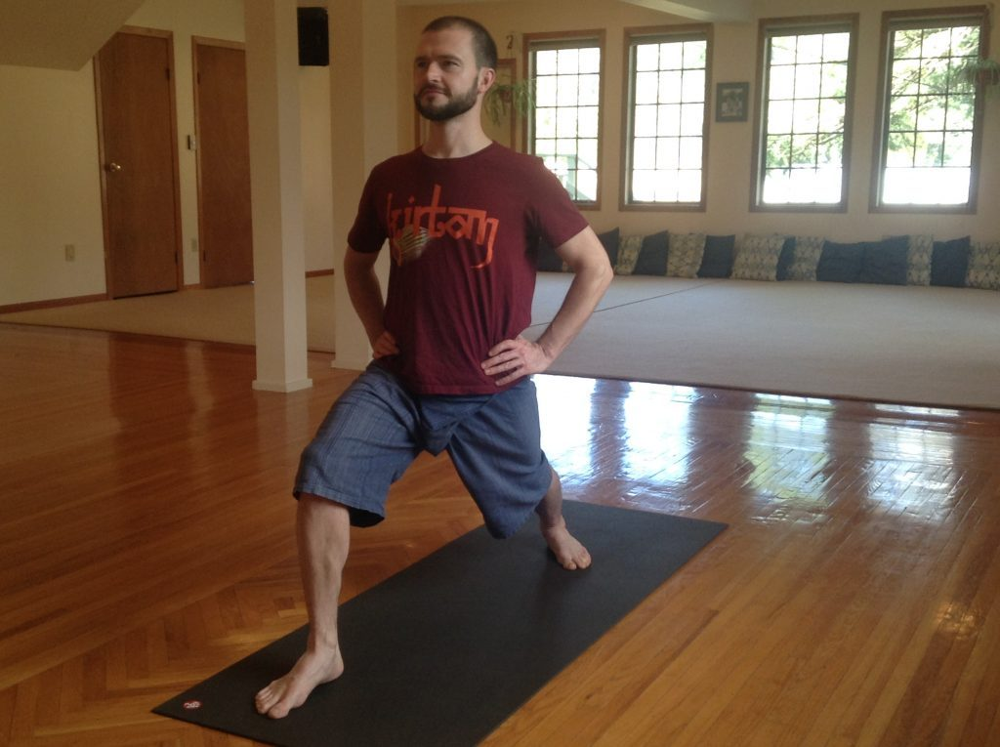
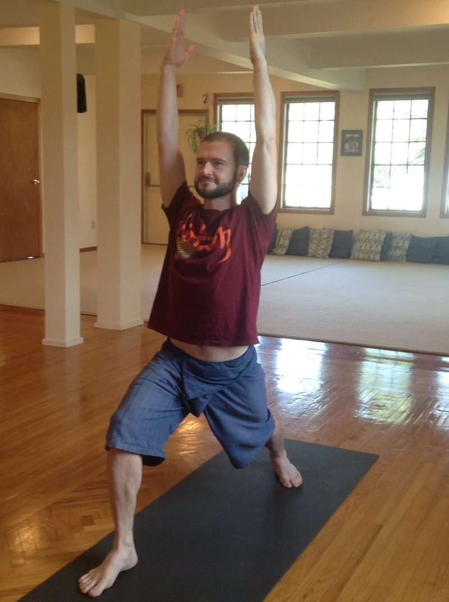
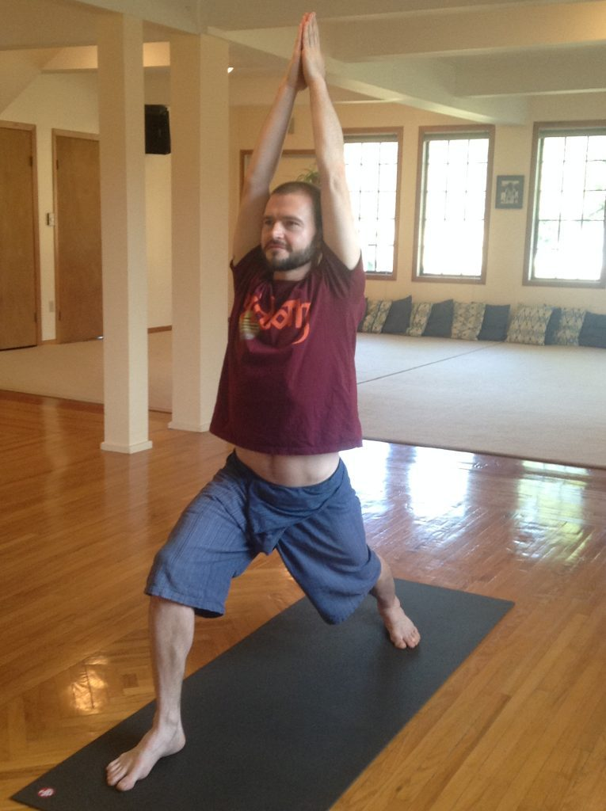
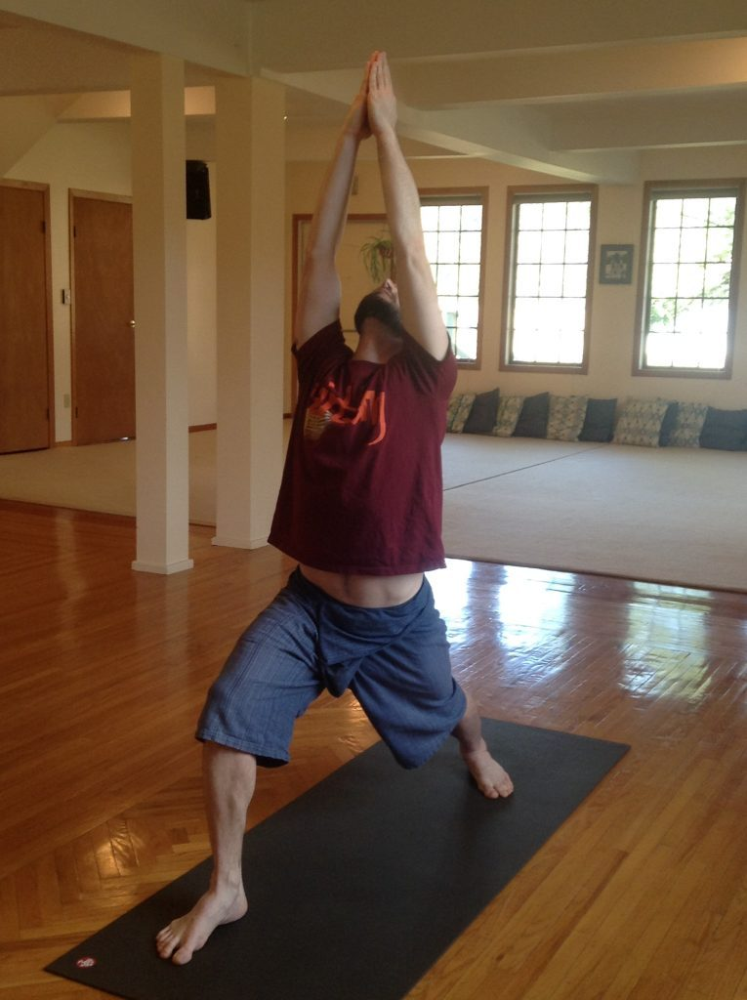

This month I have chosen to highlight one of my favorite poses of all, one that I have included in my regular daily practice for over 15 years. It is a very warming and activating pose that is a part of the classical Surya Namaskara B or Sun Salutation B sequence.

I love this pose for its wide array of beneficial effects on the body temple.

It's well-rounded healing effects include:

- Improvement of overall circulation and vitality
- Opening and expansion of the chest, aiding deeper breathing
- Relief of stiffness in the shoulders and back
- Toning of the ankles, knees and calves.
- Stretching and strengthening the legs, hip joints, and shoulders
- Stimulating the heart and lungs
- Toning the nerves of the spine
- Stimulating the thyroid, adrenal, and reproductive glands

## Getting into the Pose

Beginning in Tadasana or Mountain pose, standing at the front of your mat.

Place your hands on your hips and step the left leg back approximately one leg length or less. As you step back, turn your toes outward creating a 60 degree angle in your left foot.

With both legs strongly engaged, slowly bend your right knee up to 90 degrees.

Alignment is heel to heel or wider so that hips are facing forward.

Inhale and lift the arms forward or to the side and overhead with palms facing each other.

Bringing the elbows to the sides of the head, you can choose to join the palms together.

The fullest extension is with the thigh and calf in a right angle and thigh parallel with the ground. Your head faces forward or extends back looking up at your hands.

- 
- 

Draw down through your tailbone so as not to hyper-extend your low back.

I recommend holding the pose for up to five slow and deep full breaths.

To come out of the pose, inhale and straighten your front knee.

Exhale and relax your arms by your sides. Bend you left knee and step your leg forward into Tadasana.
