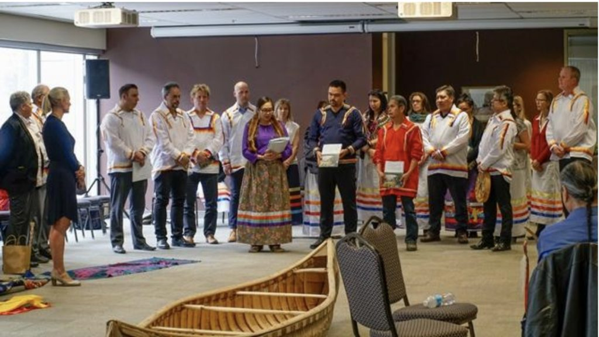
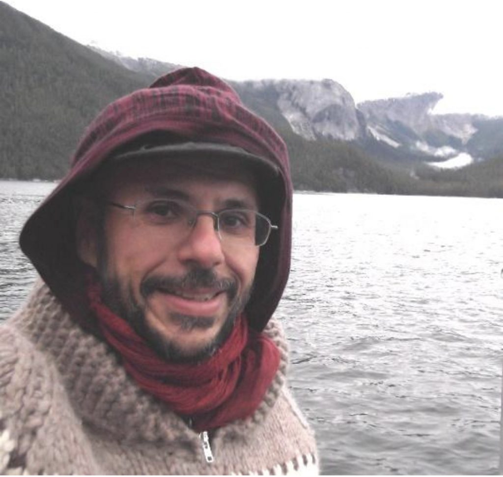
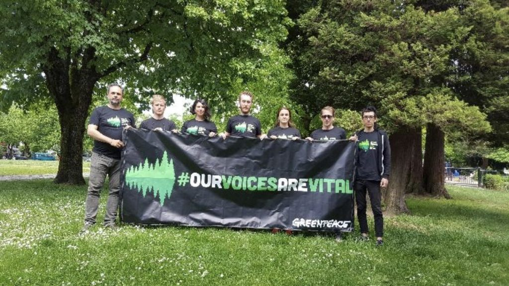
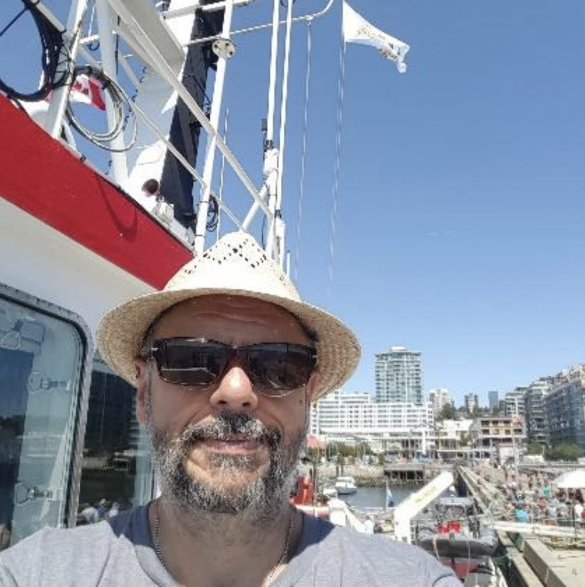
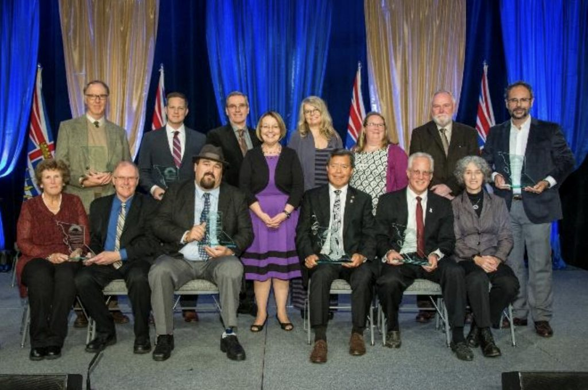
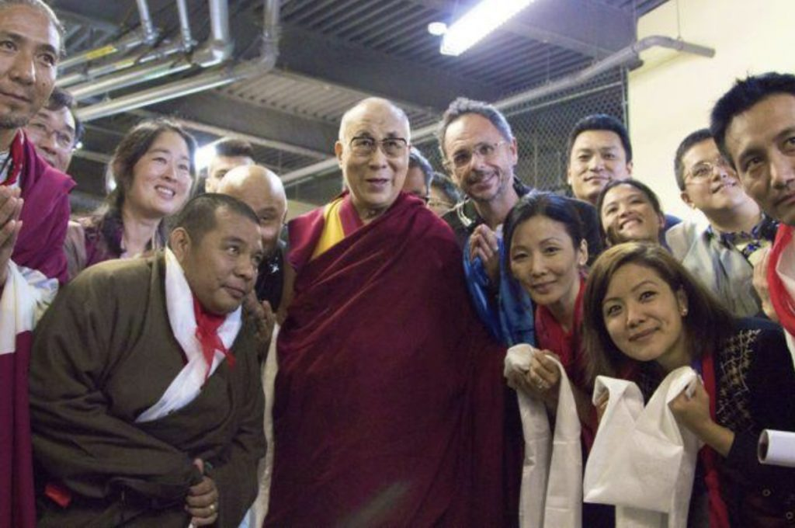
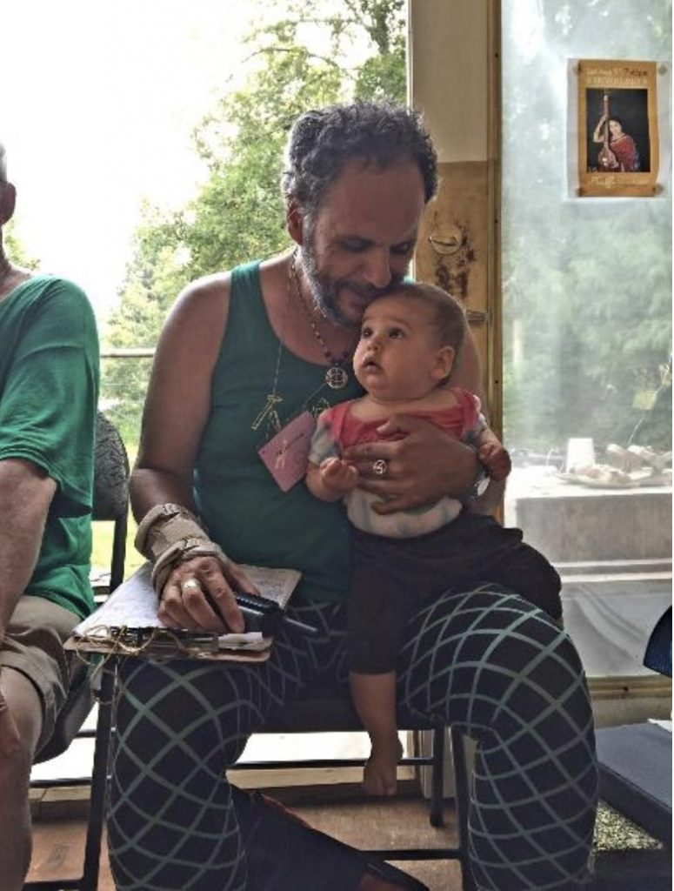
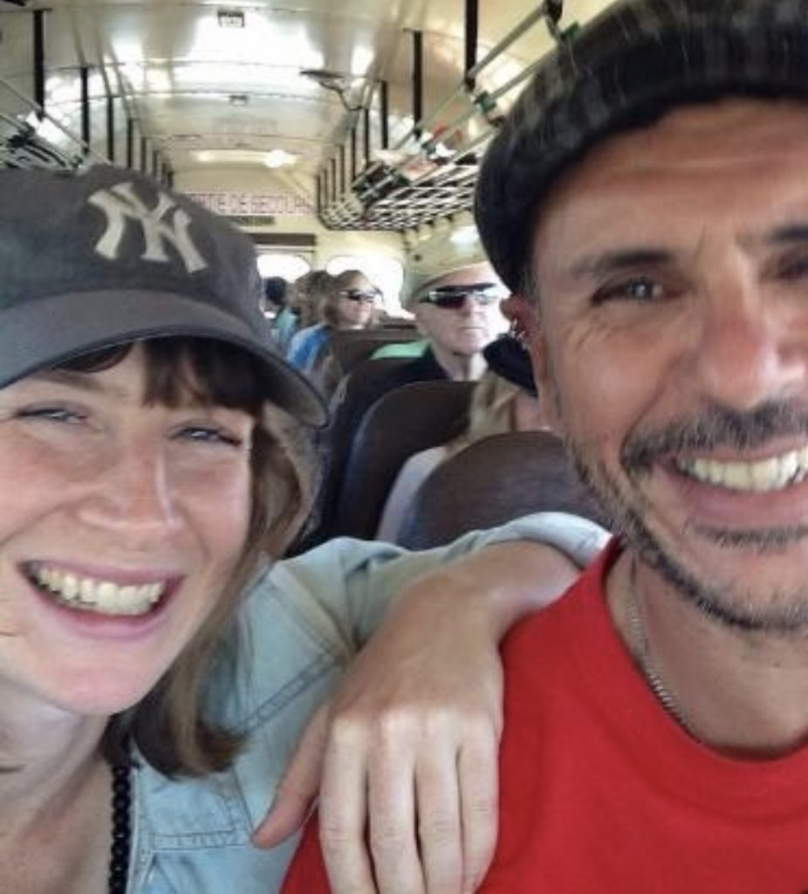
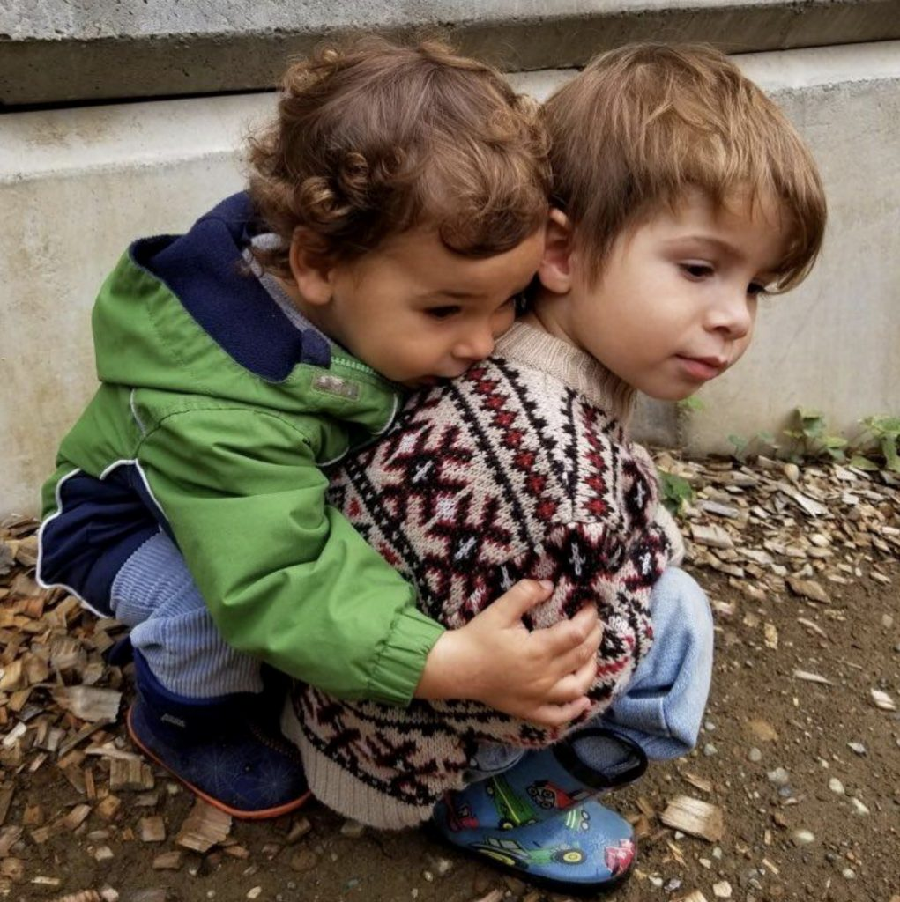
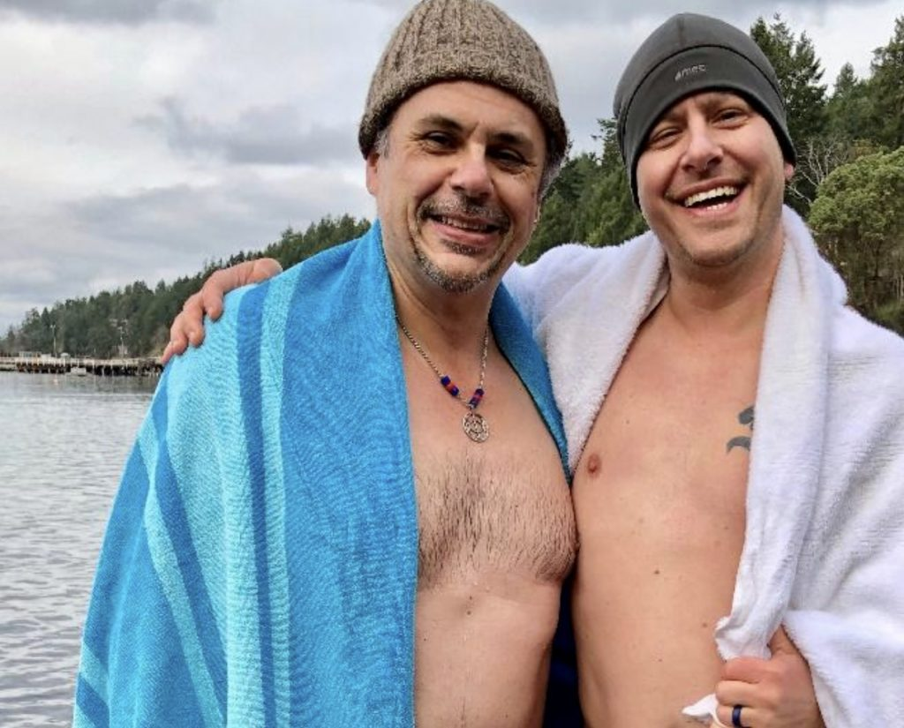

**Finding Meaning in Service and Community, Crazy Pants and All**  
*by Eduardo Sousa*

---

Handing over “We Rise Together”, a report I helped produce on Indigenous Protected and Conserved Areas in Canada to Federal Environment Minister Catherine McKenna (Ottawa, March 2018)

Clayoquot  Sound. The Great Bear Rainforest. Growing up in inner city Toronto, I remember hearing about these far off places of beauty and wilderness in the 1990s – mostly because of the conflicts over unsustainable logging and the injustices perpetrated against Indigenous peoples who were trying to protect their lands from being destroyed. I remember undertaking solidarity actions in downtown Toronto with local environmental organizations during the heat of the conflicts as a way of demonstrating support for those on the front lines – both Indigenous and non-Indigenous people.

The 1990s were also very formative for me because it was an era which also saw major First Nations land rights conflicts emerge such as at Oka and in Clayoquot Sound. And so similarly I got involved with local groups in support of the Mohawk people at Oka and Kahnesatake, and the Lubicon Cree of northern Alberta.

For me what has underlain these deep veins of passion and compassion is where environmental protection and human rights - specifically First Nations rights - have intersected. For me, social justice and environmental justice are inseparable as are biodiversity and cultural diversity.

But these deep veins have also been enriched by a profound desire to be part of community, to contribute to creating community, to serve and heal in community, including serving as the ACYR Coordinator for 2018.

I mention these things because I have been reflecting on my decade on the west coast. June of 2018 marked 10 years that I arrived in Vancouver – it also marked the start of a new chapter in my life, for in June 2018 I also moved, now with a family, to Duncan on Vancouver Island.

However, it was never part of a conscious life plan to be on the west coast, working in remote communities, and to be close to Saltspring Island (which was a major reason we moved to nearby Duncan actually).  I certainly didn’t expect that, back in July 2001 when I took an epic trip by ferry from Bellingham, Washington to Skagway, Alaska, I would be crossing the very ocean, the very region that I would almost a decade later be working in.  Though I supported efforts to protect the Great Bear Rainforest on the west coast of mainland BC from downtown Toronto in the ‘90s, it didn’t occur to me that as I travelled by boat along the Inside Passage that it was the Great Bear region I was passing through. This really struck me a couple of years back, on the dock in Bella Bella in Heiltsuk First Nation territory at the heart of the Great Bear, as I watched Alaska Marine Highway’s MV Malaspina ferry go by, that the trip I made back in 2001 was on that same ferry, through the same region I would find myself work in all those years later.

In the waters of the Great Bear Rainforest (near Hartley Bay – Gitga’at Territory, Oct 2012)

I never would have thought that in the thick of those solidarity actions in the 1990s that almost two decades later this immigrant kid from Lisbon Portugal whose habitat became the concrete jungle of downtown Toronto, I would find myself working in these places of beauty, which I valued simply because they exist. And I didn’t think that my passion for social justice would also translate into working with the First Nations communities whose territories make up what we call the Great Bear Rainforest, and Clayoquot Sound (on the west coast of Vancouver Island).

Although between 2001 and 2008 I had made three trips to the west coast (each time returning to Toronto with the thought of, ‘why am I not living on the west coast?’), the catalyst that led to making such a massive move across the country was my marriage engagement. And although shortly thereafter things didn’t work out, having found myself on the ocean’s edge in Vancouver, I decided to stay, and within six months of uprooting myself from Toronto I landed with Greenpeace as a forest campaigner.

Protecting the right to free speech (Vancouver, May 2017)

Aboard Greenpeace ship Arctic Sunrise (North Vancouver, June 2018)

What initially drew me to the job was the work with communities, especially First Nations communities, and the prospect of implementing a just agreed-to 5-year forest conservation plan (based on a 2006 Agreement that had been lauded around the world as way in which collaboration at its core can bring disparate interests together - First Nations, the BC government, industry and environmental organizations – to succeed at conservation and forestry. I’ve always been interested in building bridges as part of social justice and environmental protection so this was exciting for me. Working on a project that was so multilayered and complex and which had at its core high levels of ecological protection while aiming to advance the wellbeing of communities reliant on healthy ecosystems (notably First Nations who have known the region as their territories for millennia) was extraordinarily exciting. The potential for bringing together economic and ecological imperatives without one compromising or sacrificing the other – not to mention being at the epicentre of campaigns I had worked to support over a decade beforehand in an environment as far away from the Great Bear as you can get – led me to commit myself entirely to such an endeavour.

For me however I also needed to do things closer to home in Vancouver and thus I also got involved in 2014 to project manage the one-day teaching event with His Holiness the Dalai Lama at the University of British Columbia. Here I was also a karma yogi to this major endeavour because I wanted to serve the Tibetan diaspora in the region by helping organize this event. Aside from the plight of Indigenous Peoples around the world the other social justice passion of mine has been what has happened to the Tibetan people and their culture. It was a process and event, crazy-making at times, that I will never forget.

In 2016 we and our fellow environmental organizations reached agreement on protecting 80% the Great Bear Rainforest’s old-growth ecosystems with the true title-holders of the land (First Nations), the provincial government and industry. It only took 20 years to reach (for me about 10 of those years). It was nevertheless a huge achievement for me personally and professionally. It is far from a perfect agreement but it has created a solid foundation for First Nations in that region to exercise their rights, title, governance and stewardship of their lands, without going down what can be a deep rabbit hole of treaty-making.

All the major organizations involved in the Great Bear Rainforest Agreements are seen here accepting the Premier’s Award from the BC government for Organizational Excellence (Victoria, BC, fall 2016)

The Steering Committee that organized His Holiness the Dalai Lama’s teaching event (Vancouver, fall 2014)

The wrap up and final implementation of the Great Bear Rainforest Agreements began a new transition into a new chapter in my life. I began working on caribou protection in the interior of BC as well as helping protect boreal forest. However, the deep veins of social justice and community building continue to run through me, and so that has resulted in my getting involved in helping Indigenous governments create protected areas according to their values, and in stepping up to coordinate the 2018 Annual Community Yoga Retreat on Saltspring Island.  And this all has been marked by moving to Duncan last summer. On the surface these veins seem to run parallel but to me they weave around each other because on the whole what has motivated me has been the need to help contribute to a better world – through community work, through service to all manner of life, through being a good parent and a good male role model to my boys.

My Georgie’s first ACYR in 2017 and me wearing one of my more subdued crazy pants (Saltspring Island, summer 2017)

On the bus with Hilary to the People’s Climate March (near BC-Washington border, Fall 2014)

There is an online quote attributed to the late Babaji from 1987: “There is no negativity toward the world if one understands that the world is a ground for experiencing the world, and for finally getting liberation from the experiences.”

As I have moved through life from the ancient Atlantic shores of Portugal to the hard inner city of Toronto and now to the ancient rainforest lands of the peoples of the Pacific Northwest, I have come to see indeed that the worlds I have inhabited, despite the sufferings of self and others, have created the foundations to help me understand those experiences.   And yet I have never really thought about attaining liberation from those experiences – just the deep impulse to serve where I am. I have much to learn as I continue to move through life and I am grateful for the teachings of great people in my life – whether the elders and youth of First Nations communities I have spent time in, or my boys, or the women in my life, or Dzongsar Kheyntse Rinpoche or Babaji – that carry me through these great oceans of love and experience, crazy pants and all.

There is one dream, a recent one, that in a way encapsulates what I have been writing about here in a single image: Hours before the announcement of Babaji’s passing I had this very vivid dream that he was surrounded as he lay flat in a holy pool of water edged by ancient stones with flowers over and around him, by those that loved and revered him. This is community. This is service. This is love and beauty.

George, almost 2 and Luiz almost 3 (Duncan, fall 2018)

Myself and Shyam at this year’s Polar Bear Swim (Vesuvius Beach, Saltspring Island, Jan 1 2019)
