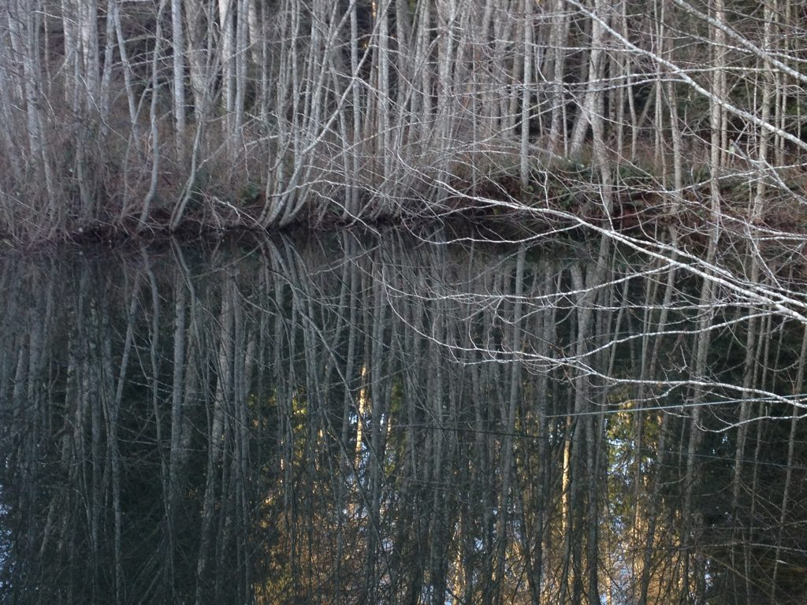
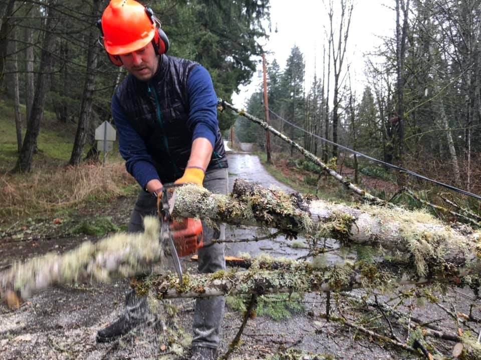
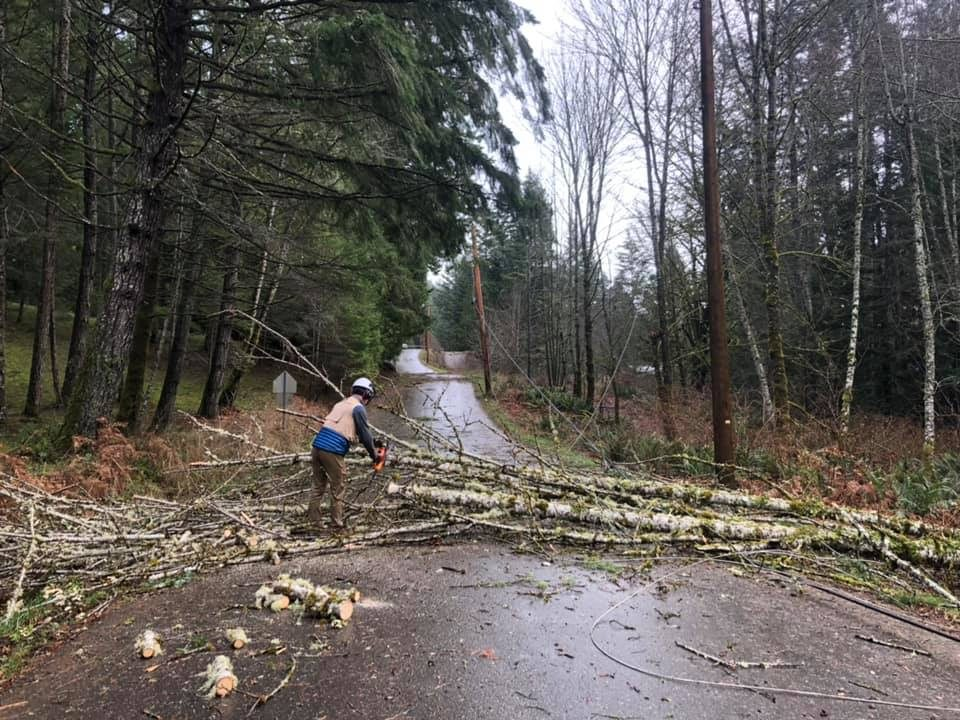
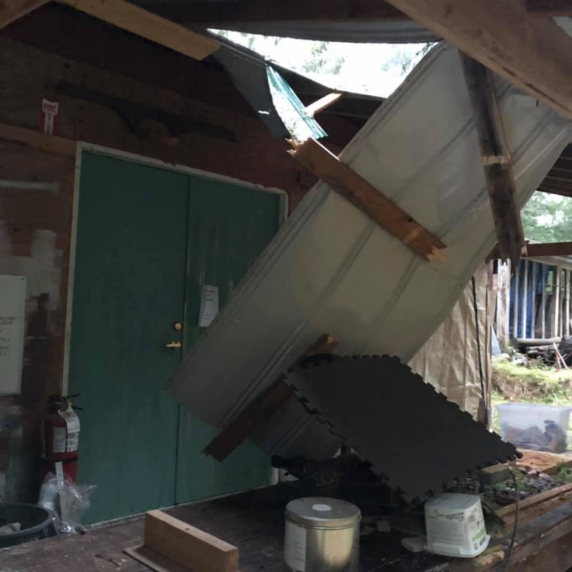
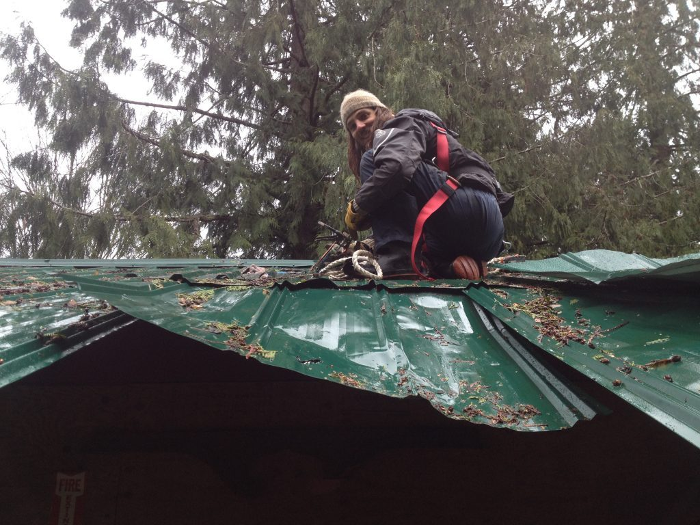
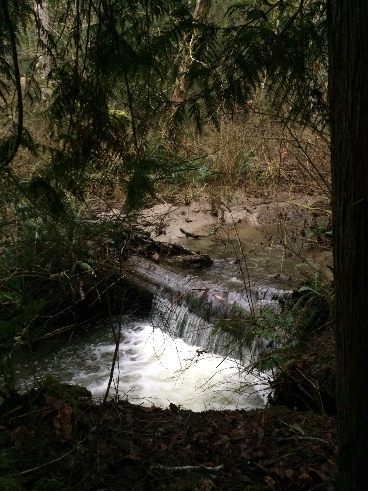
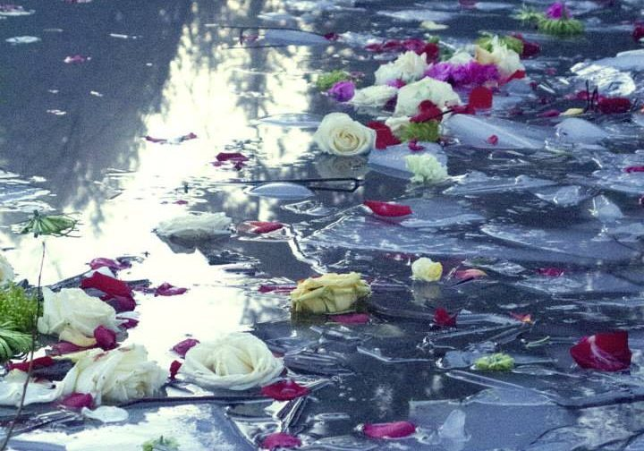

Hello everyone,

Although we’re accustomed to winter storms, this year’s winter weather has been more extreme than usual (which seems to be an ongoing refrain). Here’s the story of the adventure: A huge, record-breaking windstorm on December 20 left hundreds of  households on Salt Spring and parts of Vancouver Island without power for days (in some cases, weeks), with families having to forego plans for big Christmas dinners. Here at the Centre we fared quite well. Although the power was off for 8 days, the generator kept lights on and refrigerated food cold, plus we have a propane stove to cook on and a wood stove to gather around. After a couple of days, Ben managed to connect some of the other buildings to the generator with the aid of several very long extension cords.

There were trees down all over the island, many having fallen on hydro lines. Quite a few people weren’t able to get home on the day of the storm because trees were blocking the roads. BC Hydro and other hydro companies that came to help were kept busy for weeks reconnecting the power to hundreds of homes, and it will be quite a while yet for all the damage to be repaired.

- 
- 

When the storm hit on the last day of school before the winter break, a call went out to parents to pick their kids up early, and everyone was able to get home safely. Later that day a tree came down over the wood shop, going through the roof, pulling the electrical connections off the wall of the school building. Fortunately repairs were completed before school resumed in January.

Here are a few photos of fallen trees at the centre, relatively minor compared to folks who had big trees land on their cars or their homes.

- 
- 

Not much after the storm there was some serious rain, leaving the creek along the trail swollen and rushing.

After the heavy rain

Our tiny residential winter community has been functioning harmoniously and smoothly together. At this time we’re getting ready to begin interviews to bring more people into the community. There are a number of [positions posted on our website](https://saltspringcentre.com/community/current-opportunities/), and registrations are also coming in for [programs beginning in the spring](https://saltspringcentre.com/programs-retreats/).

Satsang and kirtan continue. These gatherings have been smaller in the winter, but now that the light is returning more people are being drawn to the Centre, away from the coziness of their wood stoves.

Winter storms were an adventure, and a good test of our readiness. Moving forward, here’s what’s coming up.

## Coming up in 2019

Our [**Yoga Getaways**](https://saltspringcentre.com/programs-retreats/yoga-getaways/) for 2019 are now officially underway and we are beginning the year with an excellent weekend program in March. Lyndsay Savage, Adam Bernath and Kishori Hutchings will be your faculty members - all proud residents of Salt Spring Island. Kishori will guide you through the morning routine of pranayama and meditation. [Adam](https://saltspringcentre.com/asana-of-the-month-virabhadrasana-warrior-1/) and [Lyndsay](http://www.savagelambyoga.ca/about-lyndsay-savage/), both graduates of our [Yoga Teacher Training Program](https://saltspringcentre.com/yoga-teacher-training/) at the centre, will be teaching the weekend asana classes.

---

**To register for the March or other Yoga Getaways in 2019, please register** [**here**](https://saltspringcentre.com/programs-retreats/yoga-getaways/)**.**

---

**To learn more about our Yoga Teacher Training, please visit our** [**website**](https://saltspringcentre.com/yoga-teacher-training/).

---

The offerings are immersed into the pond.

**[Shiva Ratri](https://saltspringcentre.com/shiva-ratri-night-of-shiva/)** this year will be celebrated on Tuesday, March 5, through the night until early morning on the 6th. Everything you need to know about this year’s Shiva Ratri is included [here](https://saltspringcentre.com/shiva-ratri-schedule-2019/). We hope you’ll be able to join us; you can come for part of it or stay till the morning when the offerings are immersed into the pond.

On the weekend of March 29-31 Dharma Sara Satsang Society will hold its Annual General Meeting. The AGM will be held on the afternoon of Saturday the 30th, and will include reports from all departments and  an election of officers to the DS Board. Dharma Sara members will be sent a notice about candidates who are seeking board positions. In addition to the formal meeting and election, the weekend will be filled with opportunities to practice pranayama and meditation together and attend asana classes. There will also be times to visit and work together. If you haven’t yet signed up to become a member of the society, you can do so here. (link)

## To read:

**Our Centre Community**: This month we feature **Eduardo Sousa** - ‘[From the Shores of the Atlantic to the Deep Forests of the Pacific - Finding Meaning in Service and Community, Crazy Pants and All](https://saltspringcentre.com/from-the-shores-of-the-atlantic-to-the-deep-forests-of-the-pacific/)’. You may remember Eduardo (particularly the crazy pants) from ACYR. Born in Portugal, growing up in Toronto, Eduardo found himself lured to the west coast, drawn by “places of beauty and wilderness”. His life has been guided by the ideals of social justice and environmental justice. That focus, along with the desire to be part of community, continue to guide his life. Fortunately for us, it’s also brought him to the Salt Spring Centre of Yoga.

**Asana of the Month:** To recharge  your asana practice this winter, **Santosh Adam Bernath** brings us [Virabhadasana](https://saltspringcentre.com/asana-of-the-month-virabhadrasana-warrior-1/), more commonly known as  Warrior 1. He says this is one of his favourite poses, one that has been part of his daily practice for over 15 years. He’s given detailed instructions with lots of photos, so it’s easy to follow. Here’s hoping it inspires you in your practice.

**The World is Not a Burden**: Sometimes life flows easily and smoothly, and everything is great, but we know it’s not always like that. As we walk our path through the world, it’s so easy to get tripped up and lose sight of our goal of living in peace and happiness. Here’s a reminder that ‘[The world is not a burden](https://saltspringcentre.com/the-world-is-not-a-burden/)’, with some practical tips about what you can do when you’re stuck.

*Don’t think you are carrying the whole world.*  
*Make it easy.*  
*Make it play.  
Make it a prayer.*   
~ Baba Hari Dass

Love and peace to all,  
 Sharada
