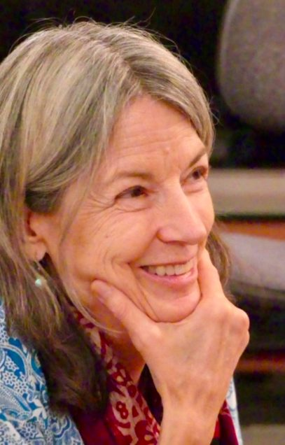

🎶*When God is loved*  
*and constantly remembered*  
*That is meditation* 🎶

These words from Babaji repeat often in my mind as a result of the angelic musical prayer that Anand Brian Darsie poured out from his heart as we lay in s*havasana* pose in the soft candle light. This was one of the uncountable precious moments that occurred during the Going Deeper Retreat at Mount Madonna Center in California.

This unique retreat follows a schedule of daily practices prescribed by Sri Baba Hari Dass to create for participants a deep meditative experience of group seclusion. Windows are covered so there is no sign of day or night in the cave-like atmosphere. Instead beautiful cloths drape the walls, and a central altar with candles, photos, murtis (statutes of gods and goddesses) and flowers draw the eyes to these symbols of purity, selflessness, devotion and love.

When persons gather closely together with a united aim and sincere effort, a transformation takes place. We can feel each other’s presence as part of ourselves, and the consciousness of all is heightened. Everyone feels safe, supported, and motivated to offer what they can to each other. In time our group evolved into a community of love. In that atmosphere, Peace is available.

In the closing circle, as participants broke their silence, there were heart-felt words that brought laughter and tears, and hesitancy to depart from this serene group atmosphere. But most of all, there was a profound sense of gratitude: for Babaji’s teachings, for his students who became yoga teachers, for inspirational music, for Truth-revealing quotes, for each other, and for this opportunity to dwell together in a place apart from the pull of the world and its many turmoils.

---

***Arpita Ezell** became a student of Babaji in 1988 and soon after moved to Mount Madonna Center. She has lived there since and has been involved with several of Babaji’s projects: teaching at Mount Madonna School, traveling numerous times to be with his Indian children at Sri Ram Ashram, and participating in Satsang at the Pacific Cultural Center in Santa Cruz. Besides working with children, she has been interested and active in the other end of the human spectrum, elder care. She has visited Salt Spring Centre a few times, and hopes to return again. She lives with her husband Rajendra and their precious pet rabbit, Pancakes.*
