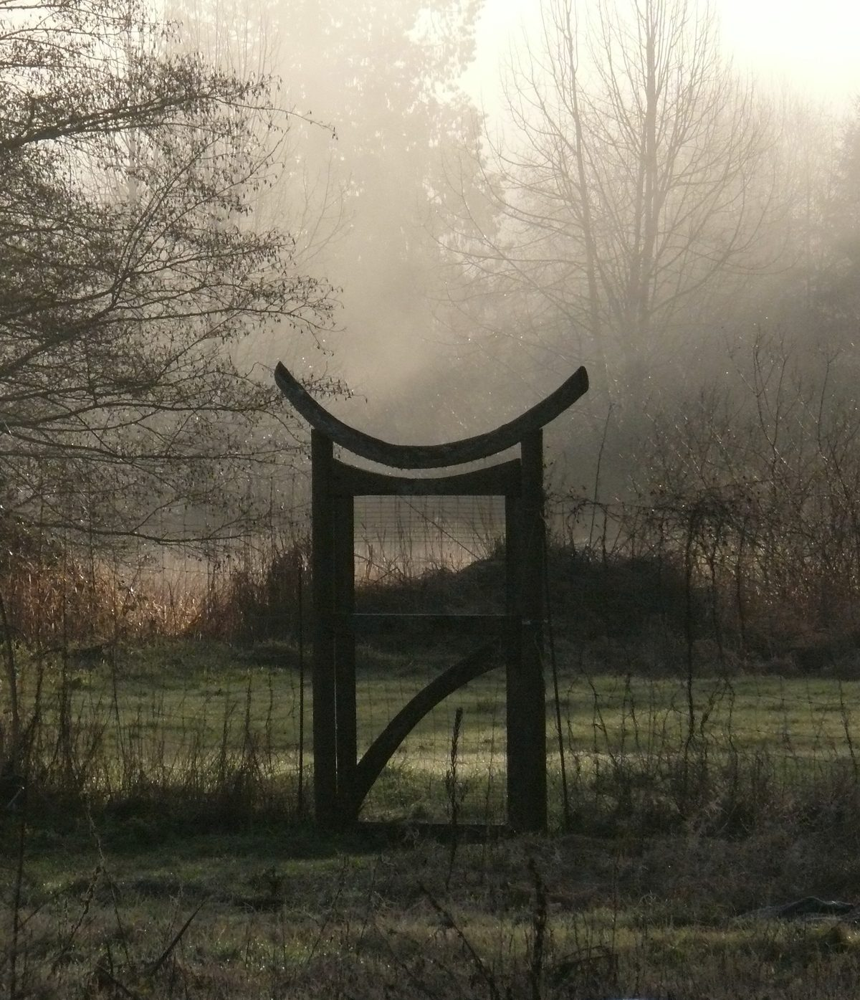
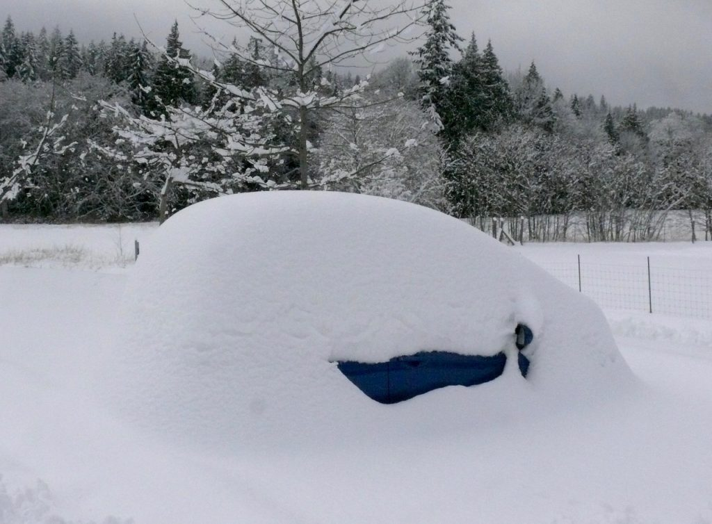
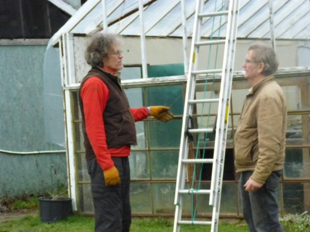
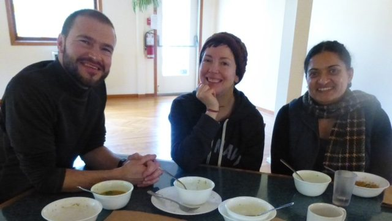
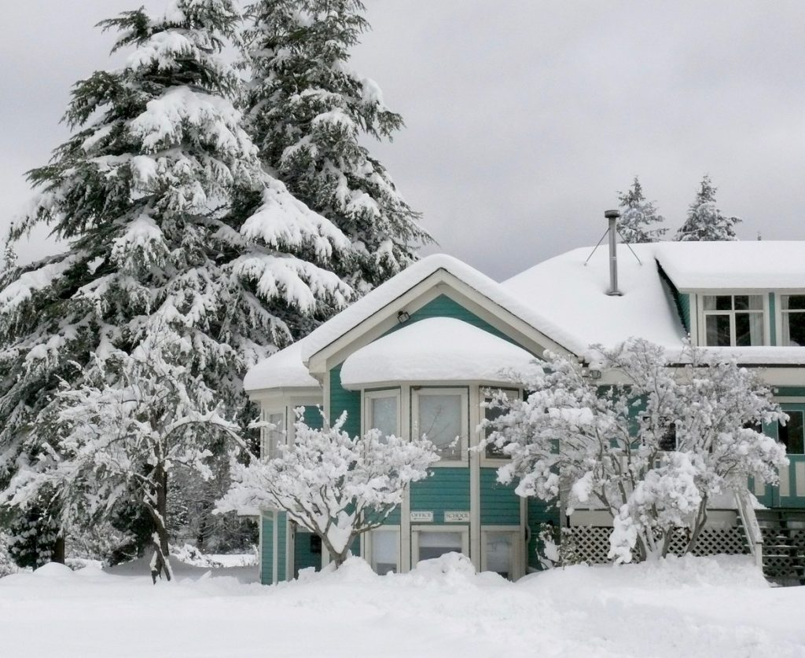
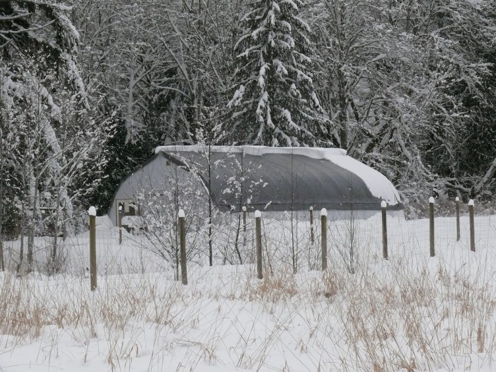
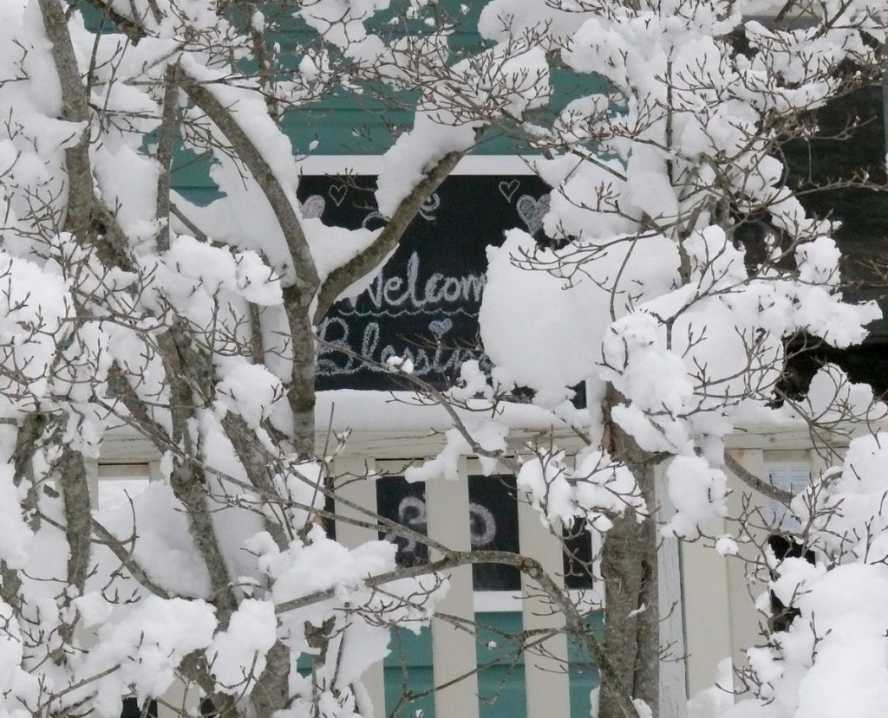
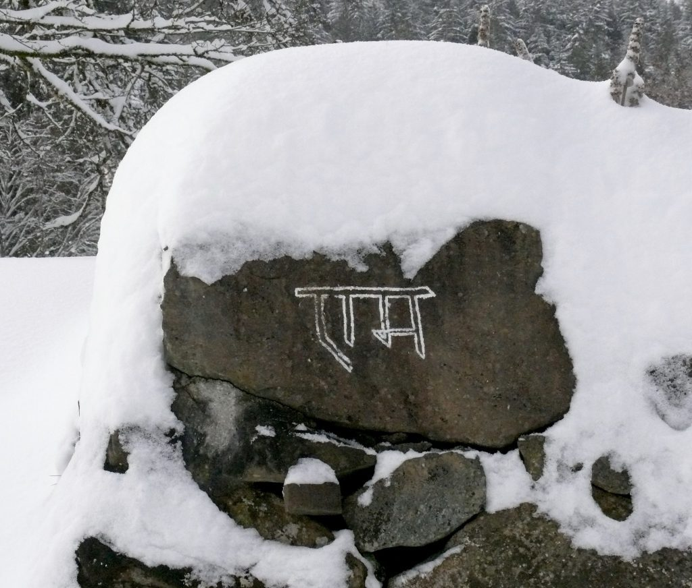
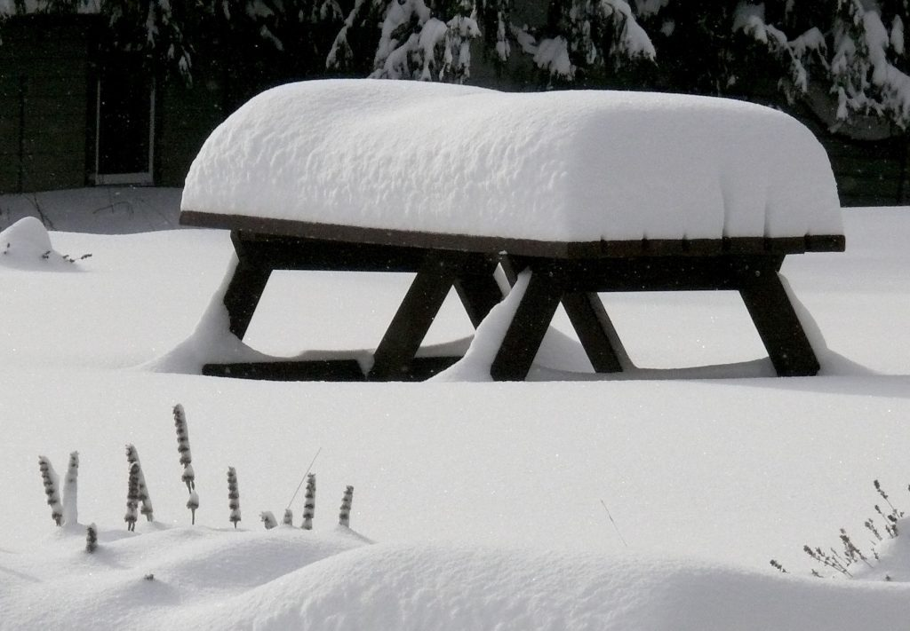
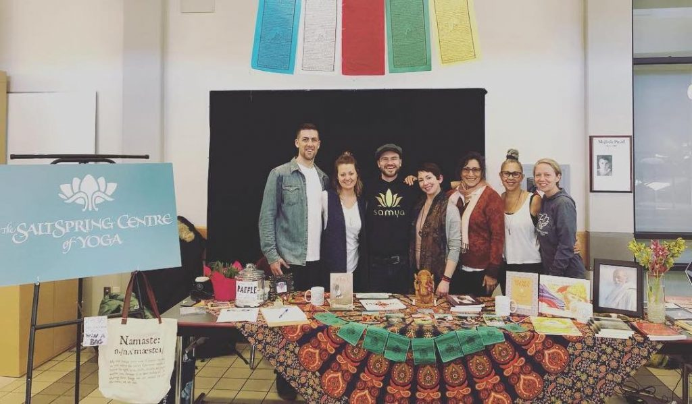

*The best way to take care of the future is to take care of the present moment.*   
~ Thich Nhat Hanh

Dear friends,

This month marks the official beginning of spring. Looking outside my window, it’s hard to believe, but soon the melting snow will reveal green grass and flowers. If you live anywhere else in Canada - and a lot of places in the US - snow in February is the norm, but this is Salt Spring Island, the tropics of Canada. To give you an idea of what February’s snow storm looked like at the Centre, here is a photo of Yogeshwar’s car in the parking lot.

Yogeshwar's car buried in the snow

## Life and Snow

Most of this month’s photos are of snow, although there are some views of life before the snow storm. I hope you enjoy them.  

- 

  OMPK & SN getting ready to replace the roof of the propagation greenhouse
- 

  Lunch by the fire on a cold winter day. Adam, Courtenay, Racquel

- 

  Jai Sita Ram!
- 
- 

  Adam shovelling his way out of Sage House   
  (before the snow slid off the roof onto that very spot)

## Victoria Yoga Conference

The A-Team: Laura Russel, Jacob Russel, Adam (Santosh) Bernath, Courtenay Lane,   
Gigi Vincentine, Satya Gauthier, Chetna Boyd

The annual Victoria Yoga Conference took place in mid-February. The Centre was well represented, and many visitors stopped by our table, which was hosted by the awesome A-Team:Chetna Boyd, Courteny Lane, Jacob and Laura Russell, Satya Gauthier, and Gigi Vincente. There was a lot of interest in our programs, especially Yoga Getaways and YTT. We look forward to seeing some of the folks who stopped by at the centre this season.

## Coming up…

**Shivaratri** will be celebrated in a few days (March 5-6 - [see this year's schedule](https://saltspringcentre.com/shiva-ratri-schedule-2019/)). I hope you will be able to join us for part or all of this night of Shiva, symbolizing the destruction of ignorance. It is an all-night vigil with Shiva kirtan, prayer, and ritual, with the aim of weakening desire and attachment in order to reconnect with our divine nature.

**Regular rituals celebrated at the centre** include weekly Ganesh pujas, Hanuman pujas, and monthly Full Moon Yajnas. And as always, Wednesday evening kirtan and Sunday afternoon satsang continue.

Later this month, on March 30, [Dharma Sara Satsang Society](https://saltspringcentre.com/dharma-sara-satsang-society/) will be holding its **Annual General Meeting**. DSSS members will hear reports from all departments of the society, and will elect a Board of Directors. If you are not yet a member but would like to be, you can apply to [become a member here](https://saltspringcentre.com/form/?fid=7). If your membership has lapsed - that is, if you weren’t a member in 2018 - you can also apply to update your membership using the [same link](https://saltspringcentre.com/form/?fid=7).

The first **[Yoga Getaway](https://saltspringcentre.com/programs-retreats/yoga-getaways/)** of the 2019 season is coming up on the weekend of March 22-24. The beginning of spring is  a wonderful time to renew your practice and lighten your life. Here’s a sampling of a few of the weekend’s offerings: morning pranayama and meditation practice, asana classes taught by experienced teachers, fabulous vegetarian food, a wood-fired sauna, the option to book an Ayurvedic treatment at [Chikitsa Shala Wellness Centre](https://saltspringcentre.com/wellness-centre/), and more.[Yoga Getaways](https://saltspringcentre.com/programs-retreats/yoga-getaways/) are offered once a month throughout our program season.

We are currently in the process of interviewing applicants for the **[Residential Karma Yoga Program](https://saltspringcentre.com/karma-yoga-program/)**. There are three session: April 1 - June 10, June 12 - August 12, and August 23 - October 31. This program provides participants with a rich mix of study and practice of yoga teachings and an opportunity to work as part of a team at the centre while living as a member of the community. Work honestly, meditate every day, meet people without fear, and play!

Salt Spring Centre of **[Yoga’s Teacher Training](https://saltspringcentre.com/yoga-teacher-training/)**, our 200 hour residential YTT program, takes place in July and August, in two sessions, July 3-16 and August 10-20. The program is based on the traditions of  Classical Ashtanga Yoga and Hatha Yoga, and provides an immersion into yogic life, studies and practices, guided by an experienced and gifted teaching faculty. Although summer may seem far away, it will be here before we know it, so please don’t wait long to register for this amazing program. Share the information with others you know would be interested.

While we’re on the topic of summer, just a note that this August will be our [45th Annual Community Retreat](https://saltspringcentre.com/programs-retreats/annual-community-yoga-retreat/), from August 1-5. There will be more information closer to the time, but mark the dates on your calendar!

## To read…

In January Racquel and I had the pleasure of taking part in the Going Deeper Retreat at Mount Madonna Center. It is a silent, devotional meditation retreat, designed to help the mind turn inward. The practices include pranayama and meditation as well as devotional rituals and spiritual stories. While we were there I asked Arpita Ezell, a longtime devotee of Babaji’s and resident at MMC, if she would write something for this newsletter. She wrote a beautiful reflection of her experience called [Glimpses of Going Deeper](https://saltspringcentre.com/glimpses-of-going-deeper/). We are planning to bring this program to Salt Spring in November; we’ll keep you posted.

To understand the mystery and meaning of Shiva Ratri, I invite you to delve into ‘[Shiva-Ratri: The Night of Shiva](https://saltspringcentre.com/shiva-ratri-the-night-of-shiva/)’, written by Yogeshwar. In this dark time of year we redirect the energy of destruction represented by Shiva into the possibility of true freedom.

Everything we do at the Centre is inspired by the teachings of Baba Hari Dass, so here are some words from him, in the form of [questions and answers](https://saltspringcentre.com/questions-answers-with-babaji/).

*If you work on yoga, yoga will work on you* ~ Baba Hari Dass

Love,  
Sharada
