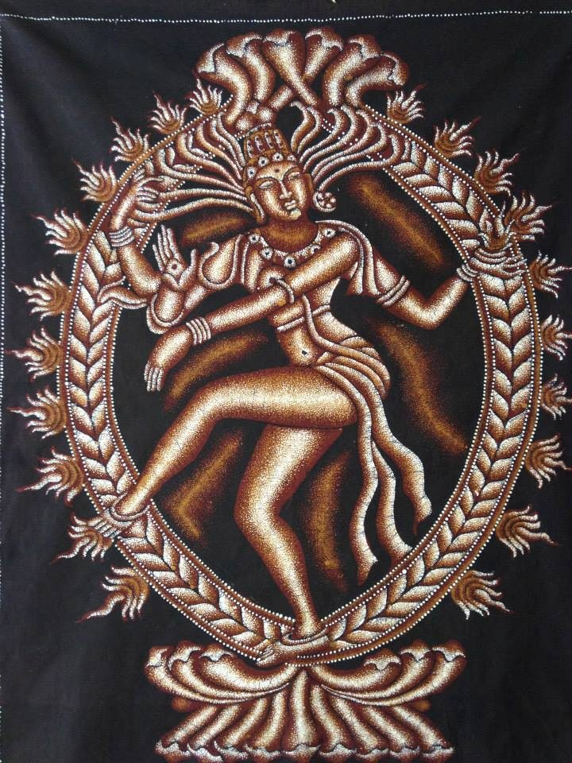

The warm days of summer are long past, like a distant, half-remembered dream. The crisp and golden days of autumn are also gone, and even the brightness and cheer of December and the holidays seem ages ago. Winter is here in all its fullness, and it stretches on and on through long, dark nights and dim, gray days. Even on mild Salt Spring Island, the life and warmth of the land has retreated inward, to someplace deep and hidden, and spring is merely a promise. Babaji often characterized the order of all that is bound in time as “birth, growth, decay, and death.” In this time of the year, we likely find ourselves confronted most strongly with the final term of that progression, with stillness, darkness, austerity, loss, and even death.

Of course, for the Śhiva-bhaktas in our satsang, it also means one other important thing: It’s Śhiva-Rātri time! And indeed, it is a fitting time to honour and reflect upon the Hindu god  Śhiva. Among Brahmā, Viṣhṇu, and Śhiva﹘the great triumvirate of Hindu gods﹘Śhiva represents the energy of destruction and dissolution, an energy that winter’s darkness and stillness evoke. While Brahmā, the creator, often appears in Hindu mythology as a jovial teacher and granter of boons, and Viṣhṇu, the preserver of the creation, as the loving saviour of *dharma*, Śhiva, the destroyer, comes across as a more challenging figure. He is the wild-eyed ascetic with long *jaṭa,* or dreadlocks, who is besmeared with ash and frequents desolate places like charnel grounds and high mountain tops. At times, he is deeply still and absorbed in practices of austerity and meditation, and at other times he is full of wild intensity and power, as symbolized by the tiger skin upon which he sits, the bull Nandi that accompanies him, and his depiction as Nāṭarāja, the dancer whose furious movements can dissolve the entire cosmos. As such, Śhiva reminds us of the inevitability of destruction and loss. As the solitary ascetic, he is a reminder of the loneliness the spiritual path can involve, and that it often requires surrendering our cherished comforts and desires, and even our very sense of the order of the world as we think we know it.

However, it’s important to remember that Śhiva is not, therefore, seen as evil or somehow bad. While he is known by such names as Rudra, the howler or wailer, Bhairava, the frightful, and Ugra, the terrible, he is also called Śhaṅkara, the benevolent and compassionate one, and of course Śhiva, the auspicious and beneficent one. The implication is that destruction is a necessary part of existence, and that it can be a teacher and even a blessing. According to the teachings of yoga, ultimately all that is not the Self is subject to destruction, and it is only in facing this uncomfortable truth that we can realize our true nature. Indeed, the spiritual path can often feel destructive as more and more of the stories and models of who we think we are, or think we should be, fall away. While such destruction can seem like a terrible thing, it ultimately brings a profound freedom as we realize that our true nature can never be lost or found, created or destroyed. In fact, in some traditions, Śhiva, or one of his various epithets, is the name given not just to a god, but to the ground of all being, to the non-dual consciousness that underlies all apparent dualities, and that is ultimately our own true nature.

Śhiva-Rātri, then, is a time to acknowledge and honour all that Śhiva evokes, especially practices of austerity and surrender. The observance falls just before the new moon of the lunar month of Phālguna, which falls in February and March of the Gregorian calendar. In Vedic astrology, or *jyotiṣh*, the time when the moon is waning, especially as the new moon is close, is generally associated with dissolving, unraveling, and involuting. As such, it is an *inauspicious* time to perform rituals for worldly success and fruition, for it corresponds to withdrawal from manifestation. In another sense, just as the moon’s light is a reflection of the sun, so too the mind’s light, or seeming consciousness, is a reflection of the Self. In this way, the new moon time also suggests the activity and energy of the mind fading or even being extinguished. While these are frightening prospects for the average person, for a yogī like Śhiva, it offers a chance to glimpse the reality that remains, maybe for only a brief moment, when the mind and the world as we know them symbolically disappear.

In this way, a normally inauspicious time becomes auspicious. Rather than avoid the challenging and even fearsome aspects of this time, and of life in general, Śhiva-Rātri invites us to face them and be transformed by them, in the same way that Śhiva invites us to face destruction and be transformed by it. And so, participants in the big night resolve to stay awake the entire night, some fast for 24 hours or more, and they give themselves over to constant remembrance of the divine through continuous kīrtan and devotional ritual. The result is a window in time in which the habits of the mind and body are consciously disrupted, and the usual veil that conditioning and habits lay upon existence can perhaps be parted to reveal a more expansive reality. Think of the flow of the night as creating a spiritual adventure, and like all adventures it includes a whole range of delights and challenges, but in the end it rewards us with new views and insights on ourselves and the world.

At the Centre the observances begin on the morning before the big night (Tuesday, March 6th), when a special ritual takes place in which 1008 clay liṅgams, which serve as the symbolic form of Śhiva, are created as the focal point for that night’s rituals. Each liṅgam is created with silent repetition of a mantra that invokes the presence of Śhiva into it, and the result is a deeply meditative practice. In the afternoon, the Satsang Room is decorated and prepared, and then the festivities pick back up that evening with rituals in honor of Gaṇeśh, Hanumān, the Guru, and Śhiva. Kīrtan to Śhiva, interspersed with two rituals to Śhiva at midnight and 5 am take up most of the rest of the night. The observances finish with placing the liṅgams and offerings from the night’s rituals into the pond, with a few hardy bhaktas taking the plunge into the icy waters to do so! After that, breakfast is served.

Śhiva-Rātri certainly attracts some hard-core devotees. However, you need not stay for the entire night, and unless you’re offering in one of the rituals, fasting is also optional. Many people find that the spirit of the group creates a supportive and buoyant energy for getting through the night, and before they know it, the sun’s coming up and the practice has been accomplished! To learn more or get involved, please contact Yogeshwar at wthumphrey@gmail.com

Hara Hara Mahādev!

---

***Yogeshwar Will Humphrey****lives on Salt Spring Island with his wife Rebecca. He first became involved with Babaji’s larger satsang during his time living at Mt. Madonna Center in 2006, as well as from 2008 to 2012. He completed his 200-hour and 500-hour YTT there in 2008 and 2011, respectively. After that, he completed an M.A. in Religious Studies at the University of Calgary just for good measure in 2016, with a thesis comparing meditative states in the Yogasūtra with movements in 20th century continental philosophy. He was also a pujari at the Sankat Mochan Hanuman Temple at MMC, and he continues to serve as one of the pujaris at SSCY. He was Operations Manager at SSCY for 2017 and 2018, and he continues to serve there as a teacher of pranayama, meditation, and yoga philosophy to residents at the Centre. He also hosts a weekly study group on the Yogasūtra at SSCY on Sunday afternoons, and he gives periodic workshops on all things yoga.*
